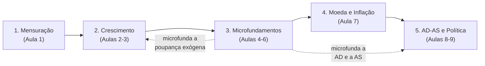

# Mapa do Curso — Macroeconomia I (MPE Insper, 2026/T3)

Hub de referência cruzada. Abra a **raiz do projeto** como vault no Obsidian para navegar
pelos wiki-links e ver o grafo.

## Mapas

| Arquivo | O que responde | Consumido por |
|---|---|---|
| [[aulas-x-bibliografia]] | cada aula → capítulo/seção → lista → regras → material | leitura humana |
| [[books-index]] | sumário com páginas e **offsets** dos PDFs | `/study-pack`, linhas `Ref:` |
| [[topics-index]] | tópico → complexidade, pré-requisitos, progressão, síntese | `/quiz-gen`, `/notebooklm`, `/quiz-analyze` |
| [[exercises-index]] | **cada exercício** do Kurlat: número, página, subtópico, nível | `/exercise-plan` |
| [[study-guide]] | ordem de estudo, bloco a bloco, com o que travar em cada um | leitura humana |
| [[cobertura]] | o que existe, o que falta, conteúdo das listas emitidas | leitura humana |
| [[formulario-aula-05]] | **fórmulas da Aula 5** — cola densa + versão anotada | véspera de prova |
| [[derivacoes-cap-09]] | **as 33 equações do Kurlat cap. 9** — derivação e história | estudo da Aula 6 |
| [[exogenous-capital-lista-05]] | **por que $K_1$ e $K_2$ são exógenos** na Lista 5, Q1 — e o que isso desliga | estudo da Aula 6 |
| `Leituras/` | **roteiros narrados para TTS** — o material inteiro, falado | Speechify, ouvir |
| [[estilo-do-professor]] | **como o professor resolve e o que ele cobra** — os 4 gabaritos dele | `/solution`, `/exam-grade` |
| [[avaliacao-listas-1-4]] | **as correções das Listas 1 e 4**, item a item, com o diagnóstico | o que consertar antes da prova |
| [[Resolucao/kurlat_solutions_ch09\|soluções cap. 9]] | os **13 exercícios** do cap. 9, resolvidos | treino da Aula 6 |

## Soluções do livro-texto

Um arquivo por capítulo do Kurlat, no mesmo estilo, com o enunciado íntegro, a álgebra sem
saltos, a leitura econômica e a verificação. Como o **Kurlat não publica gabarito**, cada
resultado é conferido por caminho independente num script que aborta se discordar.

| Capítulo | Exercícios | Aula | Arquivo |
|---|---|---|---|
| 1-4 — PIB, Além do PIB, Fatos, Solow | 23 | 1-3 | [[Resolucao/kurlat_solutions_ch1-4\|ch1-4]] (59 p.) |
| **5 — Teoria e Evidência** | 9 | 3 | [[Resolucao/kurlat_solutions_ch05\|ch05]] (28 p.) |
| **6 — Consumo e Poupança** | 9 | 4 | [[Resolucao/kurlat_solutions_ch06\|ch06]] (31 p.) |
| 7 — Trabalho e Lazer | 7 | 5 | ⏳ numérico e figuras prontos; falta o `.tex` |
| 8 — Investimento | — | — | ⛔ **fora do escopo** do programa |
| 9 — Equilíbrio Geral | 13 | 6 | [[Resolucao/kurlat_solutions_ch09\|ch09]] (33 p.) |

## Aulas

| # | Tópico | Regras | Fonte | Material | Lista |
|---|---|---|---|---|---|
| 1 | Mensuração dos Agregados Macroeconômicos | [[01_mensuracao_agregados]] | Kurlat 1-2 | ✅ Slides 1 | L1 ✅ |
| 2 | Crescimento: Fatos e Solow | [[02_crescimento_solow]] | Kurlat 3, 4.1-4.2 | ✅ Slides 2 | L1 ✅ |
| 3 | Solow (cont.) e Evidências | [[03_solow_evidencias]] | Kurlat 4.3-4.5, 5 | ✅ Handout 3 | L2 ✅ |
| 4 | Consumo e Poupança | [[04_consumo_poupanca]] | Kurlat 6 | ✅ Slides 4 | L3 ✅ |
| 5 | Trabalho e Lazer | [[05_trabalho_lazer]] | Kurlat 7 | ✅ Slides 5 | L4 ✅ |
| 6 | Equilíbrio Geral | [[06_equilibrio_geral]] | Kurlat 9 | ✅ Slides 6 | **L5 ⏳ a emitir** |
| 7 | Moeda e Inflação | [[07_moeda_inflacao]] | Kurlat 10-11 | ⬜ | L6 |
| 8 | AD-AS NK: microfundamentos | [[08_adas_microfundamentos]] | Benigno §1-5 | ⬜ | L6 |
| 9 | AD-AS NK: política | [[09_adas_politica]] | Benigno §6-12 | ⬜ | L7? |

## Os cinco temas do programa

**Os dois fios condutores do curso:**

1. **A poupança deixa de ser exógena.** A Aula 2 assume $s$ constante (Solow); a Aula 4
   deriva a escolha de $c$ e $s$ de um problema de otimização; a Aula 6 fecha o modelo em
   equilíbrio geral e mostra que o estado estacionário ótimo satisfaz
   $f'(k^*)=\rho+\delta$ — e **não** a Regra de Ouro da Aula 3.
2. **A neutralidade da moeda vale, mas só no longo prazo.** A Aula 7 estabelece a dicotomia
   clássica; as Aulas 8-9 quebram-na no curto prazo via rigidez de preços — e recuperam-na
   no longo.

Os **sete fios transversais** completos, com as aulas que cada um atravessa, estão em
[[topics-index#Conceitos que atravessam o curso]]. São a base do roteiro de revisão em
[[study-guide#Roteiro de revisão para a avaliação final 65% da nota]].

## ⭐ As listas são exercícios do Kurlat

Achado do rastreamento das três listas emitidas ([[exercises-index]]): o professor ancora
cada lista em **um capítulo**, atribui **metade dos itens direto do livro** — pelo número
ou recalibrado — e escreve a outra metade de forma **autoral e recontextualizada** (Brasil
× Colômbia, Coreia, Gotham). O **último item de cada questão é sempre o mais conceitual**.

Isso torna as listas seguintes previsíveis — e a **Lista 4 confirmou a previsão**: é
"Based on Kurlat (2020, Cap. 7)", com a Q2 construída sobre o Exercício **7.7** *Beveridge
Curve*. Restam **L5** → 9.x, **L6** → 10.x-11.x + Benigno, **L7** → Benigno gráfico.

## NotebookLM

**58 prompts** em `NotebookLM/`, em **três lotes que coexistem de propósito**:

- **Por aula (40)** — para cada uma das Aulas 1 a 4: **4 slides** (teoria · mecânica ·
  exercícios · síntese), **4 vídeos** (um por objeto visual) e **2 áudios** (um fio
  condutor cada). É o recorte de quem estuda a aula.
- **Por mecanismo (12)** — a **Lista 3**: **6 slides + 6 vídeos**, um par por mecanismo
  econômico, atravessando as duas questões em vez de seguir a ordem dos itens (riqueza e
  Euler · renda permanente · $\sigma$ como árbitro · impostos e Ricardo · restrição de
  crédito · imposto sobre poupança). Sem áudio — os dois fios do cap. 6 já estão nos
  áudios da Aula 4. É o recorte de quem está resolvendo a lista.
- **Aula 6 (6)** — **4 vídeos + 2 áudios**, sem slides. Um vídeo por objeto visual (os
  três agentes · o planejador e a contradição · a construção do diagrama de fase · a
  antecipação) e um fio condutor por áudio. É o primeiro lote **inteiramente em inglês**.

Slides e vídeo dos lotes antigos saem em pt-BR; **o áudio sai sempre em inglês**, e a
partir da Aula 6 o lote inteiro sai em inglês. Ver
[`NotebookLM/README.md`](../NotebookLM/README.md) e a regra de formato em
[[10_notebooklm_prompts]].

## Avaliação

- 7 listas de exercícios — **5 melhores** contam, peso **35%**
- Avaliação final — peso **65%**
- Estilo e rubrica: [[00_estilo_avaliacao]]
