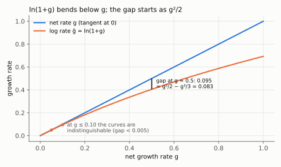
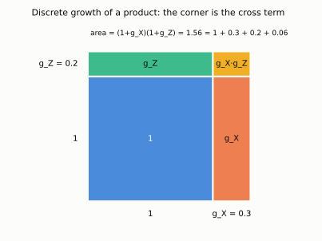
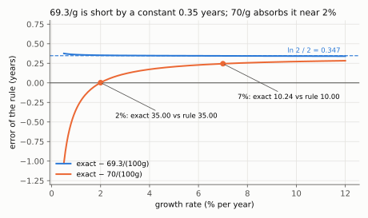

# 3. Growth arithmetic, with the error terms

**Used throughout Kurlat; formalised here.** Up: [[00-index]] ·
Prev: [[02-real-nominal-and-indices]] · Next: [[04-cross-country-and-ppp]]

> **Companion:** [Reading a Log Scale](companion-growth.html) — the same series on linear and
> log axes side by side, with the rule-of-70 doubling times marked and the log-approximation
> error plotted against $g$.

Every result in sessions 2 and 3 is stated as a growth rate, and half the mistakes in them are
arithmetic rather than economic. This note derives the five facts that get used without
comment for the rest of the course, and says how big the approximation error is in each.

---

## 3.1 Net rates, gross factors, and logs

Three ways to say the same thing:

$$Y_{t} = Y_{t-1}(1+g_t) \quad\Longleftrightarrow\quad
\frac{Y_t}{Y_{t-1}} = 1+g_t \quad\Longleftrightarrow\quad
\ln Y_t - \ln Y_{t-1} = \ln(1+g_t)$$

(The first arrow divides both sides by $Y_{t-1}$; the second takes logs of both sides and
uses $\ln(a/b)=\ln a-\ln b$.)

Define the **log growth rate** $\tilde g_t \equiv \ln Y_t - \ln Y_{t-1}$. The relation between
the two is exact (the second form exponentiates both sides of the first and subtracts 1):

$$\tilde g = \ln(1+g), \qquad g = e^{\tilde g}-1$$

Expanding the logarithm gives the approximation and, more usefully, its error. To get the
series, write the log as an integral and expand the integrand as a geometric series (valid for
$|x|<1$):

$$\ln(1+g)=\int_0^g\frac{dx}{1+x}=\int_0^g\left(1-x+x^2-\cdots\right)dx
= g-\frac{g^2}{2}+\frac{g^3}{3}-\cdots$$

Subtract this from $g$: the $g$ cancels and the leading remaining term is $g^2/2$,

$$g-\tilde g=\frac{g^2}{2}-\frac{g^3}{3}+\cdots$$

so, restating both lines together:

$$\tilde g = g - \frac{g^2}{2} + \frac{g^3}{3} - \cdots
\qquad\Longrightarrow\qquad
\boxed{\;g - \tilde g \;\simeq\; \frac{g^2}{2}\;}$$

| $g$ | $\tilde g=\ln(1+g)$ | error $g-\tilde g$ | relative error |
|---|---|---|---|
| 0.01 | 0.00995 | 0.00005 | 0.5% |
| 0.05 | 0.04879 | 0.00121 | 2.4% |
| 0.10 | 0.09531 | 0.00469 | 4.7% |
| 0.50 | 0.40546 | 0.09454 | 18.9% |
| 2.00 | 1.09861 | 0.90139 | 45.1% |

(The relative error is the error divided by $g$; e.g. $0.00469/0.10=4.7\%$.)

*The straight line $g$ is the tangent of $\ln(1+g)$ at zero; read the vertical gap at g = 0.5 (0.095) and compare it with the first two series terms (0.083). Below g = 0.10 the curves cannot be told apart.*

**The rule to carry.** The log approximation is excellent for quarterly and annual growth in
developed economies, tolerable for a decade of Chinese growth, and useless for hyperinflation —
which is exactly why [[07_moeda_inflacao]] insists on the *exact* Fisher equation when
inflation is large, and why the Cagan money demand of Kurlat Exercise 11.6 is written in logs
from the start.

## 3.2 Products, ratios and powers

For any differentiable $X_t,Z_t>0$, differentiate $\ln(XZ) = \ln X + \ln Z$ with respect to $t$.
By the chain rule, $\frac{d}{dt}\ln X_t=\frac{1}{X_t}\dot X_t$, and the same for each term:

$$\frac{\dot{(XZ)}}{XZ} = \frac{\dot X}{X}+\frac{\dot Z}{Z}
\qquad\Longrightarrow\qquad g_{XZ} = g_X+g_Z \quad\text{(exactly, in continuous time)}$$

The ratio and the power follow the same way from $\ln(X/Z)=\ln X-\ln Z$ and
$\ln X^{a}=a\ln X$, differentiated term by term:

$$g_{X/Z} = g_X-g_Z, \qquad g_{X^{a}} = a\,g_X$$

In **discrete** time these hold only approximately, and the error is again second order.
Gross factors multiply, $1+g_{XZ}=\frac{X_tZ_t}{X_{t-1}Z_{t-1}}=(1+g_X)(1+g_Z)$; expand the
product and subtract 1 from both sides:

$$(1+g_X)(1+g_Z) = 1+g_X+g_Z+g_Xg_Z
\qquad\Longrightarrow\qquad g_{XZ} = g_X+g_Z+\underbrace{g_Xg_Z}_{\text{cross term}}$$

*The area of the whole rectangle is the gross growth of the product. Adding the two growth rates keeps the two strips and drops the small corner $g_Xg_Z$ — second order, so invisible at 2% and 1%, but 0.06 at 30% and 20%.*

Two uses that recur:

- **Per capita growth.** $g_{Y/L} \simeq g_Y - g_L$. With $g_Y=3\%$ and $g_L=1\%$, per capita
  growth is 1.98%, not 2.00%. The cross term is $-0.0003$.

  > **Correction (added on audit).** The cross term here is $-0.0002$, not $-0.0003$
  > ($-0.0003=-g_Yg_L$ is the wrong product). Derivation: $Y=(Y/L)\cdot L$, so by the product
  > rule above $1+g_Y=(1+g_{Y/L})(1+g_L)$. Divide both sides by $1+g_L$ and subtract 1:
  >
  > $$g_{Y/L}=\frac{1+g_Y}{1+g_L}-1=\frac{g_Y-g_L}{1+g_L}=\frac{0.02}{1.01}=0.019802$$
  >
  > Equivalently, expand $1+g_Y=1+g_{Y/L}+g_L+g_{Y/L}g_L$ and solve,
  > $g_{Y/L}=g_Y-g_L-g_{Y/L}g_L$, so the cross term is
  > $-g_{Y/L}g_L=-0.0198\times0.01=-0.000198\simeq-0.0002$, and
  > $0.02-0.000198=0.019802$ as above.
- **Growth accounting.** $Y=AK^{\alpha}L^{1-\alpha}$ gives
  $g_Y = g_A + \alpha g_K + (1-\alpha)g_L$ exactly in continuous time. This is the identity
  that session 3 turns into the Solow residual; see [[03_solow_evidencias]]. Steps: take logs,
  $\ln Y=\ln A+\alpha\ln K+(1-\alpha)\ln L$ (product rule, then power rule for logs);
  differentiate with respect to $t$, using $\frac{d}{dt}\ln X=\dot X/X$ on each term:
  $\frac{\dot Y}{Y}=\frac{\dot A}{A}+\alpha\frac{\dot K}{K}+(1-\alpha)\frac{\dot L}{L}$.

## 3.3 Compounding, CAGR, and why arithmetic means lie

Iterating $Y_t=Y_{t-1}(1+g)$ from $0$ to $T$ — substitute $Y_1=Y_0(1+g)$ into
$Y_2=Y_1(1+g)$ to get $Y_2=Y_0(1+g)^2$, and repeat $T$ times. For the continuous form, write
$(1+g)^t=e^{t\ln(1+g)}=e^{\tilde g t}$:

$$Y_T = Y_0(1+g)^T
\qquad\text{(discrete)},\qquad
Y_t = Y_0e^{\tilde g t}\qquad\text{(continuous)}$$

Given a series, the constant rate that reproduces its endpoints is the **compound annual growth
rate**. Set $Y_T=Y_0(1+g)^T$, divide by $Y_0$, raise both sides to the power $1/T$, and
subtract 1:

$$\frac{Y_T}{Y_0}=(1+g)^T\;\Longrightarrow\;\left(\frac{Y_T}{Y_0}\right)^{1/T}=1+g
\;\Longrightarrow\;\mathrm{CAGR} = \left(\frac{Y_T}{Y_0}\right)^{1/T}-1$$

Since $\frac{Y_T}{Y_0}=\frac{Y_1}{Y_0}\cdot\frac{Y_2}{Y_1}\cdots\frac{Y_T}{Y_{T-1}}=\prod_{t=1}^{T}(1+g_t)$,
this is a *geometric* mean of the annual gross factors, and it is the only mean that is
correct, because growth compounds multiplicatively. By the AM–GM inequality,

$$\left(\prod_{t=1}^{T}(1+g_t)\right)^{1/T} \;\le\; \frac{1}{T}\sum_{t=1}^{T}(1+g_t)$$

with equality only if every $g_t$ is identical. So **the arithmetic mean of growth rates always
overstates realised growth**, and the gap widens with volatility. Concretely: $+50\%$ then
$-50\%$ has arithmetic mean $0$ and leaves you with $0.75$ of what you started with; the CAGR
is $-13.4\%$. The arithmetic: $\tfrac12(0.5-0.5)=0$; $1.5\times0.5=0.75$;
$\mathrm{CAGR}=0.75^{1/2}-1=0.8660-1=-0.134$. This is trap 4 in [[01_mensuracao_agregados]], and it is the same convexity that
makes the inequality penalty appear in [[05-beyond-gdp]].

## 3.4 The rule of 70

Set $Y_T/Y_0=2$ and solve: take logs of both sides, $T\ln(1+g)=\ln2$; divide by $\ln(1+g)$;
then replace $\ln(1+g)$ by its first-order value $g$:

$$(1+g)^T = 2 \;\Longrightarrow\; T = \frac{\ln 2}{\ln(1+g)} \simeq \frac{0.693}{g}
= \frac{69.3}{100g}$$

so doubling time in years is about $70$ divided by the growth rate in per cent. Seventy rather
than 69.3 because it divides cleanly and because the log approximation error pushes the true
answer slightly up.

How much up: keep the second-order term, $\ln(1+g)\simeq g\left(1-\tfrac g2\right)$, and use
$\frac{1}{1-x}\simeq1+x$ for small $x$:

$$T=\frac{\ln2}{g\left(1-\frac g2\right)}\simeq\frac{\ln2}{g}\left(1+\frac g2\right)
=\frac{0.693}{g}+\frac{\ln 2}{2}=\frac{69.3}{100g}+0.347$$

At $g=0.02$: $34.66+0.35=35.00$, the exact value. The first-order rule is short by an almost
constant third of a year; rounding 69.3 up to 70 adds $0.7/(100g)$ years, which exactly offsets
it at $g=2\%$ ($0.7/2=0.35$).

*The blue curve is flat at 0.347 years: that is the constant $\ln2/2$. The orange curve crosses zero at 2%, which is why 70 and not 69.3 is the number to carry; at 7% it is off by only a quarter of a year.*

| growth | rule of 70 | exact $\ln 2/\ln(1+g)$ |
|---|---|---|
| 1% | 70.0 | 69.7 |
| 2% | 35.0 | 35.0 |
| 5% | 14.0 | 14.2 |
| 7% | 10.0 | 10.2 |
| 10% | 7.0 | 7.3 |

**What it is for.** It converts growth-rate differences into the only currency that matters for
the Solow model: time. A country growing at 2% doubles income per head in 35 years, once a
working lifetime. At 7% it doubles in a decade — three and a half doublings, a factor of eleven,
in the same lifetime. That comparison is the whole motivation for Kurlat ch. 3, and the
"very long run" section (§3.1, p. 47) is the observation that for most of human history the
relevant growth rate was near zero, so doubling time exceeded recorded history.

## 3.5 Reading a log scale, and the trap

Plot $\ln Y_t$ against $t$. Then, by the chain rule ($\frac{d}{dt}\ln Y=\frac{1}{Y}\dot Y$),
and using $Y_t=Y_0e^{\tilde gt}\Rightarrow\ln Y_t=\ln Y_0+\tilde g t$,

$$\frac{d\ln Y}{dt} = \frac{\dot Y}{Y} = \tilde g$$

so **the slope of a log-scale plot is the growth rate**, and a straight line is constant
*proportional* growth — not constant absolute growth. Three readings follow:

1. A straight line on a log plot is exponential growth on a linear plot.
2. Two parallel lines are two economies growing at the same rate; the vertical gap between them
   is the constant log difference, i.e. the constant *ratio* of incomes. Parallel lines mean
   **no convergence**, however close they look.
3. A line that flattens is growth slowing, even while the level keeps rising.

Trap 5 in [[01_mensuracao_agregados]] is the confusion of (2) and (3): a chart on which poor
countries' lines run parallel to rich ones shows a permanent income ratio, and reading it as
"catching up" because the absolute gap in logs looks small is an error. Session 3 turns this
into the formal convergence test; see [[03_solow_evidencias]].

> **Contrast: Romer (2012), ch. 1.** Romer works in continuous time from the first page, so
> every one of the identities in §3.2 holds exactly for him and the cross terms never appear.
> Kurlat works in discrete time, which is closer to data and to the exercises, at the price of
> second-order residuals. The two are reconciled by noting $\tilde g$ *is* Romer's growth rate:
> translate a Kurlat difference equation into Romer's ODE by replacing $g$ with $\ln(1+g)$ and
> the statements coincide. This matters in session 2, where the Solow steady state is derived
> both ways — [[02_crescimento_solow]].

## 3.6 What to be able to do, cold

1. Convert between net rates, gross factors and log rates, and state the error size.
2. Decompose the growth of a product, a ratio and a power.
3. Explain why the CAGR and never the arithmetic mean, and give the AM–GM reason.
4. Use the rule of 70 in both directions.
5. Read levels, rates and convergence off a log-scale chart without confusing them.

Practice: Kurlat ch. 3, Exercises 3.1 and 3.2 (pp. 52–53). Worked in
[[Resolucao/kurlat_solutions_ch1-4|ch1-4]].
