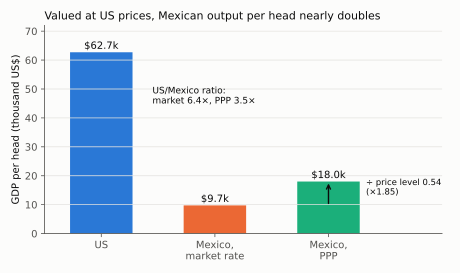
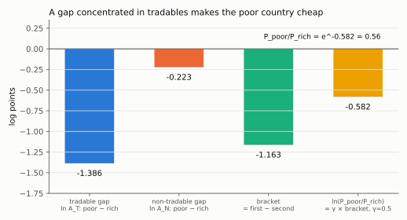

# 4. Comparing countries: PPP, and Balassa–Samuelson derived

**Kurlat §1.2, printed pages 25–27.** Up: [[00-index]] ·
Prev: [[03-growth-arithmetic]] · Next: [[05-beyond-gdp]]

> **Companion:** [Two Countries, Two Baskets](companion-ppp.html) — set relative productivity
> in tradables and non-tradables and watch the market exchange rate, the PPP rate and the
> measured income ratio separate. The Balassa–Samuelson prediction is drawn as the line the
> data should sit on.

The section makes one measurement point and raises one theoretical question it does not answer.
The measurement point is that market exchange rates are the wrong converter. The question is
*why* they are systematically wrong in one direction, and that is Balassa–Samuelson, derived
here in full because it is the reason the correction is large and predictable rather than noise.

---

## 4.1 The problem

Kurlat's Example 1.14 (p. 25): US GDP is \$20.5tn with 327m people; Mexican GDP is 23.5tn pesos
with 127m people. Per capita: \$62,700 and 185,000 pesos. The numbers are not comparable
because the units differ.

(Per capita means total divided by population: $20.5\times10^{12}/327\times10^{6}=\$62{,}691$
and $23.5\times10^{12}/127\times10^{6}=185{,}039$ pesos.)

**Market-rate conversion.** At 19 pesos to the dollar, Mexican GDP per capita is
$185{,}000/19 \simeq \$9{,}700$, so measured US income is 6.5 times Mexican income
($62{,}700/9{,}737=6.44$, which the text rounds to 6.5).

**The objection.** A dollar converted into pesos buys more in Mexico than it buys in the US.
Low measured GDP at market rates may mean low output, or it may mean low prices. The
conversion cannot tell the two apart.

## 4.2 The PPP construction

Value the foreign country's quantities at *US* prices:

$$\mathrm{GDP}^{\text{PPP}}_{\text{foreign}} \;=\; \sum_{i=1}^{N} p^{\text{US}}_i\, q^{\,i}_{\text{foreign}}$$

This is the base-year index of [[02-real-nominal-and-indices]] with "base year" replaced by
"base country": exactly Laspeyres-in-space if the US basket is the reference. It inherits the
same weighting ambiguity — valuing at Mexican prices instead gives a different answer, and the
Penn World Table's multilateral (Geary–Khamis, and now Gini–Éltetö–Köves–Szulc) methods exist
precisely to impose transitivity across many countries at once, so that the US–Mexico ratio
does not depend on whether you route the comparison through Canada.

At PPP, Mexican GDP per capita is about \$18,000, roughly twice the market-rate figure. So the
true income ratio is about 3.5, not 6.5. **Nearly half of the measured income gap between the
US and Mexico at market rates is a price-level difference, not an output difference.**

> **Precision (added on audit).** "Nearly half" is right about the *ratio* — the PPP correction
> divides it by $6.44/3.48=1.85$ — but not about the *gap* measured in logs, which is the
> additive way to split it. Taking logs of each ratio:
>
> $$\ln\frac{62{,}691}{9{,}739}=1.862,\qquad \ln\frac{62{,}691}{18{,}000}=1.248,\qquad
> \frac{1.862-1.248}{1.862}=\frac{0.614}{1.862}=0.33$$
>
> so about **one third** of the log income gap is price level and two thirds is output.

*Read the arrow on the third bar: dividing the market-rate figure by Mexico's price level (0.54) takes it from \$9.7k to \$18.0k, and the US/Mexico ratio falls from 6.4 to 3.5.*

### The PPP exchange rate, defined

Kurlat defines it as the rate that would reconcile the two conversions:

$$e^{\text{PPP}} \;\equiv\; \frac{\mathrm{GDP}^{\text{PPP}} \text{ (in dollars)}}{\mathrm{GDP}\text{ (in local currency)}}$$

Define the **price level of the country relative to the US** as the ratio of the market rate to
the PPP rate:

$$\mathcal{P} \;\equiv\; \frac{e^{\text{PPP}}}{e^{\text{market}}}$$

$\mathcal{P}<1$ means goods are cheaper there than in the US. For Mexico,
$e^{\text{market}} = 1/19 = 0.0526$ dollars per peso and $e^{\text{PPP}} = 18{,}000/185{,}000
= 0.0973$, so $\mathcal{P} = 0.54$: the Mexican price level is a little over half the US level.

> **Correction (added on audit).** The formula above is upside down; the words ("the ratio of
> the market rate to the PPP rate") and the number 0.54 are right. With both rates in dollars
> per unit of local currency, the dollar value of Mexico's GDP is $e^{\text{market}}Y_{\text{local}}$
> at market rates and $e^{\text{PPP}}Y_{\text{local}}$ at US prices. The price level is how much
> more the same output costs in dollars when valued at Mexican prices than at US prices:
>
> $$\mathcal{P}=\frac{e^{\text{market}}\,Y_{\text{local}}}{e^{\text{PPP}}\,Y_{\text{local}}}
> =\frac{e^{\text{market}}}{e^{\text{PPP}}}=\frac{0.0526}{0.0973}=0.54$$
>
> whereas $e^{\text{PPP}}/e^{\text{market}}=1.85$ is its reciprocal, the PPP uplift factor.
> Read $\mathcal{P}\equiv e^{\text{market}}/e^{\text{PPP}}$ everywhere below.

**The Big Mac index** is the same construction with $N=1$:

$$e^{\text{BigMac}} = \frac{\text{price of a Big Mac in the US (dollars)}}
{\text{price of a Big Mac abroad (local currency)}}$$

Its virtue is that the good is standardised; its defect, as Kurlat's footnote 2 says, is that
the price includes the restaurant's location, rent and wages — which are exactly the
non-tradable components that the next section shows are the source of the whole phenomenon. So
the Big Mac index is not a flawed measure of tradable-goods parity: it is an unintentionally
good measure of the overall price level, for the same reason.

## 4.3 Why poor countries are cheap: Balassa–Samuelson, derived

The empirical regularity is not that prices are randomly different. It is that $\mathcal{P}$
rises monotonically with income per head. Here is the model that produces it.

**Setup.** Two sectors, tradables $T$ and non-tradables $N$, one mobile factor (labour), linear
technology:

$$Y_T = A_T L_T, \qquad Y_N = A_N L_N$$

**Assumption 1 (law of one price in tradables).** Tradables are arbitraged, so their price is
the same everywhere once converted at the market rate. Normalise the world tradable price to
one and measure everything in that unit: $P_T = 1$ in every country.

**Assumption 2 (labour mobility across sectors).** Competitive firms pay the value of the
marginal product, and workers move until wages are equalised:

$$W = P_T A_T = P_N A_N$$

**Step 1 — the relative price of non-tradables.** Take the equality $P_TA_T=P_NA_N$ and
divide both sides by $P_TA_N$:

$$\frac{P_TA_T}{P_TA_N}=\frac{P_NA_N}{P_TA_N}\;\Longrightarrow\;\frac{A_T}{A_N}=\frac{P_N}{P_T}$$

Read right to left:

$$\boxed{\;\frac{P_N}{P_T} = \frac{A_T}{A_N}\;} \tag{4.1}$$

This is the whole mechanism in one line, and notice what it does *not* contain: no preferences,
no demand, no capital. The relative price of non-tradables is a pure technology ratio. A country
that is very productive at making tradables must pay high wages in tradables; those wages are
paid to haircutters and bus drivers too, whose productivity has not risen; so haircuts are
expensive there.

**Step 2 — the aggregate price level.** Let consumption be Cobb–Douglas with a share
$\gamma$ on non-tradables. The consumer price index is the geometric average

$$P = P_T^{1-\gamma}P_N^{\gamma} = \left(\frac{P_N}{P_T}\right)^{\gamma}
= \left(\frac{A_T}{A_N}\right)^{\gamma} \tag{4.2}$$

using $P_T=1$.

*Where the geometric average comes from.* The price index is the minimum cost of one unit of
the consumption bundle $C=C_T^{1-\gamma}C_N^{\gamma}$. Cobb–Douglas cost minimisation spends
fixed shares of outlay $E$ on each good, $P_TC_T=(1-\gamma)E$ and $P_NC_N=\gamma E$. Solve each
for the quantity and substitute into $C=1$:

$$1=\left(\frac{(1-\gamma)E}{P_T}\right)^{1-\gamma}\left(\frac{\gamma E}{P_N}\right)^{\gamma}
=\frac{(1-\gamma)^{1-\gamma}\gamma^{\gamma}\,E}{P_T^{1-\gamma}P_N^{\gamma}}
\;\Longrightarrow\;
E=\frac{P_T^{1-\gamma}P_N^{\gamma}}{(1-\gamma)^{1-\gamma}\gamma^{\gamma}}$$

The constant in the denominator is the same in every country with the same $\gamma$, so it
cancels from every cross-country ratio and is dropped. Then factor out $P_T$:
$P_T^{1-\gamma}P_N^{\gamma}=P_T\left(P_N/P_T\right)^{\gamma}$, which is $(P_N/P_T)^\gamma$ at
$P_T=1$, and substitute (4.1).

Taking logs, the price level of country $j$ relative to the US. Tradables cost the same
everywhere at the market rate, so the ratio of the two CPIs *is* $\mathcal P_j$. Take logs of
(4.2) in each country and subtract,
$\ln\mathcal P_j=\gamma\ln\frac{A_{T,j}}{A_{N,j}}-\gamma\ln\frac{A_{T,\text{US}}}{A_{N,\text{US}}}$;
expand each log of a ratio into a difference and regroup by sector:

$$\ln \mathcal{P}_j = \gamma\left[\left(\ln A_{T,j}-\ln A_{T,\text{US}}\right)
-\left(\ln A_{N,j}-\ln A_{N,\text{US}}\right)\right] \tag{4.3}$$

**Step 3 — the empirical prediction.** The productivity gap between rich and poor countries is
much larger in tradables (manufacturing, agriculture with modern inputs) than in non-tradables
(haircuts, domestic service, construction). Formally, assume
$\ln A_{T,j}-\ln A_{T,\text{US}} < \ln A_{N,j}-\ln A_{N,\text{US}} < 0$ for a poor country $j$.
Then the bracket in (4.3) is negative, so $\mathcal{P}_j<1$:

$$\boxed{\;\text{poorer country} \;\Longrightarrow\; \text{lower price level}
\;\Longrightarrow\; \text{market-rate GDP understates real GDP}\;}$$

and the understatement is *larger* the poorer the country. That is why the PPP correction
raised Mexico by a factor of about 1.9 and would raise India by more.

*The numbers from `check_measurement.py`: the rich country is 4× as productive in tradables and 1.25× in non-tradables. Read the bars left to right: −1.386 minus −0.223 gives a bracket of −1.163, and γ = 0.5 halves it to −0.582, a price level of 0.56. Equal gaps in both sectors would make the third bar zero.*

**Step 4 — the sign of the bias in growth comparisons.** Differentiating (4.3) along a growth
path, a country whose tradable productivity is catching up fast experiences **real exchange
rate appreciation** — its price level rises toward the US level. So a fast-growing economy's
GDP measured at market rates grows faster than its GDP at constant PPP, because part of the
market-rate growth is the price level catching up, not output. This is a standard source of
overstated growth figures for China in the 2000s.

The two lines behind that paragraph. Differentiate (4.3) with respect to time, writing
$g_x=\dot x/x$ (the time derivative of a log is a growth rate):

$$\frac{d\ln\mathcal P_j}{dt}=\gamma\left[\left(g_{A_T,j}-g_{A_T,\text{US}}\right)-\left(g_{A_N,j}-g_{A_N,\text{US}}\right)\right]$$

which is positive when $j$'s tradable productivity catches up faster than its non-tradable
productivity. And GDP in dollars at market rates equals PPP GDP times the price level
($e^{\text{market}}Y_{\text{local}}=\mathcal P\cdot e^{\text{PPP}}Y_{\text{local}}$); take logs and
differentiate:

$$g_{\text{GDP, market \$}}=g_{\text{GDP, PPP}}+g_{\mathcal P}$$

### Two things the derivation shows that the slogan does not

1. **It is about the *ratio* of sectoral productivities, not about being poor.** A country that
   is uniformly unproductive in both sectors has $A_T/A_N$ unchanged and no price-level effect
   at all, however poor it is. Poverty per se predicts nothing; asymmetric productivity does.
2. **$\gamma$ scales it.** A country whose consumption basket is mostly tradable goods shows
   little effect. This is why the PPP correction is smaller for small open economies with high
   import shares than for large continental ones at the same income.

## 4.4 Which denominator: three different "per" measures

$$\underbrace{\frac{Y}{\text{Population}}}_{\text{living standards}}
\;\ne\;
\underbrace{\frac{Y}{\text{Employment}}}_{\text{productivity per worker}}
\;\ne\;
\underbrace{\frac{Y}{\text{Hours}}}_{\text{productivity per hour}}$$

They are linked by an identity worth memorising, because session 5 takes it apart:

$$\frac{Y}{\text{Pop}} = \underbrace{\frac{Y}{H}}_{\text{output per hour}}
\times \underbrace{\frac{H}{E}}_{\text{hours per worker}}
\times \underbrace{\frac{E}{\text{Pop}}}_{\text{employment rate}}$$

(Multiply out the right side: $H$ cancels between the first two factors and $E$ between the
last two, leaving $Y/\text{Pop}$. In logs the three factors add, so a log gap in output per
person splits into three additive gaps.)

The classic application: France's output **per hour** is close to the US level, while its output
**per person** is roughly 25–30% lower. The whole gap is in the last two factors — shorter hours
and lower participation. Whether that is a welfare loss or a preference for leisure is exactly
the question [[05-beyond-gdp]] prices and that [[05_trabalho_lazer]] models. Getting the
denominator wrong turns a statement about leisure into a false statement about productivity.

## 4.5 Sources, and their disagreements

| Source | Builds | Caution |
|---|---|---|
| **Penn World Table** | multilateral PPP, real GDP at constant prices, capital stocks, hours | versions differ materially; always cite the version number |
| World Bank / ICP | the PPP benchmark rounds themselves | benchmark years are revised; the 2011 and 2017 rounds moved China's level noticeably |
| Maddison Project | very long-run historical series | pre-1900 numbers are reconstructions, not measurements |

Kurlat uses PWT; Jones (2020) uses it too, which is why their growth facts agree. Sessions 2
and 3 quote PWT-based numbers throughout — see [[02_crescimento_solow]].

## 4.6 What to be able to do, cold

1. Convert GDP at market rates and at PPP and say which is larger for a poor country, and why.
2. Define the PPP exchange rate and the relative price level, and compute both from data.
3. Derive (4.1) from wage equalisation and the law of one price, in three lines.
4. Give the two conditions under which Balassa–Samuelson predicts *no* price-level gap.
5. Decompose output per person into the three factors and use it on the France–US comparison.

Practice: Kurlat ch. 1, Exercise 1.4 (p. 27) on PPP and market rates; Exercise 1.5 on the
Big Mac index. Worked in [[Resolucao/kurlat_solutions_ch1-4|ch1-4]].
