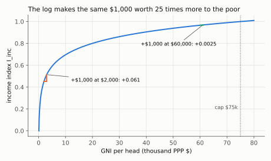
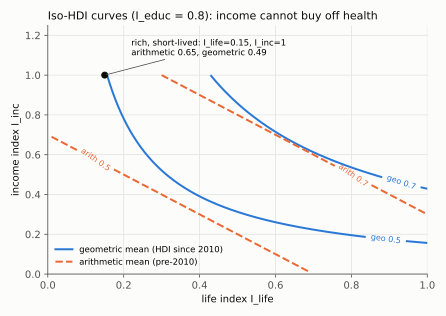
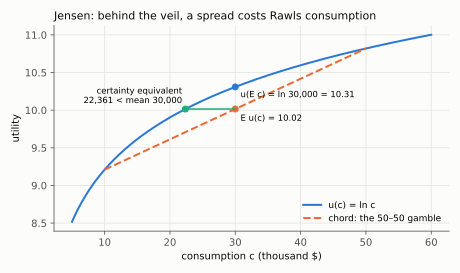
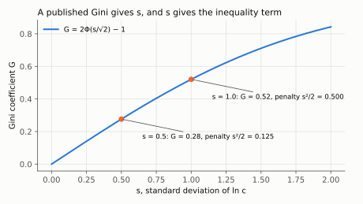

# 5. Beyond GDP: the HDI, and the Jones–Klenow welfare measure decomposed

**Kurlat §2.1–§2.2, printed pages 31–44.** Up: [[00-index]] ·
Prev: [[04-cross-country-and-ppp]]

> **Companion:** [What Rawls Would Pay](companion-welfare.html) — set consumption, leisure,
> life expectancy and inequality for a country and watch $\lambda$ decompose into its four
> additive log terms, with $\sigma$ on a slider so the inequality penalty can be seen scaling.

Two measures, built on opposite principles. The HDI picks three things that seem to matter and
averages indices of them. Jones and Klenow write down a utility function and ask what compensating
consumption would make a person indifferent. The second is the one worth deriving, because its
decomposition is a genuinely graduate-level result and because every term in it is an object from
later sessions.

---

## 5.1 The HDI, and why its arbitrariness is structural

Three sub-indices, each engineered onto $[0,1]$ by a min–max rescaling (Kurlat, p. 32):

$$I_{\text{life}} = \frac{\text{Life expectancy}-20}{85-20}$$

$$I_{\text{educ}} = \frac{1}{2}\left[\frac{\text{Mean years of schooling, 25-year-olds}}{15}
+ \frac{\text{Expected years of schooling, 5-year-olds}}{18}\right]$$

$$I_{\text{inc}} = \frac{\ln(\text{GNI per capita}) - \ln(100)}{\ln(75{,}000)-\ln(100)}$$

and the index is their geometric mean:

$$\mathrm{HDI} = \left(I_{\text{life}}\,I_{\text{educ}}\,I_{\text{inc}}\right)^{1/3}$$

**Three design choices, each defensible and none derived.**

*The log on income and not on the others.* This is the one choice with an economic argument
behind it: $\ln$ imposes diminishing returns, so a \$1,000 rise matters more at \$2,000 than at
\$60,000. The others are linear, which asserts that a year of life expectancy is worth the same
at 45 as at 80.

To put numbers on it: the denominator is $\ln 75{,}000-\ln 100=\ln 750=6.620$, and a \$1,000
rise changes the index by the log-difference over that denominator:

$$\Delta I_{\text{inc}}\big|_{2{,}000\to3{,}000}=\frac{\ln(3{,}000/2{,}000)}{6.620}=\frac{0.405}{6.620}=0.061,
\qquad
\Delta I_{\text{inc}}\big|_{60{,}000\to61{,}000}=\frac{\ln(61/60)}{6.620}=\frac{0.0165}{6.620}=0.0025$$

— about 25 times more at the bottom. Equivalently, differentiate:
$\partial I_{\text{inc}}/\partial\,\text{GNI}=1/(6.620\cdot\text{GNI})$, which falls as $1/\text{GNI}$.

*Compare the two coloured steps: the same \$1,000 lifts the index by 0.061 at \$2,000 and by 0.0025 at \$60,000. Past the \$75k cap the index keeps rising above one, as Kurlat's footnote notes.*

*The geometric mean, not arithmetic.* This is not cosmetic. Take logs:

$$\ln \mathrm{HDI} = \tfrac{1}{3}\left(\ln I_{\text{life}}+\ln I_{\text{educ}}+\ln I_{\text{inc}}\right)$$

so the sub-indices are **complements**: the marginal contribution of income rises when health is
high, and any sub-index at zero sends the HDI to zero.

The complementarity, derived. Write $H=(I_{\text{life}}I_{\text{educ}}I_{\text{inc}})^{1/3}$.
Differentiate with respect to $I_{\text{inc}}$ (power rule, the other two held fixed):

$$\frac{\partial H}{\partial I_{\text{inc}}}=\tfrac13\left(I_{\text{life}}I_{\text{educ}}\right)^{1/3}I_{\text{inc}}^{-2/3}$$

then differentiate that with respect to $I_{\text{life}}$:

$$\frac{\partial^2 H}{\partial I_{\text{life}}\,\partial I_{\text{inc}}}
=\tfrac19\,I_{\text{life}}^{-2/3}I_{\text{educ}}^{1/3}I_{\text{inc}}^{-2/3}
=\frac{H}{9\,I_{\text{life}}I_{\text{inc}}}>0$$

The cross-partial is positive, which is the definition of complements. For the arithmetic mean
$(I_{\text{life}}+I_{\text{educ}}+I_{\text{inc}})/3$ the first derivative is the constant $1/3$
and the cross-partial is zero: perfect substitutes.

*The dashed arithmetic contours are straight lines, so income trades against life one-for-one at any level; the solid geometric contours bend towards the axes, so near $I_{\text{life}}=0$ no amount of income holds the index up. The marked country scores 0.65 arithmetically but 0.49 geometrically.* An arithmetic mean would make them perfect
substitutes and let a rich, short-lived country buy its way to a high score. The UN switched from
arithmetic to geometric in 2010 for exactly this reason.

*The caps.* GNI is capped at \$75,000, life expectancy at 85. Kurlat's footnote 1 (p. 32) records
the consequence honestly: some countries' GNI exceeds the cap, so their income index is above one.
The bound is a convention, not a fact.

**Why GNI and not GDP.** Because the question is what residents *have*, not what is produced on the
territory — the distinction derived in [[01-three-approaches]] §1.4.

**The empirical punchline.** Kurlat's Figure 2.1.1 (p. 32): the correlation between HDI and GDP per
capita is **0.94**. The index that was built to correct GDP mostly reproduces it. That is not a
failure — it is evidence that income, health and schooling move together across countries — but it
means the HDI adds little information beyond ranking, and it motivates a measure built on theory
rather than on a committee's list. Which is §2.2.

## 5.2 Jones–Klenow: the thought experiment

Kurlat §2.2 (p. 33). Take a random person — Jones and Klenow call him Rawls — behind a **veil of
ignorance**: he will live a year in a country without knowing who in it he will be. Offer him two
options:

- country *Utilia*, whose living standards we want to measure;
- the United States, with everyone's consumption multiplied by $\lambda$.

**Definition.** $\lambda$ is the factor that makes him indifferent. It is an *equivalent variation*,
and it is the welfare measure:

$$u\!\left(\lambda c^{\text{US}}, l^{\text{US}}, a^{\text{US}}\right)
= u\!\left(c^{\text{Utilia}}, l^{\text{Utilia}}, a^{\text{Utilia}}\right) \tag{2.2.2}$$

The utility function, Kurlat's (2.2.1):

$$u(c,l,a) = \mathbb{E}\left[\left(\bar u + \frac{c^{1-\sigma}}{1-\sigma}-\theta(1-l)^2\right)a\right] \tag{2.2.1}$$

with $c$ consumption (random, because he does not know his place in the distribution), $l$ the
leisure share of time, and $a\in\{0,1\}$ an indicator for being alive. Behind the veil he averages
over the $N$ residents:

$$u = \frac{1}{N}\sum_{n=1}^{N}\left(\bar u + \frac{c_n^{1-\sigma}}{1-\sigma}-\theta(1-l)^2\right)a \tag{2.2.3}$$

Four modelling commitments, each of which does work:

1. **Consumption, not output.** Investment and exports do not enter Rawls's year; imports do. So
   the object is $C+G$, not $Y$ — Kurlat's footnote 3 (p. 34) records the assumption that public and
   private consumption give equal utility on average.
2. **$a$ multiplies everything.** The dead get zero, so life expectancy enters as a probability
   weight on the whole bracket, and $\bar u$ — the flow value of being alive at zero consumption —
   becomes a parameter that *must* be pinned down, since it scales how much mortality matters.
3. **$\theta(1-l)^2$** prices work as a convex disutility, so non-market time is valued. This is the
   answer to the Kurlat Example 1.11 problem from [[01-three-approaches]] §1.3(d).
4. **$\sigma$ does double duty.** It is risk aversion behind the veil, and mechanically it becomes
   aversion to inequality, because a spread-out consumption distribution *is* risk from behind the
   veil. That equivalence is the cleverest move in the paper and §5.4 makes it exact.

## 5.3 Risk aversion, concavity, and the warning

Rawls is risk averse if a certain average is preferred to the gamble:

$$u\!\left(\frac{c_{\text{rich}}+c_{\text{poor}}}{2}\right) > \frac{u(c_{\text{rich}})+u(c_{\text{poor}})}{2} \tag{2.2.4}$$

and in general

$$u(\mathbb{E}[c]) > \mathbb{E}[u(c)] \tag{2.2.5}$$

which is **Jensen's inequality**, holding for any strictly concave $u$. Marginal utility is
$u'(c)=c^{-\sigma}$ (2.2.6), positive and decreasing for all $\sigma>0$, and decreasing faster the
larger $\sigma$ is. Two conventions to have straight: at $\sigma=1$ the function
$c^{1-\sigma}/(1-\sigma)$ is undefined but its limit behaviour is $\ln c$ (Kurlat's footnote 6), and
for $\sigma>1$ the level of utility is negative, which means nothing because only comparisons are
interpretable.

The derivatives, step by step: by the power rule,
$u'(c)=\frac{(1-\sigma)c^{-\sigma}}{1-\sigma}=c^{-\sigma}>0$ and
$u''(c)=-\sigma c^{-\sigma-1}<0$ for $\sigma>0$ — strict concavity, which is what Jensen needs.
The limit: subtracting the constant $1/(1-\sigma)$ changes no comparison, so use
$\frac{c^{1-\sigma}-1}{1-\sigma}$; at $\sigma=1$ it is $0/0$, and L'Hôpital in $\sigma$
(the derivative of $c^{1-\sigma}$ with respect to $\sigma$ is $-c^{1-\sigma}\ln c$, that of
$1-\sigma$ is $-1$) gives

$$\lim_{\sigma\to1}\frac{c^{1-\sigma}-1}{1-\sigma}=\lim_{\sigma\to1}\frac{-c^{1-\sigma}\ln c}{-1}=\ln c$$

*A 50–50 gamble between \$10k and \$50k. Read the vertical gap at the mean: the utility of the mean (10.31) is above the mean of the utilities on the chord (10.02). The green segment is the same gap in consumption: a sure \$22,361 is as good as the gamble with mean \$30,000.*

> **Kurlat's methodological warning, worth repeating verbatim (p. 35).** *"It's wrong to say people
> dislike risk because their utility function is concave. Instead, one should say: in economic
> models, we describe people's preferences with concave utility functions to capture the fact that
> people dislike risk. Do not put the mathematical cart before the conceptual horse!"* The same
> discipline applies to every functional form in this course — the CRRA of
> [[04_consumo_poupanca]], the Frisch disutility of [[05_trabalho_lazer]], the Dixit–Stiglitz
> aggregator of [[08_adas_microfundamentos]].

**Calibrating $\sigma$.** Estimates run from about 1 to about 10, from portfolio choice (Friend and
Blume, 1975) and from insurance purchases (Szpiro, 1986). Jones and Klenow use $\sigma=1$, at the
low-risk-aversion end — a *conservative* choice, because it minimises the inequality penalty and
therefore understates how much inequality costs.

## 5.4 The decomposition — the result worth knowing

Take $\sigma=1$, so $u = \bar u + \ln c - \theta(1-l)^2$ conditional on being alive, and let $e$ be
the fraction of the age range over which Rawls is alive (Kurlat's construction: age uniform on
$[0,100]$, alive if age is below life expectancy, so $e = \text{LE}/100$). Then

$$u^{j} = e^{j}\left[\bar u + \mathbb{E}\left[\ln c^{j}\right] - \theta\left(1-l^{j}\right)^2\right]$$

(Why $e$ multiplies the bracket: $a=1$ with probability $e$ and $a=0$ otherwise, and the bracket
does not depend on $a$, so $\mathbb E[(\cdot)\,a]=e\cdot\mathbb E[(\cdot)]$.)

Set $u^{\text{US}}(\lambda) = u^{j}$. Scaling US consumption by $\lambda$ adds $\ln\lambda$ inside
the expectation, because $\ln(\lambda c)=\ln\lambda+\ln c$ and $\ln\lambda$ is a constant that
passes through $\mathbb E$:

$$e^{\text{US}}\left[\bar u + \ln\lambda + \mathbb{E}\ln c^{\text{US}} - \theta(1-l^{\text{US}})^2\right]
= e^{j}\left[\bar u + \mathbb{E}\ln c^{j} - \theta(1-l^{j})^2\right]$$

Now suppose consumption is **lognormal** within each country, $\ln c \sim \mathcal N(\mu,s^2)$, so
that

$$\mathbb{E}\left[\ln c\right] = \ln \mathbb{E}[c] - \tfrac{1}{2}s^2$$

— the mean of the log is the log of the mean minus half the log variance, which is Jensen's
inequality made quantitative.

*Where that comes from.* Let $x=\ln c\sim\mathcal N(\mu,s^2)$, so $c=e^{x}$ and
$\mathbb E[\ln c]=\mu$. Compute $\mathbb E[c]=\mathbb E[e^{x}]$ by completing the square in the
exponent of the normal density:

$$x-\frac{(x-\mu)^2}{2s^2}=-\frac{\left(x-(\mu+s^2)\right)^2}{2s^2}+\mu+\frac{s^2}{2}$$

(expand both sides to check). The first term, integrated against $\frac{1}{s\sqrt{2\pi}}$, is the
density of $\mathcal N(\mu+s^2,s^2)$ and integrates to 1, leaving

$$\mathbb E[c]=e^{\mu+s^2/2}\;\Longrightarrow\;\ln\mathbb E[c]=\mu+\tfrac12s^2
\;\Longrightarrow\;\mathbb E[\ln c]=\mu=\ln\mathbb E[c]-\tfrac12s^2$$

*Solving for $\ln\lambda$.* Name the flow utility of a year alive in each country,
$B^{j}\equiv\bar u+\mathbb E\ln c^{j}-\theta(1-l^{j})^2$ and likewise $B^{\text{US}}$. The
indifference condition above is then $e^{\text{US}}\left(\ln\lambda+B^{\text{US}}\right)=e^{j}B^{j}$.
Divide by $e^{\text{US}}$ and subtract $B^{\text{US}}$:

$$\ln\lambda=\frac{e^{j}}{e^{\text{US}}}B^{j}-B^{\text{US}}$$

Add and subtract $B^{j}$ on the right, and group:

$$\ln\lambda=\left(B^{j}-B^{\text{US}}\right)+\left(\frac{e^{j}}{e^{\text{US}}}-1\right)B^{j}
=\left(B^{j}-B^{\text{US}}\right)+\frac{e^{j}-e^{\text{US}}}{e^{\text{US}}}\,B^{j}$$

The second piece is term (4). Expand the first, substituting
$\mathbb E\ln c=\ln\bar c-\tfrac12s^2$ in both countries ($\bar u$ cancels):

$$B^{j}-B^{\text{US}}=\left(\ln\bar c^{\,j}-\ln\bar c^{\,\text{US}}\right)-\tfrac12\left(s_j^2-s_{\text{US}}^2\right)-\theta\left[(1-l^{j})^2-(1-l^{\text{US}})^2\right]$$

which is terms (1)–(3). Substituting and solving for $\ln\lambda$, with
$\bar c^{j}=\mathbb{E}[c^{j}]$:

$$\boxed{\;
\ln\lambda \;=\;
\underbrace{\ln\frac{\bar c^{\,j}}{\bar c^{\,\text{US}}}}_{\text{(1) consumption}}
\;-\;\underbrace{\tfrac{1}{2}\left(s_j^2-s_{\text{US}}^2\right)}_{\text{(2) inequality}}
\;-\;\underbrace{\theta\left[(1-l^{j})^2-(1-l^{\text{US}})^2\right]}_{\text{(3) leisure}}
\;+\;\underbrace{\frac{e^{j}-e^{\text{US}}}{e^{\text{US}}}\left[\bar u + \mathbb{E}\ln c^{j}-\theta(1-l^j)^2\right]}_{\text{(4) life expectancy}}
\;}$$

to first order in the mortality difference. **Four additive terms in logs.** Read them:

> **Precision (added on audit).** With this utility function the derivation above shows the
> decomposition is **exact**, not first-order: the add-and-subtract step introduces no
> approximation. "First order" only describes the reading of term (4) as "mortality gap times
> value of a year", because its weight $B^{j}$ is the *other* country's flow value.
> `check_measurement.py` confirms it against a brute-force solve to $10^{-6}$.

1. **Consumption.** The only term GDP per capita comes close to capturing, and even here it is
   $C+G$ and not $Y$, so a high-investment country scores below its GDP rank in the one-year
   experiment.
2. **Inequality, priced at exactly half the log variance.** With $\sigma\ne1$ the penalty is
   $-\tfrac{\sigma}{2}s^2$, so it scales linearly in risk aversion. (Derivation: the certainty
   equivalent $c^{\ast}$ solves $u(c^{\ast})=\mathbb E[u(c)]$, i.e.
   $(c^{\ast})^{1-\sigma}=\mathbb E[c^{1-\sigma}]=\mathbb E[e^{(1-\sigma)x}]$. The completing-the-square
   result above with $x$ scaled by $1-\sigma$ gives $\mathbb E[e^{(1-\sigma)x}]=e^{(1-\sigma)\mu+\frac12(1-\sigma)^2s^2}$.
   Take logs and divide by $1-\sigma$: $\ln c^{\ast}=\mu+\tfrac12(1-\sigma)s^2$. Substitute
   $\mu=\ln\bar c-\tfrac12s^2$: $\ln c^{\ast}=\ln\bar c-\tfrac12s^2+\tfrac12s^2-\tfrac12\sigma s^2=\ln\bar c-\tfrac{\sigma}{2}s^2$.
   This prices the consumption lottery alone; with $\sigma\ne1$ the four terms no longer separate
   exactly, because $\lambda$ multiplies rather than adds inside $c^{1-\sigma}$.) This is the same convexity that
   made the arithmetic mean overstate growth in [[03-growth-arithmetic]] §3.3 — Jensen's inequality
   appearing twice in one session, in two different costumes.
3. **Leisure.** Convex in hours worked, so the marginal hour of work costs more the more you already
   work. This is what makes the France–US comparison of [[04-cross-country-and-ppp]] §4.4 a welfare
   question rather than a productivity question.
4. **Life expectancy**, weighted by the *flow value of a year of life*, which is
   $\bar u$ plus the year's flow utility. This term is empirically the largest single source of
   disagreement with GDP, and it is entirely at the mercy of $\bar u$ — a parameter with no market
   price, recovered from value-of-statistical-life estimates.

**The headline findings.** Western Europe looks considerably better than its GDP suggests — longer
lives, more leisure, less inequality — with $\lambda$ often 20–35% above the GDP ratio. Poor
countries look *worse* than their PPP GDP suggests, because shorter lives and higher inequality
compound the consumption gap. And the cross-country correlation of $\ln\lambda$ with
$\ln(\text{GDP per capita})$ is around 0.95 — the same lesson as the HDI's 0.94, reached from
theory rather than from a list.

## 5.5 Inequality measurement, briefly

The $s^2$ in term (2) is one inequality statistic among several, and the course's vocabulary is:

- **Lorenz curve.** Cumulative income share against cumulative population share, both sorted
  ascending. The 45° line is perfect equality.
- **Gini.** Twice the area between the Lorenz curve and the 45° line; $0$ at equality, $1$ at
  complete concentration. For a lognormal distribution it maps to the log standard deviation
  exactly: $G = 2\Phi(s/\sqrt2)-1$, so $s=0.5\Rightarrow G\simeq0.28$ and $s=1.0\Rightarrow G\simeq0.52$.
  That identity is what lets term (2) be computed from published Gini coefficients.
  (Arithmetic: $0.5/\sqrt2=0.354$, $\Phi(0.354)=0.638$, $G=2(0.638)-1=0.276$; and
  $1/\sqrt2=0.707$, $\Phi(0.707)=0.760$, $G=0.520$.)

*Go from a published Gini on the vertical axis across to the curve and down to s; the inequality term is then s²/2 — 0.125 at a Gini of 0.28, 0.5 at a Gini of 0.52, so doubling s quadruples the penalty.*
- **Why the variance of logs and not the Gini in the formula.** Because it is the statistic the
  log utility function actually produces. The Gini enters only as a way to recover $s$.

## 5.6 What to be able to do, cold

1. Write the three HDI sub-indices and say why the aggregation is geometric.
2. State the Kennedy critique (p. 31) and map each item in it to a term in the Jones–Klenow
   function or to a gap that neither measure fixes.
3. Set up (2.2.2) and derive the four-term decomposition with log utility and lognormal
   consumption, showing where the $-\tfrac12 s^2$ comes from.
4. Say how the decomposition changes for general $\sigma$, and which term is most sensitive to
   an unobservable parameter.
5. Explain why both measures correlate around 0.95 with GDP per capita, and why that is
   informative rather than disappointing.

Practice: Kurlat ch. 2, Exercises 2.1–2.4 (pp. 42–43) on the HDI; Exercise 2.10 (p. 44) on the
Rawlsian difference principle as a limit of extreme risk aversion — the cleanest link between
§5.3 and political philosophy. Worked in [[Resolucao/kurlat_solutions_ch1-4|ch1-4]].
