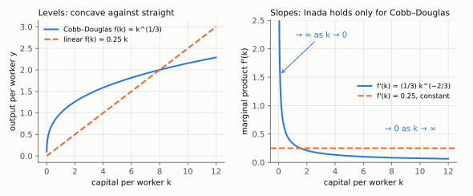
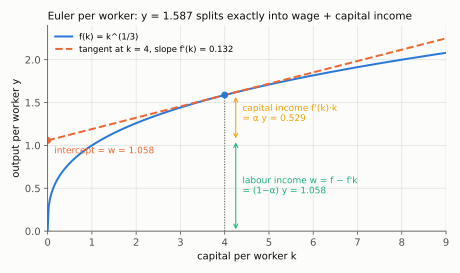

# 2. The eight assumptions, and what each one buys

**Kurlat §4.1, printed pages 53–57.** Up: [[00-index]] · Prev: [[01-growth-facts]] ·
Next: [[03-fundamental-equation]]

Kurlat lists Assumptions 4.1 through 4.8 and says "we'll see the role that each assumption
plays later on". This note does that now, because knowing which result rests on which
assumption is what makes the model usable when a question perturbs it.

---

## 2.1 Technology

$$Y_t = F(K_t, L_t) \tag{4.1.1}$$

**Assumption 4.1 — constant returns to scale.** $F(\lambda K,\lambda L)=\lambda F(K,L)$ for all
$\lambda>0$.

*What it buys:* the entire per-worker reformulation. Setting $\lambda=1/L$ is the only step in
[[03-fundamental-equation]] that needs it, and without it $y$ is not a function of $k$ alone —
the model would not close in one variable.

*What it means economically:* replication. If you can build a second identical factory with a
second identical workforce you get twice the output. That is plausible for an aggregate economy
and implausible for a single firm with a fixed manager; the aggregation is where CRS is
defensible.

*Kurlat's own aside (p. 57):* under CRS it makes no difference whether you imagine one aggregate
production process or many scaled-down copies of it. That is what licenses the representative-firm
device used from [[06_equilibrio_geral]] onward.

**Assumption 4.2 — positive marginal products.** $F_K>0$, $F_L>0$.

**Assumption 4.3 — diminishing marginal products.** $F_{KK}<0$, $F_{LL}<0$.

*What it buys:* the concavity of $f$, hence that $sf(k)$ rises more slowly than the straight line
$(\delta+n)k$, hence that they cross at most once above zero. Diminishing returns to capital is
*the* engine of the whole model: it is why accumulation alone cannot sustain growth, and why
countries far below their steady state grow fast.

**Assumption 4.4 — Inada conditions.** $\lim_{K\to0}F_K(K,L)=\infty$ and
$\lim_{K\to\infty}F_K(K,L)=0$.

Kurlat's gloss (p. 55): with very little capital, a little capital is extremely useful; with a
lot of capital, more is nearly useless because there are no workers to operate the extra
machines. And the technical point he flags — **Inada does not follow from diminishing returns,
nor the reverse.** They are separate assumptions.

*What it buys, precisely:* diminishing returns gives *at most one* interior crossing; Inada gives
*at least one*. Together they give existence and uniqueness. The counterexample that shows Inada
is doing real work is $f(k)=ak$ with $sa<\delta+n$ — concave (weakly), diminishing-returns
compatible in the weak sense, and with $sf(k)<(\delta+n)k$ for all $k>0$, so capital shrinks to
zero and there is no interior steady state at all. Proof in [[04-steady-state-and-stability]] §4.2.

> **Correction (2026-09-28).** This paragraph previously read "$f(k)=ak+b$ with $a<\delta+n$".
> Both parts were wrong. With $b>0$, $sf(0)=sb>0=(\delta+n)\cdot0$ while $sf$ has the smaller
> slope $sa<\delta+n$, so the two lines *do* cross, at $k=sb/(\delta+n-sa)>0$ — an interior
> steady state exists. And the condition for the line $sak$ to lie below $(\delta+n)k$ is
> $sa<\delta+n$, not $a<\delta+n$. The counterexample needs $b=0$, which is the $AK$ case of
> [[04-steady-state-and-stability]] §4.2.

*Right panel is the point: the Cobb–Douglas marginal product falls from ∞ to 0 (both Inada limits), the linear one stays at 0.25 for ever.*

### Cobb–Douglas, and why $\alpha$ is not an arbitrary label

$$Y = K^{\alpha}L^{1-\alpha} \tag{4.1.2}$$

Verify the four assumptions, since Kurlat says "it's easy to verify" and leaves it:

*CRS:* $F(\lambda K,\lambda L)=(\lambda K)^{\alpha}(\lambda L)^{1-\alpha}
=\lambda^{\alpha+1-\alpha}K^{\alpha}L^{1-\alpha}=\lambda F(K,L)$. ✓

*Positive marginal products:* $F_K=\alpha K^{\alpha-1}L^{1-\alpha}=\alpha Y/K>0$ and
$F_L=(1-\alpha)Y/L>0$ for $\alpha\in(0,1)$. ✓

Each line in full. For $F_K$, differentiate $K^{\alpha}$ by the power rule, holding $L$ fixed:

$$F_K = \alpha K^{\alpha-1}L^{1-\alpha}
= \alpha\,\frac{K^{\alpha}L^{1-\alpha}}{K} \quad\text{(write } K^{\alpha-1}=K^{\alpha}/K)
= \alpha\,\frac{Y}{K} \quad\text{(substitute } Y=K^{\alpha}L^{1-\alpha})$$

For $F_L$, the same with $L^{1-\alpha}$, holding $K$ fixed:

$$F_L = (1-\alpha)K^{\alpha}L^{-\alpha}
= (1-\alpha)\,\frac{K^{\alpha}L^{1-\alpha}}{L} \quad\text{(write } L^{-\alpha}=L^{1-\alpha}/L)
= (1-\alpha)\,\frac{Y}{L}$$

Both are products of positive numbers when $\alpha\in(0,1)$ and $K,L>0$.

*Diminishing:* $F_{KK}=\alpha(\alpha-1)K^{\alpha-2}L^{1-\alpha}<0$ since $\alpha<1$. ✓
(Differentiate $F_K=\alpha K^{\alpha-1}L^{1-\alpha}$ once more in $K$: the power rule brings
down $\alpha-1<0$, and every other factor is positive.) Symmetrically
$F_{LL}=-\alpha(1-\alpha)K^{\alpha}L^{-\alpha-1}<0$.

*Inada:* $F_K=\alpha(K/L)^{\alpha-1}=\alpha k^{\alpha-1}$, and since $\alpha-1<0$ this goes to
$\infty$ as $k\to0$ and to $0$ as $k\to\infty$. ✓

The first equality: $K^{\alpha-1}L^{1-\alpha}=K^{\alpha-1}L^{-(\alpha-1)}=(K/L)^{\alpha-1}$ —
the two powers share the exponent $\alpha-1$. Then write $k^{\alpha-1}=1/k^{1-\alpha}$ with
$1-\alpha>0$: the denominator goes to $0$ as $k\to0$ (so $F_K\to\infty$) and to $\infty$ as
$k\to\infty$ (so $F_K\to0$).

**The interpretation Kurlat promises** ("parameter $\alpha$ has a natural interpretation", p. 55)
is the capital income share. Under competitive factor markets — which is session 3, §4.4 — capital
earns its marginal product, so total capital income is

$$F_K\cdot K = \alpha\frac{Y}{K}\cdot K = \alpha Y
\qquad\Longrightarrow\qquad \frac{\text{capital income}}{Y}=\alpha$$

and labour's share is $1-\alpha$ by the same computation, which exhausts output exactly —
**Euler's theorem** for a homogeneous-of-degree-one function:

$$F_KK+F_LL=F(K,L)$$

Proof: differentiate $F(\lambda K,\lambda L)=\lambda F(K,L)$ with respect to $\lambda$ and set
$\lambda=1$. Line by line:

$$\frac{d}{d\lambda}F(\lambda K,\lambda L) = F_K(\lambda K,\lambda L)\cdot K + F_L(\lambda K,\lambda L)\cdot L
\qquad\text{(chain rule: } \tfrac{d(\lambda K)}{d\lambda}=K,\ \tfrac{d(\lambda L)}{d\lambda}=L)$$

$$\frac{d}{d\lambda}\big[\lambda F(K,L)\big] = F(K,L)
\qquad\text{(}F(K,L)\text{ does not depend on }\lambda)$$

The two sides of the CRS identity are equal for every $\lambda$, so their derivatives are equal:

$$F_K(\lambda K,\lambda L)K + F_L(\lambda K,\lambda L)L = F(K,L)
\;\overset{\lambda=1}{\Longrightarrow}\; F_KK+F_LL=F(K,L)$$

For Cobb–Douglas the check is direct: $F_KK+F_LL=\alpha Y+(1-\alpha)Y=Y$. So CRS is also what guarantees that paying both factors their marginal products
leaves exactly zero profit — the zero-profit condition used throughout
[[06_equilibrio_geral]].

**Per worker, the same split is a tangent line.** Divide Euler by $L$. Since
$F_K(K,L)=F_K(k,1)=f'(k)$ (the marginal product is homogeneous of degree zero), the capital
term is $F_KK/L=f'(k)k$ and the labour term is what is left:

$$y = \underbrace{f'(k)\,k}_{\text{capital income per worker}} + \underbrace{f(k)-f'(k)\,k}_{\text{wage } w=F_L}$$

*The tangent at $k$ hits the vertical axis at the wage $w=f-f'k$; the rise from there to $f(k)$ is capital income $f'(k)k=\alpha y$ — here 1.058 + 0.529 = 1.587.*

**Calibration.** Kaldor fact 3 in [[01-growth-facts]] puts the labour share near 0.65, so
$\alpha\simeq0.35$ — which is the value Kurlat draws in Figure 4.1.1, and close to the $1/3$ used
in the code of [[02_crescimento_solow]]. Two different literatures, one number, and a model that
reads the data parameter straight off a national accounts table is doing something right.

## 2.2 Population

**Assumption 4.5.** $L_{t+1}=(1+n)L_t$, with $n$ constant and exogenous.

Kurlat flags that this is "actually a very big deal" (p. 55): historically the possibility that
population growth is *endogenous*, responding to living standards as animal populations do, was a
central preoccupation. Exercise 4.5 (p. 73) is the Malthus exercise, and its point is that with
endogenous fertility the model's prediction inverts — a productivity gain raises population rather
than income per head, and living standards return to subsistence. That is exactly the pre-1800
segment of [[01-growth-facts]] §1.1, so the Malthusian model is not a curiosity: it is the model
of the other 99% of human history.

**Assumption implicit in 4.5:** everybody who is alive works, so $L$ is simultaneously population
and labour force, and per capita equals per worker. Kurlat says explicitly that the distinction
matters in data and is deferred to ch. 7 — which is [[05_trabalho_lazer]], where the participation
and hours margins of [[04-cross-country-and-ppp]] §4.4 finally get a model.

## 2.3 Closing the economy, and the saving rate

**Assumption 4.6 — closed economy, no government.** So in the identity (1.1.1) of
[[01-three-approaches]], $X=M=G=0$ and

$$Y = C+I$$

**Assumption 4.7 — the saving rate $\dfrac{Y-C}{Y}$ equals an exogenous constant $s$.**

Two steps get us to the investment equation, and Kurlat separates them deliberately (p. 56):

$$\underbrace{S \equiv Y-C = I}_{\text{step 1: closed economy}},
\qquad
\underbrace{S = sY}_{\text{step 2: Assumption 4.7}}
\qquad\Longrightarrow\qquad I = sY \tag{4.1.3}$$

Step 1 is an identity in a closed economy, not a behavioural claim. Step 2 is the behavioural
assumption, and it is the one the rest of the course dismantles: [[04_consumo_poupanca]]
replaces it with an optimising household, and $s$ stops being a parameter and becomes a function
of the interest rate, impatience and expected income.

**Kurlat's footnote 2 (p. 56) is worth reproducing**, because students assume $S=I$ needs $G=0$
and it does not. With a government collecting $\tau$ and spending $G$:

$$S = \underbrace{(Y-\tau-C)}_{\text{private}} + \underbrace{(\tau-G)}_{\text{public}}
= Y-C-G = I$$

The tax term cancels: $-\tau+\tau=0$ leaves $Y-C-G$. The last equality is the closed-economy
identity with a government, $Y=C+I+G$, rearranged by subtracting $C+G$ from both sides. Total
national saving equals investment in any closed economy, whatever the
government does. What $G>0$ changes is the *level* of saving, not the identity — which is the
crowding-out mechanism that returns, microfounded, in [[09_adas_politica]].

**Assumption 4.8 — capital depreciates at a constant rate $\delta$.**

$$K_{t+1} = (1-\delta)K_t + I_t \tag{4.1.4}$$

Next period's capital is what survived, $(1-\delta)K_t$, plus what was built, $I_t$. This is the
stock–flow identity of [[01-three-approaches]] §1.5, and the same equation that the
perpetual-inventory method uses to *construct* the capital stock in the data of
[[01-growth-facts]] §1.2.

## 2.4 The assumption ledger

| Assumption | Buys | Breaks if dropped |
|---|---|---|
| 4.1 CRS | per-worker form; Euler exhaustion; zero profit | model no longer closes in $k$ alone |
| 4.2 $F_K>0$ | $f$ increasing | accumulation could reduce output |
| 4.3 $F_{KK}<0$ | $f$ concave ⇒ **at most one** interior steady state; convergence | with constant returns to capital ($AK$) growth is endogenous and permanent |
| 4.4 Inada | **at least one** interior steady state | poverty trap or degenerate zero-capital outcome possible |
| 4.5 exogenous $n$ | $L$ path independent of income | Malthus: income gains turn into population, not living standards |
| 4.6 closed, no govt | $S=I$ | open economy: $k$ can jump via capital flows |
| 4.7 exogenous $s$ | one-variable dynamics | $s$ becomes a function of $r$ — sessions 4 and 6 |
| 4.8 constant $\delta$ | linear break-even line | non-linear replacement term, diagram distorted |

That table is the most examinable object in this note. A question of the form "what happens in
the Solow model if X" is almost always asking which row of it you are perturbing.

## 2.5 What to be able to do, cold

1. Verify all four technology assumptions for Cobb–Douglas, in four lines.
2. Prove Euler's theorem from CRS and use it to show factor payments exhaust output.
3. Show that $\alpha$ is the capital income share, and connect it to the 0.65 labour share.
4. Reproduce Kurlat's footnote 2: $S=I$ with a government.
5. Name, for each of the eight assumptions, the one result that fails without it.

Practice: Kurlat ch. 4, Exercises 4.1 and 4.2 (p. 72) on the production function's properties;
Exercise 4.5 *Malthus* (p. 73) for Assumption 4.5. Worked in
[[Resolucao/kurlat_solutions_ch1-4|ch1-4]].
