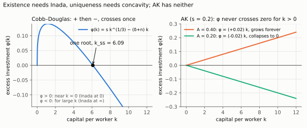
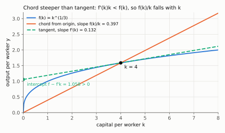
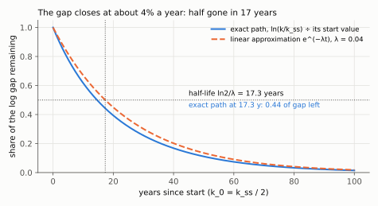
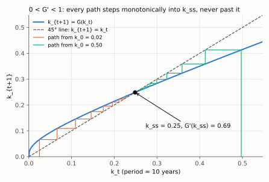

# 4. The steady state: existence, uniqueness, and global stability proved

**Kurlat §4.2, printed pages 59–61.** Up: [[00-index]] · Prev: [[03-fundamental-equation]] ·
Next: [[05-comparative-statics]]

> **Companion:** [The Solow Diagram](companion-solow.html) — drag $s$, $n$, $\delta$ and
> $\alpha$ and watch the crossing move; start the economy anywhere and watch it return.

Kurlat argues stability from the picture: above $k_{ss}$ the curve is below the line so $k$
falls, below $k_{ss}$ the reverse, "therefore over time the economy converges". That is correct
and it is not a proof — a picture does not rule out the curve and the line crossing three times,
nor the economy overshooting and diverging in discrete time. This note supplies what the picture
assumes.

---

## 4.1 Definition and closed form

**Definition.** A steady state is a $k_{ss}>0$ with $\Delta k=0$, hence

$$\boxed{\;s f(k_{ss}) = (\delta+n)\,k_{ss}\;}$$

In steady state output per worker is constant too, at $y_{ss}=f(k_{ss})$, and so is consumption
per worker.

**Cobb–Douglas closed form.** With $f(k)=k^{\alpha}$:

$$s k_{ss}^{\alpha} = (\delta+n)k_{ss}
\;\Longrightarrow\; k_{ss}^{\alpha-1} = \frac{\delta+n}{s}
\;\Longrightarrow\; k_{ss}^{1-\alpha} = \frac{s}{\delta+n}$$

The operations: divide both sides by $s\,k_{ss}$ (legal since $k_{ss}>0$), which turns
$k_{ss}^{\alpha}/k_{ss}$ into $k_{ss}^{\alpha-1}$; take reciprocals of both sides, since
$1/k_{ss}^{\alpha-1}=k_{ss}^{1-\alpha}$; raise both sides to the power $1/(1-\alpha)$ to get
$k_{ss}$. Then $y_{ss}=k_{ss}^{\alpha}$ raises the result to $\alpha$, which multiplies the
exponent: $\frac{1}{1-\alpha}\cdot\alpha=\frac{\alpha}{1-\alpha}$. And $c_{ss}=y_{ss}-sy_{ss}$
because a fraction $s$ of output is saved.

$$\boxed{\;k_{ss} = \left(\frac{s}{\delta+n}\right)^{\frac{1}{1-\alpha}},\qquad
y_{ss} = \left(\frac{s}{\delta+n}\right)^{\frac{\alpha}{1-\alpha}},\qquad
c_{ss} = (1-s)\,y_{ss}\;}$$

The exponents are worth reading rather than memorising. $1/(1-\alpha)$ is a **multiplier**: with
$\alpha=1/3$ it is $1.5$, so doubling $s$ raises $k_{ss}$ by $2^{1.5}=2.83$. And
$\alpha/(1-\alpha)=0.5$, so the same doubling raises $y_{ss}$ by only $2^{0.5}=1.41$. Output
responds *less* than capital, because the extra capital runs into diminishing returns. That
elasticity, $\alpha/(1-\alpha)$, is the single most quoted number in this session:

$$\frac{d\ln y_{ss}}{d\ln s} = \frac{\alpha}{1-\alpha} = 0.5 \text{ at } \alpha=\tfrac13$$

Where it comes from: take logs of the closed form,
$\ln y_{ss}=\frac{\alpha}{1-\alpha}\big[\ln s-\ln(\delta+n)\big]$; this is linear in $\ln s$, so
the derivative with respect to $\ln s$ is the coefficient $\frac{\alpha}{1-\alpha}$. At
$\alpha=\frac13$: $\frac{1/3}{2/3}=\frac12$.

**And it is empirically too small.** Income ratios across countries are 30–50×, while observed
saving-rate ratios are at most about 3–4×, which through an elasticity of 0.5 delivers a factor
of only $\sqrt{4}=2$. The basic Solow model therefore cannot explain the cross-country dispersion
of [[01-growth-facts]] §1.3 through saving rates. That failure is the launching point of
[[03_solow_evidencias]] and the reason TFP differences have to carry the weight.

## 4.2 Existence and uniqueness — where Inada is used

Define the excess-investment function

$$\phi(k) \equiv s f(k)-(\delta+n)k, \qquad k>0$$

A steady state is a positive root of $\phi$.

**Existence.** Consider the ratio $\phi(k)/k = sf(k)/k-(\delta+n)$.

- As $k\to0^+$: by L'Hôpital (or directly, since $f(0)=0$ under CRS),
  $\lim_{k\to0}f(k)/k=\lim_{k\to0}f'(k)=\infty$ by the first Inada condition. So
  $\phi(k)/k\to\infty>0$, and $\phi(k)>0$ for small $k$.
- As $k\to\infty$: $\lim_{k\to\infty}f(k)/k=\lim_{k\to\infty}f'(k)=0$ by the second Inada
  condition. So $\phi(k)/k\to-(\delta+n)<0$, and $\phi(k)<0$ for large $k$.

$\phi$ is continuous, positive somewhere and negative somewhere, so by the intermediate value
theorem it has a root in between. **Existence is exactly the two Inada conditions.**

(Why the sign of $\phi(k)/k$ is the sign of $\phi(k)$: dividing by $k>0$ does not change a sign.
And the L'Hôpital step: with $f(0)=0$, $f(k)/k$ is $0/0$ at $k=0$, so its limit is the limit of
the ratio of derivatives, $f'(k)/1$.)

*Left: φ starts positive (Inada at 0), ends negative (Inada at ∞) and crosses once at 6.09. Right: without either, φ = (sA − δ − n)k keeps one sign for every k > 0.*

**Uniqueness.** $f(k)/k$ is strictly decreasing. Proof:

$$\frac{d}{dk}\left(\frac{f(k)}{k}\right) = \frac{f'(k)k-f(k)}{k^2}$$

and the numerator is negative because strict concavity with $f(0)=0$ gives $f(k)>f'(k)k$ — the
chord from the origin lies above the tangent. Formally, $f(k)-f(0)=\int_0^k f'(x)\,dx > k f'(k)$
since $f'$ is strictly decreasing.

The steps of that inequality: the fundamental theorem of calculus gives
$f(k)-f(0)=\int_0^kf'(x)\,dx$; for every $x<k$, $f'(x)>f'(k)$ because $f'$ is strictly
decreasing; integrating that inequality over $[0,k]$ gives $\int_0^kf'(x)\,dx>\int_0^kf'(k)\,dx=kf'(k)$;
with $f(0)=0$ this is $f(k)>kf'(k)$, i.e. $f'(k)k-f(k)<0$. For Cobb–Douglas it is one line:
$f'(k)k-f(k)=\alpha k^{\alpha}-k^{\alpha}=-(1-\alpha)k^{\alpha}<0$.

*The chord (slope $f/k=0.397$) is steeper than the tangent (slope $f'=0.132$) because the tangent has a positive intercept; for Cobb–Douglas the ratio of slopes is exactly $\alpha=1/3$.* So $sf(k)/k$ is strictly decreasing, it crosses the constant
$\delta+n$ at most once, and the root is unique. **Uniqueness is exactly diminishing returns.**

> **The counterexample that shows both are needed.** Take $f(k)=ak$, which is CRS in $(K,L)$
> only degenerately but satisfies $f'>0$ and $f''=0$ — no diminishing returns, no Inada. Then
> $\phi(k)=(sa-\delta-n)k$ is proportional to $k$ and has **no positive root**: if
> $sa>\delta+n$, capital and output grow forever at the constant rate $sa-\delta-n$, and if
> $sa<\delta+n$ the economy collapses to zero. This is the **AK model**, and it is the cleanest
> demonstration that sustained growth from accumulation alone requires the abandonment of
> Assumption 4.3. Verified numerically in `check_solow.py`.

## 4.3 Global stability, proved

**Continuous time.** The claim is that from any $k_0>0$, $k_t\to k_{ss}$.

Since $sf(k)/k$ is strictly decreasing (§4.2) and equals $\delta+n$ exactly at $k_{ss}$:

$$k<k_{ss} \;\Longrightarrow\; \frac{sf(k)}{k}>\delta+n \;\Longrightarrow\; \dot k>0$$
$$k>k_{ss} \;\Longrightarrow\; \frac{sf(k)}{k}<\delta+n \;\Longrightarrow\; \dot k<0$$

so $k$ is monotone and bounded by $k_{ss}$, hence converges; and its limit must be a rest point,
of which there is only one. That is a complete proof, and the monotonicity is the part the
picture supplies: **capital per worker never overshoots in continuous time.**

Local speed, for later use: linearise $\dot k=\phi(k)$ about $k_{ss}$,

$$\dot k \simeq \phi'(k_{ss})\,(k-k_{ss}),
\qquad \phi'(k_{ss}) = s f'(k_{ss})-(\delta+n)$$

The first expression is a first-order Taylor expansion of $\phi$ around $k_{ss}$,
$\phi(k)\simeq\phi(k_{ss})+\phi'(k_{ss})(k-k_{ss})$, with $\phi(k_{ss})=0$ by definition of the
steady state. The second differentiates $\phi(k)=sf(k)-(\delta+n)k$ term by term.

Using $sf(k_{ss})=(\delta+n)k_{ss}$ to eliminate $s$:

$$\phi'(k_{ss}) = (\delta+n)\frac{f'(k_{ss})k_{ss}}{f(k_{ss})}-(\delta+n)
= -(\delta+n)\left[1-\alpha_{ss}\right]$$

where $\alpha_{ss}\equiv f'(k)k/f(k)$ is the elasticity of output with respect to capital — that
is, the capital share.

The operations: solve the steady-state condition for $s=(\delta+n)k_{ss}/f(k_{ss})$ and
substitute it into $sf'(k_{ss})$; then factor out $(\delta+n)$:
$(\delta+n)\big[\alpha_{ss}-1\big]=-(\delta+n)\big[1-\alpha_{ss}\big]$. For Cobb–Douglas,
$\alpha_{ss}=\frac{\alpha k^{\alpha-1}\cdot k}{k^{\alpha}}=\alpha$ at every $k$. Substituting into the Taylor line, $\dot k\simeq-\lambda(k-k_{ss})$, whose
solution is $k_t-k_{ss}=(k_0-k_{ss})e^{-\lambda t}$ (check: differentiating gives
$\dot k_t=-\lambda(k_t-k_{ss})$). So deviations decay at rate

$$\boxed{\;\lambda = (1-\alpha)(\delta+n)\;}$$

With $\alpha=1/3$, $\delta=0.05$, $n=0.01$: $\lambda = (2/3)(0.06)=0.04$, **4% a year**, implying
a half-life of $\ln 2/0.04 \simeq 17$ years. That number is the headline of the convergence
literature and it is derived properly in session 3; it appears here because it falls out of the
stability proof for free.

The half-life in steps: the gap is half its initial size when $e^{-\lambda t}=\frac12$; take logs,
$-\lambda t=\ln\frac12=-\ln2$; divide by $-\lambda$, $t=\ln2/\lambda=0.6931/0.04=17.3$ years.

*Starting at half of $k_{ss}$, the exact path (blue) closes the gap slightly faster than the linear approximation (orange), which is exact only near $k_{ss}$; both are about half done at 17 years.*

**Discrete time is not automatic.** In discrete time the map is

$$k_{t+1} = G(k_t) \equiv \frac{(1-\delta)k_t+sf(k_t)}{1+n}$$

and monotone convergence requires $|G'(k_{ss})|<1$, not merely $G'(k_{ss})<1$. Compute:

$$G'(k) = \frac{(1-\delta)+sf'(k)}{1+n} \;>\;0$$

$G'$ is **positive**, so $G$ is increasing and the path cannot oscillate at all; and at the
steady state

$$G'(k_{ss}) = \frac{1-\delta+\alpha(\delta+n)}{1+n} < 1 \iff \alpha(\delta+n) < \delta+n$$

which holds for any $\alpha<1$. So the discrete map is stable too, and monotonically — but notice
that it is *Assumption 4.3 again* ($\alpha<1$) doing the work. With $\alpha\ge1$ the map is
explosive. `check_solow.py` confirms $|G'(k_{ss})|<1$ across a parameter grid.

The steps. $G'$ differentiates the numerator of $G$ term by term (the denominator $1+n$ is a
constant). At $k_{ss}$, for Cobb–Douglas,
$sf'(k_{ss})=s\alpha k_{ss}^{\alpha-1}=\alpha\,\frac{sk_{ss}^{\alpha}}{k_{ss}}=\alpha\,\frac{(\delta+n)k_{ss}}{k_{ss}}=\alpha(\delta+n)$,
using the steady-state condition $sk_{ss}^{\alpha}=(\delta+n)k_{ss}$. Then multiply the
inequality by $1+n>0$, $1-\delta+\alpha(\delta+n)<1+n$, and subtract $1-\delta$ from both
sides, $\alpha(\delta+n)<\delta+n$.

*With a decade as the period ($\delta=1-0.95^{10}$, $n=1.01^{10}-1$) the steps are visible: $G$ is increasing and flatter than 45° at $k_{ss}$ ($G'=0.69$), so both staircases walk into $k_{ss}$ without ever jumping past it.*

## 4.4 What "no growth in steady state" does and does not mean

Kurlat flags a terminological subtlety (p. 60) and it is worth stating sharply.

In steady state, **$k$ and $y$ are constant** — output *per worker* does not grow. But the
aggregate economy does:

$$\frac{\dot K}{K} = \frac{\dot L}{L} = \frac{\dot Y}{Y} = n$$

Why: $K=kL$, so taking logs and differentiating in time gives
$\dot K/K=\dot k/k+\dot L/L=0+n$; the same with $Y=yL$ gives $\dot Y/Y=\dot y/y+n=n$.
Total output grows at the population growth rate. So "the economy is not growing" is shorthand
for "output per worker is not growing"; total GDP grows at $n$. Confusing the two produces the
false claim that Solow predicts a stagnant aggregate economy.

And the failure this exposes: Kaldor fact 1 in [[01-growth-facts]] says GDP **per capita** grows
at a constant positive rate, and the basic model says it is eventually zero. The model fails its
own first target. Session 3 fixes exactly this.

## 4.5 What to be able to do, cold

1. Derive $k_{ss}$, $y_{ss}$, $c_{ss}$ for Cobb–Douglas and state the elasticity
   $\alpha/(1-\alpha)$.
2. Use that elasticity to show saving-rate differences cannot explain observed income gaps.
3. Prove existence from Inada and uniqueness from concavity, and give the $AK$ counterexample.
4. Prove global stability in continuous time, and check $|G'(k_{ss})|<1$ in discrete time.
5. Derive the local convergence rate $(1-\alpha)(\delta+n)$ and evaluate it.
6. Say precisely what grows and what does not in steady state.

Practice: Kurlat ch. 4, Exercises 4.3, 4.4, 4.6 (pp. 72–73). Worked in
[[Resolucao/kurlat_solutions_ch1-4|ch1-4]].
