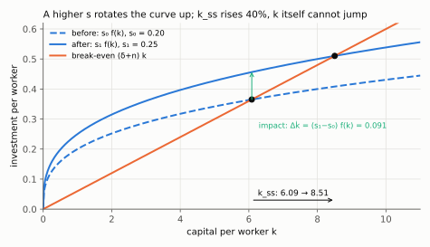
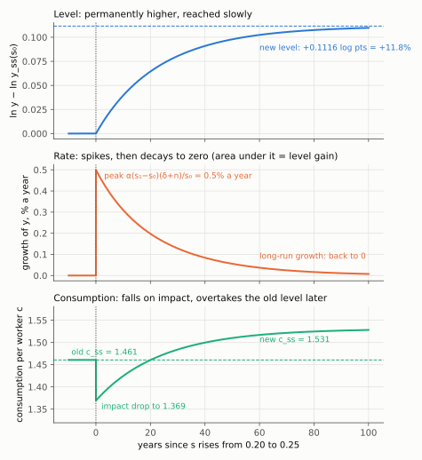
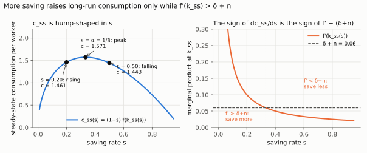
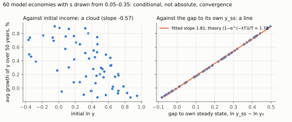

# 5. Level against rate: the transition computed

**Kurlat §4.2, printed pages 59–61.** Up: [[00-index]] ·
Prev: [[04-steady-state-and-stability]]

> **Companion:** [Level, Not Rate](companion-transition.html) — raise $s$ permanently at a
> chosen date and watch the growth rate of output per worker spike and decay back to zero while
> the level settles permanently higher. The area under the growth spike is the level gain.

This note exists because of one sentence in [[02_crescimento_solow]]: *"confusing a level effect
with a rate effect is error #1 in the exam."* The way to stop making it is to compute the
transition rather than to memorise the warning.

---

## 5.1 The three comparative statics

Differentiate the steady state $sf(k_{ss})=(\delta+n)k_{ss}$ implicitly. Write $\phi(k,s,n,\delta)=sf(k)-(\delta+n)k$, so

$$\frac{\partial k_{ss}}{\partial s} = -\frac{\phi_s}{\phi_k} = -\frac{f(k_{ss})}{sf'(k_{ss})-(\delta+n)}$$

Where the first equality comes from: $\phi(k_{ss}(s),s)=0$ holds for every $s$, so its total
derivative in $s$ is zero, $\phi_k\,\frac{\partial k_{ss}}{\partial s}+\phi_s=0$ (chain rule);
solve for $\frac{\partial k_{ss}}{\partial s}$. The partials of $\phi=sf(k)-(\delta+n)k$ are
$\phi_s=f(k)$ and $\phi_k=sf'(k)-(\delta+n)$.

The denominator is $\phi'(k_{ss})=-(1-\alpha)(\delta+n)<0$ from
[[04-steady-state-and-stability]] §4.3, and the numerator is positive, so

$$\frac{\partial k_{ss}}{\partial s} = \frac{f(k_{ss})}{(1-\alpha)(\delta+n)} \;>\;0$$

The same computation with $\phi_n=\phi_\delta=-k_{ss}$ gives

$$\frac{\partial k_{ss}}{\partial n} = \frac{\partial k_{ss}}{\partial \delta}
= -\frac{k_{ss}}{(1-\alpha)(\delta+n)} \;<\;0$$

Identical, confirming §3.3: **$n$ and $\delta$ are the same parameter to this model.**

In elasticity form, which is how to remember them, straight from the closed form:

$$\frac{d\ln k_{ss}}{d\ln s} = \frac{1}{1-\alpha},\qquad
\frac{d\ln y_{ss}}{d\ln s} = \frac{\alpha}{1-\alpha},\qquad
\frac{d\ln y_{ss}}{d\ln(\delta+n)} = -\frac{\alpha}{1-\alpha}$$

Take logs of the closed forms of [[04-steady-state-and-stability]] §4.1:

$$\ln k_{ss}=\frac{1}{1-\alpha}\big[\ln s-\ln(\delta+n)\big],\qquad
\ln y_{ss}=\alpha\ln k_{ss}=\frac{\alpha}{1-\alpha}\big[\ln s-\ln(\delta+n)\big]$$

Each is linear in $\ln s$ and in $\ln(\delta+n)$, so each elasticity is the coefficient in front.
Cross-check with the implicit derivative above: multiply $\frac{\partial k_{ss}}{\partial s}$ by
$\frac{s}{k_{ss}}$ and use $sf(k_{ss})=(\delta+n)k_{ss}$,
$\frac{s\,f(k_{ss})}{(1-\alpha)(\delta+n)k_{ss}}=\frac{(\delta+n)k_{ss}}{(1-\alpha)(\delta+n)k_{ss}}=\frac{1}{1-\alpha}$.

*The dashed curve is $s_0f(k)$, the solid one $s_1f(k)$: on impact $k$ stays at 6.09 and investment jumps by 0.091 above break-even; the new crossing is at 8.51.*

| Shock | $k_{ss}$ | $y_{ss}$ | $c_{ss}$ | long-run growth of $y$ |
|---|---|---|---|---|
| $s\uparrow$ | ↑ | ↑ | ambiguous — see §5.4 | **0** |
| $n\uparrow$ | ↓ | ↓ | ↓ | **0** |
| $\delta\uparrow$ | ↓ | ↓ | ↓ | **0** |

**The last column is the whole point.** Every one of these is a *level* effect. None of them
changes the long-run growth rate of output per worker, which is zero in this model whatever the
parameters are.

## 5.2 The transition, computed

Suppose the economy sits at $k_{ss}(s_0)$ and at date $T$ the saving rate rises permanently to
$s_1>s_0$. What happens?

**On impact.** $k$ is a **stock** and cannot jump; $k_T = k_{ss}(s_0)$ still. But investment
jumps immediately from $s_0f(k_T)$ to $s_1f(k_T)$, so

$$\dot k_T = s_1 f(k_T)-(\delta+n)k_T = (s_1-s_0)f(k_T) \;>\;0$$

using $s_0f(k_T)=(\delta+n)k_T$. Capital starts growing at once, at a rate proportional to the
size of the saving-rate change. Output jumps only through $k$, so **output does not jump** —
it starts rising from its old level. Consumption, by contrast, *does* jump, and **downward**:
$c=(1-s)f(k)$ falls discretely by $(s_1-s_0)f(k_T)$ at the moment of the change.

**During the transition.** Growth of output per worker is

$$\frac{\dot y}{y} = \alpha\frac{\dot k}{k} = \alpha\left[\frac{s_1f(k)}{k}-(\delta+n)\right]$$

which is positive at $k_T$ and falls monotonically to zero as $k\to k_{ss}(s_1)$, because
$f(k)/k$ is strictly decreasing ([[04-steady-state-and-stability]] §4.2). So the growth rate
**spikes and decays**, at the rate $\lambda=(1-\alpha)(\delta+n)$ derived earlier:

$$\frac{\dot y_t}{y_t} \;\simeq\; \alpha\lambda\,\frac{k_{ss}(s_1)-k_t}{k_t}
\;\propto\; e^{-\lambda(t-T)}$$

The steps: $\dot y/y=\alpha\,\dot k/k$ (log-differentiate $y=k^{\alpha}$); the linearisation of
[[04-steady-state-and-stability]] §4.3 gives $\dot k\simeq-\lambda\big(k-k_{ss}(s_1)\big)$;
divide by $k$ and multiply by $\alpha$. The gap itself decays as
$k_{ss}(s_1)-k_t=\big(k_{ss}(s_1)-k_T\big)e^{-\lambda(t-T)}$, hence the proportionality (the
$1/k_t$ factor varies much less than the gap, which is why it is "$\propto$" only approximately).

**In the new steady state.** Growth is back to zero. The level is permanently higher by

$$\ln y_{ss}(s_1)-\ln y_{ss}(s_0) = \frac{\alpha}{1-\alpha}\,\ln\frac{s_1}{s_0}$$

**The integral identity worth knowing.** The total level gain is the area under the growth spike:

$$\int_T^{\infty}\frac{\dot y_t}{y_t}\,dt = \ln y_{ss}(s_1)-\ln y_{ss}(s_0)
= \frac{\alpha}{1-\alpha}\ln\frac{s_1}{s_0}$$

The steps: $\dot y_t/y_t=\frac{d}{dt}\ln y_t$, so the integral is
$\int_T^\infty\frac{d}{dt}\ln y_t\,dt=\lim_{t\to\infty}\ln y_t-\ln y_T$ (fundamental theorem of
calculus); $y_t\to y_{ss}(s_1)$ and $y_T=y_{ss}(s_0)$ because $y$ does not jump. The last
equality subtracts the two logged closed forms: the $\ln(\delta+n)$ terms cancel, leaving
$\frac{\alpha}{1-\alpha}(\ln s_1-\ln s_0)$.

That is the precise sense in which a level effect and a rate effect are different objects: a
permanent rate change would make that integral diverge. Verified in `check_solow.py`.

**Numbers.** $\alpha=1/3$, $\delta=0.05$, $n=0.01$, and $s$ from 0.20 to 0.25. The level gain is
$0.5\times\ln1.25 = 0.1116$, about **11.8%** more output per worker. The half-life is 17 years,
so about 35 years to get 75% of the way. The peak growth rate is
$\alpha(s_1-s_0)f(k)/k = \alpha\lambda\cdot\frac{\Delta k_{ss}}{k_{ss}}\cdot$(something near 1),
roughly **0.5% a year** — noticeable but modest, and gone within a generation.

Each number in steps. Level: $0.5\times\ln1.25=0.5\times0.2231=0.1116$ log points, and
$e^{0.1116}-1=0.118$. Seventy-five per cent: the remaining gap is $e^{-\lambda t}=0.25$ when
$t=\ln4/\lambda=2\ln2/\lambda$, two half-lives, $2\times17.3=34.7$ years. Peak growth, exactly
rather than with "something near 1": the peak is at $t=T$, where $k_T=k_{ss}(s_0)$ and so
$f(k_T)/k_T=(\delta+n)/s_0$ by the old steady-state condition. Then

$$\left.\frac{\dot y}{y}\right|_{T}=\alpha\left[\frac{s_1f(k_T)}{k_T}-(\delta+n)\right]
=\alpha\left[\frac{s_1(\delta+n)}{s_0}-(\delta+n)\right]
=\alpha(\delta+n)\,\frac{s_1-s_0}{s_0}
=\tfrac13\times0.06\times\tfrac{0.05}{0.20}=0.005.$$

The linearised expression gives
$\alpha\lambda\cdot\frac{\Delta k_{ss}}{k_{ss}}=\frac13\times0.04\times(1.25^{1.5}-1)=\frac13\times0.04\times0.3975=0.0053$;
it overstates the exact 0.0050 because the jump is not small.

*Top: the level climbs to +11.8% and stays. Middle: the growth rate jumps to 0.5% and decays to zero; the area under it is the 0.1116 level gain. Bottom: consumption drops from 1.461 to 1.369 on impact and only later overtakes its old level, ending at 1.531.*

That calculation is the answer to "should a country save more?" in this model: yes, it is
permanently richer, by about a tenth, after decades of slightly faster growth and an immediate
fall in consumption. Whether the trade is worth it is the Golden Rule question of session 3.

## 5.3 Why the confusion is so persistent

Three reasons, each worth being able to name.

1. **During the transition, the two are indistinguishable in data.** A country in transition has
   a permanently higher saving rate *and* faster growth for decades. Only the model says the
   growth will stop.
2. **Decades is a long time.** With a 17-year half-life, a transition takes most of a working
   life. "Eventually zero" is not a statement about anything a policymaker will observe.
3. **The endogenous-growth alternative predicts otherwise, and is not crazy.** In the $AK$ case
   of [[04-steady-state-and-stability]] §4.2 a rise in $s$ *does* raise the growth rate
   permanently. So the level-not-rate claim is a consequence of Assumption 4.3 and nothing more.

## 5.4 The consumption ambiguity

The one entry in the table that is not signed. In steady state

$$c_{ss}(s) = (1-s)f\!\left(k_{ss}(s)\right)$$

Two opposing forces: a larger $s$ raises $k_{ss}$ and hence $f(k_{ss})$, but it also takes a
larger slice for investment. Differentiate:

$$\frac{dc_{ss}}{ds} = -f(k_{ss}) + (1-s)f'(k_{ss})\frac{dk_{ss}}{ds}$$

Substituting $dk_{ss}/ds$ from §5.1 and simplifying with $sf=(\delta+n)k$ gives the clean
criterion

$$\frac{dc_{ss}}{ds} > 0 \iff f'(k_{ss}) > \delta+n$$

Every line, for any $f$ (write $f,f'$ for $f(k_{ss}),f'(k_{ss})$). From §5.1,
$\frac{dk_{ss}}{ds}=\frac{f}{(\delta+n)-sf'}$ (the same fraction with the sign moved into the
denominator), and $(\delta+n)-sf'=-\phi'(k_{ss})>0$ by §4.3. Substitute:

$$\frac{dc_{ss}}{ds}=-f+(1-s)f'\,\frac{f}{(\delta+n)-sf'} \qquad\text{(substitute)}$$
$$=f\cdot\frac{-\big[(\delta+n)-sf'\big]+(1-s)f'}{(\delta+n)-sf'} \qquad\text{(common denominator, factor out } f)$$
$$=f\cdot\frac{-(\delta+n)+sf'+f'-sf'}{(\delta+n)-sf'}
=\frac{f\,\big[f'-(\delta+n)\big]}{(\delta+n)-sf'} \qquad\text{(expand; the } sf'\text{ terms cancel)}$$

$f>0$ and the denominator is positive, so the sign of $dc_{ss}/ds$ is the sign of
$f'(k_{ss})-(\delta+n)$. For Cobb–Douglas, $f'(k_{ss})=\alpha(\delta+n)/s$ (from
$sf'(k_{ss})=\alpha(\delta+n)$, §4.3), so the criterion reads $\alpha/s>1$, i.e. $s<\alpha$.

*Left: steady-state consumption rises until $s=\alpha=1/3$ (1.571) and falls after. Right: the peak is exactly where $f'(k_{ss})$ crosses $\delta+n=0.06$.*

so more saving raises long-run consumption if and only if the marginal product of capital exceeds
the break-even rate. That inequality **is** the Golden Rule condition, and it is where session 3
starts — [[03_solow_evidencias]]. Note what has quietly happened: the model, which has no
optimising agent in it, has produced a welfare criterion anyway, because $c_{ss}$ is a
well-defined function of a parameter.

## 5.5 Convergence: absolute against conditional

> **Companion:** [Two Economies, One Border](companion-unification.html) — Lista 2 Q1: two
> economies converging to different steady states (conditional convergence, not divergence), then
> unified; see who gains per worker, who loses, and where the aggregate gain comes from.

*Lista 2 Q1 answered: each economy converges to its own steady state, so the level gap persists. This is conditional convergence, not divergence. Diagnosis: [[avaliacao-listas-2-3-6]].*

The transition result *is* the convergence result, read across countries instead of across time.

**Conditional convergence.** Two countries with the same $s$, $n$, $\delta$ and $\alpha$ share a
$k_{ss}$; the one further below it grows faster. From §5.2, growth is approximately

$$\frac{\dot y}{y} \simeq \lambda\left(\ln y_{ss}-\ln y\right), \qquad \lambda=(1-\alpha)(\delta+n)$$

— a regression of growth on the gap to one's **own** steady state, with a predicted coefficient
of about 0.04.

From §5.2 to this line: $\frac{k_{ss}-k}{k}\simeq\ln k_{ss}-\ln k$ for small gaps (first-order
Taylor, $\ln(1+x)\simeq x$ with $x=\frac{k_{ss}-k}{k}$), so
$\frac{\dot y}{y}\simeq\alpha\lambda(\ln k_{ss}-\ln k)=\lambda(\alpha\ln k_{ss}-\alpha\ln k)=\lambda(\ln y_{ss}-\ln y)$,
using $\ln y=\alpha\ln k$. Over a window of $T$ years the average growth rate is
$\frac{1}{T}(\ln y_T-\ln y_0)=\frac{1-e^{-\lambda T}}{T}(\ln y_{ss}-\ln y_0)$, since the log gap
decays as $e^{-\lambda t}$; that is the coefficient a cross-section regression over $T$ years
should find ($0.0173$ for $T=50$).

*Sixty model economies that differ only in $s$: plotted against initial income they form a cloud (absolute convergence fails); plotted against their own gap they line up, slope 1.81 against the predicted 1.73 %/yr per log point.*

**Absolute convergence** is the same statement with $y_{ss}$ assumed common to all countries.
It therefore predicts a downward-sloping scatter of growth against *initial income*, and
[[01-growth-facts]] §1.3 says the world sample shows no such thing.

The reconciliation is that $y_{ss}$ differs enormously across countries. Which is not a rescue —
it is a confession: the model's free parameters are doing the explaining. Making $y_{ss}$
observable, and testing whether the differences in $s$ and $n$ are *large enough*, is exactly the
programme of Kurlat ch. 5 and session 3. Spoiler, from §4.1: they are not, by a wide margin.

## 5.6 What to be able to do, cold

1. Sign all three comparative statics and give the elasticities.
2. Describe the impact effects of a rise in $s$: $k$ does not jump, $y$ does not jump,
   $c$ falls discretely, $\dot k$ jumps up.
3. Compute the level gain and the peak growth rate for a given parameter set.
4. State the integral identity and explain why it distinguishes level from rate effects.
5. Derive the consumption criterion $f'(k_{ss})\gtrless\delta+n$.
6. Write the conditional-convergence regression and say what absolute convergence adds.

Practice: Kurlat ch. 4, Exercises 4.4, 4.6 and 4.7 (pp. 72–73) are the comparative-statics and
transition exercises. Worked in [[Resolucao/kurlat_solutions_ch1-4|ch1-4]].
