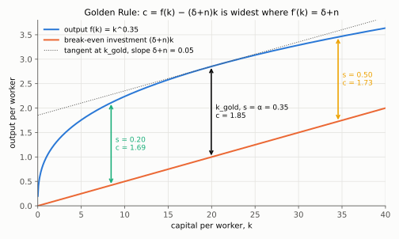
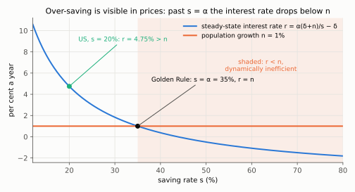

# 1. The Golden Rule, and the one inefficiency the model can diagnose

**Kurlat §4.3, printed pages 61–63.** Up: [[00-index]] ·
Next: [[02-markets-and-factor-prices]] · Rules: [[03_solow_evidencias]]

> **Companion:** [The Golden Rule](companion-golden-rule.html) — $c_{ss}$ as a hump in $s$,
> with the dynamically inefficient region shaded and the consumption path of a move to
> $s_{gold}$ drawn from both sides, so the asymmetry is visible rather than asserted.

The Solow model has no preferences in it, so it cannot say what is best. But steady-state
consumption *is* a well-defined function of the saving rate, and maximising it is a coherent
question with a sharp answer — and, on one side of that answer, a genuine efficiency verdict.

---

## 1.1 The problem

Every $s$ generates a steady state. In it, consumption per worker is output minus the
investment needed to stand still:

$$c_{ss}(s) = f\!\left(k_{ss}(s)\right) - (\delta+n)\,k_{ss}(s)$$

using $s f(k_{ss}) = (\delta+n)k_{ss}$ to replace $s f(k_{ss})$ rather than carrying $s$
explicitly. Step by step:

$$c_{ss} = (1-s)f(k_{ss}) \qquad\text{(consumption is output not saved)}$$

$$= f(k_{ss}) - s f(k_{ss}) \qquad\text{(expand the product)}$$

$$= f(k_{ss}) - (\delta+n)k_{ss} \qquad\text{(steady state: } s f(k_{ss})=(\delta+n)k_{ss}\text{)}$$

Written this way, the problem is cleaner as a choice of $k$ than as a choice of
$s$, since $k_{ss}(\cdot)$ is a strictly increasing bijection ([[04-steady-state-and-stability]]
§5.1):

$$\max_{k}\; c(k) = f(k)-(\delta+n)k$$

## 1.2 The first-order condition

$$c'(k) = f'(k)-(\delta+n) = 0
\qquad\Longrightarrow\qquad
\boxed{\;f'(k_{gold}) = \delta+n\;}$$

Second-order condition: $c''(k)=f''(k)<0$ by Assumption 4.3, so the stationary point is a
**maximum**, and because $f$ is strictly concave it is the unique one. The Inada conditions
guarantee an interior solution: $c'(0^+)=\infty>0$ and $c'(\infty)=-(\delta+n)<0$.
(Explicitly: $c'(k)=f'(k)-(\delta+n)$; as $k\to0^+$, $f'(k)\to\infty$, so $c'\to\infty$; as
$k\to\infty$, $f'(k)\to0$, so $c'\to-(\delta+n)$. A continuous $c'$ that starts positive and ends
negative crosses zero, and since $c''=f''<0$ it crosses only once.)

*Read the vertical gap between $f(k)$ and $(\delta+n)k$: it is steady-state consumption, and it is widest (1.85) at $k_{gold}\approx20$, where the tangent to $f$ is parallel to the break-even line. Saving 20% or 50% lands on narrower gaps (g = 0, $\delta+n=0.05$).*

**Read the condition.** At the optimum, the marginal product of capital equals the cost of
maintaining it. One more unit of capital produces $f'(k)$ forever and costs $(\delta+n)$ per
period to keep — $\delta$ to replace wear, $n$ to equip the extra workers. Accumulate past
that point and each extra unit costs more to maintain than it produces. The economy is
working to sustain capital that does not pay for itself.

## 1.3 The Cobb–Douglas result: $s_{gold}=\alpha$

With $f(k)=k^{\alpha}$, $f'(k)=\alpha k^{\alpha-1}$, so

$$\alpha k_{gold}^{\alpha-1} = \delta+n
\qquad\Longrightarrow\qquad
k_{gold} = \left(\frac{\alpha}{\delta+n}\right)^{\frac{1}{1-\alpha}}$$

The arrow, one operation per line:

$$k_{gold}^{\alpha-1} = \frac{\delta+n}{\alpha} \qquad\text{(divide both sides by } \alpha\text{)}$$

$$k_{gold}^{1-\alpha} = \frac{\alpha}{\delta+n} \qquad\text{(take reciprocals: } k^{\alpha-1}=1/k^{1-\alpha}\text{)}$$

$$k_{gold} = \left(\frac{\alpha}{\delta+n}\right)^{\frac{1}{1-\alpha}} \qquad\text{(raise both sides to } 1/(1-\alpha)\text{)}$$

Now find the saving rate that delivers it. From [[04-steady-state-and-stability]],
$k_{ss}(s)=\left(s/(\delta+n)\right)^{1/(1-\alpha)}$, so set the two equal:

$$\left(\frac{s}{\delta+n}\right)^{\frac{1}{1-\alpha}}
= \left(\frac{\alpha}{\delta+n}\right)^{\frac{1}{1-\alpha}}
\qquad\Longrightarrow\qquad \boxed{\;s_{gold}=\alpha\;}$$

The arrow: raise both sides to the power $1-\alpha$, which undoes the outer exponent and gives
$s/(\delta+n)=\alpha/(\delta+n)$; multiply both sides by $\delta+n$ to get $s=\alpha$.

A second derivation that explains *why*, rather than just confirming it. In steady state,
investment is $(\delta+n)k_{ss}$ and output is $f(k_{ss})$, so the investment share of output is

$$\frac{(\delta+n)k_{ss}}{f(k_{ss})} = s$$

(divide both sides of the steady-state condition $s f(k_{ss})=(\delta+n)k_{ss}$ by $f(k_{ss})$).
At the Golden Rule $\delta+n=f'(k_{gold})$, so that share becomes

$$s_{gold} = \frac{f'(k_{gold})\,k_{gold}}{f(k_{gold})}
\qquad\text{(replace } \delta+n \text{ by } f'(k_{gold})\text{)}$$

$$= \frac{\alpha k_{gold}^{\alpha-1}\cdot k_{gold}}{k_{gold}^{\alpha}}
= \frac{\alpha k_{gold}^{\alpha}}{k_{gold}^{\alpha}} = \alpha
\qquad\text{(Cobb–Douglas: } f'=\alpha k^{\alpha-1}\text{; add exponents, cancel)}$$

which is the **elasticity of output with respect to capital** — the capital income share by
[[02-ingredients]] §2.1. So the rule is: *save exactly capital's share of income.* That is a
statement about the production function alone, independent of $\delta$ and $n$, and it is the
reason the result is quotable.

**Numbers.** With $\alpha=0.35$, the Golden Rule saving rate is 35%, against a US investment
rate near 20%. So the US is **below** the Golden Rule — which, as §1.5 shows, is not a
criticism.

## 1.4 The two sides of the peak, and why they are not symmetric

This is the substance of the section and trap 2 in [[03_solow_evidencias]].

### Above the Golden Rule: $k_{ss}>k_{gold}$, i.e. $s>\alpha$

Here $f'(k_{ss})<\delta+n$. Cut $s$. What happens?

- **On impact:** $c=(1-s)f(k)$ jumps **up**, because less output is being set aside.
- **During the transition:** $k$ falls toward the new, lower $k_{ss}$. Output falls — but
  required investment falls faster, precisely because $f'(k)<\delta+n$ over the whole range
  traversed.
- **In the new steady state:** consumption is **higher** than before.

Why "at every date", in three inequalities. Write $s_1<s_0$ for the new and old rates and
$k_1<k_0$ for their steady states, both above $k_{gold}$ (with $s_1\ge\alpha$).

$$c_t=(1-s_1)f(k_t) \ge (1-s_1)f(k_1) \qquad\text{(}k_t\text{ falls monotonically from } k_0 \text{ to } k_1\text{, and } f \text{ is increasing)}$$

$$(1-s_1)f(k_1) = f(k_1)-(\delta+n)k_1 = c(k_1) \qquad\text{(steady state at } s_1\text{, as in §1.1)}$$

$$c(k_1) > c(k_0) \qquad\text{(}c'(k)=f'(k)-(\delta+n)<0 \text{ on } [k_1,k_0]\text{, since both lie above } k_{gold}\text{)}$$

Chaining them, $c_t > c(k_0)$, the old steady-state consumption, for every $t$ after the cut.

So consumption is higher **immediately and at every date thereafter**. No generation loses.
This is an unambiguous Pareto improvement and it needs no preferences, no discount rate and no
interpersonal comparison to establish. The economy was **dynamically inefficient**: it was
accumulating capital that could not pay for its own upkeep.

### Below the Golden Rule: $k_{ss}<k_{gold}$, i.e. $s<\alpha$

Here $f'(k_{ss})>\delta+n$. Raise $s$ and:

- **On impact:** consumption falls discretely, by $(s_1-s_0)f(k_{ss})$. ($k$ cannot jump, so
  $c$ goes from $(1-s_0)f(k_{ss})$ to $(1-s_1)f(k_{ss})$; subtract the second from the first.)
- **During the transition:** consumption recovers and eventually overtakes.
- **In the new steady state:** consumption is higher.

Some generations lose and later ones gain. **That is a trade-off, not an inefficiency.**
Whether it is worth making depends on how the present is weighed against the future, and the
Solow model has no object that answers that — there is no utility function, no discount
factor, nobody choosing. The model can identify waste; it cannot adjudicate a genuine
intertemporal trade.

> **This gap is the reason session 4 exists.** [[04_consumo_poupanca]] puts a discount factor
> and a utility function into the model, at which point "should we save more?" becomes a
> well-posed question with an answer — and the answer is the **modified** Golden Rule,
> $f'(k)=\delta+n+\rho$, which sits strictly *below* the Golden Rule capital stock because
> impatience is now priced. The Solow Golden Rule is the special case $\rho=0$: a planner who
> does not discount the future at all.

**The asymmetry in one line, worth memorising:** over-accumulation is a mistake anyone can
diagnose; under-accumulation is a preference.

## 1.5 Is the US below the Golden Rule, and does it matter?

The empirical test does not require estimating $k$. Compare $f'(k)$ with $\delta+n$ — and by
[[02-markets-and-factor-prices]], $f'(k)$ is the rental rate of capital, which is observable.
Equivalently, and this is the form the literature uses (Abel, Mankiw, Summers and Zeckhauser,
1989), compare **capital income with investment**:

$$\text{dynamically inefficient} \iff f'(k)<\delta+n
\iff \underbrace{f'(k)k}_{\text{capital income}} < \underbrace{(\delta+n)k}_{\text{investment}}$$

both of which are national-accounts line items. (The second equivalence multiplies both
sides by $k>0$, which preserves the inequality.) With Cobb–Douglas, divide both sides by
$y=f(k)$: capital income over output is $f'(k)k/f(k)=\alpha$, and in steady state investment
over output is $(\delta+n)k/f(k)=s$, so the test reduces to $\alpha<s$ — the same $s_{gold}=\alpha$
threshold. In US data capital income comfortably exceeds
investment — roughly 35% of GDP against 20% — so the US, and every developed economy that has
been checked, is **below** the Golden Rule. Dynamic inefficiency is a theoretical possibility
that the data decline to produce.

The same test in prices. In steady state $r=f'(k_{ss})-\delta$, and for Cobb–Douglas
$f'(k_{ss})=\alpha k_{ss}^{\alpha-1}=\alpha(\delta+n)/s$ (because $k_{ss}^{\alpha-1}=(\delta+n)/s$
from $s k_{ss}^{\alpha}=(\delta+n)k_{ss}$). So

$$r(s)=\frac{\alpha(\delta+n)}{s}-\delta,\qquad r(s)<n \iff \frac{\alpha(\delta+n)}{s}<\delta+n \iff s>\alpha$$

(add $\delta$ to both sides, then divide by $\delta+n>0$ and rearrange).

*Read where the blue $r(s)$ curve crosses the orange line $n=1\%$: exactly at $s=\alpha=35\%$. The US at $s=20\%$ has $r=4.75\%>n$, outside the shaded dynamically inefficient region (g = 0, $\delta=0.04$, $n=0.01$).*

That is a reassuring result and a slightly deflating one: the one welfare verdict this model
can deliver on its own turns out never to bind.

## 1.6 With technological progress

Everything above goes through in efficiency units, with $g$ added to the break-even rate
([[03-technological-progress]]):

$$f'(\tilde k_{gold}) = \delta+n+g$$

and, for Cobb–Douglas, still $s_{gold}=\alpha$ — the saving rate is unchanged, because the
$\delta+n+g$ cancels in the same way:
$s_{gold}=\dfrac{(\delta+n+g)\tilde k_{gold}}{f(\tilde k_{gold})}=\dfrac{f'(\tilde k_{gold})\tilde k_{gold}}{f(\tilde k_{gold})}=\alpha$
(divide the efficiency-unit steady state $s f(\tilde k)=(\delta+n+g)\tilde k$ by $f(\tilde k)$,
then substitute the Golden Rule condition). Forgetting the $g$ here is trap 5 in
[[03_solow_evidencias]].

Note what the Golden Rule maximises once $A$ grows: consumption per *efficiency unit*, which
is constant on the balanced path, while consumption per worker grows at $g$ forever. The rule
picks the highest *path*, not the highest level.

## 1.7 What to be able to do, cold

1. Set up $\max_k f(k)-(\delta+n)k$ and derive $f'(k_{gold})=\delta+n$ with its second-order
   condition.
2. Show $s_{gold}=\alpha$ two ways — by equating $k$'s, and via the investment-share argument.
3. Describe the full consumption path of a cut in $s$ from above the Golden Rule, and say why
   it is a Pareto improvement.
4. Describe the path from below and say precisely why the model cannot rank it.
5. State the observable test $f'(k)k \gtrless (\delta+n)k$ and its empirical verdict.
6. Add $g$ and say what changes and what does not.

Practice: Kurlat ch. 4, Exercises 4.6, 4.7 and 4.8 (pp. 73–74). Worked in
[[Resolucao/kurlat_solutions_ch1-4|ch1-4]].
