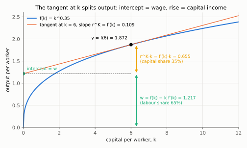
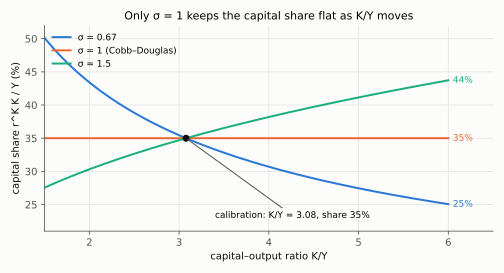

# 2. Markets: where the wage, the rental rate and the interest rate come from

**Kurlat §4.4, printed pages 63–69.** Up: [[00-index]] · Prev: [[01-golden-rule]] ·
Next: [[03-technological-progress]]

Everything so far has been an aggregate resource constraint with a mechanical saving rule —
no prices, no firms, no decisions. This section decentralises it. Nothing about the *path* of
$k$ changes; what changes is that $\alpha$ stops being a parameter label and becomes an
equilibrium outcome, and the interest rate appears, which is the variable every later session
runs on.

---

## 2.1 The firm's problem

A representative competitive firm rents capital at $r^K$ and hires labour at $w$, both in units
of output, and takes both as given:

$$\max_{K,L}\;\; \Pi = F(K,L)-r^KK-wL$$

First-order conditions:

$$\frac{\partial\Pi}{\partial K}=0:\quad \boxed{\;r^K = F_K(K,L)\;}$$

$$\frac{\partial\Pi}{\partial L}=0:\quad \boxed{\;w = F_L(K,L)\;}$$

Each factor is paid its marginal product. That is the entire content of competitive factor
markets, and it is worth noticing that the firm's *scale* is indeterminate under CRS — only
the ratio $K/L$ is pinned down — which is why a "representative firm" is a legitimate device
here and would not be under increasing returns.

**In per-worker form.** Using $Y=Lf(k)$ with $k=K/L$, and the two partial derivatives of $k$,
$\partial k/\partial K = 1/L$ and $\partial k/\partial L = -K/L^2$, differentiate (chain rule for
$F_K$, where $L$ is a constant; product rule then chain rule for $F_L$, where $L$ appears twice):

$$F_K = \frac{\partial}{\partial K}\left[L f(K/L)\right] = L f'(k)\cdot\frac{1}{L} = f'(k)$$

$$F_L = \frac{\partial}{\partial L}\left[L f(K/L)\right]
= f(k)+L f'(k)\cdot\left(-\frac{K}{L^2}\right) = f(k)-k f'(k)$$

In the last step $L\cdot K/L^2 = K/L = k$.

so

$$\boxed{\;r^K = f'(k),\qquad w = f(k)-k f'(k)\;}$$

Both depend on $k$ **alone** — another consequence of CRS, and the reason a country's wage is
a statement about its capital per worker and nothing else in this model.

*Read the tangent to $f$ at $k=6$: its slope is $r^K=f'(k)=0.109$, its intercept on the vertical axis is $w=f(k)-kf'(k)=1.217$, and the rise from the intercept to $f(6)=1.872$ is $r^Kk=0.655$. The two pieces stack to exactly $y$, which is zero profit drawn; with Cobb–Douglas they are always 35% / 65%.*

## 2.2 Zero profit, and why it is not an assumption

Substitute back:

$$\Pi = F(K,L)-F_KK-F_LL = 0$$

(replace $r^K$ by $F_K$ and $w$ by $F_L$ in $\Pi=F-r^KK-wL$; the difference is zero) by Euler's theorem ([[02-ingredients]] §2.1). **Constant returns to scale plus competitive
factor pricing forces profit to zero**, exactly. Not approximately, not "in the long run after
entry" — identically, at every $k$.

Check it in per-worker terms, which is the version to reproduce on paper:

$$r^Kk+w = f'(k)k + f(k)-kf'(k) = f(k) = y \;\checkmark$$

(substitute the two boxed prices; the $f'(k)k$ terms cancel). Multiplying by $L$ gives the
aggregate version $r^KK+wL=Lf(k)=Y$.

Capital income plus labour income exhausts output per worker. This identity is the backbone of
[[06_equilibrio_geral]], where the household owns the firm and profit income is zero precisely
because of this.

## 2.3 Factor shares, and $\alpha$ as an equilibrium object

$$\text{capital share} = \frac{r^Kk}{y} = \frac{f'(k)k}{f(k)},
\qquad
\text{labour share} = \frac{w}{y} = 1-\frac{f'(k)k}{f(k)}$$

For a general $f$ these move with $k$. For Cobb–Douglas they do not:

$$\frac{f'(k)k}{f(k)} = \frac{\alpha k^{\alpha-1}k}{k^{\alpha}} = \frac{\alpha k^{\alpha}}{k^{\alpha}} = \alpha$$

(substitute $f'(k)=\alpha k^{\alpha-1}$; add exponents $k^{\alpha-1}\cdot k=k^{\alpha}$; cancel $k^{\alpha}$).

**constant at every $k$, in and out of steady state.** That is the empirical case for
Cobb–Douglas that Kurlat makes in §5.2 (p. 77): Kaldor fact 3 says factor shares are constant,
and Cobb–Douglas is the functional form that delivers constancy *without* requiring the economy
to be in steady state. Any other CRS function would make the share drift as $k$ moves along a
transition.

So the logic runs: observe a stable 65% labour share → adopt Cobb–Douglas → set $\alpha=0.35$.
The parameter is **calibrated from a national-accounts identity**, not estimated from a
regression. That is trap 6 in [[03_solow_evidencias]], and it matters because the same $\alpha$
is then used to *test* the model in [[05-growth-accounting-and-tfp]] — estimating it from the
same data would make the test circular.

### The CES caveat, worth one paragraph

With a CES production function
$F=\left[\gamma K^{\psi}+(1-\gamma)(AL)^{\psi}\right]^{1/\psi}$ and elasticity of substitution
$\sigma_{KL}=1/(1-\psi)$, the capital share is

$$\frac{r^KK}{Y} = \gamma\left(\frac{K}{Y}\right)^{\psi}$$

*Derivation.* Write $F=X^{1/\psi}$ with $X\equiv\gamma K^{\psi}+(1-\gamma)(AL)^{\psi}$.

$$F_K = \frac{1}{\psi}X^{\frac{1}{\psi}-1}\cdot\gamma\psi K^{\psi-1}
\qquad\text{(chain rule: power rule on } X^{1/\psi}\text{, times } \partial X/\partial K\text{)}$$

$$= \gamma K^{\psi-1}X^{\frac{1-\psi}{\psi}} = \gamma K^{\psi-1}F^{1-\psi}
\qquad\text{(cancel } \psi\text{; } X^{(1-\psi)/\psi}=(X^{1/\psi})^{1-\psi}\text{)}$$

$$\frac{r^KK}{Y} = \frac{F_KK}{F} = \gamma K^{\psi}F^{-\psi} = \gamma\left(\frac{K}{Y}\right)^{\psi}
\qquad\text{(}r^K=F_K\text{; multiply by } K/F\text{; use } Y=F\text{)}$$

which is constant only if $\psi=0$ — the Cobb–Douglas case, $\sigma_{KL}=1$. If
$\sigma_{KL}>1$ the capital share **rises** with $K/Y$, which is one of the leading explanations
for the post-2000 decline in the labour share that [[01-growth-facts]] §1.2 records. So the
recent breakdown of Kaldor fact 3 is evidence against Cobb–Douglas, and the model's convenience
is bought at a price that current data is starting to charge.

*Read the three curves, each normalised to a 35% share at Kurlat's $K/Y=3.08$: only $\sigma=1$ stays flat; with $\sigma=1.5$ ($\psi=1/3$) the share climbs to 44% as $K/Y$ rises to 6, with $\sigma=0.67$ it falls to 25%.*

## 2.4 The interest rate

Kurlat's equations (4.4.10) and (4.4.12). A household that lends one unit of output for one
period must be indifferent between lending at interest $r$ and buying a unit of capital, renting
it out at $r^K$ and selling what is left after depreciation. No-arbitrage:

$$1+r = r^K + (1-\delta) \qquad\Longrightarrow\qquad \boxed{\;r = r^K-\delta = f'(k)-\delta\;}$$

(the arrow subtracts 1 from both sides, then substitutes $r^K=f'(k)$ from §2.1). The Golden
Rule restatement below is one more substitution: $f'(k_{gold})=\delta+n$ gives
$r_{gold}=\delta+n-\delta=n$.

**The interest rate is the marginal product of capital net of depreciation.** Three consequences
used repeatedly later:

1. **The Golden Rule restated.** $f'(k_{gold})=\delta+n$ is exactly $r_{gold}=n$: the real
   interest rate equals the population growth rate. Dynamic inefficiency is $r<n$, which is the
   form the condition takes in [[06_equilibrio_geral]] and in the overlapping-generations
   literature. An economy whose interest rate is below its growth rate is over-accumulating.
2. **Poor countries should have high interest rates.** Low $k$ ⇒ high $f'(k)$ ⇒ high $r$. This
   is the prediction that [[04-quantifying-and-convergence]] §4.4 takes to the data and that
   fails spectacularly.
3. **$r$ falls as an economy develops**, monotonically along the transition, since $f''<0$.

**Calibration check.** With $\alpha=0.35$, $\delta=0.04$, $s=0.20$, $n=0.01$, $g=0.015$:
$\tilde k_{ss}=(0.20/0.065)^{1/0.65}$, $r^K=\alpha\tilde k^{\alpha-1}=\alpha(\delta+n+g)/s
=0.35\times0.065/0.20=0.114$, so $r=0.114-0.04=0.074$ — **7.4%**, which is the number Kurlat
uses in the Mexico comparison of §5.3. Note the shortcut used there and worth keeping:

$$\boxed{\;r^K = \alpha\,\frac{\delta+n+g}{s}\;}$$

which follows from $r^K=\alpha\tilde y/\tilde k$ and $s\tilde y=(\delta+n+g)\tilde k$. It needs
no capital-stock data at all — only a saving rate and a capital share. In steps:

$$r^K = f'(\tilde k) = \alpha\tilde k^{\alpha-1} = \alpha\frac{\tilde k^{\alpha}}{\tilde k} = \alpha\frac{\tilde y}{\tilde k}
\qquad\text{(write } \tilde k^{\alpha-1}=\tilde k^{\alpha}/\tilde k\text{; } \tilde y=\tilde k^{\alpha}\text{)}$$

$$\frac{\tilde y}{\tilde k} = \frac{\delta+n+g}{s}
\qquad\text{(divide the steady state } s\tilde y=(\delta+n+g)\tilde k \text{ by } s\tilde k\text{)}$$

$$r^K = \alpha\,\frac{\delta+n+g}{s} = 0.35\times\frac{0.065}{0.20} = 0.35\times0.325 = 0.11375$$

and $r=0.11375-0.04=0.07375\simeq7.4\%$.

## 2.5 What decentralisation does and does not change

**Does not change:** the path of $k$, the steady state, the comparative statics, the Golden
Rule. The household still saves a fixed fraction $s$ of income by Assumption 4.7, and since
factor payments exhaust output, total income is $y$ and total saving is $sy$ — the same
accumulation equation as before.

**Does change:** the model now has prices, so it can be confronted with interest-rate and wage
data, and it can be *tested* in ways the planning version cannot. That is the whole method of
Kurlat ch. 5.

**Still missing:** a reason for $s$. The household is still mechanical. Prices exist but nobody
responds to them — the interest rate is determined and then ignored. Closing that loop is
[[04_consumo_poupanca]] and [[06_equilibrio_geral]], and it is the single largest conceptual
step in the course.

## 2.6 What to be able to do, cold

1. Solve the firm's problem and derive $r^K=f'(k)$, $w=f(k)-kf'(k)$ with the product rule.
2. Prove zero profit from CRS and verify $r^Kk+w=y$.
3. Show the Cobb–Douglas share is $\alpha$ at every $k$, and say why that is the empirical
   argument for the functional form.
4. Derive $r=f'(k)-\delta$ from no-arbitrage and restate the Golden Rule as $r=n$.
5. Compute $r^K$ from $\alpha$, $s$, $\delta$, $n$, $g$ without capital data.
6. Say what the CES case implies for the falling labour share.

Practice: Kurlat ch. 4, Exercises 4.9 and 4.10 (p. 74) on factor prices. Worked in
[[Resolucao/kurlat_solutions_ch1-4|ch1-4]].
