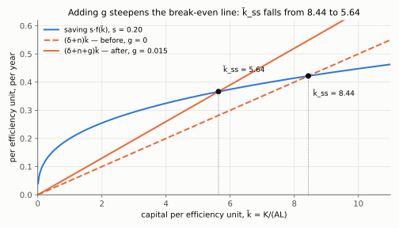
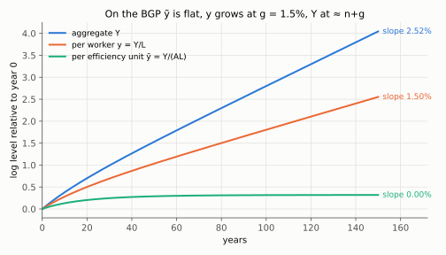
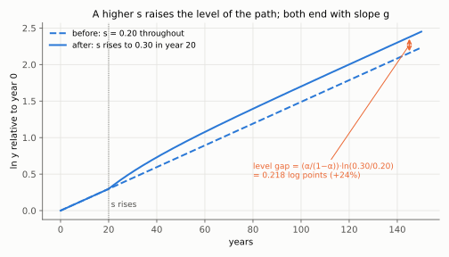

# 3. Technological progress, efficiency units, and the balanced growth path

**Kurlat §4.5, printed pages 69–72.** Up: [[00-index]] ·
Prev: [[02-markets-and-factor-prices]] · Next: [[04-quantifying-and-convergence]]

Kurlat opens the section by conceding the problem (p. 69): *"If we want to understand the
growth of GDP per capita in the US over the last 250 years the model we have studied so far
doesn't have a lot of promise: it predicts that in the long run there will be no growth."*
This note repairs it, and then examines the repair, because the form the repair takes is not
arbitrary.

---

## 3.1 Labour-augmenting technology

$$Y = F(K, AL) \tag{4.5.1}$$

$A$ is the level of technology, and (4.1.1) is the special case $A=1$. Kurlat's gloss: better
technology is *equivalent to having more workers*.

**Assumption 4.9.** $A_{t+1}=(1+g)A_t$, with $g$ constant and exogenous.

Kurlat is unusually frank about the cost of this assumption (p. 70): it makes the model fit a
great deal, and *"it is rather disappointing to have to make this assumption. Ideally, one
would like to have a deeper understanding of why there is technological progress and what
determines how fast it takes place."* Those questions are endogenous growth theory, which is
Kurlat chs. 12–15 and outside this course. The honest summary of Solow-with-technology is: it
explains capital accumulation completely and growth not at all.

**Efficiency units.** Define $\tilde L \equiv AL$. If $L$ workers operate with technology $A$,
output is what $\tilde L=AL$ workers would produce with technology 1.

$$\tilde y \equiv \frac{Y}{\tilde L} = \frac{Y}{AL},
\qquad
\tilde k \equiv \frac{K}{\tilde L} = \frac{K}{AL}$$

Kurlat's own warning (p. 70): *"These are not variables we are actually interested in but it's
a convenient way to rescale the model."* Keep that in view — the answer to any exam question is
about $y$, not $\tilde y$, and trap 4 in [[03_solow_evidencias]] is exactly the failure to
translate back.

By CRS again:

$$\tilde y = \frac{F(K,AL)}{AL} = F\!\left(\frac{K}{AL},1\right) = f(\tilde k) \tag{4.5.2}$$

The same three steps as (4.2.1), with $AL$ in place of $L$: divide output by $AL$; use CRS with
scaling factor $1/(AL)$ to move it inside, $F(K,AL)/(AL)=F(K/(AL),\,AL/(AL))$; and define
$f(\tilde k)\equiv F(\tilde k,1)$.

## 3.2 The law of motion in efficiency units

$$\Delta\tilde k_{t+1} \equiv \tilde k_{t+1}-\tilde k_t
= \frac{K_{t+1}}{A_{t+1}L_{t+1}}-\tilde k_t$$

Substitute $K_{t+1}=(1-\delta)K_t+sY_t$ and $A_{t+1}L_{t+1}=(1+g)(1+n)A_tL_t$:

$$= \frac{(1-\delta)K_t+sY_t}{(1+g)(1+n)A_tL_t}-\tilde k_t
= \frac{(1-\delta)\tilde k_t+s f(\tilde k_t)}{(1+g)(1+n)}-\tilde k_t$$

The second equality divides numerator and denominator by $A_tL_t$:
$K_t/(A_tL_t)=\tilde k_t$ and $Y_t/(A_tL_t)=\tilde y_t=f(\tilde k_t)$ by (4.5.2).

Put over a common denominator, writing
$\tilde k_t = \dfrac{(1+g)(1+n)\tilde k_t}{(1+g)(1+n)}$ and collecting the $\tilde k_t$ terms:

$$\Delta\tilde k_{t+1} = \frac{s f(\tilde k_t)-\left[(1+g)(1+n)-(1-\delta)\right]\tilde k_t}{(1+g)(1+n)}$$

Expand the bracket: $(1+g)(1+n)=1+n+g+ng$, so
$(1+g)(1+n)-(1-\delta) = 1+n+g+ng-1+\delta = \delta+n+g+ng$. The cross term $ng$ is second
order — with $n=0.01$ and $g=0.015$ it is $0.00015$, against a break-even rate of $0.065$, so
about 0.2% of it. Dropping it and the outer $(1+g)(1+n)$ (here $1.015\times1.01=1.02515$,
which rescales the speed of adjustment by 2.5% but, being positive, cannot move the zero of
the numerator), exactly as in [[03-fundamental-equation]] §3.3:

$$\boxed{\;\dot{\tilde k} = s f(\tilde k)-(\delta+n+g)\tilde k\;}$$

**The same equation as before with $g$ added to the break-even rate.** The economics of the
new term: capital must now also be built to keep up with the *effective* labour force, which
grows at $n+g$ rather than $n$, because technical progress is equivalent to more workers
arriving. Omitting it is trap 5 in [[03_solow_evidencias]].

*Read the two crossings of the saving curve $0.20\,\tilde k^{0.35}$: with the break-even line $(\delta+n)\tilde k$ (dashed, $g=0$) at $\tilde k=8.44$; with $(\delta+n+g)\tilde k$ (solid) at $\tilde k=5.64$. The same economy holds less capital per efficiency unit because the effective workforce now grows at $n+g$.*

Steady state, in the same closed form. Set $\dot{\tilde k}=0$ with $f(\tilde k)=\tilde k^{\alpha}$:

$$s\tilde k^{\alpha} = (\delta+n+g)\tilde k
\;\Longrightarrow\; \tilde k^{\alpha-1} = \frac{\delta+n+g}{s}
\;\Longrightarrow\; \tilde k^{1-\alpha} = \frac{s}{\delta+n+g}$$

(divide both sides by $s\tilde k$; take reciprocals), then raise to $1/(1-\alpha)$ for
$\tilde k_{ss}$ and to $\alpha/(1-\alpha)$ for $\tilde y_{ss}=\tilde k_{ss}^{\alpha}$:

$$\tilde k_{ss} = \left(\frac{s}{\delta+n+g}\right)^{\frac{1}{1-\alpha}},
\qquad
\tilde y_{ss} = \left(\frac{s}{\delta+n+g}\right)^{\frac{\alpha}{1-\alpha}}$$

Existence, uniqueness and global stability go through verbatim from
[[04-steady-state-and-stability]] — nothing in those arguments used the value of the break-even
constant, only that it was positive.

## 3.3 The balanced growth path, translated back

$\tilde k$ and $\tilde y$ are constant in steady state. Translate to the variables anyone cares
about, using $y=Y/L=A\tilde y$ and $k=K/L=A\tilde k$:

$$y_t = A_t\,\tilde y_{ss} \qquad\Longrightarrow\qquad \frac{\dot y}{y}=\frac{\dot A}{A}=g$$

The steps: $y=\dfrac{Y}{L}=A\cdot\dfrac{Y}{AL}=A\tilde y$ (multiply and divide by $A$). Take
logs, $\ln y_t=\ln A_t+\ln\tilde y_t$, and differentiate with respect to time:
$\dot y/y=\dot A/A+\dot{\tilde y}/\tilde y = g+0$. The same operation on
$K=\tilde k\,A\,L$ gives $\dot K/K=0+g+n$, and on $Y=\tilde y\,A\,L$ gives $\dot Y/Y=g+n$ —
the aggregate rows of the table.

| Variable | Growth rate on the BGP |
|---|---|
| $\tilde k,\;\tilde y,\;\tilde c$ | $0$ |
| $k=K/L,\;y=Y/L,\;c=C/L$ | $g$ |
| $K,\;Y,\;C$ | $n+g$ |
| $L$ | $n$ |
| $A$ | $g$ |
| $K/Y$, factor shares, $r$, $w/y$ | $0$ (constant) |
| $w$ | $g$ |

*Read the end slopes of an economy starting at 40% of $\tilde k_{ss}$: $\ln\tilde y$ flattens to slope 0, $\ln y$ settles at slope 1.50% ($g$) and $\ln Y$ at 2.52% ($=(1+n)(1+g)-1$, i.e. $n+g$ plus the $ng$ term). All three rise faster early on — that is the transition, not the BGP.*

**This is Kurlat's Proposition 4.3 and it is the headline of the session: output per capita
grows at the rate of technological progress, $g$, and nothing else.** Not the saving rate, not
the population growth rate, not $\delta$. Those still set the *level* of the path — the
comparative statics of [[05-comparative-statics]] survive intact, as level effects — but the
slope is $g$ alone.

*Read the gap between the dashed (s = 0.20) and solid (s rises to 0.30 in year 20) paths of $\ln y$: it grows during the transition and then stays at $\frac{\alpha}{1-\alpha}\ln\frac{0.30}{0.20}=0.218$ log points (+24%), with both paths ending at slope $g$. The level gap is $\ln\tilde y_{ss}(0.30)-\ln\tilde y_{ss}(0.20)$, from $\tilde y_{ss}=(s/(\delta+n+g))^{\alpha/(1-\alpha)}$: take logs and subtract, and $\delta+n+g$ cancels.*

Check the wage claim, since it is a good test of whether the table is understood.
$w=f(k)-kf'(k)$ is not the right object any more; in efficiency units the firm's problem gives
$w = A\left[f(\tilde k)-\tilde k f'(\tilde k)\right]$, which is $A$ times a constant. So real
wages grow at $g$, and the labour share $w L/Y$ is constant. The derivation, as in
[[02-markets-and-factor-prices]] §2.1 but with $\tilde k=K/(AL)$, so
$\partial\tilde k/\partial L=-K/(AL^2)$:

$$w = \frac{\partial}{\partial L}\left[AL\,f(\tilde k)\right]
= A f(\tilde k) + AL\,f'(\tilde k)\left(-\frac{K}{AL^2}\right)
\qquad\text{(product rule, then chain rule)}$$

$$= A f(\tilde k) - A\,\tilde k f'(\tilde k) = A\left[f(\tilde k)-\tilde k f'(\tilde k)\right]
\qquad\text{(}AL\cdot K/(AL^2)=K/L=A\tilde k\text{)}$$

$$\frac{wL}{Y} = \frac{AL\left[f(\tilde k)-\tilde k f'(\tilde k)\right]}{AL\,f(\tilde k)}
= 1-\frac{\tilde k f'(\tilde k)}{f(\tilde k)} = 1-\alpha
\qquad\text{(divide by } Y=ALf(\tilde k)\text{; Cobb–Douglas share)}$$ Both are Kaldor facts, and the
model now delivers them. Verified in `check_growth.py`.

## 3.4 Why *labour*-augmenting? The Uzawa argument

This is the question [[03_solow_evidencias]] flags and does not answer. Three forms of
technical progress are conceivable:

$$\underbrace{Y=F(K,AL)}_{\text{labour-augmenting, Harrod-neutral}},\qquad
\underbrace{Y=F(AK,L)}_{\text{capital-augmenting, Solow-neutral}},\qquad
\underbrace{Y=A\,F(K,L)}_{\text{Hicks-neutral}}$$

**Claim (Uzawa, 1961).** If an economy with a general CRS production function, exogenous
technical progress and a constant saving rate has a balanced growth path along which $K/Y$ is
constant, then technical progress must be labour-augmenting.

*Sketch of the argument, which is all the course needs.* On a balanced path, $K$ and $Y$ grow at
the same rate, call it $\gamma$, and $L$ grows at $n$. The production function must therefore
satisfy, for every $t$,

$$Y_0e^{\gamma t} = F\!\left(K_0e^{\gamma t},\,L_0e^{nt},\,t\right)$$

Since $F$ is CRS, factor out $e^{\gamma t}$ from the first argument:

$$Y_0 = F\!\left(K_0,\,L_0e^{(n-\gamma)t},\,t\right)$$

(CRS in $(K,L)$ at each $t$ says $F(\lambda K,\lambda L,t)=\lambda F(K,L,t)$; take
$\lambda=e^{\gamma t}$, write $L_0e^{nt}=e^{\gamma t}\cdot L_0e^{(n-\gamma)t}$, pull
$e^{\gamma t}$ out, and divide both sides by it.)

For this to hold at every $t$ with $Y_0$ and $K_0$ fixed, all of the time dependence must be
absorbable into the labour argument — that is, $F(K,L,t)=F(K,A(t)L)$ with $A$ growing at
$\gamma-n$. The construction that shows it: define the time-invariant CRS function
$\tilde F(K,L)\equiv F(K,L,0)$ and $A(t)\equiv e^{(\gamma-n)t}$. Along the balanced path,

$$\tilde F\!\left(K_t,\,A(t)L_t\right)
= \tilde F\!\left(K_0e^{\gamma t},\,L_0e^{\gamma t}\right)
= e^{\gamma t}\tilde F(K_0,L_0) = e^{\gamma t}Y_0 = Y_t$$

(first $A(t)L_t=e^{(\gamma-n)t}L_0e^{nt}=L_0e^{\gamma t}$; then CRS with $\lambda=e^{\gamma t}$;
then $\tilde F(K_0,L_0)=F(K_0,L_0,0)=Y_0$). So the observed path is exactly what a
labour-augmenting technology $\tilde F(K,AL)$ would produce. Technical progress enters multiplying $L$, and the growth rate of output per worker
is $\gamma-n=g$. ∎

**The exception everybody meets first.** Under Cobb–Douglas the three forms are
*indistinguishable*, because

$$A\,K^{\alpha}L^{1-\alpha} = K^{\alpha}\left(A^{\frac{1}{1-\alpha}}L\right)^{1-\alpha}
= \left(A^{\frac{1}{\alpha}}K\right)^{\alpha}L^{1-\alpha}$$

Check each equality by expanding the power of a product:
$\left(A^{\frac{1}{1-\alpha}}L\right)^{1-\alpha}=A^{\frac{1-\alpha}{1-\alpha}}L^{1-\alpha}=A\,L^{1-\alpha}$
and $\left(A^{\frac{1}{\alpha}}K\right)^{\alpha}=A^{\frac{\alpha}{\alpha}}K^{\alpha}=A\,K^{\alpha}$.

Any Hicks-neutral $A$ can be rewritten as labour-augmenting with technology
$A^{1/(1-\alpha)}$, or capital-augmenting with $A^{1/\alpha}$. Kurlat's footnote 3 (p. 77) makes
exactly this point about writing $AK^{\alpha}L^{1-\alpha}$ instead: *"This doesn't make much
difference. With the Cobb-Douglas function, the term $A^{1-\alpha}$ factors out anyway so it's
just changing the units in which we measure technology."*

So: **with Cobb–Douglas the distinction is a change of units; with any other CRS function it is
a real restriction, and only the labour-augmenting form admits a balanced growth path.** That is
why the general statement of the model puts $A$ next to $L$. Note the consequence for
[[05-growth-accounting-and-tfp]]: growth accounting is usually done with a Hicks-neutral
residual, which is legitimate precisely because Cobb–Douglas is assumed there.

## 3.5 The two rescalings, kept apart

Trap 3 in [[03_solow_evidencias]] is mixing $k$ and $\tilde k$ in one exercise. The translation
table:

$$\tilde k = \frac{k}{A},\qquad
\tilde y = \frac{y}{A},\qquad
\frac{\dot{\tilde k}}{\tilde k} = \frac{\dot k}{k}-g$$

The last one: $\tilde k=k/A$, so $\ln\tilde k=\ln k-\ln A$; differentiate with respect to time,
$\dot{\tilde k}/\tilde k=\dot k/k-\dot A/A$, and $\dot A/A=g$.

A useful discipline: **do all the algebra in tildes, then translate once at the end.** The
steady state only exists in tildes; in per-worker terms there is no steady state at all, only a
path growing at $g$. Saying "$k$ converges to $k_{ss}$" is false once $g>0$ — what converges is
$\tilde k$.

And the statement that catches people: on the BGP, $\tilde y$ is **constant**, not growing at
$g$. It is $y$ that grows at $g$. That is trap 4.

## 3.6 What to be able to do, cold

1. Derive the law of motion in efficiency units from (4.1.4) and Assumptions 4.5 and 4.9,
   showing where $(1+g)(1+n)$ enters and what the $ng$ term is worth.
2. Give $\tilde k_{ss}$, $\tilde y_{ss}$ and the full BGP growth-rate table.
3. State Proposition 4.3 and explain why $s$ and $n$ affect levels but not the growth rate.
4. Give the Uzawa argument for labour-augmenting progress and the Cobb–Douglas exception.
5. Translate between $k$ and $\tilde k$ in both directions without dropping the $A$.

Practice: Kurlat ch. 4, Exercises 4.11 and 4.12 (p. 74) introduce technology into the model;
Exercise 5.1 *Quantifying the Solow Model* (p. 96) is the numerical companion and is worked in
[[04-quantifying-and-convergence]]. Worked in [[Resolucao/kurlat_solutions_ch1-4|ch1-4]] and
[[Resolucao/kurlat_solutions_ch05|ch05]].
