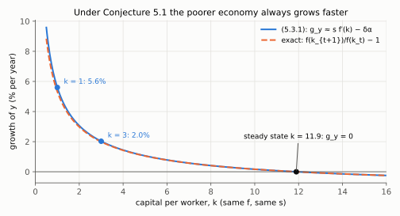
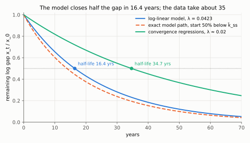
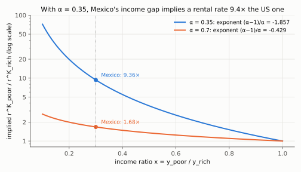

# 4. Quantifying the model, and rejecting the capital hypothesis

**Kurlat §5.1–§5.3, printed pages 75–86.** Up: [[00-index]] ·
Prev: [[03-technological-progress]] · Next: [[05-growth-accounting-and-tfp]]

> **Companion:** [Whose Fault Is the Gap?](companion-development.html) — set a country's income
> ratio to the US and watch the implied capital ratio, the implied rental rate, and the TFP
> residual that has to make up the difference.

This is the chapter where the model is put on trial. Kurlat states the hypothesis as a numbered
conjecture, tests it three independent ways, and rejects it. The three tests are worth knowing
individually because they fail for different reasons.

---

## 4.1 The calibration (§5.2, p. 77)

Cobb–Douglas is adopted because, by [[02-markets-and-factor-prices]] §2.3, it makes factor
shares constant **outside** the steady state as well as in it, which is what Kaldor fact 3
requires. Then each parameter is read off one fact:

| Parameter | Value | Read off |
|---|---|---|
| $\alpha$ | 0.35 | labour share averaging 0.65 (Figure 3.2.3) |
| $g$ | 0.015 | US GDP per capita growth ≈ 1.5%/yr since 1800, and Proposition 4.3 says $g=g_y$ |
| $n$ | 0.01 | US population growth ≈ 1%/yr since 1950 |
| $\delta$ | 0.04 | blended from BEA: 0.02 buildings, 0.15 equipment, 0.30 computers |
| $s$ | 0.20 | recent US **investment** rate |

Kurlat's honesty about $s$ is worth carrying: the model assumes a closed economy, so $S=I$;
the US is not closed and has recently invested more than it saved, financed by a trade deficit
(footnote 4, p. 78). Matching investment gives 0.20; matching saving would give a little less.
Which you pick depends on whether you are asking about capital accumulation or about household
behaviour.

**Consistency check — and it is a real one.** These five numbers were each chosen from a
separate fact, so nothing forces them to agree with the sixth Kaldor fact, $K/Y=3.2$. In steady
state,

$$\frac{K}{Y} = \frac{K/(AL)}{Y/(AL)} = \frac{\tilde k_{ss}}{\tilde y_{ss}} = \frac{s}{\delta+n+g}
= \frac{0.20}{0.04+0.01+0.015} = \frac{0.20}{0.065} = 3.08$$

against a measured 3.2. (First equality: divide numerator and denominator by $AL$. Last
equality: the steady state $s\tilde y_{ss}=(\delta+n+g)\tilde k_{ss}$, divided by
$(\delta+n+g)\tilde y_{ss}$.) Five independently calibrated parameters reproduce a sixth fact to
within 4%. That is the model's best moment, and it is worth stating plainly before the rest of
the chapter dismantles it. Verified in `check_growth.py`.

The implied rental rate follows without any capital data
([[02-markets-and-factor-prices]] §2.4):

$$r^K = \alpha\frac{\delta+n+g}{s} = 0.35\times\frac{0.065}{0.20}=0.114,
\qquad r = r^K-\delta = 0.074$$

**7.4%** — the number used in the Mexico comparison below.

## 4.2 The conjecture

> **Conjecture 5.1** (Kurlat, p. 80). *Technology levels are the same across countries and the
> differences in GDP per capita are the result of differences in $K/L$.*

It is logically coherent, and if true it would be excellent news: the problem of poverty would
be a problem of capital, and capital can be accumulated or imported. Kurlat: *"we'll see that
this conjecture is decisively rejected by the evidence."* Three tests follow.

## 4.3 Test 1 — convergence

Compute the growth rate of a country off its steady state. Kurlat sets $n=g=0$ to keep the
algebra clean (the argument survives without that). Following p. 81 line by line:

$$g_y \equiv \frac{y_{t+1}}{y_t}-1 = \frac{f(k_{t+1})-f(k_t)}{f(k_t)}
\;\simeq\; \frac{f'(k_t)\left[k_{t+1}-k_t\right]}{f(k_t)}$$

the third step being a first-order Taylor approximation: $f(k_{t+1})\simeq f(k_t)+f'(k_t)(k_{t+1}-k_t)$,
so $f(k_{t+1})-f(k_t)\simeq f'(k_t)(k_{t+1}-k_t)$. Substituting $\Delta k$ from (4.2.2), which
with $n=0$ reads $k_{t+1}-k_t=sf(k_t)-\delta k_t$:

$$= \frac{f'(k_t)\left[sf(k_t)-\delta k_t\right]}{f(k_t)}
= s f'(k_t)-\delta\,\frac{f'(k_t)k_t}{f(k_t)}
= s f'(k_t)-\delta\alpha \tag{5.3.1}$$

(second equality: distribute $f'(k_t)$ over the bracket and split the fraction, the
$f(k_t)$ cancelling in the first term; third: $f'(k)k/f(k)=\alpha$ for Cobb–Douglas,
[[02-markets-and-factor-prices]] §2.3).

using that $f'(k)k/f(k)=\alpha$ is the capital share. **Read (5.3.1):** growth depends on $k$
only through $f'(k)$, which is *decreasing*. So under Conjecture 5.1 — same $f$, same $s$,
differences only in $k$ — the richer country has lower $f'(k)$ and must grow more slowly. At
every point on the path, not just near the steady state.

*Read the downward slope: with $s=0.20$, $\delta=0.04$, an economy at $k=1$ grows 5.6% a year, one at $k=3$ grows 2.0%, and growth reaches zero at the steady state $k=11.9$. The dashed exact one-period rate sits almost on top of (5.3.1), so the Taylor step costs little.*

**The test.** Plot growth against initial income across countries. Figure 3.3.1 shows no strong
negative relation ([[01-growth-facts]] §1.3). **Failed.**

**Two honest qualifications Kurlat raises, and they matter.**

*Population weighting (Figure 5.3.1).* Weight each country by population and the data **do**
show convergence, more strongly since 1980. The reason is simple and worth saying out loud:
China and India started poor and grew fast, and between them they are a third of humanity.
Kurlat's footnote 7 is careful about whether weighting is right — if the point is to test a
universal claim, a small country is as informative an experiment as a large one; but not all
economic forces operate at national level, and perhaps each of India's 29 states should count
separately. There is no clean answer; the conclusion is that "does the world converge" is
partly a question about the unit of observation.

*Within-group convergence (Figure 5.3.2).* Among **US states** (1929–1988) and among **Western
European countries**, initially poorer units did grow faster. Strong convergence. So the
conjecture may hold *within* a group sharing technology and institutions while failing across
groups — capital abundance may explain why Connecticut is richer than Louisiana without
explaining why the US is richer than Paraguay. Kurlat adds the caveat that in recent decades
poorer US states have stopped converging, and the logical caveat that evidence consistent with
a conjecture does not prove it.

### The convergence speed, derived properly

Kurlat leaves the speed to Exercise 5.2. Do it by log-linearisation, which is Romer's method
and the one the empirical literature uses.

Start from the efficiency-units law and write it in growth rates:

$$\frac{\dot{\tilde k}}{\tilde k} = s\,\frac{f(\tilde k)}{\tilde k}-(\delta+n+g)
= s\,\tilde k^{\alpha-1}-(\delta+n+g)$$

(divide $\dot{\tilde k}=sf(\tilde k)-(\delta+n+g)\tilde k$ by $\tilde k$; then
$f(\tilde k)/\tilde k=\tilde k^{\alpha}/\tilde k=\tilde k^{\alpha-1}$).

Let $x \equiv \ln\tilde k-\ln\tilde k_{ss}$. Then $\tilde k^{\alpha-1}
= \tilde k_{ss}^{\alpha-1}e^{(\alpha-1)x}$, and $s\tilde k_{ss}^{\alpha-1}=\delta+n+g$ by the
steady-state condition, so

$$\dot x = (\delta+n+g)\left[e^{(\alpha-1)x}-1\right]$$

Each piece, one operation at a time:

- $\tilde k=\tilde k_{ss}e^{x}$ (exponentiate the definition of $x$), so
  $\tilde k^{\alpha-1}=\tilde k_{ss}^{\alpha-1}\left(e^{x}\right)^{\alpha-1}=\tilde k_{ss}^{\alpha-1}e^{(\alpha-1)x}$.
- $\dot x=\dfrac{d\ln\tilde k}{dt}-0=\dot{\tilde k}/\tilde k$ ($\tilde k_{ss}$ is a constant).
- Substitute both into the growth-rate equation:
  $\dot x=s\tilde k_{ss}^{\alpha-1}e^{(\alpha-1)x}-(\delta+n+g)$, and replace
  $s\tilde k_{ss}^{\alpha-1}$ by $\delta+n+g$ (the steady state $s\tilde k_{ss}^{\alpha}=(\delta+n+g)\tilde k_{ss}$
  divided by $\tilde k_{ss}$). Factor out $\delta+n+g$.

First-order expansion about $x=0$, where $e^{(\alpha-1)x}-1\simeq(\alpha-1)x$ (Taylor:
$e^{z}\simeq1+z$ for small $z$, with $z=(\alpha-1)x$):

$$\dot x \simeq (\delta+n+g)(\alpha-1)\,x = -\underbrace{(1-\alpha)(\delta+n+g)}_{\equiv\;\lambda}\,x
\qquad\Longrightarrow\qquad
x_t = x_0e^{-\lambda t}$$

The arrow solves the linear differential equation: separate variables, $dx/x=-\lambda\,dt$;
integrate from $0$ to $t$, $\ln x_t-\ln x_0=-\lambda t$; exponentiate.

$$\boxed{\;\lambda = (1-\alpha)(\delta+n+g)\;}$$

the same $\lambda$ found from the stability argument in [[04-steady-state-and-stability]] §4.3,
now with $g$ included. And since $\ln\tilde y-\ln\tilde y_{ss}=\alpha x$, **output converges at
the same rate as capital**. (Take logs of $\tilde y=\tilde k^{\alpha}$ and of
$\tilde y_{ss}=\tilde k_{ss}^{\alpha}$ and subtract: $\ln\tilde y-\ln\tilde y_{ss}=\alpha(\ln\tilde k-\ln\tilde k_{ss})=\alpha x$,
so the output gap is $\alpha x_0e^{-\lambda t}$ — the same $e^{-\lambda t}$.)

**Numbers, and the problem with them.** At Kurlat's calibration:
$\lambda=(1-0.35)(0.065)=0.042$, so **4.2% a year**, with a half-life of
$\ln2/0.042\simeq16.4$ years. (Half-life $T_{1/2}$: set $x_T/x_0=e^{-\lambda T}=\tfrac12$, take
logs, $-\lambda T=-\ln2$, so $T=\ln2/\lambda=0.6931/0.04225=16.4$.) Kurlat's footnote 8 (p. 69) anticipates exactly this: *"after a
few decades we should expect almost no growth."*

But empirical convergence regressions find $\lambda\simeq0.02$ — half the model's prediction, a
half-life of 35 years. To match 2% you need $1-\alpha=0.02/0.065=0.31$, i.e.
**$\alpha\simeq0.69$**, roughly twice the capital share in the national accounts. That
discrepancy is one of the standard arguments for a *broad* capital concept including human
capital, which raises the effective $\alpha$ to around 0.6–0.7 — and it is exactly the Mankiw–
Romer–Weil augmented model. Verified in `check_growth.py`. (The 2% half-life is
$\ln2/0.02=34.7$ years; the implied $\alpha$ solves $(1-\alpha)\times0.065=0.02$: divide by
0.065, $1-\alpha=0.308$, so $\alpha=0.692$.)

*Read the half-life markers: the log-linear model closes half the gap in 16.4 years, convergence regressions ($\lambda\approx0.02$) in 34.7. The dashed exact path from 50% below $\tilde k_{ss}$ is faster still than the linear prediction (0.60 of the log gap left after 10 years against 0.66), so the approximation, if anything, understates the model's speed.*

## 4.4 Test 2 — predicted levels

Take measured capital stocks across countries and ask what output the common production
function predicts. Kurlat's Figure 5.3.3: predicted GDP per capita is systematically **above**
actual, and the gap is **larger the poorer the country**. For the poorest countries the model
predicts about **\$10,000** against an actual figure closer to **\$1,000**.

A factor of ten, in the wrong direction, concentrated among the poor. That is not a calibration
quibble; poor countries produce far less than their measured capital should allow. **Failed.**

## 4.5 Test 3 — rates of return, and the Lucas paradox

Suppose the capital data are not trusted. Interest rates are also observable, and by
[[02-markets-and-factor-prices]] §2.4,

$$r^K = f'(k) = \alpha k^{\alpha-1} \tag{5.3.2}$$

Let country A be $x$ times richer per capita than country B. Under Conjecture 5.1 the only
difference is $k$, so from the production function

$$x = \frac{y_A}{y_B} = \left(\frac{k_A}{k_B}\right)^{\alpha}
\qquad\Longrightarrow\qquad
x^{\frac{\alpha-1}{\alpha}} = \left(\frac{k_A}{k_B}\right)^{\alpha-1} \tag{5.3.3}$$

(the arrow: raise both sides to $1/\alpha$, $k_A/k_B=x^{1/\alpha}$; then raise both sides to
$\alpha-1$) and substituting into (5.3.2):

$$\boxed{\;\frac{r^K_A}{r^K_B} = x^{\frac{\alpha-1}{\alpha}}\;} \tag{5.3.4}$$

In steps: $\dfrac{r^K_A}{r^K_B}=\dfrac{\alpha k_A^{\alpha-1}}{\alpha k_B^{\alpha-1}}=\left(\dfrac{k_A}{k_B}\right)^{\alpha-1}$
(the $\alpha$'s cancel, and a ratio of equal powers is the power of the ratio), which by
(5.3.3) is $x^{(\alpha-1)/\alpha}$.

**Kurlat's example (p. 84).** Mexican GDP per capita is about 0.3 times the US level, so
$x=y_{MEX}/y_{US}=0.3$ and $\alpha=0.35$:

$$\frac{r^K_{MEX}}{r^K_{US}} = 0.3^{\frac{0.35-1}{0.35}} = 0.3^{-1.857} \simeq 9.4$$

(country A is Mexico, B the US; the exponent is $-0.65/0.35=-1.857$; numerically
$0.3^{-1.857}=e^{-1.857\ln0.3}=e^{-1.857\times(-1.204)}=e^{2.236}=9.36$. Equivalently
$r^K_{US}/r^K_{MEX}\simeq1/9.4$.)

so the rental rate in Mexico should be about **9.4 times** the US rate. Converting to interest
rates with $r=r^K-\delta$ and a US $r$ of 7.4% with $\delta=0.04$: $r^K_{US}=0.114$, so
$r^K_{MEX}=1.07$ and $r_{MEX}=1.03$ — an interest rate of over **100% a year**.
($r^K_{US}=r_{US}+\delta=0.074+0.04=0.114$; multiply by the ratio, $0.114\times9.4=1.07$;
subtract $\delta$, $1.07-0.04=1.03$.)

Nothing like that is observed. And the corollary is worse: if capital earned ten times as much
in Mexico, capital would flow there until the rates equalised. It does not. That is the **Lucas
paradox** (Lucas, 1990), and it is the most quotable failure of the capital hypothesis, because
it needs no capital-stock data at all — only relative incomes and the capital share. **Failed.**

**Why the exponent is so violent.** $(\alpha-1)/\alpha = -1.857$ at $\alpha=0.35$. A modest
income ratio is amplified into an enormous return ratio because with a small capital share,
explaining a big output gap through capital alone requires an *enormous* capital gap, and
diminishing returns then price the scarce capital extravagantly. Raise $\alpha$ toward 0.7
(broad capital again) and the exponent falls to $-0.43$, giving a rental-rate ratio of only
1.7 ($0.3^{-0.3/0.7}=0.3^{-0.429}=e^{0.516}=1.68$) — which is another argument that the
effective capital share is much larger than 0.35.

*Read the two curves at $x=0.3$ (dotted line): with $\alpha=0.35$ Mexico's rental rate should be 9.36 times the US one, with broad capital $\alpha=0.7$ only 1.68 times. The log scale shows how the steep exponent $-1.857$ explodes as $x$ falls.*

## 4.6 What survives

All three tests point the same way: **income differences across countries are not mainly
differences in capital.** What is left is the residual — differences in how productively a given
stock of capital and labour is used. That is total factor productivity, and measuring it is
[[05-growth-accounting-and-tfp]].

Note the epistemic status carefully. TFP has not been *shown* to explain income differences. It
is what is left after capital fails, and it is measured as a residual. Calling it "technology"
is a naming convention, not a finding — which is trap 7 in [[03_solow_evidencias]].

## 4.7 What to be able to do, cold

1. Reproduce Kurlat's calibration and the $K/Y=s/(\delta+n+g)=3.08$ consistency check.
2. Derive (5.3.1) with the Taylor step named, and state what it predicts about convergence.
3. Give both qualifications — population weighting, within-group convergence — with the reason
   each one matters.
4. Log-linearise to get $\lambda=(1-\alpha)(\delta+n+g)$, evaluate it, and explain the gap
   against the 2% found in data.
5. Derive (5.3.4) and compute the Mexico number; state the Lucas paradox in one sentence.
6. Say precisely what TFP is at the end of this chapter: a residual, not an explanation.

Practice: Kurlat ch. 5, Exercises 5.1 *Quantifying the Solow Model* (p. 96), 5.2 *The Speed of
Convergence* (p. 96), 5.4 on measuring the capital stock (p. 97). Worked in
[[Resolucao/kurlat_solutions_ch05|ch05]].
