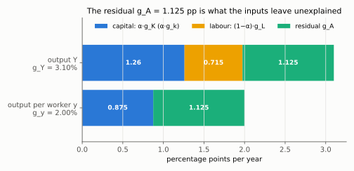
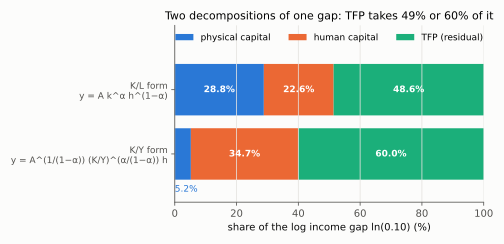

# 5. Growth accounting, development accounting, and what TFP is

**Kurlat §5.4–§5.5, printed pages 86–95.** Up: [[00-index]] ·
Prev: [[04-quantifying-and-convergence]]

> **Companion:** [Whose Fault Is the Gap?](companion-development.html) — decompose a country's
> income ratio into capital, human capital and TFP, and watch how much the answer moves when
> $\alpha$ moves.
>
> **Companion:** [Security Capital Looks Like Bad Luck](companion-hidden-wedge.html) — Lista 2 Q2:
> security capital counted in $K$ shows up as low TFP, and a fall in crime as TFP growth.

*Lista 2 2(d): cutting security capital from θ = 0.5 to 0.125 over ten years is reported as 0.96% a year of TFP growth, although A never moved. Diagnosis: [[avaliacao-listas-2-3-6]].*

Two decompositions that look identical and answer different questions. Growth accounting
decomposes a country's change **over time**; development accounting decomposes the gap between
two countries **at a point in time**. Confusing them is common and the algebra does not stop
you, so this note keeps them apart deliberately.

---

## 5.1 The method

Kurlat's three steps (p. 86):

1. Measure how much capital and labour changed.
2. Work out how much output change *should* follow. This is the step where theory does the work.
3. Attribute everything left over to productivity.

Start from a production function with technology as a **separate argument**, so that no
particular form of technical progress is imposed:

$$Y_t = F(K_t, L_t, A_t) \tag{5.4.1}$$

Kurlat is explicit (p. 86) that the labour-augmenting case $F(K,AL)$ is a special case of
(5.4.1), and that he wants to allow other forms. This is legitimate here because the exercise
will assume Cobb–Douglas, under which the forms are interchangeable up to units
([[03-technological-progress]] §3.4).

## 5.2 The growth-accounting identity, derived

Totally differentiate (5.4.1) with respect to time:

$$\dot Y = F_K\dot K + F_L\dot L + F_A\dot A$$

(chain rule: $Y_t$ depends on $t$ only through $K_t$, $L_t$, $A_t$, so
$dY/dt=\sum_X(\partial F/\partial X)(dX/dt)$).

Divide by $Y$ and multiply and divide each term to create growth rates — for the capital
term, $\dfrac{F_K\dot K}{Y}=\dfrac{F_KK}{Y}\cdot\dfrac{\dot K}{K}$, and the same for $L$ and $A$:

$$\frac{\dot Y}{Y} = \underbrace{\frac{F_KK}{Y}}_{\text{capital share}}\frac{\dot K}{K}
+ \underbrace{\frac{F_LL}{Y}}_{\text{labour share}}\frac{\dot L}{L}
+ \underbrace{\frac{F_AA}{Y}\frac{\dot A}{A}}_{\text{residual}}$$

The two elasticities are the factor **shares**, by [[02-markets-and-factor-prices]] §2.1 — this
is where competitive factor markets enter, and it is the whole reason the decomposition can be
implemented with national-accounts data rather than with an estimated production function. With
Cobb–Douglas they are $\alpha$ and $1-\alpha$:

$$\boxed{\;g_Y = g_A + \alpha\,g_K + (1-\alpha)\,g_L\;}$$

The residual's coefficient becomes one because, with $Y=AK^{\alpha}L^{1-\alpha}$,
$F_A=K^{\alpha}L^{1-\alpha}=Y/A$, so $F_AA/Y=1$. The same follows directly by taking logs,
$\ln Y=\ln A+\alpha\ln K+(1-\alpha)\ln L$, and differentiating with respect to time. The
shares: $F_KK/Y=\alpha AK^{\alpha-1}L^{1-\alpha}\cdot K/Y=\alpha Y/Y=\alpha$, and likewise
$F_LL/Y=1-\alpha$.

In per-worker terms, subtracting $g_L$ from both sides and using $g_y=g_Y-g_L$,
$g_k=g_K-g_L$:

$$g_Y-g_L = g_A+\alpha g_K+(1-\alpha)g_L-g_L = g_A+\alpha g_K-\alpha g_L = g_A+\alpha(g_K-g_L)$$

(the $g_L$ terms combine to $(1-\alpha-1)g_L=-\alpha g_L$; factor out $\alpha$), that is:

$$\boxed{\;g_y = g_A + \alpha\,g_k\;}$$

**The Solow residual** is what this is solved for:

$$g_A = g_Y - \alpha g_K - (1-\alpha)g_L$$

It is measured **by difference**. Nothing about $A$ is observed; it is defined as whatever makes
the identity hold. Abramovitz's phrase, which Kurlat echoes, is that it is *"a measure of our
ignorance"*.

**A worked residual** (illustrative numbers, the ones `check_growth.py` uses): $g_Y=3.1\%$,
$g_K=3.6\%$, $g_L=1.1\%$, $\alpha=0.35$.

$$g_A = 0.031-0.35\times0.036-0.65\times0.011 = 0.031-0.0126-0.00715 = 0.01125$$

Per worker: $g_y=0.031-0.011=0.020$ and $\alpha g_k=0.35\times(0.036-0.011)=0.00875$, so
$g_y=0.01125+0.00875$ — the same residual, as the per-worker identity requires.

*Read each bar as the identity drawn: 3.1 pp of output growth = 1.26 (capital) + 0.715 (labour) + 1.125 (residual); per worker, 2.0 pp = 0.875 (capital deepening) + the same 1.125. The green block is not measured anywhere — it is what is left.*

### What the residual actually contains

Trap 7 in [[03_solow_evidencias]], and the single most important caveat in this session. $g_A$
absorbs, indiscriminately:

- genuine technical progress;
- **mismeasured inputs** — capital utilisation over the cycle, labour effort, quality change in
  machines;
- **composition** — a shift of workers from low- to high-productivity sectors raises measured
  TFP without anything becoming more productive;
- **allocative efficiency** — the same inputs distributed better across firms;
- **institutions, distortions, misallocation**;
- and any error in $\alpha$, $g_K$ or $g_L$.

Two consequences. First, TFP is strongly **procyclical** in the data, which is implausible as
technology and is mostly unmeasured utilisation — a point that matters for the business-cycle
chapters this course excludes but that should still be said. Second, and more important here:
calling the residual "technology" in a cross-country comparison is a decision, not a finding.

## 5.3 Development accounting — the level decomposition

A different question: not why a country grew, but why it is richer than another **now**. Take
levels rather than growth rates, with $y=Ak^{\alpha}$:

$$\frac{y_i}{y_{US}} = \frac{A_i}{A_{US}}\left(\frac{k_i}{k_{US}}\right)^{\alpha}$$

(divide $y_i=A_ik_i^{\alpha}$ by $y_{US}=A_{US}k_{US}^{\alpha}$ and group the ratios).

In logs, which is how it is reported (the log of a product is the sum of logs, and
$\ln z^{\alpha}=\alpha\ln z$):

$$\underbrace{\ln\frac{y_i}{y_{US}}}_{\text{observed gap}}
= \underbrace{\alpha\ln\frac{k_i}{k_{US}}}_{\text{capital's contribution}}
+ \underbrace{\ln\frac{A_i}{A_{US}}}_{\text{TFP, the residual}}$$

**Worked example.** A country with $y_i/y_{US}=0.10$ and $k_i/k_{US}=0.15$, at $\alpha=0.35$:

$$\text{capital contributes } 0.15^{0.35}=0.515,
\qquad \text{TFP must supply } \frac{0.10}{0.515}=0.194$$

($0.15^{0.35}=e^{0.35\ln0.15}=e^{0.35\times(-1.897)}=e^{-0.664}=0.515$; the TFP ratio is the
observed ratio divided by capital's, from rearranging the level equation for $A_i/A_{US}$.)
So capital explains a factor of about 2 of the 10-fold gap and TFP a factor of 5. In log terms,
capital accounts for $\ln 0.515/\ln 0.10 = 28.8\%$ and TFP for 71.2%.
($\ln0.515=-0.664$, $\ln0.10=-2.303$, ratio $0.288$; TFP's share is $1-0.288$ because the two
logs add up to the observed log gap.) Computed in
`check_growth.py`.

### A better decomposition: the capital–output ratio form

There is a well-known problem with the form above. Capital is *endogenous*: a country with high
TFP invests more and therefore has more capital, so attributing that capital to "capital" gives
TFP too little credit. Rewrite using $K/Y$ instead of $K/L$. From $y=Ak^{\alpha}$,

$$y = A^{\frac{1}{1-\alpha}}\left(\frac{K}{Y}\right)^{\frac{\alpha}{1-\alpha}}$$

*Derivation.* $y=Ak^{\alpha}=A(K/L)^{\alpha}=A(K/Y)^{\alpha}(Y/L)^{\alpha}=A(K/Y)^{\alpha}y^{\alpha}$,
so $y^{1-\alpha}=A(K/Y)^{\alpha}$ and raise both sides to $1/(1-\alpha)$. ∎

Line by line:

$$\frac{K}{L} = \frac{K}{Y}\cdot\frac{Y}{L} \qquad\text{(multiply and divide by } Y\text{)}$$

$$y = A\left(\frac{K}{Y}\right)^{\alpha}y^{\alpha} \qquad\text{(substitute into } y=A(K/L)^{\alpha}\text{, with } Y/L=y\text{)}$$

$$y^{1-\alpha} = A\left(\frac{K}{Y}\right)^{\alpha} \qquad\text{(divide both sides by } y^{\alpha}\text{)}$$

$$y = A^{\frac{1}{1-\alpha}}\left(\frac{K}{Y}\right)^{\frac{\alpha}{1-\alpha}} \qquad\text{(raise both sides to } 1/(1-\alpha)\text{)}$$

This is preferable because $K/Y$ is constant along a balanced growth path and does **not**
respond to TFP in the long run ([[03-technological-progress]] §3.3), so the two terms are closer
to independent. The exponent on the capital term rises to $\alpha/(1-\alpha)=0.54$, but it is
applied to a ratio that varies far less across countries than $k$ does — capital–output ratios
are broadly similar everywhere, capital–labour ratios are not. The net effect is that the $K/Y$
form attributes **more** to TFP. With $K_i/Y_i$ at 0.8 of the US ratio and the same
$y_i/y_{US}=0.10$, capital now accounts for only **5.2%** of the log gap instead of 28.8%.
(Take the ratio of the $K/Y$ form across countries and logs:
$\ln\frac{y_i}{y_{US}}=\frac{1}{1-\alpha}\ln\frac{A_i}{A_{US}}+\frac{\alpha}{1-\alpha}\ln\frac{(K/Y)_i}{(K/Y)_{US}}$.
Capital's term is $0.5385\times\ln0.8=0.5385\times(-0.2231)=-0.1202$, and
$-0.1202/-2.303=0.052$.)

## 5.4 Human capital

The natural objection: labour is not homogeneous, and a US worker has far more schooling than a
worker in a poor country. Put it in:

$$Y = AK^{\alpha}(hL)^{1-\alpha}$$

where $h$ is human capital per worker. **How $h$ is measured** is the part worth knowing,
because it is not arbitrary: it uses **Mincer** wage regressions. The empirical regularity is
that log wages rise roughly linearly in years of schooling,

$$\ln w = \text{const} + \phi\,S$$

with a return $\phi$ of about 6–10% per year of schooling. Since competitive labour markets pay
the marginal product, that return *is* the productivity gain, so

$$h = e^{\phi S}$$

(exponentiate the Mincer line: $w=e^{\text{const}}e^{\phi S}$, so a worker's wage, and hence
marginal product, is proportional to $e^{\phi S}$; normalise the constant into $A$ and call
$e^{\phi S}$ the worker's efficiency units $h$). Relative to the US, only the difference in
schooling matters: $h_i/h_{US}=e^{\phi S_i}/e^{\phi S_{US}}=e^{\phi(S_i-S_{US})}$.

with $\phi$ often taken piecewise (higher for the first four years, lower later), following Hall
and Jones (1999) and Klenow and Rodríguez-Clare (1997).

**What it buys.** A country with 4 years of schooling against the US 12, at $\phi=0.10$:

$$\frac{h_i}{h_{US}} = e^{0.10(4-12)} = e^{-0.8} = 0.45$$

and its contribution to the income ratio is $0.45^{1-\alpha}=0.45^{0.65}=0.60$
($e^{0.65\times(-0.8)}=e^{-0.52}=0.595$, and $1/0.595=1.68$). So human capital
explains a factor of 1.7 out of the tenfold gap — real but far from sufficient.

**Careful with the exponent on $h$.** In the $K/L$ form, $y=Ak^{\alpha}h^{1-\alpha}$, so human
capital enters as $h^{1-\alpha}$. In the $K/Y$ form the algebra of §5.3 gives

$$y = A^{\frac{1}{1-\alpha}}\left(\frac{K}{Y}\right)^{\frac{\alpha}{1-\alpha}}h$$

so $h$ enters with exponent **one**. The same four lines as §5.3, starting from
$y=Ak^{\alpha}h^{1-\alpha}$: substitute $k=(K/Y)y$ to get
$y=A(K/Y)^{\alpha}y^{\alpha}h^{1-\alpha}$; divide by $y^{\alpha}$,
$y^{1-\alpha}=A(K/Y)^{\alpha}h^{1-\alpha}$; raise to $1/(1-\alpha)$, and
$(h^{1-\alpha})^{1/(1-\alpha)}=h$. Carrying $h^{1-\alpha}$ into the $K/Y$ decomposition is a
common slip and it understates human capital by a third.

**Putting the pieces together, with the numbers above.** In the $K/L$ form, physical and human
capital jointly account for **51%** of the log gap — roughly half and half with TFP. In the
preferred $K/Y$ form they account for **40%**, leaving TFP **60%**. The arithmetic, each term
divided by $\ln0.10=-2.303$: in the $K/L$ form, capital $0.35\ln0.15=-0.664$ (28.8%) and human
capital $0.65\times(-0.8)=-0.52$ (22.6%), together 51.4%; in the $K/Y$ form, capital
$-0.120$ (5.2%) and human capital $\ln h_i/h_{US}=-0.8$ (34.7%), together 40.0%. Both are computed in
`check_growth.py`, and the second is the Hall and Jones (1999) figure; Klenow and
Rodríguez-Clare (1997) report 50–60% depending on specification.

The honest summary is therefore not "capital explains less than half" under every accounting.
It is that **under the decomposition whose two terms are closest to independent, TFP carries the
majority** — and that the answer moves by ten percentage points on a modelling choice a careless
reader would not notice. Say which decomposition you used.

*Read the green blocks: the same country ($y_i/y_{US}=0.10$, $k_i/k_{US}=0.15$, $(K/Y)_i/(K/Y)_{US}=0.8$, 4 against 12 years of schooling) leaves TFP 48.6% of the log gap in the $K/L$ form and 60.0% in the $K/Y$ form. Capital shrinks from 28.8% to 5.2%, human capital grows from 22.6% to 34.7% because its exponent rises from $1-\alpha$ to one.*

## 5.5 Where do TFP differences come from? (§5.5)

Kurlat's §5.5 asks the question the residual forces. The candidate answers, none of which the
model delivers:

- **Misallocation.** The same technology used badly. If capital and labour are distributed
  across firms in a way that does not equate marginal products, aggregate TFP falls even with
  identical firm-level technology. Hsieh and Klenow (2009) estimate that moving China and India
  to US allocative efficiency would raise their TFP by 30–60%.
- **Institutions.** Property rights, contract enforcement, corruption — the Hall and Jones
  "social infrastructure", and Acemoglu–Johnson–Robinson's colonial-origins instrument.
- **Barriers to technology adoption.** Knowledge is non-rival and should diffuse; something
  stops it. Parente and Prescott.
- **Human capital quality** rather than quantity — years of schooling are not learning, and test
  scores across countries differ far more than enrolment does.
- **Measurement.** Some of the residual is not real.

The intellectually honest position, and the one to write in an exam: *the Solow model localises
the problem precisely and then hands it over.* It proves that the answer is not capital, which
is a genuine and non-obvious result, and it names the remaining object without explaining it.

> **Contrast: Jones (2020), chs. 4–6.** Jones runs the same development-accounting exercise and
> reports it as a bar chart of contributions country by country, which makes the TFP share
> visible at a glance and is the better format for an exam answer. He also carries the human
> capital construction in more detail than Kurlat, including the piecewise Mincer returns. Where
> Kurlat is stronger is the *rejection* argument of [[04-quantifying-and-convergence]] — Jones
> does not state the capital hypothesis as a falsifiable conjecture and test it three ways. Use
> Kurlat for the logic, Jones for the numbers. Local 2020 file, +25 offset ([[books-index]]).

## 5.6 Growth accounting against development accounting, kept apart

| | Growth accounting | Development accounting |
|---|---|---|
| Question | why did **this country** grow? | why is **this country** poorer? |
| Data | one country, many dates | many countries, one date |
| Object | growth rates $g_Y,g_K,g_L$ | levels $y_i/y_{US}$, $k_i/k_{US}$ |
| Residual | $g_A$, TFP **growth** | $A_i/A_{US}$, TFP **level** |
| Typical finding | for the US, TFP growth is about half of output-per-worker growth; for the East Asian miracles, capital dominated | TFP explains most of cross-country variation |

The East Asian result (Young, 1995; Krugman's "myth of Asia's miracle") is the best illustration
that the two answers can differ: Singapore's growth was almost entirely factor accumulation,
with a TFP residual near zero, while its **level** of TFP is high. Fast growth from accumulation
and a high productivity level are different facts, and only keeping the two accountings apart
lets you say both.

## 5.7 What to be able to do, cold

1. Derive $g_Y=g_A+\alpha g_K+(1-\alpha)g_L$ by total differentiation, naming where factor
   shares come from.
2. Compute a Solow residual from data and list at least four things it contains besides
   technology.
3. Run a development-accounting decomposition in logs and report the capital and TFP shares.
4. Derive the $K/Y$ form and say why it is preferred.
5. Explain how $h=e^{\phi S}$ is justified by Mincer regressions, and compute a human-capital
   contribution.
6. State the headline finding and the East Asian counterpoint.

Practice: Kurlat ch. 5, Exercises 5.3 *Causes of Growth and Growth Accounting* (p. 97), 5.5 and
5.6 on TFP differences (pp. 98–99). Worked in [[Resolucao/kurlat_solutions_ch05|ch05]].
