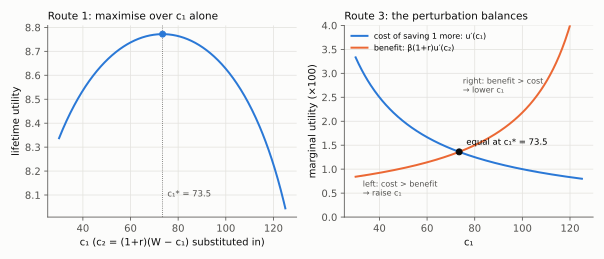
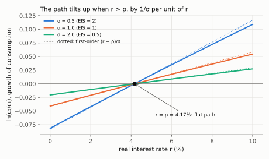
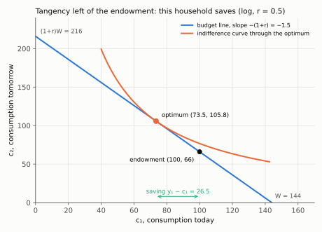

# 2. The two-period problem: budget constraint, Euler equation, closed forms

**Kurlat §6.2, printed pages 105–112.** Up: [[00-index]] ·
Prev: [[01-keynesian-and-the-problem]] · Next: [[03-income-and-substitution]]

> **Companion:** [Two Periods, One Line](companion-euler.html) — the budget line pivoting about
> the endowment point as $r$ moves, with indifference curves, the tangency condition and the
> moment the household switches from lender to borrower.

This is the most reused piece of machinery in the course. The same problem, with different
labels, is the Solow saver of session 6, the labour–leisure chooser of session 5, and the
household whose Euler equation *is* the aggregate demand curve in session 8.

---

## 2.1 Preferences

$$U(c_1,c_2) = u(c_1)+\beta\,u(c_2),
\qquad u'>0,\quad u''<0,\quad \beta=\frac{1}{1+\rho}\in(0,1)$$

Three things are being assumed and each has consequences worth naming.

**Additive separability across time.** Utility today does not depend on consumption yesterday.
This rules out habit formation, which is one of the leading modifications in the empirical
literature, and it is what makes the Euler equation a relation between two adjacent periods
only.

**Concavity, $u''<0$.** Diminishing marginal utility. This is what makes smoothing desirable —
[[01-keynesian-and-the-problem]] §1.3 — and the same curvature that produces risk aversion in
[[05-beyond-gdp]] §5.3. Note that under certainty it has nothing to do with risk; it is a
statement about the willingness to trade consumption across *dates*.

**Geometric discounting, $\beta^t$.** The discount factor between $t$ and $t+1$ is the same
whatever $t$ is. This is what makes plans **time-consistent**: a plan made today is still
optimal tomorrow. Its failure is the hyperbolic-discounting alternative of
[[05-ricardian-and-constraints]] §5.5.

$\beta$ is a **factor** and $\rho$ a **rate**. $\beta=0.96$ corresponds to
$\rho=1/0.96-1=0.0417$. Trap 2 in [[04_consumo_poupanca]].

## 2.2 The budget constraint

Period by period, with $a$ the assets carried forward:

$$c_1 + a = y_1, \qquad c_2 = y_2 + (1+r)a$$

Note that $a$ may be negative — the household may borrow — and that there is no period-3, so
optimality forces the household to consume everything in period 2. Solve the first for $a$ and
substitute into the second:

$$c_2 = y_2 + (1+r)(y_1-c_1)$$

Rearrange into the **intertemporal budget constraint**, one operation per line. Multiply out
the bracket:

$$c_2 = y_2 + (1+r)y_1-(1+r)c_1$$

Add $(1+r)c_1$ to both sides:

$$(1+r)c_1 + c_2 = (1+r)y_1 + y_2$$

Divide both sides by $1+r$:

$$\boxed{\;c_1 + \frac{c_2}{1+r} \;=\; y_1 + \frac{y_2}{1+r} \;\equiv\; W\;}$$

Three readings.

1. **$1/(1+r)$ is the relative price of future consumption** in units of present consumption.
   The constraint is an ordinary budget line with that price. Everything you know about
   consumer theory applies, which is the point of writing it this way.
2. **$W$ is lifetime wealth**, the present value of the income stream. It is the only feature
   of the income path that enters the problem — the *timing* of income is irrelevant given its
   present value. That single sentence is the permanent income hypothesis, and everything in
   [[04-permanent-income]] is its elaboration.
3. **The endowment point $(y_1,y_2)$ always lies on the line**, whatever $r$ is. Consuming your
   income every period is always feasible. So a change in $r$ pivots the line *about the
   endowment*, which is the geometric fact behind the income–substitution decomposition of
   [[03-income-and-substitution]].

Trap 1 in [[04_consumo_poupanca]] lives here: future consumption is **divided** by $1+r$, not
multiplied. Sanity check by asking what a large $r$ should do — it should make future
consumption *cheap*, so its price must fall.

## 2.3 The Euler equation, three ways

**Route 1 — substitution.** Put $c_2 = (1+r)(W-c_1)$ into the objective and maximise over $c_1$
alone:

$$\max_{c_1}\; u(c_1)+\beta\,u\!\left((1+r)(W-c_1)\right)$$

Differentiate term by term. The first term gives $u'(c_1)$. For the second apply the chain
rule: the inner function $(1+r)(W-c_1)$ has derivative $-(1+r)$ with respect to $c_1$, so

$$\frac{d}{dc_1}\,\beta u\!\left((1+r)(W-c_1)\right)=\beta\,u'\!\left((1+r)(W-c_1)\right)\cdot\left[-(1+r)\right]
=-\beta(1+r)u'(c_2)$$

Set the total derivative to zero:

$$\frac{d}{dc_1}: \quad u'(c_1)-\beta(1+r)u'(c_2) = 0$$

**Route 2 — Lagrangian.** With multiplier $\lambda$ on the intertemporal constraint:

$$\mathcal{L}=u(c_1)+\beta u(c_2)+\lambda\left[W-c_1-\frac{c_2}{1+r}\right]$$

$$\frac{\partial\mathcal L}{\partial c_1}=0:\ u'(c_1)=\lambda,
\qquad
\frac{\partial\mathcal L}{\partial c_2}=0:\ \beta u'(c_2)=\frac{\lambda}{1+r}$$

Divide the first by the second. $\lambda$ cancels and the same condition appears:

$$\frac{u'(c_1)}{\beta u'(c_2)}=\frac{\lambda}{\lambda/(1+r)}=1+r
\quad\Longrightarrow\quad\text{multiply by }\beta u'(c_2):\quad u'(c_1)=\beta(1+r)u'(c_2)$$

Note in
passing that $\lambda=u'(c_1)$ is the marginal utility of wealth, which is the object that
becomes the AD curve's multiplier in Benigno §3.

**Route 3 — the perturbation argument**, which is the one to give if asked for intuition.
Starting from any candidate plan, consume one unit less in period 1 and invest it. The utility
cost today is $u'(c_1)$. The unit becomes $1+r$ units tomorrow, worth $u'(c_2)$ each in
tomorrow's utility, discounted by $\beta$: the benefit is $\beta(1+r)u'(c_2)$. At an optimum no
such perturbation can help, so cost equals benefit.

$$\boxed{\;u'(c_1)=\beta(1+r)\,u'(c_2)\;}$$

*Read the right panel as the perturbation argument: left of $c_1^*=73.5$ the cost of saving one
more unit, $u'(c_1)$, exceeds its benefit $\beta(1+r)u'(c_2)$, so the household should consume
more; right of it the reverse. The crossing is the peak of the left panel (log utility,
$\beta=0.96$, $r=0.5$, $W=144$).*

**The key reading.** Rearranged as $\dfrac{u'(c_1)}{u'(c_2)}=\beta(1+r)$: the ratio of marginal
utilities equals the ratio of prices, which is the standard tangency condition of consumer
theory. The marginal rate of substitution between present and future consumption equals the
gross interest rate.

**The benchmark case.** If $\beta(1+r)=1$ — equivalently $r=\rho$ — then $u'(c_1)=u'(c_2)$ and,
since $u'$ is strictly decreasing and therefore invertible, $c_1=c_2$: **perfect smoothing**,
a flat consumption path regardless of how uneven income is. Impatience and the interest rate
exactly offset. If $r>\rho$ the household tilts consumption toward the future; if $r<\rho$
toward the present.

## 2.4 Closed forms

### Logarithmic utility, $u(c)=\ln c$

Euler: $1/c_1 = \beta(1+r)/c_2$, so $c_2 = \beta(1+r)c_1$ (multiply both sides by
$c_1c_2$). Substitute into the budget constraint:

$$c_1 + \frac{\beta(1+r)c_1}{1+r} = W$$

The $1+r$ in the numerator cancels the one in the denominator, leaving $c_1+\beta c_1=W$;
factor out $c_1$:

$$c_1(1+\beta)=W$$

Divide by $1+\beta$ to get $c_1$, and put that $c_1$ back into $c_2=\beta(1+r)c_1$ to get $c_2$:

$$\boxed{\;c_1 = \frac{W}{1+\beta},\qquad c_2 = \frac{\beta(1+r)W}{1+\beta}\;}$$

**Two remarkable features.** First, $c_1$ depends on $r$ **only through $W$** — given wealth,
the interest rate does not affect current consumption at all. Income and substitution effects
cancel exactly. Second, the share of wealth consumed today, $1/(1+\beta)$, depends only on
impatience. With $\beta=0.96$, it is 0.51.

### CRRA utility, $u(c)=\dfrac{c^{1-\sigma}-1}{1-\sigma}$

Differentiate: the constant $-1$ drops out and
$\frac{d}{dc}\frac{c^{1-\sigma}}{1-\sigma}=\frac{(1-\sigma)c^{-\sigma}}{1-\sigma}$, so
$u'(c)=c^{-\sigma}$. The Euler equation reads $c_1^{-\sigma}=\beta(1+r)c_2^{-\sigma}$. Divide both
sides by $c_2^{-\sigma}$ and use $c_1^{-\sigma}/c_2^{-\sigma}=(c_2/c_1)^{\sigma}$:

$$\left(\frac{c_2}{c_1}\right)^{\sigma}=\beta(1+r)$$

Raise both sides to the power $1/\sigma$, hence

$$\boxed{\;\frac{c_2}{c_1}=\left[\beta(1+r)\right]^{1/\sigma}\;}$$

Take logs: $\ln c_2-\ln c_1 = \frac{1}{\sigma}\left[\ln\beta+\ln(1+r)\right]
\simeq \frac{1}{\sigma}(r-\rho)$ to first order. The approximation, step by step: since
$\beta=1/(1+\rho)$, $\ln\beta=-\ln(1+\rho)$; the first-order Taylor expansion $\ln(1+x)\simeq x$
for small $x$ gives $\ln(1+r)\simeq r$ and $\ln(1+\rho)\simeq\rho$; so
$\ln\beta+\ln(1+r)\simeq r-\rho$, and dividing by $\sigma$ gives the result. This is **exactly equation (4) of Benigno
(2015)**, the Euler equation that becomes the New-Keynesian AD curve in
[[01-household-and-ad]] §1.3. The same object, met twice in one course.

**Why $1/\sigma$ is the elasticity of intertemporal substitution.** From the boxed ratio, take
logs, $\ln(c_2/c_1)=\frac{1}{\sigma}\ln\beta+\frac{1}{\sigma}\ln(1+r)$; the first term does not
depend on $r$, so differentiating with respect to $\ln(1+r)$ leaves only the coefficient of the
second:

$$\frac{d\ln(c_2/c_1)}{d\ln(1+r)}=\frac{1}{\sigma}$$

The EIS measures how strongly the consumption *path* tilts when its relative price changes. Its
reciprocal $\sigma$ measures curvature, hence risk aversion under uncertainty. **They are
reciprocals of one another and it is a modelling artefact of CRRA that a single parameter does
both jobs** — Epstein–Zin preferences exist precisely to separate them. Trap 4 in
[[04_consumo_poupanca]].

*Read the slope of each line as $1/\sigma$: all three cross zero at $r=\rho=4.17\%$ (a flat path),
and the dotted first-order lines $(r-\rho)/\sigma$ stay close to the exact ones over this range.*

Solving for the level, substitute $c_2=\left[\beta(1+r)\right]^{1/\sigma}c_1$ into the budget
constraint:

$$c_1+\frac{\left[\beta(1+r)\right]^{1/\sigma}c_1}{1+r}=W
\quad\text{(factor out }c_1\text{)}\quad
c_1\left[1+\frac{\left[\beta(1+r)\right]^{1/\sigma}}{1+r}\right]=W$$

Simplify the fraction: $\left[\beta(1+r)\right]^{1/\sigma}=\beta^{1/\sigma}(1+r)^{1/\sigma}$, and
dividing by $(1+r)=(1+r)^{1}$ subtracts one from the exponent, giving
$\beta^{1/\sigma}(1+r)^{\frac{1}{\sigma}-1}$. Divide both sides by the bracket:

$$\boxed{\;c_1=\frac{W}{1+\beta^{1/\sigma}(1+r)^{\frac{1}{\sigma}-1}}\;}$$

Check the log case: $\sigma=1$ gives $(1+r)^{0}=1$ and the denominator collapses to $1+\beta$. ✓
Verified in `check_consumption.py`.

**The sign that matters.** The exponent $\frac{1}{\sigma}-1$ is positive when $\sigma<1$ and
negative when $\sigma>1$. So the denominator rises with $r$ when $\sigma<1$ (consumption falls,
saving rises) and falls with $r$ when $\sigma>1$ (consumption rises, saving falls). That single
exponent is the whole of [[03-income-and-substitution]], visible in the closed form before any
decomposition is done.

## 2.5 The geometry

In the $(c_1,c_2)$ plane:

*Read the gap between the optimum (73.5) and the endowment (100) on the horizontal axis as saving,
26.5; the line's intercepts are $W=144$ and $(1+r)W=216$, and the indifference curve touches it
exactly once.*

The slope of the indifference curve comes from totally differentiating
$u(c_1)+\beta u(c_2)=\bar U$: along the curve $d\bar U=0$, so $u'(c_1)\,dc_1+\beta u'(c_2)\,dc_2=0$;
solve for the ratio of changes:

$$\left.\frac{dc_2}{dc_1}\right|_{\bar U}=-\frac{u'(c_1)}{\beta u'(c_2)}$$

| Object | Expression | Feature |
|---|---|---|
| Budget line | $c_2=(1+r)(W-c_1)$ | slope $-(1+r)$; passes through $(y_1,y_2)$ always |
| Indifference curve | $u(c_1)+\beta u(c_2)=\bar U$ | slope $-u'(c_1)/\left[\beta u'(c_2)\right]$, convex |
| Optimum | tangency | $u'(c_1)/\left[\beta u'(c_2)\right]=1+r$, the Euler equation |
| Endowment | $(y_1,y_2)$ | on the line; the pivot point when $r$ changes |
| Saving | $y_1-c_1$ | positive if the optimum is left of the endowment |

**The sign test.** The household lends if $c_1<y_1$, which happens if the indifference curve
through the endowment is flatter than the budget line there — that is, if
$u'(y_1)<\beta(1+r)u'(y_2)$. (Flatter means a smaller absolute slope,
$u'(y_1)/[\beta u'(y_2)]<1+r$; multiply both sides by $\beta u'(y_2)>0$.) With $y_1$ large relative to $y_2$ this holds and the household
saves; with income back-loaded it borrows. This is the fact that makes the interest-rate effect
sign-dependent in the next note.

## 2.6 What to be able to do, cold

1. Derive the intertemporal budget constraint from the two period constraints and interpret all
   three of its features.
2. Derive the Euler equation by all three routes, and state the perturbation argument in words.
3. Show that $\beta(1+r)=1$ implies perfect smoothing, and say what tilts the path either way.
4. Derive the log and CRRA closed forms, and verify the CRRA one nests the log one.
5. Explain why $1/\sigma$ is the EIS, and why it is the reciprocal of risk aversion only by
   construction.
6. Draw the diagram and locate the endowment, the optimum and saving on it.

Practice: Kurlat ch. 6, Exercises 6.2 and 6.3 (pp. 123–124). Worked in
[[Resolucao/kurlat_solutions_ch06|ch06]].
