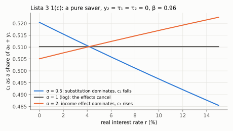
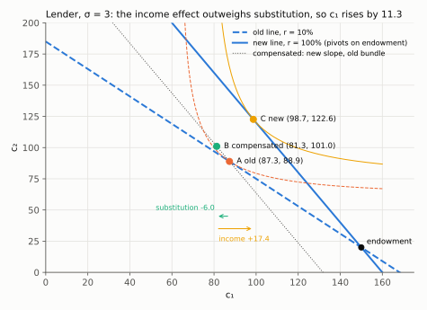
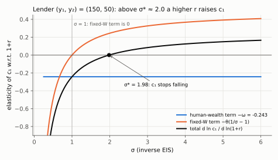
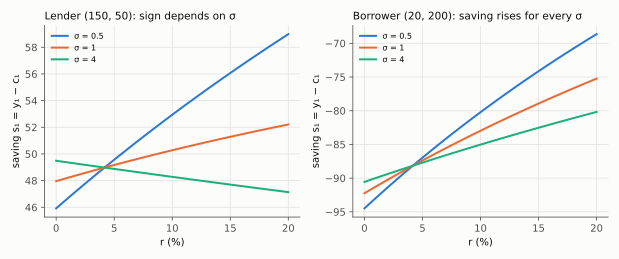

# 3. Why a higher interest rate has an ambiguous effect on saving

**Kurlat §6.2, printed pages 112–115.** Up: [[00-index]] ·
Prev: [[02-two-period-problem]] · Next: [[04-permanent-income]]

> **Companion:** [Two Periods, One Line](companion-euler.html) — raise $r$ and watch the budget
> line pivot about the endowment, with the Hicksian decomposition drawn as the compensated line.
>
> **Companion:** [Taxes, Timing and the Limit](companion-taxes-and-limits.html) — its $\sigma$ panel
> plots $c_1$ against $r$ for a pure saver ($y_2=\tau_1=\tau_2=0$, Lista 3 1(c)): falling for $\sigma<1$,
> flat at $\sigma=1$, rising for $\sigma>1$.

*Lista 3 1(c): for a pure saver, c₁ rises with r iff σ > 1, because the income effect dominates. The graded answer had this sign and wrote the opposite. Diagnosis: [[avaliacao-listas-2-3-6]].*

"Higher interest rates encourage saving" is the single most common false statement in this
material — trap 3 in [[04_consumo_poupanca]]. It is false because a higher interest rate makes a
saver *richer*, and richer households consume more, including today. This note decomposes the
effect exactly and says when each side wins.

---

## 3.1 The two channels

A rise in $r$ does two things to a household that is currently saving.

**Substitution effect.** Future consumption becomes cheaper relative to present consumption —
its price $1/(1+r)$ falls. Substitute toward it: consume less today, **save more**. This
channel always pushes saving up, for savers and borrowers alike, because it is about relative
prices and nothing else.

**Income (wealth) effect.** The household's lifetime wealth changes, and the *sign depends on
which side of the endowment it sits*:

$$W = y_1+\frac{y_2}{1+r} \qquad\Longrightarrow\qquad \frac{\partial W}{\partial r} = -\frac{y_2}{(1+r)^2}<0$$

(Write the second term as $y_2(1+r)^{-1}$; the power rule gives $-y_2(1+r)^{-2}$; $y_1$ does
not depend on $r$.)

At first sight $W$ always falls. But $W$ measured this way is not the right welfare object for a
saver, and the correct statement is about the *attainable* consumption bundle. The clean way to
see it: the budget line pivots about the endowment $(y_1,y_2)$, which is always affordable.

- A **lender** ($c_1<y_1$) consumes at a point to the left of the endowment, where the new,
  steeper line lies **above** the old one. Their feasible set has expanded: they are **richer**.
  Being richer, they consume more of both goods, including $c_1$ — which **reduces** saving.
- A **borrower** ($c_1>y_1$) sits to the right of the endowment, where the new line lies
  **below** the old. They are **poorer**, so they cut consumption today — which **increases**
  saving (reduces borrowing).

$$\boxed{\;\text{lender: income effect opposes substitution} \qquad
\text{borrower: income effect reinforces substitution}\;}$$

**Hence:** for a **borrower** the effect of $r$ on saving is unambiguously positive. For a
**lender** it is ambiguous, and which side wins is a quantitative question about $\sigma$.

*Read the three points left to right along the horizontal axis. A to B (−6.0) is the substitution
effect: the compensated line has the new slope but still just buys the old bundle A. B to C
(+17.4) is the income effect of the steeper line pivoting up on the lender's side of the
endowment. With $\sigma=3$ the second wins and $c_1$ rises. Long periods, so $r$ goes from 10% to
100%; endowment $(150,20)$.*

## 3.2 The decomposition, done exactly

Work with the CRRA closed form from [[02-two-period-problem]] §2.4:

$$c_1 = \frac{W}{D}, \qquad D \equiv 1+\beta^{1/\sigma}(1+r)^{\frac{1}{\sigma}-1},
\qquad W = y_1+\frac{y_2}{1+r}$$

Take logs, $\ln c_1=\ln W-\ln D$ (the log of a ratio is the difference of logs), and
differentiate both sides with respect to $\ln(1+r)$:

$$\frac{d\ln c_1}{d\ln(1+r)} = \underbrace{\frac{d\ln W}{d\ln(1+r)}}_{\text{wealth}}
- \underbrace{\frac{d\ln D}{d\ln(1+r)}}_{\text{substitution}}$$

**The wealth term.** $\dfrac{dW}{d(1+r)} = -\dfrac{y_2}{(1+r)^2}$, so

$$\frac{d\ln W}{d\ln(1+r)} = -\frac{y_2/(1+r)}{W} \;\equiv\; -\omega$$

The middle step: an elasticity is $\dfrac{d\ln W}{d\ln x}=\dfrac{x}{W}\dfrac{dW}{dx}$ with
$x=1+r$; substitute the derivative, $\dfrac{1+r}{W}\cdot\left(-\dfrac{y_2}{(1+r)^2}\right)$, and
cancel one power of $1+r$ to get $-\dfrac{y_2/(1+r)}{W}$.

where $\omega\in(0,1)$ is the **share of lifetime wealth coming from future income**. This is
the natural measure of how "back-loaded" the household's income is, and it is exactly the
statistic that decides the sign below.

**The substitution term.** Write $x\equiv\ln(1+r)$, so $(1+r)^{\frac1\sigma-1}=e^{(\frac1\sigma-1)x}$
and $D=1+\beta^{1/\sigma}e^{(\frac1\sigma-1)x}$. Differentiate the exponential (chain rule brings
down the exponent's coefficient): $\dfrac{dD}{dx}=\beta^{1/\sigma}(1+r)^{\frac1\sigma-1}\left(\frac1\sigma-1\right)$.
Then $\dfrac{d\ln D}{dx}=\dfrac{1}{D}\dfrac{dD}{dx}$:

$$\frac{d\ln D}{d\ln(1+r)}
= \frac{\beta^{1/\sigma}(1+r)^{\frac{1}{\sigma}-1}}{D}\left(\frac{1}{\sigma}-1\right)
= \theta\left(\frac{1}{\sigma}-1\right)$$

where $\theta\equiv 1-1/D\in(0,1)$ is the share of wealth consumed in period 2. Two small steps
justify both claims. First, $\beta^{1/\sigma}(1+r)^{\frac1\sigma-1}=D-1$ by the definition of $D$,
so the fraction is $(D-1)/D=1-1/D$. Second, the present value of period-2 consumption is
$c_2/(1+r)=W-c_1$ (budget constraint), so its share of wealth is
$(W-c_1)/W=1-c_1/W=1-1/D$ because $c_1=W/D$.

Putting them together:

$$\boxed{\;\frac{d\ln c_1}{d\ln(1+r)} = -\omega-\theta\left(\frac{1}{\sigma}-1\right)\;}$$

and saving is $s_1=y_1-c_1$, so $\dfrac{ds_1}{d\ln(1+r)} = -c_1\dfrac{d\ln c_1}{d\ln(1+r)}$,
whose sign is the *opposite*. (The step: $y_1$ does not move with $r$, so $ds_1=-dc_1$, and
$dc_1=c_1\,d\ln c_1$ because $d\ln c_1=dc_1/c_1$.)

**A caution on the labels.** The second term is the effect of $r$ *holding $W$ fixed*. That is not
the pure Hicksian substitution effect: at fixed $W$ a cheaper $c_2$ also makes the household
richer in terms of $c_2$, so this term is Hicksian substitution *plus* that income effect, and the
two cancel exactly at $\sigma=1$. The first term is the change in the present value of future
income (human wealth). The figure labels them accordingly; the exact Hicksian split is the
compensated-line figure in §3.1.

### Reading the formula

**Case $\sigma=1$ (log).** The second term vanishes, and $d\ln c_1/d\ln(1+r)=-\omega$.
Consumption falls, and it falls **only** because the present value of future income fell. Given
$W$, $r$ has no effect at all — the income and substitution effects on the *allocation* cancel
exactly, which is the property noted in [[02-two-period-problem]] §2.4. This is the knife-edge
benchmark, and it is why log utility is the default in this course.

**Case $\sigma<1$ (EIS $>1$).** $\frac{1}{\sigma}-1>0$, so the second term is negative too:
consumption falls by more than the wealth effect alone. **Substitution dominates** and saving
rises with $r$.

**Case $\sigma>1$ (EIS $<1$).** $\frac{1}{\sigma}-1<0$, so the second term is positive and
offsets the wealth term. If $\sigma$ is large enough, $c_1$ **rises** with $r$ and saving
**falls**. The household is so unwilling to tilt its path that a higher return simply makes it
richer and it spends the proceeds.

*Read where the black total crosses zero: for this lender (endowment $(150,50)$, $r=4\%$,
$\omega=0.243$) the fixed-$W$ term is zero at $\sigma=1$ and overtakes the human-wealth term at
$\sigma^*\approx1.98$, beyond which a higher $r$ raises $c_1$ and lowers saving.*

**A special case worth knowing.** If the household has no second-period income ($y_2=0$, so
$\omega=0$ — a retiree living off assets, or the "cake-eating" case), the wealth term vanishes
and the sign is entirely the substitution term: saving rises with $r$ iff $\sigma<1$. Conversely
if $y_1=0$ the household must borrow and both effects push the same way. In the formula: $y_1=0$
means $W=y_2/(1+r)$, so $\omega=1$; substitute and expand,
$-1-\theta\left(\frac1\sigma-1\right)=-1-\frac{\theta}{\sigma}+\theta=-(1-\theta)-\frac{\theta}{\sigma}$,
which is negative for every $\sigma$ because $\theta\in(0,1)$.

*Read the two panels against each other: for the borrower $(20,200)$ every line slopes up, while for
the lender $(150,50)$ the $\sigma=4$ line slopes down: the sign is ambiguous only for a lender.*

Verified numerically in `check_consumption.py`, which computes the total effect by solving the
problem at two interest rates and checks it against the boxed formula, then splits it into
Hicksian substitution and income components by compensating wealth.

## 3.3 The Slutsky version

For those who prefer the standard consumer-theory apparatus. With the endowment $(y_1,y_2)$
fixed and price $p\equiv 1/(1+r)$ for good 2, the Slutsky equation in endowment form is

$$\frac{\partial c_1}{\partial p} = \underbrace{\left.\frac{\partial c_1}{\partial p}\right|_{\text{comp}}}_{\text{substitution, }>0\text{ for }c_1}
+ \underbrace{\left(y_2-c_2\right)\frac{\partial c_1}{\partial W}}_{\text{endowment income effect}}$$

Where it comes from, in two steps. Write $c_1(p,W)$ for demand given the price and wealth, with
$W=y_1+p\,y_2$ (divide the budget by $1+r$ and use $p=1/(1+r)$). A change in $p$ moves $c_1$
directly and through $W$; by the chain rule, since $\partial W/\partial p=y_2$,

$$\frac{dc_1}{dp}=\left.\frac{\partial c_1}{\partial p}\right|_{W}+y_2\,\frac{\partial c_1}{\partial W}$$

The ordinary Slutsky equation splits the fixed-$W$ price effect into the compensated effect and
an income effect that scales with the quantity bought, $c_2$:
$\left.\frac{\partial c_1}{\partial p}\right|_{W}=\left.\frac{\partial c_1}{\partial p}\right|_{\text{comp}}-c_2\frac{\partial c_1}{\partial W}$.
Substitute it into the chain-rule line and collect the two $\partial c_1/\partial W$ terms,
$-c_2+y_2=y_2-c_2$: that is the equation above.

The second term carries the factor $y_2-c_2$, which is **negative for a lender** (who consumes
more than their period-2 income) and **positive for a borrower**. That factor is the entire
content of §3.1, stated in the general form: the income effect of a price change is
proportional to the household's *net trade* in that good. A household that neither borrows nor
lends has no income effect at all, and for it the substitution effect is the whole story.

## 3.4 The empirical question, and why it is unsettled

The elasticity of saving with respect to the interest rate is one of the most-estimated and
least-agreed numbers in macroeconomics. Estimates of the EIS $1/\sigma$ run from near zero
(Hall, 1988, using aggregate consumption) to around one or above (Attanasio and Weber, using
micro data and correcting for aggregation bias). Standard macro calibrations use $\sigma$
between 1 and 2, which places the economy near or slightly on the "saving falls" side of the
knife-edge.

**Why it matters beyond this session.** The entire effect of monetary policy on demand in
[[08_adas_microfundamentos]] runs through this elasticity: $\sigma$ there is the slope parameter
of the AD curve, and a low EIS means a steep AD curve and a weak interest-rate channel. So the
unsettled empirical question about household saving is the same unsettled question about how
much a central bank can do. It is worth saying that out loud in an exam answer.

## 3.5 The policy corollary

A tax incentive for saving — a tax-exempt retirement account, say — raises the after-tax return
$r$. The analysis above says the effect on national saving is:

- unambiguously positive for **constrained or borrowing** households, who are precisely the
  households least likely to hold such accounts;
- **ambiguous** for lenders, who are precisely the households that do;
- and **zero on the allocation** in the log benchmark.

Add the point that such schemes are typically funded by forgone tax revenue, which is negative
public saving, and the net effect on *national* saving can easily be negative. This is the
standard critique of savings-incentive policy, and it follows from a decomposition rather than
from an opinion.

## 3.6 What to be able to do, cold

1. Name the two channels and give the sign of each for a lender and for a borrower.
2. Explain why the budget line pivots about the endowment, and derive the welfare consequence
   from that geometry alone.
3. Derive $d\ln c_1/d\ln(1+r)=-\omega-\theta(1/\sigma-1)$ and read off all three cases.
4. State why log is the knife-edge, in terms of the allocation rather than the level.
5. Write the Slutsky equation in endowment form and identify the net-trade factor.
6. Give the policy corollary and the reason a saving incentive may lower national saving.

Practice: Kurlat ch. 6, Exercises 6.3 and 6.4 (p. 124). Worked in
[[Resolucao/kurlat_solutions_ch06|ch06]].
