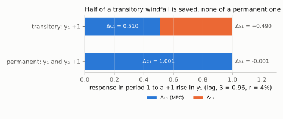
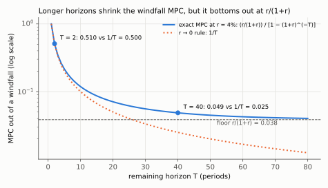
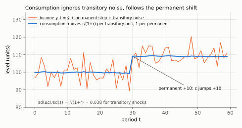

# 4. Permanent income: the marginal propensity to consume, derived

**Kurlat §6.2–§6.3, printed pages 115–120.** Up: [[00-index]] ·
Prev: [[03-income-and-substitution]] · Next: [[05-ricardian-and-constraints]]

> **Companion:** [Wealth, Not Income](companion-pih.html) — hit the household with a transitory
> or a permanent shock and watch the two MPCs separate, with the horizon on a slider so the
> $1/T$ scaling is visible.

The central result of the session, and the one that survives into every later model.

---

## 4.1 The contrast, computed

Work in the log case for clarity, where $c_1=W/(1+\beta)$ from [[02-two-period-problem]] §2.4,
so that $\mathrm{MPC} = \partial c_1/\partial y_1$ is just $\frac{1}{1+\beta}\cdot\partial W/\partial y_1$.

**Transitory shock: $y_1$ rises by $\Delta$, $y_2$ unchanged.**

$$\Delta W = \Delta
\qquad\Longrightarrow\qquad
\Delta c_1 = \frac{\Delta}{1+\beta}, \qquad
\Delta s_1 = \Delta-\Delta c_1 = \frac{\beta}{1+\beta}\Delta$$

(The last step puts $\Delta$ over the common denominator:
$\Delta-\frac{\Delta}{1+\beta}=\frac{(1+\beta)\Delta-\Delta}{1+\beta}=\frac{\beta\Delta}{1+\beta}$.
With $\beta=0.96$: $1/1.96=0.5102$ and $0.96/1.96=0.4898$.)

With $\beta=0.96$: consumption rises by **0.51** of the windfall and saving by **0.49**. Roughly
half the windfall is saved.

**Permanent shock: $y_1$ and $y_2$ both rise by $\Delta$.**

$$\Delta W = \Delta+\frac{\Delta}{1+r} = \Delta\,\frac{(1+r)+1}{1+r} = \Delta\,\frac{2+r}{1+r}
\qquad\Longrightarrow\qquad
\Delta c_1 = \frac{\Delta}{1+\beta}\cdot\frac{2+r}{1+r}$$

With $\beta=0.96$ and $r=0.04$: $\Delta c_1 = 0.51\times1.962\Delta = \textbf{1.00}\Delta$, and
saving is essentially unchanged.

$$\boxed{\;\mathrm{MPC}_{\text{transitory}} \simeq 0.51,
\qquad \mathrm{MPC}_{\text{permanent}} \simeq 1.00\;}$$

*Read each bar as the unit of extra period-1 income split between consumption and saving: 0.510 /
0.490 for the transitory rise, 1.001 / −0.001 for the permanent one.*

**The same household, the same preferences, two MPCs differing by a factor of two.** No
Keynesian consumption function can produce that, because it has one MPC by construction. This
is the resolution of the Kuznets puzzle promised in [[01-keynesian-and-the-problem]] §1.2.

A neat check: the permanent MPC is exactly 1 when $\beta(1+r)=1$, i.e. $r=\rho$. Then the
household already wants a flat path, and a permanent income rise shifts the whole path up
one-for-one with no change in saving. The algebra: $\beta=1/(1+r)$ gives
$1+\beta=\frac{(1+r)+1}{1+r}=\frac{2+r}{1+r}$, so
$\frac{1}{1+\beta}\cdot\frac{2+r}{1+r}=\frac{1+r}{2+r}\cdot\frac{2+r}{1+r}=1$. With $\beta=0.96$, $\rho=0.0417$ against $r=0.04$, so the
MPC is a hair below one. Verified in `check_consumption.py`.

## 4.2 Why the MPC out of transitory income is not tiny in a two-period model

Students often expect the transitory MPC to be near zero, because "the windfall is spread over a
lifetime". In a **two-period** model the lifetime is two periods, so it is spread over two — an
MPC near one half. The intuition is right; the horizon is short.

Generalise. With $T$ remaining periods, a flat consumption path, and $r=\rho$ so smoothing is
exactly desired, a windfall $\Delta$ received now must be spread over $T$ periods:

$$\mathrm{MPC}_{\text{transitory}} \simeq \frac{1}{T}\qquad\text{(for }r\text{ near }0\text{)}$$

so a 40-year horizon gives an MPC near 0.025 **when $r$ is close to zero**. Be careful with that
qualifier: the exact MPC is the annuity factor of §4.3,
$\frac{r}{1+r}\big/\left[1-(1+r)^{-T}\right]$, which at $r=0.04$ and $T=40$ is **0.049**
($0.04/1.04=0.03846$; $1.04^{-40}=0.2083$; $0.03846/0.7917=0.0486$) —
nearly twice $1/T$, because discounting concentrates the windfall's value in the near years.
The $1/T$ rule is the $r\to0$ limit, not the general answer. Both are checked in
`check_consumption.py`.

Why $1/T$ is the $r\to0$ limit. Multiply out the denominator: the MPC is
$\frac{r}{(1+r)\left[1-(1+r)^{-T}\right]}=\frac{r}{g(r)}$ with $g(r)\equiv(1+r)-(1+r)^{1-T}$.
At $r=0$, $g=1-1=0$, and its derivative $g'(r)=1-(1-T)(1+r)^{-T}$ equals $1-(1-T)=T$; so to
first order $g(r)\simeq Tr$ and the MPC is $\frac{r}{Tr}=\frac1T$. For $r>0$ the MPC exceeds
$1/T$: $g''(r)=-T(T-1)(1+r)^{-T-1}\le0$, so $g$ is concave and lies below its tangent $Tr$.

*Read the gap between the blue and the dotted line: they agree at $T=2$ (0.510 against 0.500), but by
$T=40$ the exact MPC is 0.049 against 0.025, and as $T$ grows it levels off at $r/(1+r)=0.038$
instead of going to zero.*

Either way the order of magnitude is the point: that is the sense in
which the permanent income
hypothesis predicts a **very small** response to windfalls — and it is the prediction that the
empirical literature has had the most trouble with, since estimated MPCs out of tax rebates
cluster around 0.2–0.4, an order of magnitude too large. Resolving that gap is what credit
constraints and precautionary saving are for, in [[05-ricardian-and-constraints]].

## 4.3 The annuity formula

Do the $T$-period case properly. With $r=\rho$ so that the optimal path is flat at $c$, and
initial assets $a_0$:

$$\sum_{t=0}^{T-1}\frac{c}{(1+r)^t} = (1+r)a_0 + \sum_{t=0}^{T-1}\frac{y_t}{(1+r)^t} \equiv W$$

The left side is $c$ times a finite geometric series with ratio $q\equiv1/(1+r)$. Its sum,
from first principles: call it $S=1+q+\dots+q^{T-1}$; multiply by $q$,
$qS=q+q^2+\dots+q^{T}$; subtract, and every term but the first and last cancels,
$S-qS=1-q^{T}$; divide by $1-q$, $S=\dfrac{1-q^T}{1-q}$. Now substitute $q$:

$$\sum_{t=0}^{T-1}\frac{1}{(1+r)^t} = \frac{1-(1+r)^{-T}}{1-(1+r)^{-1}}
= \frac{1+r}{r}\left[1-(1+r)^{-T}\right]$$

(the last step uses $1-\frac{1}{1+r}=\frac{r}{1+r}$, whose reciprocal is $\frac{1+r}{r}$). The
budget constraint is therefore $c\cdot\frac{1+r}{r}\left[1-(1+r)^{-T}\right]=W$; divide both sides
by the bracketed series, so

$$\boxed{\;c = \frac{r}{1+r}\cdot\frac{W}{1-(1+r)^{-T}}\;}$$

**The infinite-horizon limit**, $T\to\infty$, where $(1+r)^{-T}\to0$:

$$\boxed{\;c = \frac{r}{1+r}\,W\;}$$

This is the **annuity value** of wealth: consume the interest on your wealth and never touch the
principal, so that the same $c$ is sustainable forever. It is the cleanest statement of the
permanent income hypothesis, and it is why economists say "permanent income" rather than
"wealth" — $\frac{r}{1+r}W$ *is* the constant income flow equivalent to the wealth $W$.

Two immediate corollaries:

- **MPC out of a transitory windfall** $\Delta$ (which raises $W$ by $\Delta$) is
  $\frac{r}{1+r}$. At $r=0.04$ that is **0.038** — essentially the $1/T$ intuition of §4.2, made
  exact.
- **MPC out of a permanent income rise** $\Delta$ per period forever raises $W$ by
  $\Delta\frac{1+r}{r}$, so consumption rises by exactly $\Delta$: **MPC = 1**. (The rise in $W$
  is $\Delta$ times the infinite series $\sum_{t\ge0}(1+r)^{-t}=\frac{1}{1-q}=\frac{1+r}{r}$, the
  $T\to\infty$ limit of $S$; multiply by $\frac{r}{1+r}$ and the two fractions cancel to 1.)

A factor of **26** between the two MPCs at this calibration: $1\big/\frac{r}{1+r}=\frac{1+r}{r}=\frac{1.04}{0.04}=26$. That is the permanent income
hypothesis in one number.

## 4.4 Consumption smoothing, quantified

The model predicts that consumption is much less volatile than income, and now the prediction
can be signed. Suppose income follows $y_t = \bar y+\varepsilon_t$ with $\varepsilon$ purely
transitory and serially uncorrelated. Then each shock changes $W$ by $\varepsilon_t$ and
consumption by $\frac{r}{1+r}\varepsilon_t$, so

$$\frac{\operatorname{sd}(\Delta c)}{\operatorname{sd}(\varepsilon)} = \frac{r}{1+r} \simeq 0.04$$

Consumption should be **almost perfectly smooth** against transitory income. Against *permanent*
shocks it should move one-for-one. So the model does not merely predict "smoother"; it predicts
that the degree of smoothing depends entirely on the **persistence** of the shock, which is a
sharp, testable and largely confirmed prediction — and the reason empirical work on consumption
spends most of its effort on decomposing income into permanent and transitory components.

*Read the blue line against the orange: each transitory unit moves consumption by only 0.038,
so it is nearly flat through the noise, and the permanent +10 at $t=30$ moves it by the full 10
(simulated with $r=\rho=4\%$ and transitory shocks of s.d. 5).*

## 4.5 The random walk, stated

Under uncertainty, quadratic utility and $\beta(1+r)=1$, the Euler equation becomes

$$u'(c_t) = \mathbb{E}_t\left[u'(c_{t+1})\right]
\quad\Longrightarrow\quad
c_t = \mathbb{E}_t\left[c_{t+1}\right]$$

because with quadratic $u$, marginal utility is linear, so the expectation passes through. Step
by step: $\beta(1+r)=1$ removes the factor in front of the expectation in
$u'(c_t)=\beta(1+r)\mathbb{E}_t[u'(c_{t+1})]$. Take $u(c)=c-\frac{b}{2}c^2$, so $u'(c)=1-bc$. The
expectation of a linear function is the function of the expectation,
$\mathbb{E}_t[1-bc_{t+1}]=1-b\,\mathbb{E}_t[c_{t+1}]$, so the Euler equation reads
$1-bc_t=1-b\,\mathbb{E}_t[c_{t+1}]$; subtract 1 and divide by $-b$.
Therefore

$$\boxed{\;c_{t+1}=c_t+\epsilon_{t+1},\qquad \mathbb{E}_t[\epsilon_{t+1}]=0\;}$$

**Consumption is a martingale — Hall (1978).** The testable content is strong and surprising:
*no variable known at $t$ should help predict the change in consumption.* Not lagged income, not
lagged consumption, not anything. All predictable income movements are already in $c_t$; only
news moves consumption.

Two things to be careful about, both worth a sentence in an exam:

1. **The random walk needs quadratic utility**, not just concavity. With CRRA the Euler equation
   gives a martingale in *marginal* utility, $u'(c_t)=\mathbb{E}_t u'(c_{t+1})$, and Jensen's
   inequality then makes consumption itself drift upward — the precautionary term of
   [[05-ricardian-and-constraints]] §5.4.
2. **The empirical verdict is mixed.** Consumption is excessively sensitive to *predictable*
   income changes (Flavin, 1981) and excessively smooth with respect to *permanent* shocks
   (Deaton's paradox). Both failures point the same way: toward constraints and precaution.

This result is Romer (2012) ch. 8 territory and is stated here rather than derived, since the
stochastic machinery is outside the course.

> **Contrast: Romer (2012), ch. 8.** Romer derives the random walk properly, states the
> excess-sensitivity and excess-smoothness tests, and carries the certainty-equivalence algebra
> that this note compresses. Where Kurlat is better is the two-period geometry, which Romer
> skips entirely. Use Kurlat for the picture and the intuition, Romer for the stochastic
> statement. Local 4th edition, +22 page offset ([[books-index]]).

## 4.6 What the hypothesis does *not* say

Worth listing, because each is a common misreading:

- It does **not** say consumption is constant. It says consumption is constant *given the
  information set*; news moves it permanently.
- It does **not** say income does not matter. Income determines $W$; it is the *timing* of
  income that is irrelevant.
- It does **not** require $r=\rho$. That assumption makes the path flat; without it the path
  tilts at a constant rate but the MPC contrast is unchanged in kind.
- It does **not** survive credit constraints, and Friedman knew that. See
  [[05-ricardian-and-constraints]] §5.3.

## 4.7 What to be able to do, cold

1. Compute both MPCs in the two-period log model and state the ratio.
2. Explain why the transitory MPC is near 1/2 in two periods and near $1/T$ in $T$.
3. Derive the annuity formula from the geometric series and take the infinite-horizon limit.
4. Give both MPCs in the infinite-horizon case and the factor between them.
5. State the random-walk result, the assumption it needs beyond concavity, and its testable
   content.
6. List what the hypothesis does not claim.

Practice: Kurlat ch. 6, Exercises 6.2, 6.6 and 6.7 (pp. 123–125). Worked in
[[Resolucao/kurlat_solutions_ch06|ch06]].
