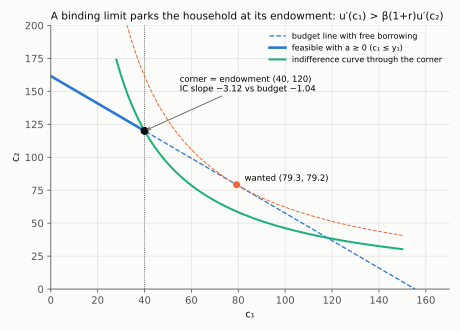
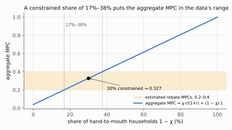
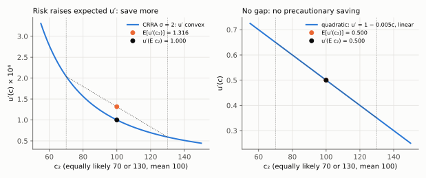

# 5. Taxes, Ricardian equivalence, constraints, precaution, and the behavioural alternatives

**Kurlat §6.2–§6.4, printed pages 120–126.** Up: [[00-index]] ·
Prev: [[04-permanent-income]]

> **Companion:** [Wealth, Not Income](companion-pih.html) — impose a borrowing limit and watch
> the household switch from permanent-income behaviour to hand-to-mouth, with the MPC jumping
> from 0.04 to 1.
>
> **Companion:** [Taxes, Timing and the Limit](companion-taxes-and-limits.html) — cut $\tau_1$ by one
> and raise $\tau_2$ by $1+r$: nothing moves but saving, until the limit $a\ge-b$ binds; then compare a
> tax on saving with the lump sum that raises the same revenue.

*Lista 3 1(e): the same tax swap leaves consumption unchanged when the household can borrow, and moves c₁ one-for-one when the limit binds. Diagnosis: [[avaliacao-listas-2-3-6]].*

Four departures from the baseline, in the order Kurlat takes them. The first is a result, the
other three are the reasons it and the permanent income hypothesis fail in data.

---

## 5.1 Taxes in the budget constraint

Let the government levy lump-sum taxes $T_1$ and $T_2$. The household's constraint becomes

$$c_1+\frac{c_2}{1+r} = (y_1-T_1)+\frac{y_2-T_2}{1+r}
= W - \underbrace{\left(T_1+\frac{T_2}{1+r}\right)}_{\text{present value of taxes}}$$

Only the **present value** of taxes enters. Nothing about their timing appears anywhere.

Now add the government's own intertemporal budget constraint. With spending $G_1$, $G_2$ and no
initial debt:

$$G_1+\frac{G_2}{1+r} = T_1+\frac{T_2}{1+r}$$

Substitute: the bracket in the household constraint is the left side of the government's, so
replace $T_1+\frac{T_2}{1+r}$ by $G_1+\frac{G_2}{1+r}$ and write $W$ out:

$$\boxed{\;c_1+\frac{c_2}{1+r} = y_1+\frac{y_2}{1+r}-G_1-\frac{G_2}{1+r}\;}$$

**The household's constraint contains $G$ and does not contain $T$.**

## 5.2 Ricardian equivalence

> **Result.** Holding $G_1$ and $G_2$ fixed, a change in the *timing* of taxes leaves the
> household's budget set, and therefore its consumption, completely unchanged.

**The mechanism, concretely.** Suppose the government cuts $T_1$ by $\Delta$ and borrows to
cover it, repaying with interest next period: $T_2$ rises by $(1+r)\Delta$. The household's
disposable income rises by $\Delta$ today and falls by $(1+r)\Delta$ tomorrow. Its present
value change is $\Delta-\frac{(1+r)\Delta}{1+r}=0$. So it consumes exactly as before, and saves
the entire tax cut in order to pay the future tax bill:

$$\Delta s_1^{\text{private}} = +\Delta, \qquad \Delta s^{\text{public}} = -\Delta,
\qquad \Delta s^{\text{national}} = 0$$

Each entry, one line: private saving is $s_1=(y_1-T_1)-c_1$, and $T_1$ falls by $\Delta$ while
$c_1$ does not move, so $\Delta s_1=+\Delta$. Public saving is $T_1-G_1$, and $T_1$ falls by
$\Delta$ with $G_1$ fixed, so it falls by $\Delta$. National saving is their sum,
$\Delta-\Delta=0$.

**Private saving rises exactly enough to offset public dissaving.** A deficit-financed tax cut
is not stimulus; it is a forced loan that the household undoes.

### The five assumptions, from Kurlat p. 121

Kurlat lists these explicitly and they are examinable as a list. Each names a way the result
fails:

1. **Perfect rationality and understanding of the government's budget.** Households must see
   the future tax bill coming.
2. **No change in expected future spending.** If a tax cut is read as a signal that $G$ will
   fall, wealth genuinely rises and consumption moves.
3. **The government borrows and lends at the same rate as households, and everyone can borrow
   and lend at that rate.** This is the big one — see §5.3.
4. **Taxes are lump-sum**, so households cannot change their liability by changing behaviour.
   Distortionary taxes change relative prices and therefore allocations.
5. Implicitly, **an infinite horizon or operative bequests**. With finite lives, some of the
   future tax falls on people not yet alive, so the present generation is genuinely richer.
   Barro (1974) shows altruistic bequests restore the result.

Kurlat notes that Exercise 6.5 (p. 124) breaks one of these deliberately.

### What it does *not* say — Kurlat's own warning, p. 121

He flags this because "people sometimes get this wrong", and it is worth quoting the substance:
Ricardian equivalence does **not** say that anything the government does is irrelevant, and it
says **nothing** about what happens if the government changes $G_1$ or $G_2$. *The only thing
that is irrelevant is the timing of taxes, everything else held equal.* A rise in government
spending has real effects in this model — it shows up directly in the boxed constraint above and
lowers household consumption one-for-one in present value.

### Where this reappears

Ricardian equivalence is assumed throughout Benigno (2015) §3–§9, which is why every fiscal
experiment in [[07-fiscal-multipliers]] is implicitly financed by a lump-sum transfer. It fails
in Benigno §10 precisely through assumption 3: borrowers are at a credit limit, so *who* is
taxed matters, and $\tau_b$ appears in the AD curve of [[09-deleveraging]]. The link is exact —
the assumption that breaks there is the one listed here.

## 5.3 Credit constraints

Add the restriction that the household cannot borrow:

$$a\ge0 \qquad\Longleftrightarrow\qquad c_1\le y_1$$

(From the period-1 constraint, $a=y_1-c_1$; so $a\ge0$ is $y_1-c_1\ge0$; add $c_1$ to both sides.)

**If the unconstrained optimum has $a\ge0$**, nothing changes; the constraint does not bind.

**If the unconstrained optimum wanted $a<0$** — a household with low current income and high
expected future income, a student say — the constraint binds and the solution is the corner:

$$\boxed{\;c_1=y_1,\qquad c_2=y_2\;}$$

*Read the thick segment as all that is feasible: the household that wanted $(79.3,79.2)$ is stopped
at the endowment $(40,120)$, where its indifference curve (slope −3.12) is steeper than the budget
line (slope −1.04). That gap is the Euler inequality below (log, $\beta=0.96$, $r=4\%$).*

The household consumes its income in each period. **It is hand-to-mouth, and the Keynesian
consumption function of [[01-keynesian-and-the-problem]] describes it exactly.**

**The Euler equation becomes an inequality.** At the corner, the household would like to move
consumption forward but cannot, so the marginal utility of present consumption exceeds the
discounted marginal benefit of saving:

$$\boxed{\;u'(c_1) > \beta(1+r)\,u'(c_2)\;}$$

Trap 6 in [[04_consumo_poupanca]]: writing this as an equality at a binding constraint is a
straightforward error, and it is the standard way to get a Kuhn–Tucker problem wrong. The
complementary-slackness statement is $u'(c_1)-\beta(1+r)u'(c_2)=\mu\ge0$ with $\mu a=0$.

Where it comes from. Write $c_1=y_1-a$ and $c_2=y_2+(1+r)a$ and choose $a$, attaching the
multiplier $\mu\ge0$ to $a\ge0$:

$$\mathcal L=u(y_1-a)+\beta u\!\left(y_2+(1+r)a\right)+\mu a$$

Differentiate with respect to $a$ (chain rule on each term: $\partial c_1/\partial a=-1$,
$\partial c_2/\partial a=1+r$) and set to zero:

$$-u'(c_1)+\beta(1+r)u'(c_2)+\mu=0$$

Move the first two terms to the right: $\mu=u'(c_1)-\beta(1+r)u'(c_2)$. If the limit is slack,
$a>0$ and $\mu a=0$ force $\mu=0$, the ordinary Euler equation. If it binds, $\mu>0$ and the
inequality is strict.

### The consequences, which are the point

- **The MPC out of transitory income jumps to one.** A windfall is consumed entirely, because
  the household was liquidity-constrained and wanted to consume more all along. This is the
  resolution of the excess-sensitivity puzzle of [[04-permanent-income]] §4.5, and it explains
  why estimated rebate MPCs of 0.2–0.4 are consistent with theory once a fraction of households
  is constrained.
- **Ricardian equivalence fails.** A tax cut today relaxes the binding constraint, so it raises
  consumption — it is genuine stimulus. The household would *like* to borrow against the future
  tax bill and cannot; the government borrows on its behalf.
- **Timing of income matters again.** The variable that the permanent income hypothesis said was
  irrelevant is, for these households, the only thing that matters.

**The practical summary.** In any economy a fraction $\chi$ of households is unconstrained and
behaves as in [[04-permanent-income]], while $1-\chi$ is constrained and behaves as in
[[01-keynesian-and-the-problem]]. Aggregate consumption is a weighted average, and the aggregate
MPC is roughly $\chi\frac{r}{1+r}+(1-\chi)$. With an empirically common $1-\chi\simeq0.3$, that
gives about 0.33 — right in the estimated range ($0.7\times0.03846+0.3\times1=0.0269+0.3=0.327$).

*Read the band: the aggregate MPC is a straight line from 0.038 (nobody constrained) to 1
(everybody), and it lies inside the estimated 0.2–0.4 range for constrained shares between 17% and
38% (solve $0.03846+s(1-0.03846)=0.2$ and $=0.4$ for $s$).* This two-type structure is exactly the
Eggertsson–Krugman model of [[09-deleveraging]], where it produces multipliers above one.

## 5.4 Precautionary saving

Drop certainty: period-2 income is random. Kurlat introduces this at p. 122 and the result is
that **uncertainty itself raises saving**, provided marginal utility is convex.

The Euler equation under uncertainty is

$$u'(c_1) = \beta(1+r)\,\mathbb{E}\!\left[u'(c_2)\right]$$

By **Jensen's inequality**, if $u'''>0$ — marginal utility convex — then

$$\mathbb{E}\!\left[u'(c_2)\right] > u'\!\left(\mathbb{E}[c_2]\right)$$

so the right-hand side is larger than it would be under certainty with the same mean. To restore
equality, $u'(c_1)$ must rise, so $c_1$ must **fall** (because $u''<0$, $u'$ is decreasing, so a
higher $u'(c_1)$ means a lower $c_1$): the household saves more. That extra saving is the
**precautionary motive**.

Why convexity of $u'$ is the condition, in the simplest case. Let $c_2$ be $\bar c-h$ or
$\bar c+h$ with equal probability. Expand each by Taylor to second order around $\bar c$:
$u'(\bar c\pm h)\simeq u'(\bar c)\pm u''(\bar c)h+\frac12u'''(\bar c)h^2$. Average the two: the
$\pm u''h$ terms cancel, leaving

$$\mathbb{E}[u'(c_2)]\simeq u'(\bar c)+\tfrac12u'''(\bar c)\,h^2$$

so the gap $\mathbb{E}[u'(c_2)]-u'(\mathbb{E}c_2)$ has the sign of $u'''$ and grows with the
spread $h^2$.

*Read the orange point against the black one: with CRRA $\sigma=2$ the average of $u'$ over 70 and
130 is 1.316 against $u'(100)=1.000$ (×10⁻⁴), so risk raises the right side of the Euler equation;
with linear $u'$ the two coincide and there is nothing to save against.*

**The condition is $u'''>0$, not concavity.** Concavity ($u''<0$) gives risk aversion; convex
marginal utility ($u'''>0$) gives *prudence*, in Kimball's (1990) terminology. They are logically
distinct, and the standard illustration is that **quadratic utility is risk averse but not
prudent** — $u'''=0$, so there is no precautionary saving at all. That is exactly why the random
walk of [[04-permanent-income]] §4.5 needs quadratic utility: certainty equivalence holds only
when prudence is absent. CRRA has $u'''=\sigma(\sigma+1)c^{-\sigma-2}>0$, so it is prudent, and
under CRRA the random-walk result fails. (Differentiate $u'(c)=c^{-\sigma}$ twice:
$u''(c)=-\sigma c^{-\sigma-1}$, then $u'''(c)=(-\sigma)(-\sigma-1)c^{-\sigma-2}=\sigma(\sigma+1)c^{-\sigma-2}$.)

**Why this matters empirically.** Precautionary saving explains part of the excess *smoothness*
of consumption, the buffer-stock behaviour of households with low wealth, and why saving rates
rise in recessions beyond what income changes alone would predict.

## 5.5 Behavioural theories (§6.4)

Kurlat closes with the alternatives, and the honest framing is that each is a different
diagnosis of the same symptom — households consume more out of current income than the model
says they should.

**Poor self-control.** People know they should save and do not. Kurlat's own sharp observation
(p. 121) deserves quoting in substance: *it is not that people have poor self-control, it is that
they have a very low $\beta$* — a household that heavily discounts the future and one that
cannot control itself produce identical choices, so the two stories are observationally
equivalent in this model. Distinguishing them requires something the model does not have.

**Hyperbolic discounting.** Replace $\beta^t$ with a schedule that discounts the near future
much more steeply than the far future — for example $1,\ \beta\delta,\ \beta\delta^2,\dots$ with
$\beta<1$ (Laibson, 1997). The consequence is **time inconsistency**: a plan made today to save
next year is not carried out when next year arrives, because the trade-off has been re-dated.
This is *not* observationally equivalent to a low $\beta$ — it predicts demand for **commitment
devices** (locked retirement accounts, Christmas clubs, illiquid assets held alongside
high-interest debt), which geometric discounting cannot explain and which are widely observed.

**Mental accounting and rules of thumb.** Households treat income from different sources as
non-fungible — spending a bonus but not a capital gain, say — which contradicts the single
wealth variable $W$ of [[02-two-period-problem]] §2.2.

**How to weigh them in an answer.** These are not refutations of the intertemporal framework;
they are modifications of the preference specification inside it. The budget constraint, the
perturbation logic and the wealth concept all survive. What changes is the shape of $u$ and the
discounting, and the model remains the language in which the alternative is stated — which is
itself a point in the framework's favour.

## 5.6 What to be able to do, cold

1. Derive the household constraint with taxes and show that only the present value enters.
2. Combine it with the government constraint and state Ricardian equivalence, with the
   saving-offset arithmetic.
3. List the five assumptions and say what fails when each is dropped.
4. State what the result does not say, and why a change in $G$ is different from a change in
   tax timing.
5. Solve the constrained problem, give the corner solution and write the Euler inequality with
   its multiplier.
6. Explain precautionary saving via Jensen's inequality and state the $u'''>0$ condition, with
   the quadratic counterexample.
7. Distinguish low $\beta$ from hyperbolic discounting by the one prediction that separates them.

Practice: Kurlat ch. 6, Exercises 6.5 *Credit Constraints and Ricardian Equivalence* (p. 124),
6.8 and 6.9 (pp. 125–126). Worked in [[Resolucao/kurlat_solutions_ch06|ch06]].
