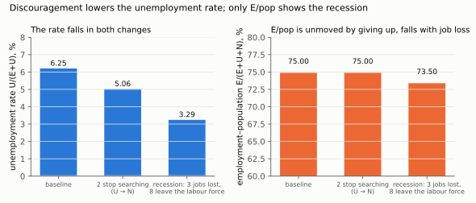
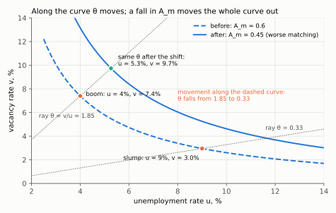

# 1. Measuring the labour market: three stocks, four flows

**Kurlat §7.1, printed pages 127–131.** Up: [[00-index]] · Next: [[02-static-model]] ·
Rules: [[05_trabalho_lazer]]

Measurement first, because the headline statistic is the one most easily misread, and because
the flow view introduced here is what the search model of [[05-search-and-equilibrium]] formalises.

---

## 1.1 The three stocks

Every person of working age is in exactly one of three states:

| State | Definition |
|---|---|
| **Employed**, $E$ | did any paid work in the reference week |
| **Unemployed**, $U$ | not working, **available**, and **actively searched** in the last four weeks |
| **Out of the labour force**, $N$ | everyone else — students, retirees, carers, discouraged workers |

The labour force is $L=E+U$, and the working-age population is $E+U+N$.

$$\text{unemployment rate}=\frac{U}{E+U},\qquad
\text{participation rate}=\frac{E+U}{E+U+N},\qquad
\text{employment–population ratio}=\frac{E}{E+U+N}$$

**The definition of $U$ is doing the work.** A person must be *searching* to be counted as
unemployed. Someone who wants a job, is available, and has given up looking is a **discouraged
worker** and is counted in $N$, not $U$.

*Brazil:* PNAD Contínua (IBGE) is the source, and it publishes the *desalento* series
separately for exactly this reason.

## 1.2 Why the unemployment rate can fall in a recession

This is the examinable consequence of §1.1 and it appears in the quiz for this session.

Discouragement moves a person from $U$ to $N$. That removes one from the numerator **and** one
from the denominator of $U/(E+U)$. Since $U/(E+U)<1$, removing one from each falls more heavily
on the numerator in proportional terms, so **the unemployment rate falls**.

Formally, differentiating $u=U/(E+U)$ with respect to a transfer $dU=-dN$:

$$du = \frac{(E+U)\,dU - U\,dU}{(E+U)^2} = \frac{E}{(E+U)^2}\,dU < 0 \quad\text{for } dU<0$$

Step by step. $E$ is held fixed, so the numerator $U$ changes by $dU$ and the denominator $E+U$
also changes by $dU$. The quotient rule, $d(a/b)=(b\,da-a\,db)/b^2$, with $a=U$, $b=E+U$ and
$da=db=dU$, gives the first fraction:

$$du=\frac{(E+U)\,dU-U\,dU}{(E+U)^2}
\qquad\text{(quotient rule)}$$

Factor $dU$ out of the numerator and cancel $U-U$:

$$du=\frac{(E+U-U)\,dU}{(E+U)^2}=\frac{E}{(E+U)^2}\,dU
\qquad\text{(factor, cancel)}$$

The coefficient $E/(E+U)^2$ is positive, so $du$ takes the sign of $dU$: negative when a searcher
leaves. For the employment–population ratio, the numerator $E$ does not move and the denominator
changes by $dU+dN=dU-dU=0$, so $d\big[E/(E+U+N)\big]=0$ exactly.

Meanwhile the employment–population ratio $E/(E+U+N)$ is **unchanged** by discouragement — the
person moved between two categories that are both outside its numerator, and the denominator is
unaffected. And if employment is also falling, that ratio falls.

$$\boxed{\;\text{unemployment rate}\downarrow \text{ and employment–population ratio}\downarrow
\;\Longrightarrow\; \text{discouragement, not recovery}\;}$$

*Start from $E=150$, $U=10$, $N=40$. Two searchers giving up cut the rate from 6.25% to 5.06% and
leave E/pop at 75%. A recession that also pushes 8 people out of the labour force cuts the rate
to 3.29%. Only the fall in E/pop, to 73.5%, shows that fewer people are working.*

**The practical rule:** never read the unemployment rate alone. The employment–population ratio
has no escape hatch — nobody can leave it by giving up — so the two together are diagnostic in
a way that either alone is not. Verified numerically in `check_labour.py`.

## 1.3 The flows

The stocks are large and the flows between them are larger. In US data, monthly gross flows are
several per cent of each stock, so the labour market completely reshuffles on a timescale far
shorter than the movement in the stocks suggests.

The six flows: $E\to U$ (layoffs and quits into search), $U\to E$ (hires), $E\to N$ (retirement,
withdrawal), $N\to E$ (direct entry without search), $U\to N$ (discouragement), $N\to U$ (entry
into search).

**Why this matters.** Two economies with the same unemployment rate can be completely different
places. Compress the flows into a two-state version with separation rate $\lambda$ and finding
rate $f$; [[05-search-and-equilibrium]] shows steady-state unemployment is

$$u^* = \frac{\lambda}{\lambda+f}$$

which depends only on the **ratio**. Triple both and the rate is unchanged, while the average
duration of an unemployment spell, $1/f$, falls to a third. Europe and the US have historically
differed exactly this way: comparable rates at some dates, with European spells far longer and
flows far smaller. A high unemployment rate made of short spells is a different social problem
from one made of long spells, and the rate cannot tell them apart.

## 1.4 Vacancies and the Beveridge curve

Firms post vacancies $V$; the vacancy rate is $v=V/(V+E)$. Plotting $v$ against $u$ over time
traces a **downward-sloping** relation — the **Beveridge curve** (Kurlat Figure 7.1.4, p. 130).

**Why it slopes down.** In a boom firms post many vacancies and unemployed workers are hired
quickly, so $v$ is high and $u$ low. In a slump the reverse. Movements *along* the curve are
cyclical.

**Why shifts matter more than movements.** An outward shift — more vacancies *and* more
unemployment at the same time — means the matching process has got worse: the unemployed and
the vacancies exist simultaneously and are not finding each other. That is **mismatch**, by
skill, by geography or by sector. The US curve shifted out noticeably after 2009 and again
after 2020, which is the empirical hook for the matching function of
[[05-search-and-equilibrium]] §5.3.

So the Beveridge curve is a diagnostic: *along* it is a demand story, *shifting* it is a
structural story.

*Each point sits on a ray from the origin whose slope is tightness $\theta=v/u$. Going from boom
to slump along the dashed curve, $\theta$ falls from 1.85 to 0.33. When matching efficiency
$A_m$ falls from 0.6 to 0.45, the whole curve moves out: the same $\theta=1.85$ now comes with
5.3% unemployment and 9.7% vacancies. The curve is derived in
[[05-search-and-equilibrium]] §5.3.*

## 1.5 Which margin carries the cycle

**Intensive margin:** hours per worker, $H/E$.
**Extensive margin:** the number of people working, $E$.

Total hours decompose exactly:

$$H = \underbrace{\frac{H}{E}}_{\text{intensive}}\times\underbrace{E}_{\text{extensive}}
\qquad\Longrightarrow\qquad
g_H = g_{H/E}+g_E$$

The arrow takes two steps. Take logs of the identity, which turns the product into a sum:
$\ln H=\ln(H/E)+\ln E$. Then differentiate both sides with respect to time. The time derivative
of a log is a growth rate, $d\ln X/dt=\dot X/X\equiv g_X$, so the sum of logs becomes the sum of
growth rates. The identity is exact, so the split of $g_H$ between the two margins involves no
approximation.

**The empirical fact, and it decides the modelling.** Most of the cyclical variation in
aggregate hours comes from the **extensive** margin — people moving into and out of employment —
not from changes in the hours of those who keep their jobs. Kurlat states this at p. 127 and it
is why the static consumption–leisure model of [[02-static-model]], which is *entirely* about
the intensive margin, cannot be the whole story.

The consequence for [[03-elasticities-and-evidence]]: micro estimates of the hours elasticity
for prime-age men — the intensive margin — are small, around 0.1–0.3. But the aggregate
elasticity that matters for the cycle includes the participation decision, which is a corner
solution and can be far more responsive. The two numbers are measuring different things, and
much of the apparent conflict between micro and macro estimates is this conflation.

## 1.6 The long-run facts

Three, each of which the static model has something to say about:

1. **Hours per worker have fallen** steadily for a century in every developed economy — from
   around 3,000 hours a year to 1,400–1,800 — while real wages rose several-fold. A rising
   wage with *falling* hours means the income effect has dominated; see
   [[02-static-model]] §2.4.
2. **Female participation rose sharply** through the twentieth century and then flattened.
3. **Prime-age male participation has fallen** steadily since the 1960s in the US, which is a
   participation puzzle the static model does not resolve.

Fact 1 is the one with theoretical teeth: it is the balanced-growth restriction that forces the
preference specification in [[02-static-model]] §2.5.

> **Contrast: Jones (2020), ch. 7.** Jones presents the same measurement apparatus with much
> better cross-country and time-series charts, and gives the Europe–US hours divergence as a
> data fact before any theory. Where Kurlat is stronger is the flow view and the insistence that
> unemployment is a flow phenomenon. Use Jones for the facts, Kurlat for the mechanism. Local
> 2020 file, +25 page offset ([[books-index]]).

## 1.7 What to be able to do, cold

1. Define the three stocks and the three rates, and say precisely what makes someone unemployed
   rather than out of the labour force.
2. Show that discouragement lowers the unemployment rate, and give the joint diagnostic with the
   employment–population ratio.
3. Explain why two economies with the same unemployment rate can differ completely, using
   $u^*=\lambda/(\lambda+f)$ and spell duration $1/f$.
4. Draw the Beveridge curve, explain its slope, and say what an outward shift means.
5. Decompose total hours into the two margins and say which carries the cycle, with the
   consequence for modelling.

Practice: Kurlat ch. 7, Exercises 7.1, 7.3 and 7.4 *Puerto Rico* (pp. 146–147), and 7.7 *The
Beveridge Curve* (p. 150). Worked in [[Resolucao/lista4_resolucao|lista 4]] — the Kurlat ch. 7 solution set has not been written yet; the code lives in `Resolucao/kurlat_ch07_codigo/`.
