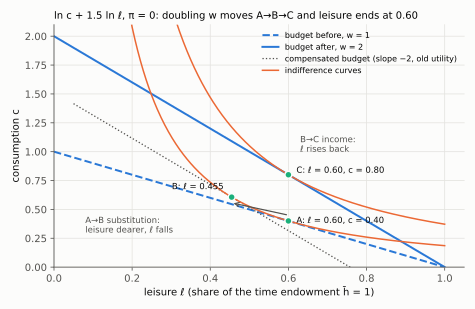
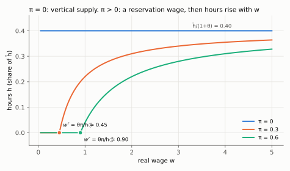
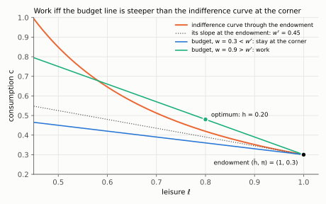

# 2. The static model: full income, MRS = w, and the backward bend

**Kurlat §7.2, printed pages 131–137.** Up: [[00-index]] · Prev: [[01-measurement]] ·
Next: [[03-elasticities-and-evidence]]

> **Companion:** [The Backward Bend](companion-labour-supply.html) — the labour supply curve
> bending back as the wage rises, with the reservation wage marking where participation stops
> and non-wage income shifting both.

One first-order condition, used for the rest of the course. This is also the first model in
which an ambiguous comparative static is *the* result rather than an embarrassment.

---

## 2.1 The problem, and the trick that makes it standard

A household has a time endowment $\bar h$, splits it between leisure $\ell$ and work
$h=\bar h-\ell$, earns real wage $w$ per hour and non-wage income $\pi$:

$$\max_{c,\ell}\; u(c,\ell) \qquad\text{s.t.}\qquad c = w(\bar h-\ell)+\pi$$

Rearrange the constraint by moving the wage bill of leisure to the left. Expand the product,
$w(\bar h-\ell)=w\bar h-w\ell$, so the constraint reads $c=w\bar h-w\ell+\pi$. Then add $w\ell$ to
both sides:

$$\boxed{\;c + w\ell \;=\; \underbrace{w\bar h+\pi}_{\text{full income}}\;}$$

**This is the whole trick and it is worth dwelling on.** Written this way the problem is an
*ordinary* two-good consumer problem: goods $c$ and $\ell$, prices $1$ and $w$, income
$w\bar h+\pi$. Everything from consumer theory applies unchanged.

Two readings that follow immediately:

1. **The wage is the price of leisure.** An hour of leisure costs $w$ units of consumption
   forgone. This is why a wage rise is a *price* change and not only an income change.
2. **Full income** is what the household would have if it sold its entire time endowment. It
   appears on the right-hand side, so a wage rise raises income *as well as* the price of
   leisure — and that double role is the source of every ambiguity in this note.

Note that $w$ appears on **both sides** of the ordinary consumer problem, which is exactly the
endowment-economy structure met in [[03-income-and-substitution]] §3.3. The household is
endowed with $\bar h$ units of the good whose price is changing.

## 2.2 The first-order condition

Lagrangian, with multiplier $\mu$ on full income:

$$\mathcal{L}=u(c,\ell)+\mu\left[w\bar h+\pi-c-w\ell\right]$$

$$\frac{\partial\mathcal L}{\partial c}=0:\ u_c=\mu,
\qquad
\frac{\partial\mathcal L}{\partial \ell}=0:\ u_\ell=\mu w$$

The two derivatives in full: $\partial\mathcal L/\partial c=u_c-\mu$, because $c$ enters the
bracket with coefficient $-1$; and $\partial\mathcal L/\partial\ell=u_\ell-\mu w$, because $\ell$
enters it with coefficient $-w$. Setting each to zero gives the two conditions above.

Divide the second condition by the first. The multiplier cancels, $\mu w/\mu=w$:

$$\boxed{\;\frac{u_\ell(c,\ell)}{u_c(c,\ell)} = w\;}$$

**The marginal rate of substitution between leisure and consumption equals the real wage.**
Geometrically: the indifference curve is tangent to the budget line of slope $-w$ in the
$(\ell,c)$ plane.

Both slopes, derived. The budget line is $c=(w\bar h+\pi)-w\ell$, so $dc/d\ell=-w$. Along an
indifference curve utility does not change: $du=u_c\,dc+u_\ell\,d\ell=0$. Solve for the ratio:
$dc/d\ell=-u_\ell/u_c$. Setting the two slopes equal gives $u_\ell/u_c=w$ again.

This is the condition Benigno writes as $v_l(L)/u_c(C)=W/P$ in his equation (iii)/(7)
([[01-household-and-ad]] §1.2), with $v_l$ the marginal disutility of labour in place of the
marginal utility of leisure. The two formulations are the same statement: whether you write
utility as increasing in leisure or decreasing in labour is a change of variable, since
$\ell=\bar h-h$ gives $u_\ell = -u_h$.

**And note what [[01-household-and-ad]] insists on:** this is a *supply-side* equation. It is
the household's condition, but it is the firm that uses it, to convert its marginal cost into a
function of output. Keep that in view for session 8.

## 2.3 A wage rise: two effects, opposite signs

Raise $w$. The budget line pivots about the endowment point $(\ell,c)=(\bar h,\pi)$ — the
household can always choose not to work and consume $\pi$, whatever the wage.

| Channel | Effect on leisure | Effect on hours | Why |
|---|---|---|---|
| **Substitution** | ↓ | ↑ | leisure is more expensive |
| **Income** | ↑ | ↓ | full income rose, and leisure is a normal good |

**The net effect on hours is ambiguous.** That is not a failure of the model; it is the model's
central prediction, and it is why the empirical elasticity in
[[03-elasticities-and-evidence]] is a number worth arguing about.

**The backward-bending labour supply curve.** At low wages the substitution effect dominates
and hours rise with $w$. At high wages the income effect can dominate and hours fall. The
supply curve bends back. This is not a curiosity: §1.6 records that a century of rising real
wages came with *falling* hours, which is the backward-bending region observed in the aggregate.

**The clean test.** A rise in **non-wage income $\pi$** is a *pure income effect* — it shifts
full income without touching the price of leisure. So the model predicts unambiguously that
$\pi\uparrow$ lowers hours. This is testable and has been tested: lottery winners, inheritances
and negative-income-tax experiments all show hours falling, with estimated income elasticities
around $-0.1$ to $-0.2$. It is the cleanest confirmation the model gets, because it has no
offsetting channel.

## 2.4 The log-log benchmark, and why hours are constant

Take $u(c,\ell)=\ln c+\theta\ln\ell$. Then $u_c=1/c$, $u_\ell=\theta/\ell$, and MRS $=w$ gives

$$\frac{\theta c}{\ell}=w \qquad\Longrightarrow\qquad c=\frac{w\ell}{\theta}$$

(The MRS is $u_\ell/u_c=(\theta/\ell)/(1/c)=\theta c/\ell$. To get the second equation, multiply
both sides of $\theta c/\ell=w$ by $\ell/\theta$.)

Substitute into the full-income constraint:

$$\frac{w\ell}{\theta}+w\ell = w\bar h+\pi
\;\Longrightarrow\;
w\ell\,\frac{1+\theta}{\theta}=w\bar h+\pi$$

(Factor $w\ell$ out of the left-hand side: $w\ell\left(\frac1\theta+1\right)=w\ell\,\frac{1+\theta}{\theta}$.)
To isolate $\ell$, multiply both sides by $\dfrac{\theta}{(1+\theta)\,w}$:

$$\ell=\frac{\theta}{1+\theta}\cdot\frac{w\bar h+\pi}{w}
=\frac{\theta}{1+\theta}\,\bar h+\frac{\theta}{1+\theta}\,\frac{\pi}{w}$$

Hours are $h=\bar h-\ell$. Use $\bar h-\frac{\theta}{1+\theta}\bar h=\frac{1}{1+\theta}\bar h$:

$$\boxed{\;\ell = \frac{\theta}{1+\theta}\cdot\frac{w\bar h+\pi}{w},
\qquad h = \bar h-\ell = \frac{\bar h}{1+\theta}-\frac{\theta}{1+\theta}\frac{\pi}{w}\;}$$

**Set $\pi=0$** and the wage cancels completely:

$$\ell = \frac{\theta}{1+\theta}\bar h, \qquad h = \frac{\bar h}{1+\theta}$$

**Hours do not depend on the wage at all.** Income and substitution effects cancel exactly. The
household works a constant fraction of its time endowment, set entirely by the taste parameter
$\theta$.

*The wage doubles from 1 to 2 with $\theta=1.5$ and $\pi=0$. The budget line pivots about the
endowment $(\bar h,\pi)=(1,0)$. Substitution alone (A→B, the dotted line gives the old utility
at the new price) cuts leisure from 0.60 to 0.455. The income effect (B→C) brings it back to
exactly 0.60, so hours stay at 0.40.*

With $\pi>0$ the cancellation breaks and hours *rise* with $w$ — because the non-wage income
term $\pi/w$ shrinks as $w$ grows, so the pure income effect of $\pi$ weakens. Note the
direction carefully: adding non-wage income makes labour supply upward-sloping in this
specification, not backward-bending. Verified in `check_labour.py`.

The sign, derived. In $h=\frac{\bar h}{1+\theta}-\frac{\theta}{1+\theta}\,\pi w^{-1}$ only the
last term depends on $w$. Differentiate, using $d(w^{-1})/dw=-w^{-2}$:

$$\frac{\partial h}{\partial w}=-\frac{\theta\pi}{1+\theta}\cdot\left(-\frac{1}{w^{2}}\right)
=\frac{\theta\,\pi}{(1+\theta)\,w^{2}}\;>0\quad\text{for }\pi>0,\qquad =0\text{ for }\pi=0.$$

*With $\theta=1.5$: at $\pi=0$ supply is vertical at $\bar h/(1+\theta)=0.40$. With $\pi>0$ nobody
works below the reservation wage $\theta\pi/\bar h$ (0.45 and 0.90, see §2.6). Above it hours
rise with $w$ and approach 0.40 from below as $\pi/w\to0$.*

## 2.5 Why log-log is not a convenience assumption

This is the part usually skipped, and it is the reason this preference class appears everywhere
in macro.

**The balanced-growth restriction.** Sessions 2 and 3 established that on a balanced growth
path, real wages grow at $g$ forever ([[03-technological-progress]] §3.3). Kaldor's facts, and
the data of §1.6, say hours per worker are *roughly stable* over the same century — falling
slowly, certainly not falling to zero or rising without bound.

So the preference specification must have the property that **a permanent, proportional rise in
the wage leaves hours unchanged**. That is exactly the income–substitution cancellation of §2.4,
and it is a restriction, not a taste.

**The general statement (King–Plosser–Rebelo, 1988).** Preferences consistent with balanced
growth and constant hours must take the form

$$u(c,\ell) = \frac{c^{1-\sigma}}{1-\sigma}\,v(\ell)
\quad\text{for }\sigma\ne1,
\qquad\text{or}\qquad
u(c,\ell)=\ln c + v(\ell)\quad\text{for }\sigma=1$$

The log case is the one where the leisure term is *additively* separable, which is why
$\ln c+\theta\ln\ell$ works. For $\sigma\ne1$ the consumption and leisure terms must be
**multiplicatively** joined — additive CRRA in both arguments is *not* balanced-growth
consistent, and is a common modelling error.

**Check the claim.** Take $u=\frac{c^{1-\sigma}}{1-\sigma}+\frac{\ell^{1-\gamma}}{1-\gamma}$,
additively separable CRRA in both. MRS $=\ell^{-\gamma}c^{\sigma}=w$. Scale $w$ by $\mu$ and
$c$ by $\mu$ (as balanced growth requires) and the condition becomes
$\ell^{-\gamma}\mu^{\sigma}c^{\sigma}=\mu w$, which needs $\mu^{\sigma}=\mu$, i.e. $\sigma=1$.
So additive separability forces log consumption. Confirmed numerically in `check_labour.py`.

The same check one line at a time:

1. Marginal utilities: $u_c=c^{-\sigma}$ and $u_\ell=\ell^{-\gamma}$ (differentiate each power term).
2. MRS: $u_\ell/u_c=\ell^{-\gamma}/c^{-\sigma}=\ell^{-\gamma}c^{\sigma}$, so the condition is
   $\ell^{-\gamma}c^{\sigma}=w$.
3. On a balanced growth path $c$ and $w$ both grow by the factor $\mu$ and $\ell$ must stay
   put. Replace $c\to\mu c$ and $w\to\mu w$ with the same $\ell$:
   $\ell^{-\gamma}(\mu c)^{\sigma}=\mu^{\sigma}\,\ell^{-\gamma}c^{\sigma}$ on the left, $\mu w$ on the right.
4. Divide both sides by $\ell^{-\gamma}c^{\sigma}=w$ (the condition before the scaling):
   $\mu^{\sigma}=\mu$.
5. This must hold for every growth factor $\mu>0$, which happens only if $\sigma=1$.

With $\sigma=1$ the form is $\ln c+v(\ell)$: the MRS is $v'(\ell)\,c$, and scaling $c$ and $w$
by $\mu$ multiplies both sides of $v'(\ell)c=w$ by $\mu$, so the same $\ell$ still solves it.

**Where this bites later.** Benigno (2015) uses $u(C)-v(L)$ with $u$ CRRA and
$v(L)=L^{1+\eta}/(1+\eta)$ — additively separable with $\sigma\ne1$ in general. He can do this
because his model has **two periods and no growth**, so the balanced-growth restriction never
binds. In a growth model the same specification would be inconsistent. Worth knowing, because it
explains why the functional forms differ between sessions 3 and 8 and it is not an oversight.

## 2.6 The reservation wage and the extensive margin

The static problem above has an interior solution only if the household wants to work at all.
The corner is $h=0$, $\ell=\bar h$, $c=\pi$.

**The household works iff the wage exceeds the value of the marginal hour of leisure at the
corner:**

$$\boxed{\;w^{r} = \frac{u_\ell(\pi,\bar h)}{u_c(\pi,\bar h)}\;}$$

Work if $w>w^r$; stay out if $w<w^r$. The condition is a comparison of the slope of the
indifference curve **at the endowment** with the slope of the budget line.

Where it comes from. Put the budget into utility and write it as a function of hours:
$U(h)=u\big(wh+\pi,\;\bar h-h\big)$. Differentiate with the chain rule. Consumption rises at
rate $w$ and leisure falls at rate 1:

$$U'(h)=u_c\cdot w+u_\ell\cdot(-1)=u_c\,w-u_\ell .$$

At the corner $h=0$ the arguments are $(c,\ell)=(\pi,\bar h)$. The first hour raises utility iff
$U'(0)>0$, that is iff $u_c(\pi,\bar h)\,w>u_\ell(\pi,\bar h)$. Divide by $u_c>0$ to get $w>w^r$.
When $U$ is concave in $h$, $U'(0)\le0$ means no positive $h$ does better, so the corner is optimal.

For $\ln c+\theta\ln\ell$: $u_\ell(\pi,\bar h)=\theta/\bar h$ and $u_c(\pi,\bar h)=1/\pi$, so
$w^r=(\theta/\bar h)/(1/\pi)=\theta\pi/\bar h$. With $\pi=0$, $w^r=0$ and everybody works.

*With $\theta=1.5$ and $\pi=0.3$ the indifference curve through the endowment $(1,0.3)$ has slope
$w^r=0.45$ there. The flatter budget ($w=0.3$) runs below that curve, so every point with work
is worse and the household stays at the corner. The steeper one ($w=0.9$) cuts above it and
reaches a tangency at $h=0.20$.*

Three comparative statics, each with an empirical counterpart:

- $\pi\uparrow$ raises $w^r$. Higher non-wage income — a partner's earnings, a benefit, an
  inheritance — raises the wage needed to justify working. This is the participation counterpart
  of the pure income effect of §2.3.
- $\theta\uparrow$ (stronger taste for leisure, or a higher value of home production — childcare,
  study) raises $w^r$.
- A **payroll or income tax** lowers the *after-tax* wage relative to $w^r$ and pushes people out
  at the margin. This is the participation channel of the Prescott argument in
  [[03-elasticities-and-evidence]] §3.4.

**Why this matters more than it looks.** §1.5 said the extensive margin carries most of the
cyclical variation in hours. The reservation-wage condition is the model of that margin, and it
is a *discrete* choice — so a small change in $w$ or $\pi$ near the threshold produces a large
change in employment, while producing nothing at all for households far from it. That
discreteness is how a small individual elasticity can coexist with a large aggregate one, and it
is the resolution of the micro–macro conflict in the next note.

## 2.7 The diagram

In the $(\ell,c)$ plane, with $\ell$ from $0$ to $\bar h$:

| Object | Expression | Feature |
|---|---|---|
| Budget line | $c=\pi+w(\bar h-\ell)$ | slope $-w$; passes through $(\bar h,\pi)$ always |
| Endowment | $(\bar h,\pi)$ | not working; the pivot when $w$ changes |
| Indifference curve | $u(c,\ell)=\bar u$ | slope $-u_\ell/u_c$ |
| Optimum | tangency | MRS $=w$ |
| Hours | $\bar h-\ell^*$ | horizontal distance from the endowment |
| Reservation wage | slope of the indifference curve **at the endowment** | steeper than the budget line ⇒ do not work |

## 2.8 What to be able to do, cold

1. Derive the full-income constraint and explain both of its readings.
2. Derive MRS $=w$ by Lagrangian and relate it to Benigno's equation (7).
3. Name the two effects of a wage rise, give their signs on hours, and explain the backward bend.
4. Identify the clean test ($\pi\uparrow$) and state its empirical verdict.
5. Solve the log-log case, show hours are wage-independent at $\pi=0$, and say what $\pi>0$ does.
6. State the balanced-growth restriction on preferences and show additive CRRA fails it unless
   $\sigma=1$.
7. Define the reservation wage, sign its comparative statics, and explain why a discrete margin
   reconciles small micro and large macro elasticities.

Practice: Kurlat ch. 7, Exercises 7.2 and 7.5 *Prescott's Calculation* (pp. 147–148). Worked in
[[Resolucao/lista4_resolucao|lista 4]] — the Kurlat ch. 7 solution set has not been written yet; the code lives in `Resolucao/kurlat_ch07_codigo/`; the formula sheet for this session is
[[formulario-aula-05]].
