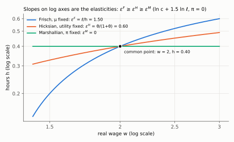
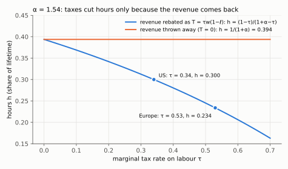
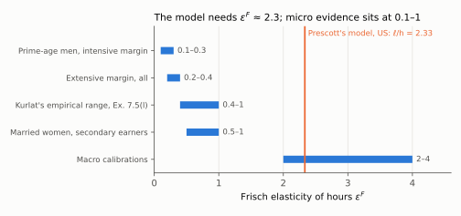

# 3. Three elasticities, and the number macroeconomics cannot agree on

**Kurlat §7.3, printed pages 137–140.** Up: [[00-index]] · Prev: [[02-static-model]] ·
Next: [[04-dynamic-labour-supply]]

> **Companion:** [The Backward Bend](companion-labour-supply.html) — the three elasticities read
> off the same supply curve at the same point, so the ordering between them is visible.

"The labour supply elasticity" is three different numbers and most disagreements in this
literature are about which one is being quoted. This note defines all three, orders them, and
then works Prescott's Europe–US calculation, which is the highest-stakes application of the
distinction in the course.

---

## 3.1 The three elasticities

All three measure $d\ln h/d\ln w$; they differ in **what is held fixed**.

**Marshallian (uncompensated).** Hold non-wage income $\pi$ fixed and let the household's
welfare change:

$$\varepsilon^{M}=\left.\frac{\partial \ln h}{\partial \ln w}\right|_{\pi}$$

This contains both the substitution and the income effect, so it is the ambiguous one of
[[02-static-model]] §2.3 and can be **negative** (the backward bend).

**Hicksian (compensated).** Hold **utility** fixed by adjusting $\pi$:

$$\varepsilon^{H}=\left.\frac{\partial \ln h}{\partial \ln w}\right|_{\bar u}$$

Pure substitution effect, so $\varepsilon^{H}>0$ always — the compensated labour supply curve
slopes up, no exceptions.

**Frisch.** Hold the **marginal utility of wealth** $\mu$ fixed:

$$\varepsilon^{F}=\left.\frac{\partial \ln h}{\partial \ln w}\right|_{\mu}$$

This is the relevant one in a dynamic model where a household with a given lifetime wealth
reallocates hours across periods in response to a *temporary* wage change. It is the elasticity
of [[04-dynamic-labour-supply]], and the one that appears as $1/\eta$ in Benigno.

### The ordering, and why

$$\boxed{\;\varepsilon^{F} \;\ge\; \varepsilon^{H} \;\ge\; \varepsilon^{M}\;}$$

The first inequality: holding $\mu$ fixed is a *weaker* constraint than holding utility fixed,
because the household is additionally allowed to move resources across periods. More margins of
adjustment means a larger response.

The second is the **Slutsky decomposition** applied to labour supply:

$$\underbrace{\varepsilon^{M}}_{\text{uncompensated}}
= \underbrace{\varepsilon^{H}}_{\text{substitution}}
+ \underbrace{w\,\frac{\partial h}{\partial \pi}}_{\text{income}}
= \varepsilon^{H}+\frac{wh}{\pi}\,\varepsilon_{\pi}$$

where $\varepsilon_{\pi}=\partial\ln h/\partial\ln \pi<0$ is the (negative) income elasticity —
leisure is a normal good — weighted by the ratio of earnings $wh$ to non-wage income $\pi$. The
first form, $w\,\partial h/\partial\pi$, is the one to use at $\pi=0$, where the ratio is not
defined. So $\varepsilon^{M}\le\varepsilon^{H}$, with equality only if the income effect is zero.

**Derivation, step by step.**

1. Let $m(w,\bar u)$ be the smallest non-wage income that reaches utility $\bar u$ at wage $w$:
   $m(w,\bar u)=\min_{c,\ell}\{c+w\ell-w\bar h\;:\;u(c,\ell)\ge\bar u\}$.
2. Envelope theorem: differentiate the objective with respect to $w$ at the optimum, ignoring
   the induced change in $(c,\ell)$: $\partial m/\partial w=\ell-\bar h=-h$.
3. Compensated hours are ordinary hours at the compensating income:
   $h^{H}(w,\bar u)=h^{M}\big(w,\,m(w,\bar u)\big)$.
4. Differentiate this identity with respect to $w$, applying the chain rule to the second argument:
   $$\frac{\partial h^{H}}{\partial w}=\frac{\partial h^{M}}{\partial w}+\frac{\partial h^{M}}{\partial \pi}\cdot\frac{\partial m}{\partial w}
   =\frac{\partial h^{M}}{\partial w}-h\,\frac{\partial h^{M}}{\partial \pi}\qquad\text{(step 2)}$$
5. Move the income term to the other side:
   $\dfrac{\partial h^{M}}{\partial w}=\dfrac{\partial h^{H}}{\partial w}+h\,\dfrac{\partial h^{M}}{\partial \pi}$.
6. Multiply every term by $w/h$ to turn derivatives into elasticities:
   $\varepsilon^{M}=\varepsilon^{H}+w\,\partial h/\partial\pi$.
7. For $\pi>0$, write $w\,\partial h/\partial\pi=\dfrac{wh}{\pi}\cdot\dfrac{\pi}{h}\dfrac{\partial h}{\partial\pi}=\dfrac{wh}{\pi}\,\varepsilon_{\pi}$.

**The log-log case pins the arithmetic.** From [[02-static-model]] §2.4 with $\pi=0$, hours are
constant, so $\varepsilon^{M}=0$ exactly. And the Hicksian elasticity is then exactly the
income-effect term with the sign flipped. That is the cleanest illustration that
$\varepsilon^{M}=0$ does **not** mean "labour supply does not respond" — it means two responses
cancelled. Checked in `check_labour.py`.

The three numbers for $\ln c+\theta\ln\ell$ at $\pi=0$, one at a time:

- *Income term.* From $h=\frac{\bar h}{1+\theta}-\frac{\theta}{1+\theta}\frac{\pi}{w}$,
  differentiate in $\pi$: $\partial h/\partial\pi=-\frac{\theta}{(1+\theta)w}$. Multiply by $w$:
  $w\,\partial h/\partial\pi=-\frac{\theta}{1+\theta}$.
- *Hicksian.* Slutsky with $\varepsilon^M=0$: $0=\varepsilon^H-\frac{\theta}{1+\theta}$, so
  $\varepsilon^H=\frac{\theta}{1+\theta}$.
- *Frisch.* Hold $\mu$ fixed in the leisure condition $\theta/\ell=\mu w$, so $\ell=\theta/(\mu w)$
  and $d\ell/dw=-\ell/w$. Hours are $h=\bar h-\ell$, so $dh/dw=\ell/w$. Multiply by $w/h$:
  $\varepsilon^F=\ell/h$. At $\pi=0$, $\ell/h=\theta$.

So the ordering reads $\theta\;\ge\;\frac{\theta}{1+\theta}\;\ge\;0$. With $\theta=1.5$ that is
$1.5\ge0.6\ge0$.

*The three curves pass through the same allocation, $w=2$ and $h=0.40$. On log axes each slope
at that point is an elasticity: 1.50 with $\mu$ fixed, 0.60 with utility fixed, and 0 with $\pi$
fixed. The more that is left free to adjust, the steeper the curve.*

## 3.2 The Frisch elasticity and $\eta$

Take the balanced-growth-consistent specification with $v(h)=\chi\,h^{1+\eta}/(1+\eta)$, so the
marginal disutility of work is $v'(h)=\chi h^{\eta}$. The intratemporal condition with the
marginal utility of wealth $\mu$ held fixed is

$$\chi h^{\eta}=\mu w \qquad\Longrightarrow\qquad \ln h = \frac{1}{\eta}\left[\ln\mu+\ln w-\ln\chi\right]$$

(Take logs of both sides, $\ln\chi+\eta\ln h=\ln\mu+\ln w$. Subtract $\ln\chi$ and divide by
$\eta$. With $\mu$ held fixed, $\ln\mu$ and $\ln\chi$ are constants, so differentiating in
$\ln w$ leaves only the coefficient $1/\eta$.)

$$\boxed{\;\varepsilon^{F}=\frac{d\ln h}{d\ln w}\bigg|_{\mu}=\frac{1}{\eta}\;}$$

**$\eta$ is the inverse Frisch elasticity.** This is exactly the $\eta$ of
[[02-firms-and-as]] §2.3 and of Benigno's $v(L)=L^{1+\eta}/(1+\eta)$. So the parameter that
determines how steep the aggregate supply curve is in session 8 is *this* elasticity, and the
dispute below is therefore a dispute about the slope of the Phillips curve.

## 3.3 What the evidence says

The estimates split cleanly by margin and by group, which is the substance of Kurlat §7.3.

| Group / margin | Frisch elasticity | Source type |
|---|---|---|
| Prime-age men, **intensive** margin | 0.1 – 0.3 | micro panel, hours regressions |
| Married women, secondary earners | 0.5 – 1.0+ | micro, includes participation |
| **Extensive** margin, all | 0.2 – 0.4 | participation responses |
| Aggregate, implied by macro models | 2 – 4 | calibration to match cycles |

**The conflict is real and unresolved.** Micro studies of prime-age men find a very small
elasticity — those men work full-time whatever the wage. Macro models need a large one to
generate observed employment fluctuations from plausible productivity shocks.

**Three reconciliations, all partly right:**

1. **Aggregation over the extensive margin.** §1.5 and [[02-static-model]] §2.6: participation
   is a discrete choice, so the aggregate elasticity is the density of households near their
   reservation wage, not the average individual elasticity. Everyone can have a small individual
   elasticity while the aggregate is large. This is the Rogerson (1988) indivisible-labour
   argument, and it is the main modern answer.
2. **Whose elasticity.** Prime-age men are the least responsive group and the most studied.
   Weighting by the groups that actually move at the margin — secondary earners, the young, the
   near-retired — raises the aggregate number.
3. **Which elasticity.** Micro hours regressions typically identify something closer to the
   Marshallian or Hicksian elasticity; macro models need the Frisch. By §3.1 the Frisch is the
   largest of the three, so part of the gap is definitional rather than substantive.

Kurlat's own note (p. 139) is that estimates from micro studies are "quite a bit lower" than the
value Prescott's calculation requires, "though there is some debate as to how to translate" one
into the other. That translation problem is §3.1.

## 3.4 Prescott's calculation

Prescott (2004), which Kurlat presents at pp. 137–139 and sets as Exercise 7.5 (p. 148).

**The fact.** In the early 1970s, hours worked per person of working age were similar in the US
and in continental Europe. By the 1990s Americans worked roughly **50% more hours** than the
French or the Germans.

**The hypothesis.** The difference is not culture or preferences. It is the **effective marginal
tax rate on labour income** — income tax plus payroll tax plus consumption tax, which all drive
the same wedge between the wage a firm pays and the consumption a worker gets. European
effective rates are far higher.

**The mechanism.** In the static model of [[02-static-model]], a tax $\tau$ makes the relevant
price of leisure $(1-\tau)w$. If the revenue were thrown away, a log-log specification with no
other income would leave hours unaffected: the tax is just a lower wage, and §2.4 showed the
wage cancels. Prescott's government **returns the revenue as a lump-sum transfer** $T$. A
transfer is non-wage income, so it plays the role of $\pi>0$: it hands back the income the tax
took, which removes the income effect of the tax and leaves only the substitution effect. That
is why taxes cut hours in his model even with log-log preferences — and, as step 5 below shows,
the calibration that matches the data implies a **Frisch elasticity above 2**.

**The arithmetic, in the form to reproduce (Kurlat Ex. 7.5).** Preferences
$u=\ln c+\alpha\ln\ell$, time endowment 1, budget $c=w(1-\tau)(1-\ell)+T$.

1. *First-order conditions.* With multiplier $\lambda$ on the budget: $1/c=\lambda$ and
   $\alpha/\ell=\lambda w(1-\tau)$. Divide the second by the first ($\lambda$ cancels):
   $$\frac{\alpha c}{\ell}=w(1-\tau)\qquad\Longleftrightarrow\qquad \alpha c=w(1-\tau)\,\ell$$
2. *Substitute the budget for $c$ and expand the product:*
   $$\alpha w(1-\tau)-\alpha w(1-\tau)\,\ell+\alpha T=w(1-\tau)\,\ell$$
3. *Collect the $\ell$ terms on the right,* $\alpha\,[w(1-\tau)+T]=(1+\alpha)\,w(1-\tau)\,\ell$,
   *and divide by $(1+\alpha)w(1-\tau)$:*
   $$\ell=\frac{\alpha}{1+\alpha}\left[1+\frac{T}{w(1-\tau)}\right]$$
   With $T=0$ the tax drops out, $\ell=\alpha/(1+\alpha)$: the thrown-away case above.
4. *Impose a balanced budget,* $T=\tau w(1-\ell)$. Put it into the first equation of step 3 and
   divide by $w$: $\alpha(1-\tau)+\alpha\tau(1-\ell)=(1+\alpha)(1-\tau)\,\ell$. Expand
   $\alpha\tau(1-\ell)=\alpha\tau-\alpha\tau\ell$ and move $-\alpha\tau\ell$ to the right:
   $\alpha(1-\tau)+\alpha\tau=\ell\,[(1+\alpha)(1-\tau)+\alpha\tau]$. The left side is $\alpha$.
   The bracket is $1+\alpha-\tau-\alpha\tau+\alpha\tau=1+\alpha-\tau$. So
   $$\boxed{\;\ell=\frac{\alpha}{1+\alpha-\tau},\qquad h=1-\ell=\frac{1-\tau}{1+\alpha-\tau}\;}$$

**Put the numbers in.** Kurlat's calibration is $\alpha=1.54$, $w=1$, $\tau_{\text{US}}=0.34$,
$\tau_{\text{EU}}=0.53$:

$$h_{\text{US}}=\frac{0.66}{2.20}=0.300,\qquad h_{\text{EU}}=\frac{0.47}{2.01}=0.234,\qquad
\frac{h_{\text{EU}}}{h_{\text{US}}}=0.78$$

Taxes alone put European hours 22% below American hours. (With Kurlat's rounded transfers,
$T=0.102$ and $0.124$, step 3 gives $\ell=0.700$ and $0.766$, the same up to rounding.)

*With $\alpha=1.54$: if revenue is thrown away, hours sit at $1/(1+\alpha)=0.394$ at every tax
rate. If it is rebated, hours fall along $(1-\tau)/(1+\alpha-\tau)$, from 0.300 at the US rate
to 0.234 at the European one.*

5. *The elasticity this requires.* Hold $c$ fixed in step 1: $\ell=\alpha c/[w(1-\tau)]$. Write
   $\omega\equiv w(1-\tau)$, so $h=1-\alpha c\,\omega^{-1}$ and $\partial h/\partial\omega=\alpha c\,\omega^{-2}$.
   Multiply by $\omega/h$: $\varepsilon^{F}=\alpha c/(\omega h)$. Step 1 says $\alpha c=\omega\ell$, so
   $\varepsilon^{F}=\ell/h$. For the US, $0.700/0.300$:

$$\boxed{\;\varepsilon^{F}=\frac{\ell}{h}\simeq 2.3\;}$$

An elasticity of about **2.3** — well above the 0.1–0.3 that micro studies of prime-age men
report, and above the 0.4–1 range Kurlat quotes in Ex. 7.5(l). Computed in `check_labour.py`.

*The ranges are the estimates in the §3.3 table plus Kurlat's 0.4–1. The vertical line is the
$\ell/h=2.33$ the calibrated model implies for the US. It lies inside only the range that macro
calibrations assume.*

**The same exercise with $v(h)=\chi h^{1+\eta}/(1+\eta)$.** With $u=\ln c-\chi h^{1+\eta}/(1+\eta)$
the first-order condition is $\chi h^{\eta}=(1-\tau)w/c$. Multiply both sides by $h$:
$\chi h^{1+\eta}=(1-\tau)\,wh/c$. With all revenue rebated, $c=(1-\tau)wh+\tau wh=wh$, so
$wh/c=1$ and $\chi h^{1+\eta}=1-\tau$. Divide the European equation by the American one ($\chi$
cancels) and raise both sides to the power $1/(1+\eta)$:

$$\frac{h_{\text{EU}}}{h_{\text{US}}}=\left(\frac{1-\tau_{\text{EU}}}{1-\tau_{\text{US}}}\right)^{1/(1+\eta)}$$

The exponent is $1/(1+\eta)=\varepsilon^{F}/(1+\varepsilon^{F})<1$, not $1/\eta$. The multiplication
by $h$ adds one to the power. So hours can never fall proportionally more than the net-of-tax
rate. With effective rates of 0.40 and 0.60, the net-of-tax ratio is $0.40/0.60=0.667$, and a 50%
hours gap ($h_{\text{EU}}/h_{\text{US}}=0.667$) would need $\varepsilon^{F}\to\infty$. Whatever the
specification, matching the hours gap with taxes needs a large elasticity. Checked in
`check_labour.py`.

**Why this matters and why it is contested.** Kurlat records (p. 139) that there is no consensus
on whether Prescott is right. The argument has enormous stakes: if true, a large part of the
Europe–US income-per-person gap of [[04-cross-country-and-ppp]] §4.4 is a *chosen* response to
taxation rather than a productivity failure, and European hours are not a welfare loss but a
purchase of leisure. If the elasticity is really 0.2, taxes explain a fifth of the gap and
something else explains the rest — unionisation, statutory hours, vacation mandates, or
preferences after all.

**The honest position for an exam:** the calculation is a clean identification of what the data
require of the elasticity. Whether that requirement is met is the empirical question, and it is
the same question as §3.3.

## 3.5 The welfare reading, which is the point

Suppose Prescott is right. Then Europeans work less because leisure is *cheap* for them in
after-tax terms, and they are choosing it. Measured GDP per person is lower; utility need not
be. This is precisely the correction that the leisure term in the Jones–Klenow welfare measure
of [[05-beyond-gdp]] §5.4 applies — and it is why that term is one of the largest in the European
decomposition.

So the three sessions connect: [[04-cross-country-and-ppp]] observed the hours gap,
[[05-beyond-gdp]] priced it in welfare terms, and this note supplies the mechanism that
generates it. Being able to run that chain is a good answer to almost any question about
Europe–US comparisons.

## 3.6 What to be able to do, cold

1. Define all three elasticities by what is held fixed, and state the ordering with the reason.
2. Write the Slutsky decomposition for labour supply and identify the income-effect weight.
3. Derive $\varepsilon^{F}=1/\eta$ from $v(h)=\chi h^{1+\eta}/(1+\eta)$.
4. Quote the evidence by margin and group, and give the three reconciliations of the micro–macro
   gap.
5. Reproduce Prescott's calculation and back out the implied elasticity.
6. State the welfare implication and connect it to the Jones–Klenow leisure term.

Practice: Kurlat ch. 7, Exercise 7.5 *Prescott's Calculation* (p. 148) — parts (b) and (c) ask
for exactly the implied elasticity computed above; and Exercise 7.6 (p. 149). Worked in
[[Resolucao/lista4_resolucao|lista 4]] — the Kurlat ch. 7 solution set has not been written yet; the code lives in `Resolucao/kurlat_ch07_codigo/`.
