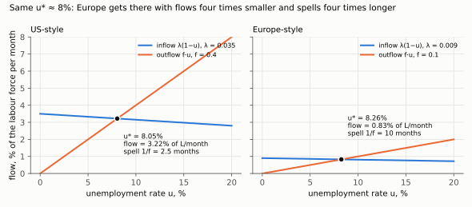
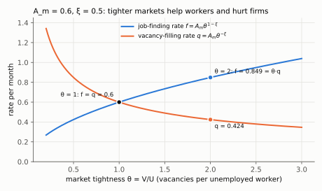
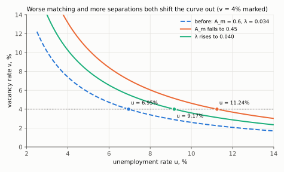
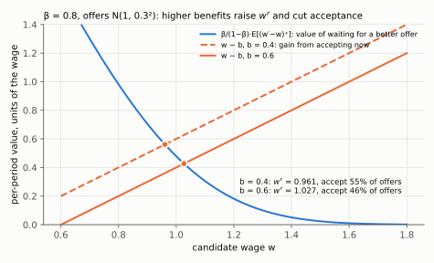

# 5. Search: unemployment as a flow equilibrium

**Kurlat §7.5, printed pages 142–150.** Up: [[00-index]] ·
Prev: [[04-dynamic-labour-supply]]

> **Companion:** [Unemployment Is a Flow](companion-flows.html) — the unemployment stock
> settling where the two flows balance, with the Beveridge curve traced as matching efficiency
> and separations move.

The models so far have no unemployment in them: everyone works their chosen hours at the going
wage. This note builds the minimum apparatus that produces unemployment as an equilibrium
object rather than as a failure.

---

## 5.1 The flow accounting

Two states, employed $E$ and unemployed $U$, with a fixed labour force $L=E+U$ normalised to one
so that $u=U/L$ is the unemployment rate.

- **Separation rate $\lambda$:** the fraction of the employed who lose their job each period.
  Flow out of employment: $\lambda E = \lambda(1-u)$.
- **Job-finding rate $f$:** the fraction of the unemployed who find a job each period. Flow out
  of unemployment: $f U = f u$.

The law of motion:

$$u_{t+1}-u_t = \underbrace{\lambda(1-u_t)}_{\text{inflow}}-\underbrace{f u_t}_{\text{outflow}}$$

**Steady state.** Set the change to zero:

$$\lambda(1-u^*) = f u^*
\;\Longrightarrow\;
\lambda-\lambda u^* = f u^*
\;\Longrightarrow\;
\lambda = u^*(\lambda+f)
\;\Longrightarrow\;
\boxed{\;u^* = \frac{\lambda}{\lambda+f}\;}$$

(Expand the left side; add $\lambda u^*$ to both sides and factor $u^*$ out of the right side;
divide by $\lambda+f$.)

**Stability.** The map is $u_{t+1}=u_t+\lambda-(\lambda+f)u_t = \lambda+\left[1-(\lambda+f)\right]u_t$,
a linear difference equation with slope $1-(\lambda+f)$. Since $\lambda+f\in(0,2)$ for sensible
rates, $|1-(\lambda+f)|<1$ and the steady state is globally stable, with deviations decaying at
rate $\lambda+f$ per period. Verified in `check_labour.py` against a simulated path.

The deviation, explicitly. The steady state satisfies the same map,
$u^*=\lambda+[1-(\lambda+f)]u^*$. Subtract it from the law of motion; $\lambda$ cancels. Write
$x_t\equiv u_t-u^*$:

$$x_{t+1}=\left[1-(\lambda+f)\right]x_t
\qquad\Longrightarrow\qquad
x_t=\left[1-(\lambda+f)\right]^{t}x_0 .$$

Each period the gap shrinks by the fraction $\lambda+f$. It goes to zero from any $x_0$ exactly
when $|1-(\lambda+f)|<1$.

**Half-life.** Deviations decay with half-life $\ln 2/(\lambda+f)$. With monthly US values
$\lambda\simeq0.034$ and $f\simeq0.43$, that is $\ln2/0.464\simeq1.5$ months — the unemployment
rate reverts to its flow-implied level very fast.

The half-life, derived. It is the $n$ with $[1-(\lambda+f)]^{n}=\tfrac12$. Take logs,
$n\ln[1-(\lambda+f)]=-\ln2$, and divide:

$$n=\frac{\ln 2}{-\ln\left[1-(\lambda+f)\right]}\;\simeq\;\frac{\ln2}{\lambda+f},$$

where the approximation uses $-\ln(1-x)\simeq x$ for small $x$. Here $x=0.464$ is not small, so
the exact value in monthly discrete time is $0.693/0.624\simeq1.1$ months, a little faster than
the 1.5 above. Either way, deviations die out within a quarter. So persistent high unemployment means
persistently changed **flows**, not slow adjustment of the stock.

## 5.2 What the formula says

**It depends only on the ratio.** Write $u^*=\dfrac{1}{1+f/\lambda}$. Only $f/\lambda$ matters.

**Average duration of an unemployment spell is $1/f$.** If the exit probability each month is
$f$, the expected number of months to exit is $1/f$. So:

(Derivation: a spell lasts exactly $k$ months with probability $(1-f)^{k-1}f$, that is $k-1$
months without exit and then an exit. The mean is $\sum_{k\ge1}k(1-f)^{k-1}f$. Use
$\sum_{k\ge1}kx^{k-1}=1/(1-x)^2$, the derivative of the geometric sum $\sum x^k=1/(1-x)$, with
$x=1-f$: the mean is $f\cdot1/f^{2}=1/f$.)

$$u^* = \frac{\lambda}{\lambda+f} = \frac{\lambda\cdot(1/f)}{1+\lambda/f}\approx \lambda\times\text{duration}
\quad\text{for small }\lambda/f$$

(The middle step divides numerator and denominator by $f$. When $\lambda/f$ is small the
denominator $1+\lambda/f$ is close to 1 and can be dropped. With US values, $\lambda/f=0.08$.)

**Unemployment is the separation rate times the duration of a spell.** That decomposition is the
most useful thing in this note, because the two factors are separately measurable and separately
meaningful.

**The US–Europe comparison, made precise.** Take two economies with the same $u^*=8\%$:

| | $\lambda$ (monthly) | $f$ (monthly) | duration $1/f$ |
|---|---|---|---|
| "US-style" | 0.035 | 0.40 | 2.5 months |
| "Europe-style" | 0.009 | 0.10 | 10 months |

Identical unemployment rates; a completely different experience. In the first, many people are
briefly unemployed; in the second, few people are unemployed for a long time. Long-term
unemployment carries skill depreciation, detachment and much larger welfare costs — so the same
headline number describes two different social problems. This is the point flagged in
[[01-measurement]] §1.3, now with the algebra behind it. Both rows are computed in
`check_labour.py`.

*Steady state is where the inflow $\lambda(1-u)$ crosses the outflow $fu$. Both economies cross
near 8%. In the US-style market 3.22% of the labour force changes state each month and spells
last 2.5 months. In the Europe-style one it is 0.83% and 10 months.*

**Corollary for policy.** A policy that reduces separations ($\lambda\downarrow$) and one that
raises finding ($f\uparrow$) both reduce $u^*$, but the first raises duration for those who do
become unemployed while the second cuts it. Employment protection legislation does the first;
active labour market policy aims at the second.

## 5.3 The matching function

Where does $f$ come from? Hiring requires an unemployed worker and a vacancy to find each other,
which takes time and resources. Model it with a **matching function**:

$$M = A_m\,U^{\xi}V^{1-\xi}, \qquad \xi\in(0,1)$$

with $A_m$ matching efficiency. It is Cobb–Douglas and CRS by the same convenience and for the
same reasons as the production function of [[02-ingredients]] — and note the conceptual move:
matching is treated as a *production process* whose inputs are searchers and vacancies.

Define **market tightness** $\theta\equiv V/U$ — vacancies per unemployed worker. Then

$$f = \frac{M}{U}=A_m\left(\frac{V}{U}\right)^{1-\xi}=A_m\theta^{1-\xi},
\qquad
q = \frac{M}{V}=A_m\theta^{-\xi}$$

(Divide $M$ by $U$ and subtract exponents: $A_mU^{\xi-1}V^{1-\xi}=A_mU^{-(1-\xi)}V^{1-\xi}=A_m(V/U)^{1-\xi}$.
Divide by $V$ instead: $A_mU^{\xi}V^{-\xi}=A_m(V/U)^{-\xi}$. And $f=\theta q$ holds for any
matching function, since $M/U=(M/V)(V/U)$.)

where $q$ is the rate at which a **vacancy** is filled. Two immediate properties:

- $f$ is **increasing** in tightness: when vacancies are plentiful relative to searchers,
  workers find jobs fast.
- $q$ is **decreasing** in tightness: the same conditions make it hard for firms to fill posts.

*With $A_m=0.6$ and $\xi=0.5$ the two rates are equal at $\theta=1$. At $\theta=2$ a worker finds a
job at rate 0.849 a month and a vacancy fills at 0.424, and $0.849=2\times0.424$.*

**This is a congestion externality and it is the reason the model is not trivial.** One more
unemployed worker makes it easier for firms to hire (raising $q$) and harder for other workers
to find work (lowering $f$). Neither effect is internalised by the searcher, so the
decentralised outcome is not generally efficient — the Hosios condition states exactly when it
is, and that is beyond this course.

### The Beveridge curve, derived

Combine the steady-state condition with the matching function:

$$u^* = \frac{\lambda}{\lambda+A_m\theta^{1-\xi}}, \qquad \theta=\frac{v}{u}$$

Substituting $\theta=v/u$ and rearranging gives a **downward-sloping** relation between $v$ and
$u$: higher vacancies raise tightness, raise $f$, and lower $u$. That is the Beveridge curve of
[[01-measurement]] §1.4, now derived rather than observed.

The substitution and rearrangement, one step at a time:

1. Steady state, with $f$ written out: $\lambda(1-u)=f\,u=A_m\theta^{1-\xi}u$.
2. Substitute $\theta=v/u$ and combine the powers of $u$:
   $A_m v^{1-\xi}u^{-(1-\xi)}\,u=A_m v^{1-\xi}u^{\xi}$. So $\lambda(1-u)=A_m v^{1-\xi}u^{\xi}$.
3. Divide both sides by $A_m u^{\xi}$: $v^{1-\xi}=\dfrac{\lambda(1-u)}{A_m u^{\xi}}$.
4. Raise both sides to the power $1/(1-\xi)$:
   $$\boxed{\;v=\left[\frac{\lambda(1-u)}{A_m\,u^{\xi}}\right]^{1/(1-\xi)}\;}$$
5. Slope. Take logs, $\ln v=\frac{1}{1-\xi}\left[\ln\lambda+\ln(1-u)-\ln A_m-\xi\ln u\right]$, and
   differentiate in $u$:
   $$\frac{1}{v}\frac{dv}{du}=\frac{1}{1-\xi}\left[-\frac{1}{1-u}-\frac{\xi}{u}\right]<0 .$$
   Using step 1 ($1/(1-u)=\lambda/(fu)$) and $f=\theta q$, the same slope is
   $dv/du=-(\lambda+\xi f)/[(1-\xi)q]$.
6. Shifts, from the log form at a given $u$: $\partial\ln v/\partial\ln A_m=-1/(1-\xi)$ and
   $\partial\ln v/\partial\ln\lambda=+1/(1-\xi)$. Lower $A_m$ or higher $\lambda$ means more
   vacancies at every $u$, so the curve moves out.

And the shift result: an **outward** shift — more $u$ at the same $v$ — requires $\lambda$ up or
$A_m$ down. So a Beveridge curve that moves out is diagnostic of *either* more churn *or* worse
matching, and distinguishing the two requires separation data. Verified numerically.

*The dashed curve uses $A_m=0.6$ and $\lambda=0.034$. At a 4% vacancy rate it puts unemployment at
6.95%. Cutting $A_m$ to 0.45 moves that to 11.24%, and raising $\lambda$ to 0.040 moves it to
9.17%. Both are outward shifts of the same shape, so stock data alone cannot tell them apart.*

## 5.4 Reservation wages in search

The unemployed worker receives job offers drawn from a wage distribution $F(w)$ and must decide
whether to accept. With unemployment benefit $b$ per period, discount factor $\beta$, and jobs
that last forever once taken, the value of unemployment $V^U$ and of employment $V^E(w)$ satisfy

$$V^{E}(w) = \frac{w}{1-\beta}, \qquad
V^{U} = b+\beta\,\mathbb{E}\!\left[\max\left\{V^{E}(w'),\,V^{U}\right\}\right]$$

The worker accepts iff $V^{E}(w)\ge V^{U}$, and since $V^{E}$ is strictly increasing in $w$
there is a **reservation wage** $w^{r}$ defined by

$$\boxed{\;\frac{w^{r}}{1-\beta} = V^{U}\;}$$

**Solving for $w^r$.** Put $V^U=w^r/(1-\beta)$ and $V^E(w')=w'/(1-\beta)$ into the equation for
$V^U$:

1. $\dfrac{w^r}{1-\beta}=b+\beta\,\mathbb E\left[\max\left\{\dfrac{w'}{1-\beta},\dfrac{w^r}{1-\beta}\right\}\right]$.
2. Multiply both sides by $1-\beta$: $w^r=(1-\beta)b+\beta\,\mathbb E[\max\{w',w^r\}]$.
3. Split the max as $\max\{w',w^r\}=w^r+(w'-w^r)^+$, where $x^+=\max\{x,0\}$:
   $w^r=(1-\beta)b+\beta w^r+\beta\,\mathbb E[(w'-w^r)^+]$.
4. Subtract $\beta w^r$ and divide by $1-\beta$:
   $$\boxed{\;w^r-b=\frac{\beta}{1-\beta}\,\mathbb E\big[(w'-w^r)^+\big]\;}$$

The left side is what accepting $w^r$ gains over the benefit for one period. The right side is
the expected gain from holding out for a better draw. The left side rises one-for-one in $w^r$.
The right side falls in $w^r$ (its derivative is $-\frac{\beta}{1-\beta}[1-F(w^r)]\le0$). So there
is exactly one crossing, and each comparative static below reads off which side shifts.

Accept any offer above it, reject any below. Note that this is a *different* reservation wage
from the participation threshold of [[02-static-model]] §2.6: that one compares work with
leisure, this one compares accepting now with waiting for a better offer. Both are corner
conditions, and they are often confused.

**Comparative statics, all examinable:**

- $b\uparrow$ raises $V^{U}$, hence raises $w^{r}$: **more generous unemployment insurance makes
  workers choosier**, so they reject more offers, $f$ falls, and by §5.1 both duration and $u^*$
  rise.
- Greater **dispersion** of the wage offer distribution raises $w^{r}$: the option value of
  continuing to search is higher when there is more to gain from a lucky draw.
- $\beta\uparrow$ (more patience) raises $w^{r}$.

In terms of the boxed equation: a higher $b$ moves the left side down, so the crossing moves
right. A mean-preserving spread raises $\mathbb E[(w'-w)^+]$ at every $w$, because $(\cdot)^+$ is
convex (Jensen's inequality), so the right side moves up. A higher $\beta$ raises
$\beta/(1-\beta)$, which also moves the right side up. All three raise $w^r$. All three are
checked in `check_labour.py` against value-function iteration on the Bellman equation.

*Offers are $N(1,0.3^2)$ and $\beta=0.8$. Raising the benefit from 0.4 to 0.6 moves the crossing
from $w^r=0.961$ to 1.027. The share of offers accepted falls from 55% to 46%, so $f$ falls,
spells lengthen and $u^*$ rises.*

## 5.5 Unemployment insurance: the trade-off, stated properly

The naive reading of §5.4 is that unemployment insurance is bad because it raises unemployment.
The model says something more careful, and this is the examinable version.

**The cost.** Higher $b$ raises $w^r$, lowers $f$, raises duration and raises $u^*$. This is a
real distortion — a **moral hazard** effect, and it is measured: the elasticity of unemployment
duration with respect to benefit generosity is around 0.5 in the empirical literature.

**Three benefits, all in the model.**

1. **Insurance.** Job loss is a large uninsurable risk, and by the concavity of
   [[02-two-period-problem]] §2.1 a risk-averse worker values smoothing consumption across it
   highly. This is the Baily–Chetty logic: the optimal replacement rate balances the moral hazard
   elasticity against the consumption drop at job loss.
2. **Match quality.** A worker who can afford to reject a bad offer takes a better job.
   Higher $w^r$ means higher accepted wages and potentially longer, more productive matches. The
   empirical evidence here is mixed but the mechanism is in the model.
3. **Liquidity rather than moral hazard.** Part of the duration response is a *liquidity* effect
   — a constrained household ([[05-ricardian-and-constraints]] §5.3) takes the first offer because
   it cannot afford to search, not because search is unattractive. Benefits relax that constraint,
   and that portion of the response is efficient rather than distortionary.

**The conclusion to write:** the optimal level of unemployment insurance is interior, not zero,
and the model identifies exactly which elasticity has to be measured to find it.

## 5.6 What search adds that §7.2–§7.4 could not

| Question | Static / dynamic supply | Search |
|---|---|---|
| Why is anyone unemployed? | nobody is | matching takes time |
| Why do spells have duration? | no concept of it | $1/f$ |
| What does a recession do? | hours fall voluntarily | $\lambda$ rises and $f$ falls |
| Is unemployment inefficient? | question does not arise | yes, through congestion externalities |
| Does the wage clear the market? | yes, by construction | no — matches are bilateral |

The last row is the deepest difference. In the competitive model a wage clears the labour market
instantly. Once matching is bilateral and takes time, there is a *surplus* to be split in each
match, no single market-clearing wage, and the division is a bargaining problem — which is where
the full Diamond–Mortensen–Pissarides model goes, and where this course stops.

## 5.7 What to be able to do, cold

1. Write the law of motion, derive $u^*=\lambda/(\lambda+f)$ and prove it is globally stable.
2. Decompose unemployment into separation rate times duration, and use it on a US–Europe
   comparison.
3. Define the matching function and tightness, derive $f$ and $q$, and say why the externality
   matters.
4. Derive the Beveridge curve from the steady state and the matching function, and say what a
   shift means.
5. Define the search reservation wage, distinguish it from the participation reservation wage,
   and sign the effect of $b$ on $w^r$, $f$, duration and $u^*$.
6. State the unemployment-insurance trade-off with all three benefits, not just the cost.

Practice: Kurlat ch. 7, Exercises 7.7 *The Beveridge Curve* (p. 150) and 7.8 (p. 150). Worked in
[[Resolucao/lista4_resolucao|lista 4]] — the Kurlat ch. 7 solution set has not been written yet; the code lives in `Resolucao/kurlat_ch07_codigo/`.
