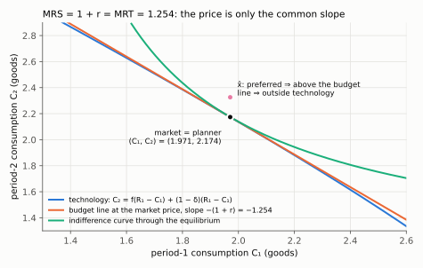
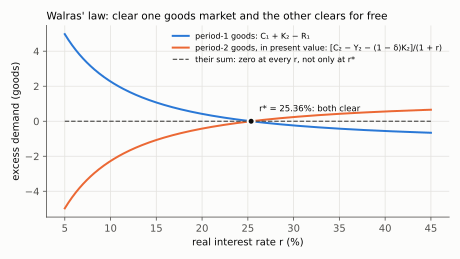

# 1. What competitive equilibrium buys, and why the prices cancel

**Kurlat §9.1–§9.2.** Up: [[00-index]] · Equations: [[derivacoes-cap-09]] Parts I–III ·
Next: [[02-dynamics-and-saddle-path]] · Rules: [[06_equilibrio_geral]]

> **Companion:** [When Capital Is Frozen, σ Decides](companion-frozen-capital.html) — Lista 5
> Q1 as a live equilibrium: labour clears period by period, $r$ is set last by the Euler equation,
> and the sign of the hours response to $A$ flips with $1-\sigma$. The verdict line switches between
> substitution and income effect as σ crosses 1.

The equation-by-equation walk is in [[derivacoes-cap-09]]. This note states the two structural
facts that the walk demonstrates but does not isolate: **why five conditions containing prices
collapse into two that do not**, and **what the First Welfare Theorem is a theorem about**.

---

## 1.1 What "equilibrium" has to specify

A competitive equilibrium is not a set of equations; it is a list of objects plus a list of
conditions, and exam answers lose marks by giving the second without the first. The definition
to write:

> A competitive equilibrium is an **allocation** $\{C_1,C_2,L_1,L_2,K_2,I\}$ and a **price
> vector** $\{w_1,w_2,r,r^K_2\}$ such that
> 1. taking prices as given, the **household** maximises utility subject to its budget
>    constraint;
> 2. taking prices as given, each **firm** maximises profit;
> 3. all **markets clear** — goods, labour and credit, in every period.

Three features of that definition do the work.

**Price-taking.** Every agent treats prices as parameters. Nobody optimises *over* prices. This
is the assumption that [[08_adas_microfundamentos]] deletes when firms become monopolistic
competitors with a mark-up.

**Consistency, not causation.** The definition does not say who sets prices or how they are
found. It says which prices are *consistent* with everyone's optimisation. This is why the
model has no story about adjustment — and why a model that wants one needs sticky prices.

**Market clearing in every market.** Kurlat's (9.1.3)–(9.1.6) in [[derivacoes-cap-09]] Part II.
Note that with $n$ markets you only need $n-1$ clearing conditions, by §1.3. What happens
when a price is stuck and a market does *not* clear (the short side decides the quantity) is
worked out in [[benigno/11-three-schools-and-market-clearing]] §11.1.

## 1.2 Why the prices cancel — the structural fact

[[derivacoes-cap-09]] Part II shows five first-order conditions, (9.1.7)–(9.1.11), each
containing a price, collapsing into (9.1.12)–(9.1.13), which contain none. That is not a lucky
algebraic accident, and here is why it has to happen.

**The mechanism.** Every price in this economy appears in exactly **two** places with opposite
signs: once in the problem of whoever pays it, once in the problem of whoever receives it.

- $w_t$ is a cost to the firm and income to the household.
- $r$ is a cost to the borrower and a return to the lender.
- $r^K_2$ is revenue to the investment firm and a cost to the producing firm.

When you impose market clearing you are asserting that the quantity bought equals the quantity
sold, so the two appearances are attached to the *same* quantity and the price drops out of the
combined system. What survives is a relation between quantities only.

**The cancellation, one operation per line.** Take the two prices of the two-period economy in
turn.

*The wage.* The household's labour condition (9.1.7) and the firm's (9.1.10) both end in the
same $w_t$, because one labour market clears at one price:

$$\frac{v'(l_t)}{u'(c_t)} = w_t \qquad\text{(household)}\qquad\qquad F_L(K_t,L_t) = w_t \qquad\text{(firm)}$$

Both left-hand sides equal the same number $w_t$, so they equal each other; and market clearing
(9.1.6) says the $L_t$ the firm hires is the $1-l_t$ the household sells:

$$\frac{v'(l_t)}{u'(c_t)} = F_L(K_t,\,1-l_t) \tag{9.1.12}$$

*The interest rate.* Start from the Euler equation (9.1.8) and divide both sides by
$\beta u'(c_2)$:

$$u'(c_1)=\beta(1+r)\,u'(c_2) \;\Longrightarrow\; \frac{u'(c_1)}{\beta u'(c_2)} = 1+r$$

Replace $1+r$ by $r^K_2$ (arbitrage, 9.1.11), then $r^K_2$ by $F_K(K_2,L_2)$ (the firm's
capital condition 9.1.9 at $t=2$):

$$\frac{u'(c_1)}{\beta u'(c_2)} = 1+r = r^K_2 = F_K(K_2,L_2) \tag{9.1.13}$$

Each price was used exactly twice — once on the buying side, once on the selling side — and
then it is gone.

*Read the common slope at the black dot: the household's indifference curve (MRS), the market
budget line ($1+r$) and the technology frontier (MRT) all have slope $-1.254$ there. The price
is just the name of that slope; delete it and the tangency between preferences and technology
is still there. The pink point is used in §1.4. (The figure is `check_ge.py`'s economy, where
capital survives into period 2, so MRT $=F_K+1-\delta$; with Kurlat's two-period $\delta_2=1$ it
is the $F_K$ of (9.1.13).)*

**The economic content.** Prices are the device by which the decentralised economy communicates.
Once every market clears, the communication has done its job and the outcome can be described
without reference to the messages. That is the whole intuition behind the welfare theorem, and
it is worth saying in exactly those terms.

**The trap.** The cancellation is a property of the *equilibrium*, not of the equations
individually. Away from equilibrium the prices emphatically do not cancel — that is what
disequilibrium means. So "the prices cancel" is a statement you are entitled to make only after
imposing market clearing, and using it earlier is circular.

## 1.3 Walras' law

With $n$ markets and every agent on its budget constraint, the value of aggregate excess demand
is identically zero at **every** price vector, not only at equilibrium:

$$\sum_{j=1}^{n} p_j\,z_j(\mathbf{p}) \;\equiv\; 0$$

where $z_j$ is excess demand in market $j$.

*Proof sketch.* Each agent's budget constraint says the value of what it demands equals the
value of what it supplies. Sum over agents: the value of aggregate demand equals the value of
aggregate supply, at any prices. ∎

*The same proof, one operation per line.* Let household $h$ own endowment $e^h_j$ of good $j$,
demand $x^h_j(\mathbf p)$, and own a share $\theta^{hf}$ of firm $f$; firm $f$ supplies net
output $y^f_j(\mathbf p)$ and earns $\pi^f=\sum_j p_j y^f_j$.

1. Household $h$'s budget holds with equality (more consumption is always wanted):
   $$\sum_j p_j x^h_j = \sum_j p_j e^h_j + \sum_f \theta^{hf}\pi^f$$
2. Sum step 1 over all households, and use $\sum_h \theta^{hf}=1$ (every firm is fully owned):
   $$\sum_j p_j \underbrace{\textstyle\sum_h x^h_j}_{X_j} = \sum_j p_j \underbrace{\textstyle\sum_h e^h_j}_{E_j} + \sum_f \pi^f$$
3. Substitute the definition of profit, $\sum_f\pi^f=\sum_j p_j\sum_f y^f_j \equiv \sum_j p_j Y_j$:
   $$\sum_j p_j X_j = \sum_j p_j E_j + \sum_j p_j Y_j$$
4. Move everything to the left and collect by good; $z_j \equiv X_j-E_j-Y_j$ is excess demand:
   $$\sum_j p_j\,(X_j-E_j-Y_j)=\sum_j p_j\,z_j(\mathbf p)=0$$

No step used market clearing — only budgets and the definition of profit — so the identity holds
at every price vector.

*In the two-period economy of `check_ge.py`.* The household saves $a$ out of period-1
resources $R_1$, so $C_1=R_1-a$ and $C_2=(1+r)a+\pi_2$, with $\pi_2=f(K_2)-f'(K_2)K_2$ the wage
bill; the firm demands $K_2$ with $f'(K_2)=r+\delta$. Then

$$z_1 = C_1+K_2-R_1 = (R_1-a)+K_2-R_1 = K_2-a$$

$$z_2 = C_2-f(K_2)-(1-\delta)K_2 = (1+r)a + f - (r+\delta)K_2 - f - (1-\delta)K_2 = (1+r)(a-K_2)$$

Divide $z_2$ by $1+r$ (the period-2 price in period-1 goods) and add:

$$z_1+\frac{z_2}{1+r} = (K_2-a)+(a-K_2) = 0 \quad\text{for every } r$$

*Read the two curves as mirror images: at every interest rate the period-1 excess demand is
exactly offset by the period-2 one in present value (their sum is the flat dashed line). They
cross zero together at $r^*=25.36\%$, so imposing either market clears the other.*

**Two consequences that matter for this chapter.**

1. **If $n-1$ markets clear, the $n$-th clears automatically.** With $z_j=0$ for
   $j=1,\dots,n-1$, the identity forces $p_nz_n=0$, so $z_n=0$ whenever $p_n>0$. This is why
   Kurlat can impose goods-market and labour-market clearing and get credit-market clearing for
   free — and why counting equations and unknowns in this model appears to give one too many
   equations until you notice one is redundant.
2. **Only relative prices are determined.** Scaling every price by $\lambda>0$ changes no
   agent's problem, since budget constraints are homogeneous of degree zero in prices. So the
   model pins down $w/p$ and $1+r$, never the price *level*. That indeterminacy is not a defect
   here; it is precisely the classical dichotomy, and it is why session 7 needs to add something
   — money — to determine the price level at all. See [[07_moeda_inflacao]].

Verified numerically in `check_ge.py`, which evaluates aggregate excess demand at a grid of
off-equilibrium price vectors and confirms the identity holds at every one.

## 1.4 The First Welfare Theorem, and what it is a theorem about

**Statement.** Every competitive equilibrium allocation is Pareto efficient.

**What Kurlat proves**, in (9.2.1)–(9.2.3) — see [[derivacoes-cap-09]] Part III. The structure
is a proof by contradiction in two inequalities, and the shape is worth knowing independently of
the algebra:

1. Suppose some feasible allocation $\mathbf{x}'$ is **strictly preferred** by the household to
   the equilibrium allocation $\mathbf{x}^*$.
2. Then $\mathbf{x}'$ must have been **unaffordable** at equilibrium prices — otherwise the
   household would have chosen it. That is inequality (9.2.2): the value of $\mathbf{x}'$
   exceeds the household's income.
3. But firms were maximising profit at those prices, so **no feasible production plan can be
   worth more** than the equilibrium one. That is inequality (9.2.3).
4. Combining: $\mathbf{x}'$ is worth more than total income and total income equals the maximum
   value of feasible output. So $\mathbf{x}'$ is not feasible — contradiction. ∎

**The logical shape, stated plainly:** preference $\Rightarrow$ unaffordability (from household
optimisation) $\Rightarrow$ infeasibility (from firm optimisation plus market clearing). Each
arrow uses exactly one of the three parts of the equilibrium definition in §1.1. That is why the
theorem needs all three and fails if any is dropped.

*On the figure of §1.2.* The pink point $\hat{\mathbf x}$ lies above the indifference curve
(preferred), therefore above the budget line (unaffordable — step 2), therefore above the
technology frontier (infeasible — step 3). Because the frontier lies everywhere on or below the
budget line, which is tangent to it at the equilibrium, no point can be preferred and feasible
at once. The full algebra of step 4, with every cancellation, is written out in
[[derivacoes-cap-09]] under (9.2.3).

### The four assumptions, and which session breaks each

The theorem is not about markets being good. It is a conditional statement, and the conditions
are where all the economics is:

| Assumption | Fails when | Where in this course |
|---|---|---|
| **Price-taking** | agents have market power | mark-up $\mu>0$ in [[02-firms-and-as]] §2.3 |
| **Complete markets** | some good cannot be traded | borrowing limits in [[05-ricardian-and-constraints]] §5.3; the deleveraging model of [[09-deleveraging]] |
| **No externalities** | one agent's action enters another's payoff directly | matching congestion in [[05-search-and-equilibrium]] §5.3 |
| **No distortions** | taxes drive wedges | every $\tau$ in [[07-fiscal-multipliers]] |

**The single sentence to carry into session 8.** Benigno's aggregate mark-up $\mu$ is a measure
of the distance between the decentralised allocation and the one this theorem proves is optimal,
which is why $y_n-y_e=-\mu/(\sigma^{-1}+\eta)$ in [[03-natural-and-efficient]] §3.4 and why a
mark-up shock creates a policy trade-off while a productivity shock does not. Without the
theorem, $y_e$ would be an arbitrary reference point; with it, $y_e$ is the allocation a planner
would choose and the gap is a genuine welfare loss.

## 1.5 What the theorem does not say

Four misreadings, each common:

- It does **not** say the allocation is fair. Pareto efficiency is silent about distribution; an
  allocation in which one household consumes everything can be efficient.
- It does **not** say markets always clear, or that the economy reaches equilibrium. It
  characterises equilibrium if one exists; existence is a separate theorem and adjustment is not
  modelled at all.
- It does **not** say government intervention is harmful. It says intervention cannot make
  everyone better off *when the four assumptions hold*. When one fails — and in sessions 8 and 9
  one always does — intervention can.
- It does **not** depend on the utility function's shape beyond monotonicity. The proof in §1.4
  used only "the household would have chosen it if affordable", which is revealed preference, not
  concavity.

## 1.6 What to be able to do, cold

1. Write the three-part definition of competitive equilibrium, with the objects listed.
2. Explain why prices cancel when the first-order conditions are combined, and why that is a
   statement about equilibrium rather than about the equations.
3. State and prove Walras' law, and give both consequences — one redundant market, and price
   level indeterminacy.
4. Give the two-inequality structure of the welfare proof and say which part of the equilibrium
   definition each step uses.
5. Name the four assumptions and, for each, the later session that breaks it.
6. List what the theorem does not claim.

Practice: the exercises are indexed in [[derivacoes-cap-09]] Part VI ("o que cai quando cada
hipótese cai") and worked in [[Resolucao/kurlat_solutions_ch09|ch09]]. The Lista 5 material,
including why $K_1$ and $K_2$ are exogenous there, is in [[exogenous-capital-lista-05]].
