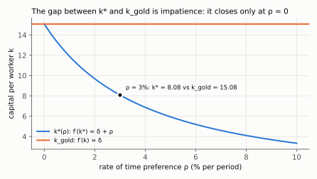
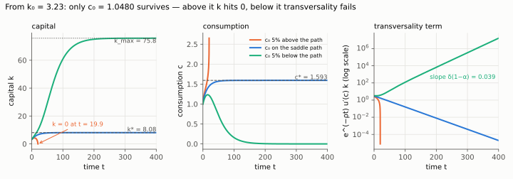
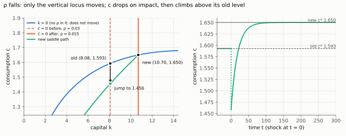

# 2. Infinite horizon: the phase diagram and the saddle path

**Kurlat §9.3, equations (9.3.14)–(9.3.17).** Up: [[00-index]] ·
Equations: [[derivacoes-cap-09]] Part IV · Prev: [[01-equilibrium-as-benchmark]]

> **Companion:** [The Saddle Path](companion-phase-diagram.html) — the two loci, the four
> regions with their arrows, the unstable arms, and the one trajectory that survives. Start the
> economy off the path and watch it either run out of capital or violate transversality.

[[derivacoes-cap-09]] Part IV derives (9.3.14) through (9.3.17). This note does the thing the
equation walk cannot: explain **why there is exactly one trajectory**, which is the single most
confusing feature of this model for anyone arriving from Solow.

---

## 2.1 The two equations

From [[derivacoes-cap-09]] (9.3.14) and (9.3.15), the infinite-horizon competitive equilibrium
(equivalently, the planner's solution) reduces to two differential equations in two variables:

$$\boxed{\;\dot k = f(k)-\delta k-c\;} \tag{resource constraint}$$

$$\boxed{\;\frac{\dot c}{c} = \frac{1}{\sigma}\left[f'(k)-\delta-\rho\right]\;} \tag{Euler}$$

The first is an accounting identity: output not consumed and not replacing depreciation
accumulates. The second is the Euler equation of [[02-two-period-problem]] §2.3 in continuous
time, with the equilibrium interest rate $r=f'(k)-\delta$ substituted in — which is exactly the
arbitrage condition (9.1.11) and the $r=r^K-\delta$ of [[02-markets-and-factor-prices]] §2.4.

**From Kurlat's discrete equations to these two, one step at a time.** Kurlat's (9.3.14) and
(9.3.15), with $L_t=1$, $f(k)\equiv F(k,1)$ and $r_{t+1}=f'(k_{t+1})-\delta$ by (9.3.11), read

$$\frac{c_{t+1}}{c_t}=\big[\beta(1+r_{t+1})\big]^{1/\sigma}, \qquad k_{t+1}=(1-\delta)k_t+f(k_t)-c_t$$

*Euler.* Take logs of the first equation (the log of a power is the exponent times the log):

$$\ln c_{t+1}-\ln c_t=\frac{1}{\sigma}\big[\ln\beta+\ln(1+r_{t+1})\big]$$

Write the discount factor as $\beta=1/(1+\rho)$, so $\ln\beta=-\ln(1+\rho)$:

$$\ln c_{t+1}-\ln c_t=\frac{1}{\sigma}\big[\ln(1+r_{t+1})-\ln(1+\rho)\big]$$

Use $\ln(1+x)\approx x$ for small $x$ (first-order Taylor expansion about $x=0$), on both
$r$ and $\rho$:

$$\ln c_{t+1}-\ln c_t\approx\frac{1}{\sigma}\,(r_{t+1}-\rho)$$

The left side is the growth rate of $c$ over one period; as the period shrinks it becomes
$\dot c/c$, and substituting $r=f'(k)-\delta$ gives the boxed Euler equation.

*Resource constraint.* Subtract $k_t$ from both sides of the second equation:
$k_{t+1}-k_t=f(k_t)-\delta k_t-c_t$. The left side is the change in $k$ over one period, which
in continuous time is $\dot k$ — the boxed resource constraint.

**The crucial asymmetry, and it is the whole of §2.4.** $k$ is a **state** variable: it is
inherited from the past and cannot jump. $c$ is a **control** variable: the household chooses it
now, and it can jump at any instant. One equation of motion for something that cannot move
discontinuously, one for something that can.

## 2.2 The two loci

**The $\dot c=0$ locus.** Setting the Euler equation to zero:

$$f'(k^*)=\delta+\rho$$

This pins down a single value $k^*$, independent of $c$. **It is a vertical line** in the
$(k,c)$ plane. With $f(k)=k^{\alpha}$:

$$k^* = \left(\frac{\alpha}{\delta+\rho}\right)^{\frac{1}{1-\alpha}}$$

*Steps.* Differentiate $f(k)=k^\alpha$: $f'(k)=\alpha k^{\alpha-1}$. Set it equal to $\delta+\rho$
and divide both sides by $\alpha$:

$$k^{\alpha-1}=\frac{\delta+\rho}{\alpha}$$

Raise both sides to the power $1/(\alpha-1)$, then flip the fraction to turn the negative exponent
$1/(\alpha-1)=-1/(1-\alpha)$ into a positive one:

$$k^*=\left(\frac{\delta+\rho}{\alpha}\right)^{\frac{1}{\alpha-1}}=\left(\frac{\alpha}{\delta+\rho}\right)^{\frac{1}{1-\alpha}}$$

**The $\dot k=0$ locus.** Setting the resource constraint to zero:

$$c = f(k)-\delta k$$

A hump: rising while $f'(k)>\delta$, peaking at $f'(k)=\delta$, falling after. Its peak is the
**Golden Rule** capital stock of [[01-golden-rule]] §1.2, with $n=g=0$.

*Steps.* Differentiate the locus with respect to $k$: $\dfrac{d}{dk}\big[f(k)-\delta k\big]=f'(k)-\delta$.
This is positive while $f'(k)>\delta$ and negative once $f'(k)<\delta$; the second derivative is
$f''(k)<0$, so the zero of the first derivative is a maximum:

$$f'(k_{gold})=\delta \;\Longrightarrow\; \alpha k_{gold}^{\alpha-1}=\delta \;\Longrightarrow\; k_{gold}=\left(\frac{\alpha}{\delta}\right)^{\frac{1}{1-\alpha}}$$

(the same two operations as for $k^*$, with $\rho=0$). The hump returns to $c=0$ at
$k_{max}$, where $f(k_{max})=\delta k_{max}$, i.e. $k_{max}^{\alpha-1}=\delta$ and
$k_{max}=(1/\delta)^{1/(1-\alpha)}$ — the largest capital stock the economy can maintain at all.

**The steady state** is where they cross: $(k^*, c^*)$ with $c^*=f(k^*)-\delta k^*$.

### The modified Golden Rule, and why $k^*<k_{gold}$

Compare the two conditions:

$$\underbrace{f'(k_{gold})=\delta}_{\text{Golden Rule}}
\qquad\text{against}\qquad
\underbrace{f'(k^*)=\delta+\rho}_{\text{this model}}$$

Since $\rho>0$ and $f''<0$, we get $f'(k^*)>f'(k_{gold})$ and therefore

$$\boxed{\;k^* < k_{gold}\;}$$

*The step spelled out.* $f'(k^*)-f'(k_{gold})=(\delta+\rho)-\delta=\rho>0$. A strictly decreasing
function ($f''<0$) takes a larger value only at a smaller argument, so $k^*<k_{gold}$. With
Cobb–Douglas the ratio is explicit: dividing the two closed forms,

$$\frac{k^*}{k_{gold}}=\left(\frac{\alpha/(\delta+\rho)}{\alpha/\delta}\right)^{\frac{1}{1-\alpha}}=\left(\frac{\delta}{\delta+\rho}\right)^{\frac{1}{1-\alpha}}<1$$

*Read the vertical gap between the two lines: it is zero only at $\rho=0$ and widens as
impatience rises. At the note's parameters ($\alpha=0.35$, $\delta=0.06$, $\rho=0.03$)
$k^*=8.08$ against $k_{gold}=15.08$ — the ratio $(0.06/0.09)^{1/0.65}=0.536$.*

**The economy deliberately stops short of the consumption-maximising capital stock, and it is
right to.** Reaching $k_{gold}$ would require sacrificing consumption now for consumption later,
and a household with $\rho>0$ does not value the later consumption enough. This is the answer to
the question [[01-golden-rule]] §1.4 could not answer: the Solow model could identify
over-accumulation as inefficient but could not rank under-accumulation, because it had no
preferences. Here there are preferences, and they say **the optimum is strictly below the Golden
Rule**.

**Corollary that matters:** this economy can never be dynamically inefficient. $k^*<k_{gold}$
always, so $f'(k^*)>\delta$ always, so the marginal product of capital always exceeds
depreciation. Over-accumulation is impossible when saving is chosen optimally by an
infinitely-lived household — it can only arise from a mechanical saving rule (Solow) or from
finite lives (overlapping generations). That is a genuinely useful thing to know.

Verified in `check_ge.py`, which computes both capital stocks across a parameter grid and
confirms the inequality is strict everywhere.

## 2.3 The four regions

The two loci cut the plane into four regions, and the arrows follow directly from the signs:

| Region | Position | $\dot k$ | $\dot c$ | Motion |
|---|---|---|---|---|
| NW | $k<k^*$, $c$ above the hump | $<0$ | $>0$ | up and left |
| NE | $k>k^*$, $c$ above the hump | $<0$ | $<0$ | down and left |
| SE | $k>k^*$, $c$ below the hump | $>0$ | $<0$ | down and right |
| SW | $k<k^*$, $c$ below the hump | $>0$ | $>0$ | up and right |

*Reading the signs.* $\dot k>0$ below the hump, because consumption is less than what is
available after depreciation. $\dot c>0$ to the left of the vertical line, because there
$k<k^*$ so $f'(k)>\delta+\rho$, so the return on saving exceeds impatience and the household
tilts consumption upward.

**Only two of the four regions point toward the steady state**, and even they do not arrive
there from an arbitrary starting point — they sweep past it. That is the signature of a
**saddle**.

## 2.4 Why there is exactly one path — the heart of the matter

Fix the initial capital stock $k_0$. The household chooses $c_0$, and that single choice
determines the entire future trajectory, since the two differential equations then take over.
Three cases:

**Choose $c_0$ too high.** Consumption starts above the saddle path. The economy runs down its
capital: $\dot k<0$, and as $k$ falls $f'(k)$ rises so $\dot c>0$ — consumption keeps rising
while capital shrinks. The trajectory hits $k=0$ **in finite time** with consumption still
positive, which is infeasible: you cannot consume from a capital stock of zero. **Ruled out by
feasibility.**

**Choose $c_0$ too low.** The economy accumulates capital, with consumption eventually falling.
*(Correction: capital does not go to infinity. It rises past $k_{gold}$ toward $k_{max}$, the
point where the hump meets the axis, $f(k_{max})=\delta k_{max}$, while $c\to0$; the figure below
shows it levelling off at $k_{max}=75.8$.)* The household is piling up capital it never
consumes. Formally this violates the **transversality condition**

$$\lim_{t\to\infty}e^{-\rho t}\,u'(c_t)\,k_t = 0$$

which says the present value of terminal wealth must be zero — if it were positive, the
household could consume some of it and be strictly better off, so the path was not optimal.
**Ruled out by optimality.**

*Why this path violates it, step by step.* As $k\to k_{max}$, the marginal product settles at
$f'(k_{max})=\alpha k_{max}^{\alpha-1}=\alpha\delta$ (because $k_{max}^{\alpha-1}=\delta$). Put
that into the Euler equation:

$$\frac{\dot c}{c}\to\frac{1}{\sigma}\big[\alpha\delta-\delta-\rho\big]=-\frac{(1-\alpha)\delta+\rho}{\sigma}<0$$

With $u'(c)=c^{-\sigma}$, the growth rate of $u'(c)$ is $-\sigma$ times the growth rate of $c$:

$$\frac{d\ln u'(c)}{dt}=-\sigma\frac{\dot c}{c}\to(1-\alpha)\delta+\rho$$

The growth rate of a product is the sum of the growth rates, and $k$ has stopped growing, so

$$\frac{d}{dt}\ln\!\big[e^{-\rho t}u'(c_t)k_t\big]\to-\rho+\big[(1-\alpha)\delta+\rho\big]+0=(1-\alpha)\delta>0$$

The term grows without bound instead of going to zero.

*Read the three panels left to right. Starting at $k_0=3.23$: 5% too much consumption drives
$k$ to zero at $t\approx 19.9$ (orange); 5% too little sends $c$ to zero and $k$ to
$k_{max}=75.8$ (green), and its transversality term grows at the slope $(1-\alpha)\delta=0.039$
on the log scale; only $c_0=1.0480$ (blue) reaches $(k^*,c^*)=(8.08,\,1.593)$ with a
transversality term that dies out.*

**Choose $c_0$ exactly right.** There is exactly one value that puts the economy on the
**saddle path** — the stable arm — which converges to $(k^*,c^*)$. It is a knife-edge, and it is
the equilibrium.

$$\boxed{\;\text{feasibility rules out paths above; transversality rules out paths below;
one remains}\;}$$

**This is the structural difference from Solow, and it is worth stating explicitly.** In Solow,
$s$ is fixed, the dynamics are one-dimensional, and *every* initial $k$ converges to $k_{ss}$ —
[[04-steady-state-and-stability]] §4.3 proved global stability. Here the dynamics are
two-dimensional, the steady state is a saddle rather than a sink, and convergence happens only
because the **jump variable is chosen to put the economy on the stable arm**. Stability in Solow
is a property of the system; here it is a consequence of optimisation.

**Local analysis, for completeness.** Linearising the system about $(k^*,c^*)$ gives a Jacobian
with determinant

$$\det J = \frac{c^*}{\sigma}f''(k^*) \;<\;0$$

since $f''<0$.

*Where the Jacobian comes from.* Name the right-hand sides
$G(k,c)=f(k)-\delta k-c$ and $H(k,c)=\frac{c}{\sigma}\big[f'(k)-\delta-\rho\big]$. The
Jacobian collects their four partial derivatives, evaluated at $(k^*,c^*)$:

- $\partial G/\partial k=f'(k)-\delta$; at $k^*$, $f'(k^*)=\delta+\rho$, so this is $\rho$.
- $\partial G/\partial c=-1$.
- $\partial H/\partial k=\frac{c}{\sigma}f''(k)$ (product rule; only $f'$ depends on $k$); at the
  steady state, $\frac{c^*}{\sigma}f''(k^*)$.
- $\partial H/\partial c=\frac{1}{\sigma}\big[f'(k)-\delta-\rho\big]$; at $k^*$ the bracket is
  zero, so this is $0$.

$$J=\begin{pmatrix}\rho & -1\\[2pt] \frac{c^*}{\sigma}f''(k^*) & 0\end{pmatrix},\qquad
\det J=\rho\cdot0-(-1)\cdot\frac{c^*}{\sigma}f''(k^*)=\frac{c^*}{\sigma}f''(k^*),\qquad
\operatorname{tr}J=\rho$$

*Eigenvalues.* They solve $\lambda^2-(\operatorname{tr}J)\lambda+\det J=0$, i.e.

$$\lambda_{\pm}=\frac{\rho\pm\sqrt{\rho^2-4\det J}}{2}$$

With $\det J<0$ the square root is real and larger than $\rho$, so $\lambda_+>0>\lambda_-$
(equivalently, $\lambda_+\lambda_-=\det J<0$ forces opposite signs).

A negative determinant means the two eigenvalues are **real with opposite
signs** — one stable, one unstable. That is the definition of a saddle, and the stable
eigenvector is the tangent to the saddle path at the steady state. Confirmed numerically in
`check_ge.py`, which computes the Jacobian and its eigenvalues at the steady state.

## 2.5 Comparative statics, done on the diagram

Each shock moves one locus, and reading which one is most of the skill.

**A fall in $\rho$ (more patience).** The $\dot c=0$ line moves **right**: $f'(k^*)=\delta+\rho$
with a smaller $\rho$ needs a smaller $f'$, hence a larger $k^*$. The $\dot k=0$ hump does not
move — it contains no preference parameter. The new steady state has more capital and more
consumption. On impact, $c$ **jumps down** onto the new saddle path, and then both $k$ and $c$
rise along it. Patience is paid for immediately and rewarded later.

*The signs, derived.* Differentiate the steady-state condition $f'(k^*)=\delta+\rho$ totally
with respect to $\rho$ (chain rule on the left):

$$f''(k^*)\,\frac{dk^*}{d\rho}=1 \;\Longrightarrow\; \frac{dk^*}{d\rho}=\frac{1}{f''(k^*)}<0$$

Then differentiate $c^*=f(k^*)-\delta k^*$ with respect to $\rho$, and use $f'(k^*)-\delta=\rho$:

$$\frac{dc^*}{d\rho}=\big[f'(k^*)-\delta\big]\frac{dk^*}{d\rho}=\frac{\rho}{f''(k^*)}<0$$

So a fall in $\rho$ raises both $k^*$ and $c^*$. The jump on impact follows from the geometry:
$k$ cannot move at the instant of the shock, the new saddle path approaches the new steady state
from the south-west region (below the hump, where $\dot k>0$), and the old steady state sits
**on** the hump — so at the old $k^*$ the new saddle path lies below the old $c^*$.

*Read the left panel for the loci: the vertical $\dot c=0$ line moves from $k^*=8.08$ (dashed)
to $10.70$ (solid) when $\rho$ falls from 3% to 1.5%, and the hump stays put. Consumption drops
from $1.593$ to $1.456$ at the unchanged $k$, then climbs along the new saddle path to
$1.650$ — the right panel shows the same jump-then-rise in time.*

**A rise in $\delta$.** Both loci move: the hump shifts down and the vertical line shifts left.
Unambiguously lower $k^*$ and lower $c^*$.

*Derived.* Differentiate $f'(k^*)=\delta+\rho$ with respect to $\delta$:
$f''(k^*)\,dk^*/d\delta=1$, so $dk^*/d\delta=1/f''(k^*)<0$. Now $\delta$ enters $c^*=f(k^*)-\delta k^*$
twice — through $k^*$ and directly — so the derivative has two terms:

$$\frac{dc^*}{d\delta}=\big[f'(k^*)-\delta\big]\frac{dk^*}{d\delta}-k^*=\frac{\rho}{f''(k^*)}-k^*<0$$

**A productivity gain, $f\to Af$ with $A>1$.** The hump shifts up, and the vertical line shifts
right since $Af'(k)=\delta+\rho$ needs a larger $k$. Both $k^*$ and $c^*$ rise.
*Derived:* differentiate $Af'(k^*)=\delta+\rho$ with respect to $A$ (product rule):
$f'(k^*)+Af''(k^*)\,dk^*/dA=0$, so $dk^*/dA=-f'(k^*)/\big[Af''(k^*)\big]>0$; then
$c^*=Af(k^*)-\delta k^*$ gives $dc^*/dA=f(k^*)+\big[Af'(k^*)-\delta\big]dk^*/dA=f(k^*)+\rho\,dk^*/dA>0$. Whether $c$
jumps up or down on impact depends on whether the wealth effect or the higher return dominates —
the same ambiguity as [[03-income-and-substitution]] §3.2, and resolved the same way by $\sigma$.

**The general rule:** preference parameters ($\rho$, $\sigma$) move only the $\dot c=0$ locus;
technology and depreciation ($A$, $\delta$) move both. A shock that moves only the vertical line
leaves the consumption-possibility frontier untouched and reallocates along it.

## 2.6 What to be able to do, cold

1. Write the two differential equations and identify the state and the control.
2. Derive both loci, and show the $\dot c=0$ locus is vertical while $\dot k=0$ is a hump peaking
   at the Golden Rule.
3. Prove $k^*<k_{gold}$ and explain why this economy is never dynamically inefficient.
4. Draw the four regions with the correct arrows, deriving each sign.
5. Explain why exactly one trajectory survives, naming feasibility for one side and
   transversality for the other.
6. Show $\det J<0$ and say what that means for the eigenvalues.
7. Do the $\rho\downarrow$ comparative static, including the direction of the jump in $c$.

Practice: the exercises are indexed in [[derivacoes-cap-09]] Part VI and worked in
[[Resolucao/kurlat_solutions_ch09|ch09]].
