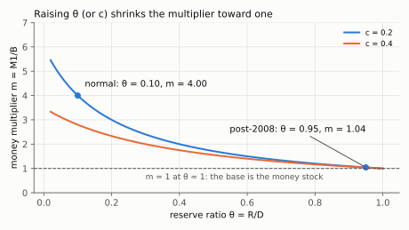
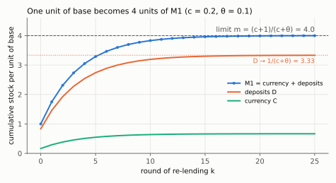

# 1. What money is, and where the money stock comes from

**Kurlat §10.1–§10.3, printed pages 191–199.** Up: [[00-index]] ·
Next: [[02-money-demand]] · Rules: [[07_moeda_inflacao]]

Kurlat opens by warning that the question is "trickier than it seems". The trick is that money
is defined by a **function**, the function is satisfied in degrees, and so the boundary of the
money stock is a convention rather than a fact.

---

## 1.1 The three functions, and which one is definitional

Money is anything serving as:

1. **store of value** — hold it now, spend it later;
2. **unit of account** — prices are quoted in it;
3. **medium of exchange** — it changes hands when people pay.

**Only the third is definitional**, and this is the examinable point. Plenty of assets are a
store of value — bonds, houses, gold — and they are not money. Plenty of things could serve as a
unit of account, including a currency nobody uses. **Only money is handed over in transactions.**

**Why that function matters: the double coincidence of wants.** Without money, trade requires
finding someone who has exactly what you want *and* wants exactly what you have. That coincidence
is demanding and usually fails. With money, you accept payment for what you sell knowing others
will accept the same token for what you want to buy.

So the answer to "what distinguishes money from other assets" is *the medium-of-exchange
function and the double-coincidence problem it solves* — not a recitation of three functions.

**The five properties** a convenient money needs (Kurlat, p. 192), each with its argument:
hard to counterfeit, so the seller need not verify; easy to carry, since transactions happen
everywhere; durable, or it is a poor store of value — coffee beans rather than strawberries;
divisible, so exact prices can be paid and change given (Sargent and Velde, *The Big Problem of
Small Change*, on how Europe struggled with this); and commonly accepted, which is sometimes pure
convention and sometimes reinforced by law.

**The consequence, which is the point of the section.** Assets satisfy these five properties *to
different degrees*. There is no sharp line between money and not-money, so **there is no unique
measure of the money stock**. Hence several conventional definitions.

## 1.2 The four aggregates

From narrowest to broadest — reproduce this ladder from memory:

| Aggregate | Contents |
|---|---|
| **Monetary base** ($M_0$) | physical currency **+ central bank reserves** |
| **M1** | currency in circulation + demand deposits |
| **M2** | M1 + savings deposits + small time deposits + retail money-market funds |
| **M3** | M2 + large time deposits + institutional money funds + repos |

Two things to notice. **Reserves are in the base and not in M1**, because reserves are not held
by the public and cannot be spent on goods. And **currency appears in both**, but "currency in
circulation" for M1 excludes what sits in bank vaults.

The ordering is by liquidity, which is exactly the medium-of-exchange property of §1.1 measured
in degrees. Moving down the list, assets are better stores of value and worse media of exchange.

## 1.3 The money multiplier, derived

The central bank controls the **base**, $B$. The public holds M1. The link is fractional-reserve
banking, and the multiplier is a piece of accounting, not a theory.

**Two behavioural ratios:**

$$c \equiv \frac{C}{D} \quad\text{(currency the public holds per unit of deposits)},
\qquad
\theta \equiv \frac{R}{D} \quad\text{(reserves banks hold per unit of deposits)}$$

**Two identities:**

$$B = C+R, \qquad M_1 = C+D$$

Divide both by $D$ and substitute the ratios:

$$\frac{B}{D}=\frac{C}{D}+\frac{R}{D}=c+\theta, \qquad \frac{M_1}{D}=\frac{C}{D}+\frac{D}{D}=c+1$$

Take the ratio, and $D$ cancels:

$$\frac{M_1}{B}=\frac{M_1/D}{B/D}=\frac{c+1}{c+\theta}$$

$$\boxed{\;\frac{M_1}{B} = \frac{c+1}{c+\theta} \;\equiv\; m\;}$$

**The two derivatives, by the quotient rule.** For $\theta$ only the denominator moves:

$$\frac{\partial m}{\partial \theta}=(c+1)\cdot\frac{\partial}{\partial\theta}(c+\theta)^{-1}
=-\frac{c+1}{(c+\theta)^2}<0$$

For $c$ both numerator and denominator move, each with derivative 1:

$$\frac{\partial m}{\partial c}=\frac{1\cdot(c+\theta)-(c+1)\cdot 1}{(c+\theta)^2}
=\frac{\theta-1}{(c+\theta)^2}$$

which is negative exactly when $\theta<1$. And $m>1 \iff c+1>c+\theta \iff \theta<1$ (both
denominators are positive, so cross-multiplying keeps the inequality).

*Read off: $m$ falls from 4.00 at $\theta=0.10$ to 1.04 at $\theta=0.95$ and reaches exactly 1 at $\theta=1$; the higher-$c$ curve lies below for every $\theta<1$.*

**Signs, each with its reason:**

- $\dfrac{\partial m}{\partial \theta}<0$. Higher required or desired reserves means less lending
  per unit of base, so a smaller multiplier.
- $\dfrac{\partial m}{\partial c}<0$ whenever $\theta<1$. Currency held by the public does not get
  re-lent, so it leaks out of the deposit-expansion chain.
- $m>1$ iff $\theta<1$. With 100% reserves, $m=1$ and the base *is* the money stock.

**The deposit-expansion chain, which is where the formula comes from.** A bank receiving a
deposit of 1 keeps $\theta$ and lends $1-\theta$; the borrower spends it, the recipient banks it
(keeping a fraction $c/(1+c)$ as currency), and so on. Summing the geometric series gives exactly
$m$. Verified in `check_money.py` by simulating the chain term by term and comparing with the
closed form.

The sum, step by step. Write $s\equiv c/(1+c)$ for the currency share of every receipt, so
$1-s=1/(1+c)$, and inject one unit of base.

1. Round 0: the public keeps $s$ as currency and deposits $d_0=1-s$.
2. Each round, a bank keeps $\theta d_k$ and lends $(1-\theta)d_k$; of that loan a share $s$ comes
   back as currency and $1-s$ as a new deposit, so $d_{k+1}=(1-\theta)(1-s)\,d_k$.
3. Deposits form a geometric series with ratio $q=(1-\theta)(1-s)<1$:
$$D=\sum_{k\ge0}d_k=\frac{1-s}{1-(1-\theta)(1-s)}$$
4. Substitute $1-s=1/(1+c)$ and put the denominator over $1+c$:
$$1-\frac{1-\theta}{1+c}=\frac{(1+c)-(1-\theta)}{1+c}=\frac{c+\theta}{1+c}
\quad\Longrightarrow\quad D=\frac{1/(1+c)}{(c+\theta)/(1+c)}=\frac{1}{c+\theta}$$
5. Currency is the round-0 share plus $s$ times every loan:
$$C=s+s(1-\theta)D=\frac{c}{1+c}\cdot\frac{(c+\theta)+(1-\theta)}{c+\theta}
=\frac{c}{1+c}\cdot\frac{1+c}{c+\theta}=\frac{c}{c+\theta}$$
6. Check the ratios: $C/D=c$ as assumed, reserves $R=\theta D=\theta/(c+\theta)$, and
   $C+R=(c+\theta)/(c+\theta)=1=B$. Add currency and deposits:
$$M_1=C+D=\frac{c+1}{c+\theta}=m$$

*Read off: with $c=0.2$, $\theta=0.1$ the cumulative M1 climbs round by round to $m=4$, deposits to $1/(c+\theta)=3.33$ and currency to $c/(c+\theta)=0.67$.*

**The honest caveat, and it matters after 2008.** The multiplier is an *identity given $c$ and
$\theta$*, not a causal mechanism. When banks hold large excess reserves — as they have since
2008, with interest paid on reserves — $\theta$ rises endogenously and the multiplier collapses.
The US base grew several-fold after 2008 while M1 grew far less, and the multiplier fell below
one for a period. Reading the identity as "the central bank controls M1 through B" is exactly
trap 1 in [[07_moeda_inflacao]]: it holds $\theta$ fixed when $\theta$ is a choice.

## 1.4 How the central bank changes the money supply

**Open-market operations** are the main instrument: the central bank buys bonds from the public
and pays with newly created reserves, so $B$ rises. Selling bonds does the reverse.

Note the balance-sheet logic, which is the cleanest way to see it: the central bank's assets are
the bonds it holds, its liabilities are currency plus reserves. Buying a bond expands both sides
of the balance sheet, and the liability side *is* the monetary base. Money is created by a
balance-sheet expansion, not by printing in any literal sense.

Other instruments: changing reserve requirements (moves $\theta$ directly), lending at the
discount window, and — the modern one — paying interest on reserves, which sets a floor under
the short rate and makes $\theta$ a choice variable rather than a constraint.

**The important reframing for sessions 8 and 9.** A modern central bank does not target the money
stock at all. It sets a short-term **interest rate** and supplies whatever quantity of reserves
that rate requires. Once you accept that, $M$ becomes endogenous, and the whole money-supply
apparatus of this section becomes a description of what the balance sheet has to do rather than a
policy instrument. That is precisely why Benigno (2015) has no LM curve and no money stock — see
[[00-index]] and [[01-household-and-ad]] §1.7.

## 1.5 What to be able to do, cold

1. Give the three functions and say which is definitional, with the double-coincidence argument.
2. List the five properties and give the argument behind each.
3. Reproduce the four aggregates in order and say what distinguishes the base from M1.
4. Derive $m=(c+1)/(c+\theta)$ from the two ratios and two identities, and sign both derivatives.
5. Explain what an open-market operation does to the central bank's balance sheet.
6. Say why the multiplier is an identity rather than a mechanism, with the post-2008 evidence.

Practice: Kurlat ch. 10, Exercises 10.1 and 10.2 (pp. 203–204). Worked in
[[Resolucao/lista6_resolucao|lista 6]] — the Kurlat chs. 10–11 solution set has not been written yet. Narration: [[Leituras/aula-07-money-and-inflation-narrated.txt|class 7 narration]], parts one and two.
