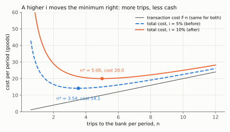
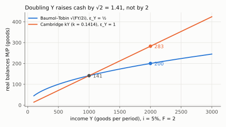
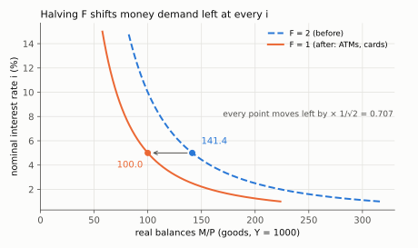
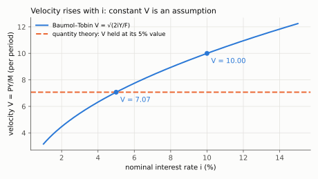

# 2. Money demand: Baumol–Tobin, derived

**Kurlat §10.4, printed pages 199–204.** Up: [[00-index]] ·
Prev: [[01-money-and-its-supply]] · Next: [[03-equilibrium-and-neutrality]]

> **Companion:** [The Trip to the Bank](companion-baumol-tobin.html) — the two costs trading
> off, the square-root optimum, and both elasticities read straight off the curve.

Money pays no interest and bonds do, so holding money is strictly dominated as an investment.
Any model in which money is held must therefore contain a **friction**, and the whole content of
this section is one specific friction and what it implies.

---

## 2.1 The problem

A household must spend $Y$ over a period, evenly. It holds wealth in bonds earning nominal
interest $i$, and converts bonds to cash on trips to the bank. Each trip costs $F$ in real
resources — time, fees, inconvenience.

Let $n$ be the number of trips. Each trip withdraws $Y/n$, which is then run down to zero before
the next trip. **Average money holdings over the period are therefore half the withdrawal:**

$$\frac{M^d}{P} = \frac{Y}{2n}$$

This is the sawtooth: balances start at $Y/n$, fall linearly to zero, and jump back up. The
average of a linear decline from $x$ to $0$ is $x/2$.

The average, computed. Take the period as length 1, so spending runs at rate $Y$ and a trip
happens every $1/n$. Within one interval, $t$ time after the trip, the balance is
$Y/n-Yt$. Average it over the interval (integrate, then divide by the interval length $1/n$):

$$\frac{1}{1/n}\int_0^{1/n}\Big(\frac{Y}{n}-Yt\Big)dt
= n\Big[\frac{Y}{n}t-\frac{Y}{2}t^2\Big]_0^{1/n}
= n\Big(\frac{Y}{n^2}-\frac{Y}{2n^2}\Big)
= n\cdot\frac{Y}{2n^2}=\frac{Y}{2n}$$

Every interval is identical, so this is also the average over the whole period.

**The two costs.**

- **Transaction cost:** $F\,n$, rising in the number of trips.
- **Forgone interest:** $i\cdot\dfrac{Y}{2n}$, falling in the number of trips.

$$\min_{n}\;\; \mathcal{C}(n)= F n + i\,\frac{Y}{2n}$$

## 2.2 Solving it

$$\frac{d\mathcal C}{dn} = F - \frac{iY}{2n^2} = 0
\qquad\Longrightarrow\qquad
n^2 = \frac{iY}{2F}
\qquad\Longrightarrow\qquad
n^* = \sqrt{\frac{iY}{2F}}$$

Line by line: write the second cost as $\tfrac{iY}{2}n^{-1}$, whose derivative is
$-\tfrac{iY}{2}n^{-2}$ (power rule); set the derivative to zero and move that term across,
$F=\tfrac{iY}{2n^2}$; multiply both sides by $n^2/F$, giving $n^2=\tfrac{iY}{2F}$; take the
positive square root, since $n>0$.

Second-order condition: $\mathcal C''(n)=iY/n^3>0$, so it is a minimum. (Differentiate
$-\tfrac{iY}{2}n^{-2}$ once more: $-\tfrac{iY}{2}\cdot(-2)n^{-3}=iY/n^3$, positive for every $n>0$.)
The two cost curves cross
at the optimum — at $n^*$, total transaction cost equals total forgone interest, which is a good
check and a nice fact:

$$Fn^* = \sqrt{\frac{F i Y}{2}} = i\,\frac{Y}{2n^*}$$

Each side, worked out. Left: $Fn^*=F\sqrt{\tfrac{iY}{2F}}=\sqrt{\tfrac{F^2 iY}{2F}}=\sqrt{\tfrac{FiY}{2}}$
(move $F$ inside the root as $F^2$). Right: $\tfrac{iY}{2n^*}=\tfrac{iY}{2}\sqrt{\tfrac{2F}{iY}}
=\sqrt{\tfrac{i^2Y^2\cdot 2F}{4\,iY}}=\sqrt{\tfrac{FiY}{2}}$. This equality is not a coincidence of the
numbers: the FOC $F=iY/(2n^2)$, multiplied by $n$, reads $Fn=iY/(2n)$.

*Read off: raising $i$ from 5% to 10% lifts the total-cost curve and moves its minimum from $n^*=3.54$ to $n^*=5.00$ trips; the transaction-cost line $Fn$ does not move.*

Substituting $n^*$ into average balances gives the **Baumol–Tobin money demand**:

$$\frac{M^d}{P} = \frac{Y}{2n^*} = \frac{Y}{2}\sqrt{\frac{2F}{iY}}
\qquad\Longrightarrow\qquad
\boxed{\;\frac{M^d}{P} = \sqrt{\frac{FY}{2i}}\;}$$

The middle step: $1/n^*=\sqrt{2F/(iY)}$ (invert the fraction under the root). The last step brings
$Y/2$ inside the root as $Y^2/4$:
$\tfrac{Y}{2}\sqrt{\tfrac{2F}{iY}}=\sqrt{\tfrac{Y^2}{4}\cdot\tfrac{2F}{iY}}=\sqrt{\tfrac{2FY}{4i}}=\sqrt{\tfrac{FY}{2i}}$.

Verified against numerical minimisation in `check_money.py`.

## 2.3 The two elasticities, and why they are the point

Take logs of the boxed formula:

$$\ln\frac{M^d}{P} = \tfrac12\ln F + \tfrac12\ln Y - \tfrac12\ln i - \tfrac12\ln 2$$

(Two log rules: $\ln\sqrt{x}=\tfrac12\ln x$, then the log of a product-over-quotient
$\ln\tfrac{FY}{2i}=\ln F+\ln Y-\ln 2-\ln i$.) Each elasticity is the coefficient on the
corresponding log, because the other terms do not depend on that variable: differentiate with
respect to $\ln Y$ and only $\tfrac12\ln Y$ survives, giving $\tfrac12$; with respect to $\ln i$,
only $-\tfrac12\ln i$ survives, giving $-\tfrac12$; with respect to $\ln F$, $\tfrac12$.

so

$$\boxed{\;\varepsilon_Y \equiv \frac{\partial\ln(M/P)}{\partial\ln Y}=\frac{1}{2},
\qquad
\varepsilon_i \equiv \frac{\partial\ln(M/P)}{\partial\ln i}=-\frac{1}{2},
\qquad
\varepsilon_F = \frac{1}{2}\;}$$

**The income elasticity is one half, and that is an economic claim, not an algebraic accident.**
A household whose income doubles does **not** double its cash. It goes to the bank more often —
$n^*$ rises with $\sqrt{Y}$ — so cash rises only with the square root. There are **economies of
scale in cash management**.

The number behind the sentence: doubling $Y$ multiplies $\sqrt{FY/2i}$ by $\sqrt{2}\approx1.41$, since
$\sqrt{F(2Y)/2i}=\sqrt2\cdot\sqrt{FY/2i}$.

*Read off: both curves pass through 141 at $Y=1000$ ($i=5\%$, $F=2$); at $Y=2000$ Baumol–Tobin gives 200 ($\times\sqrt2$) while the Cambridge form gives 283 ($\times2$).*

**Contrast with the Cambridge/quantity-theory formulation**, $M^d/P = kY$, which has
$\varepsilon_Y=1$: money demand proportional to income, no scale economies. The difference is not
a quibble about parameters. One says managing cash has scale economies; the other says it does
not. Which is right is an empirical question, and [[03-equilibrium-and-neutrality]] §3.4 shows
exactly how much a central bank loses by getting it wrong.

**The interest elasticity is negative**, which is the demand-curve property: a higher nominal
rate raises the opportunity cost of holding cash, so people economise on it by trooping to the
bank more often. Note it is $i$ and not $r$ that matters — the opportunity cost of holding a
zero-interest asset is the **nominal** rate, since inflation erodes both money and bonds equally.
This is trap 2 in [[07_moeda_inflacao]] and it returns in the Fisher discussion.

**The $F$ elasticity is where financial innovation enters.** Cash machines, debit cards and
banking on a phone all cut $F$. Since $\varepsilon_F=+1/2$, a falling $F$ **lowers** real money
demand — which is a downward drift in money demand that has nothing to do with income or interest
rates, and which is the standard explanation for why money-demand equations estimated in the
1970s broke down in the 1980s. It is also the reason [[03-equilibrium-and-neutrality]] §3.6 warns
against monetary targeting.

Halving $F$ multiplies balances by $\sqrt{(F/2)Y/2i}\,/\sqrt{FY/2i}=\sqrt{1/2}\approx0.707$ at every $i$.

*Read off: at $i=5\%$ real balances fall from 141.4 to 100.0 when $F$ halves from 2 to 1; the whole curve moves left by the same factor $1/\sqrt2$, so this is a shift, not a movement along the curve.*

## 2.4 Velocity, as an implication rather than an assumption

> **Companion:** [Who Moves When Money Moves](companion-money-regimes.html) — velocity read off
> $V=Y/m=\sqrt{2iY/F}$ before and after a money or rate change, in each of the four regimes.

Define velocity by the **quantity equation**:

$$M V = P Y \qquad\Longleftrightarrow\qquad V\equiv\frac{PY}{M}$$

**This is a definition, true by construction** — it defines $V$ as whatever makes it hold. It
becomes the *quantity theory* only when you add the assumption that $V$ is constant.

Substitute Baumol–Tobin:

$$V = \frac{Y}{M/P} = \frac{Y}{\sqrt{FY/2i}}
\qquad\Longrightarrow\qquad
\boxed{\;V = \sqrt{\frac{2iY}{F}}\;}$$

The steps: divide numerator and denominator of $PY/M$ by $P$ to get $Y/(M/P)$; write $Y=\sqrt{Y^2}$
and combine the two roots, $\sqrt{Y^2}\big/\sqrt{FY/2i}=\sqrt{Y^2\cdot\tfrac{2i}{FY}}=\sqrt{\tfrac{2iY}{F}}$.

*Read off: with $Y=1000$, $F=2$, velocity is 7.07 at $i=5\%$ and 10.00 at $i=10\%$; the flat dashed line is what the quantity theory assumes.*

**So velocity is not constant.** It rises with the nominal interest rate (people hold less cash,
so each unit turns over faster), rises with income (scale economies again), and falls with the
cost of a trip.

**The pivot to state in an exam:** assuming constant velocity is what converts the quantity
*identity* into the quantity *theory*, and the model just derived says velocity moves whenever
the interest rate moves. So the quantity theory is a good approximation exactly when interest
rates are stable, and a poor one in exactly the episodes — hyperinflations, disinflations — where
people most want to use it.

## 2.5 What the model leaves out

Baumol–Tobin is a model of **transactions** demand only. Two other motives are standard and are
not in it:

- **Precautionary demand** — holding cash against uncertain expenditure, which is the Jensen
  argument of [[05-ricardian-and-constraints]] §5.4 applied to liquidity.
- **Speculative demand** — Keynes's motive, holding money when bond prices are expected to fall.

And the model treats $Y$ as exogenous to the cash decision, ignores the choice between different
liquid assets, and assumes trips are evenly spaced. None of that changes the qualitative results;
all of it means the elasticities are stylised rather than estimates.

> **Contrast: Jones (2020), ch. 8 and Romer (2012), ch. 11.** Jones works with $M^d/P = kY$
> throughout — the Cambridge form — which makes the quantity theory exact and the algebra
> shorter, at the cost of hiding the scale economies. Romer derives money demand from a
> money-in-the-utility-function or cash-in-advance setup, which is more general and more modern
> but yields no closed-form elasticity to test. Kurlat's trip-cost model is the only one of the
> three that *derives* a number you can argue about, which is why it is the one in the syllabus.
> Local files, +25 and +22 page offsets ([[books-index]]).

## 2.6 What to be able to do, cold

1. Set up the trip-cost problem, explain why average balances are $Y/2n$, and derive $n^*$.
2. Reach the square-root formula and verify the second-order condition.
3. Show that at the optimum the two costs are equal.
4. Derive all three elasticities by taking logs, and give the economics of each.
5. State the contrast with the Cambridge form and what is at stake in it.
6. Derive velocity, show it is not constant, and state exactly what converts the quantity
   identity into the quantity theory.
7. Explain how financial innovation shifts money demand, and why that matters for policy.

Practice: Kurlat ch. 10, Exercises 10.3 and 10.4 (p. 204); and Lista 6, question 2, which is the
Baumol–Tobin calibration. Worked in [[Resolucao/lista6_resolucao|lista 6]]; the Kurlat chs. 10–11
solution set has not been written yet.
