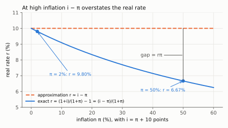
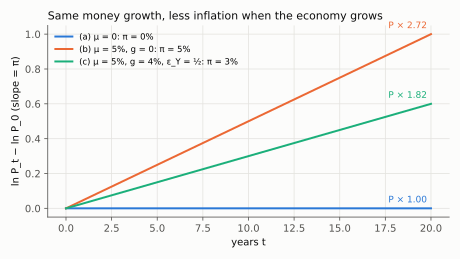
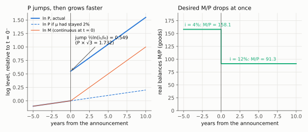

# 3. Equilibrium, Fisher, and the three steady states

**Kurlat §11.1–§11.2, printed pages 205–215.** Up: [[00-index]] ·
Prev: [[02-money-demand]] · Next: [[04-seigniorage-and-costs]]

> **Companion:** [Who Moves When Money Moves](companion-money-regimes.html) — the same equilibrium
> condition solved for $p$, for $Y$ and $i$, or for $M$, depending on the instrument and on price flexibility.

*Lista 6 1(c)-(d): under a money target the equation determines i. Under a rate target it determines M. Diagnosis: [[avaliacao-listas-2-3-6]].*

One equilibrium condition, read four ways. This note derives the inflation decomposition that
the whole session exists for, and then prices the cost of getting one parameter wrong.

---

## 3.1 The equilibrium condition

Money supply equals money demand:

$$\boxed{\;M^s = P\cdot L(Y,i)\;}$$

with $L(\cdot)$ the real money demand of [[02-money-demand]], so under Baumol–Tobin
$L=\sqrt{FY/2i}$.

**Three and only three ways the market can clear** after a rise in $M^s$, and the classical
model shuts two of them:

| Channel | Mechanism | Classical view |
|---|---|---|
| $P$ rises | more nominal money chasing the same real balances | **open** |
| $i$ falls | lower opportunity cost raises real money demand | **shut** — $i=r+\pi^e$, with $r$ set by [[01-equilibrium-as-benchmark]] |
| $Y$ rises | more transactions to finance | **shut** — $Y=Y_n$, set by technology and factors |

**Neutrality is not an extra assumption bolted on at the end.** It is the statement that two of
the three channels are closed, which follows from the classical dichotomy proved in session 6:
real variables are determined by real forces, without reference to any nominal quantity. Given
that, $P$ is the only free variable and must absorb the whole change.

$$P = \frac{M^s}{L(Y_n, r+\pi^e)}$$

(Divide both sides of $M^s=P\cdot L$ by $L$, then substitute the two closed channels,
$Y=Y_n$ and $i=r+\pi^e$.)

## 3.2 Measuring inflation, and the two indices

$$\pi_t = \frac{P_t-P_{t-1}}{P_{t-1}}$$

The index used matters, and the machinery is already built in
[[02-real-nominal-and-indices]]: the GDP deflator is a **Paasche** index over domestically
produced goods; the CPI is a **Laspeyres** index over a fixed consumption basket including
imports.

**The consequence to carry into this session.** By the substitution-bias theorem of
[[02-real-nominal-and-indices]] §2.4, a Laspeyres index overstates inflation whenever
$\operatorname{Cov}_s(\hat p,\hat q)<0$. So a CPI-based measure of $\pi$ is biased **upward**,
and therefore the real interest rate computed as $r=i-\pi^{\text{CPI}}$ is biased **downward**.
Indexed bonds, indexed wages and indexed pensions all inherit that bias, which is why the Boskin
exercise was a fiscal question as much as a statistical one.

Kurlat works two arithmetics here and both are in `check_money.py`: the wheat-and-computers
deflator giving about 73 and inflation near $-27\%$, and the three-good basket going from 300 to
330, so the index goes 100 to 110 and inflation is $10\%$.

## 3.3 Fisher, exactly and approximately

An investor lending one unit of goods gets back $1+i$ units of money, which buys
$(1+i)P_t/P_{t+1}$ units of goods. So the **exact** Fisher equation is

$$\boxed{\;1+r = \frac{1+i}{1+\pi}\;}$$

The steps: lend $P_t$ in money (the price of one unit of goods); receive $(1+i)P_t$ next period;
divide by next period's price to convert to goods, $(1+i)P_t/P_{t+1}$; and use
$P_{t+1}/P_t=1+\pi$, so $P_t/P_{t+1}=1/(1+\pi)$. The gross real return on one unit of goods is
$1+r$ by definition, which gives the box.

and the familiar approximation follows from taking logs and using $\ln(1+x)\simeq x$:

$$\ln(1+r)=\ln(1+i)-\ln(1+\pi)\quad\Longrightarrow\quad r\simeq i-\pi$$

(log of a quotient is the difference of logs; then replace each $\ln(1+x)$ by $x$, which drops
terms of order $x^2$.)

with error $\simeq r\pi$, second order — the same expansion as
[[03-growth-arithmetic]] §3.1. At $i=5\%$, $\pi=2\%$ the approximation gives $3\%$ and the exact
answer is $2.94\%$; at $i=60\%$, $\pi=50\%$ it gives $10\%$ and the exact answer is $6.67\%$.
**Use the exact form whenever inflation is large**, which is the whole of
[[04-seigniorage-and-costs]].

The error term is in fact exact, not only approximate. Multiply the box out by $(1+\pi)$:

$$(1+r)(1+\pi)=1+i\;\Longrightarrow\;1+r+\pi+r\pi=1+i\;\Longrightarrow\;i-\pi=r+r\pi$$

so the approximation $i-\pi$ overstates $r$ by exactly $r\pi$. Solving the last equation for $r$
(factor $r$ out of $r+r\pi$, divide by $1+\pi$) gives the exact real rate in one line,

$$r=\frac{i-\pi}{1+\pi}$$

which reproduces both numbers above: $0.03/1.02=2.94\%$ and $0.10/1.50=6.67\%$.

*Read off: holding $i-\pi$ at 10 points, the exact real rate is 9.80% at $\pi=2\%$ but only 6.67% at $\pi=50\%$; the vertical gap is $r\pi$.*

**Kurlat's worked example** (p. 209), reproduced in the check script: an 11% nominal rate, 2%
expected inflation, a price index going 100 to 102. Lend \$100, buying one basket today; get back
\$111, which buys $111/102 = 1.088$ baskets. The real rate is **8.8%**, against the approximation
$11-2=9\%$.

**Two distinctions that get marked.**

*Ex ante against ex post.* The rate that governs decisions is $r^{\text{ante}}=i-\pi^e$, formed
with **expected** inflation. The rate actually realised is $r^{\text{post}}=i-\pi$. They differ
by the forecast error, and **unexpected inflation transfers wealth from lenders to borrowers** —
which is the redistribution channel of [[09-deleveraging]] and the reason the Fisher effect there
is a *debt* effect.

*Which rate belongs where.* The **real** rate governs intertemporal goods decisions — the Euler
equation of [[02-two-period-problem]]. The **nominal** rate governs money holding, because it is
the opportunity cost of an asset paying zero. Putting $r$ in money demand is trap 2 in
[[07_moeda_inflacao]].

## 3.4 The three steady states

**(a) Constant money supply.** $M^s=\bar M$, so $P=\bar M/L(Y_n,i)$: a constant price level, zero
inflation.

**(b) Money growing at a constant rate.** Conjecture $\pi=\mu_M$ and verify. If $\pi$ is constant
then $i=r+\pi$ is constant, so $L(Y_n,i)$ is constant, so from $P=M^s/L$ the price level grows at
exactly the rate $M^s$ grows. The conjecture is confirmed:

$$\pi = \mu_M \qquad\text{when } Y \text{ is constant}$$

**(c) A growing economy — the case that matters.** Take logs of the equilibrium condition and
differentiate with respect to time:

$$\ln M^s = \ln P + \ln L(Y,i)$$

$$\mu_M = \pi + \varepsilon_Y\,g_Y + \varepsilon_i\,\frac{di/dt}{i}$$

Term by term. The log of a product is the sum of logs, which gives the first line. Differentiate
each term with respect to $t$:

- $\dfrac{d\ln M^s}{dt}=\dfrac{\dot M^s}{M^s}=\mu_M$ and $\dfrac{d\ln P}{dt}=\dfrac{\dot P}{P}=\pi$
  (the derivative of $\ln x(t)$ is $\dot x/x$);
- $\ln L$ depends on $t$ through $\ln Y$ and $\ln i$, so by the chain rule
$$\frac{d\ln L}{dt}=\frac{\partial\ln L}{\partial\ln Y}\cdot\frac{d\ln Y}{dt}
+\frac{\partial\ln L}{\partial\ln i}\cdot\frac{d\ln i}{dt}
=\varepsilon_Y\,g_Y+\varepsilon_i\,\frac{di/dt}{i}$$
  using the definitions of the two elasticities and $g_Y\equiv\dot Y/Y$.

In a steady state $\pi$ is constant, so $i=r+\pi$ is constant and the last term vanishes:

$$\boxed{\;\pi = \mu_M - \varepsilon_Y\,g_Y\;}$$

(Set $di/dt=0$ in the second line and subtract $\varepsilon_Y g_Y$ from both sides.)

**Inflation is money growth net of what real growth absorbs.** A growing economy carries out more
transactions and wants more real balances; that appetite soaks up newly created money instead of
letting it bid up prices. Two countries printing money at the same rate will have different
inflation if they grow at different rates — and the faster-growing one has *less* inflation.

With Baumol–Tobin, $\varepsilon_Y=1/2$:

$$\pi = \mu_M - \tfrac12 g_Y$$

*Read off: with the same 5% money growth, prices rise 5% a year when $g_Y=0$ but 3% a year when $g_Y=4\%$ and $\varepsilon_Y=\tfrac12$; after 20 years that is $P\times2.72$ against $P\times1.82$.*

## 3.5 The cost of getting the elasticity wrong

This is the section's payoff and it is a clean, quotable result.

A central bank wants $\pi^{\text{target}}$ in an economy growing at $g_Y$. Believing the
elasticity is $\hat\varepsilon$, it sets

$$\mu_M = \pi^{\text{target}} + \hat\varepsilon\,g_Y$$

If the true elasticity is $\varepsilon$, realised inflation is
$\pi = \mu_M - \varepsilon g_Y$, so

$$\pi=\big(\pi^{\text{target}}+\hat\varepsilon\,g_Y\big)-\varepsilon\,g_Y
\quad\Longrightarrow\quad \pi-\pi^{\text{target}}=\hat\varepsilon\,g_Y-\varepsilon\,g_Y$$

(substitute the rule for $\mu_M$, subtract $\pi^{\text{target}}$ from both sides, factor out $g_Y$):

$$\boxed{\;\pi-\pi^{\text{target}} = \left(\hat\varepsilon-\varepsilon\right)g_Y\;}$$

**The inflation error equals the error in the elasticity times the growth rate.** Its sign is set
by which way you erred, and it is proportional to growth — so the mistake is harmless in a
stagnant economy and expensive in a fast-growing one.

**Kurlat's numbers.** Target 2%, growth 3%, believed elasticity 1/2, so $\mu_M=3.5\%$. If money
demand is really proportional to income ($\varepsilon=1$), realised inflation is
$3.5-3=0.5\%$ — one and a half points below target, from a single parameter. Computed in
`check_money.py`. In the formula: $\mu_M=2+\tfrac12\cdot3=3.5\%$, and
$(\hat\varepsilon-\varepsilon)g_Y=(0.5-1)\times3=-1.5$ points, so $\pi=2-1.5=0.5\%$.

**Two conclusions, and the honest answer is that both are defensible:** either measure money
demand better, or stop targeting monetary aggregates. The profession chose the second.

## 3.6 Neutrality against superneutrality

The distinction is examinable and is trap 3 in [[07_moeda_inflacao]].

**Neutrality.** A one-off change in the **level** of $M$ changes all nominal variables
proportionally and no real variable. Double $M$ and $P$ doubles; $Y$, $r$, $M/P$ and relative
prices are untouched.

**Superneutrality.** A change in the **growth rate** of $M$ leaves real variables unchanged.
**This fails**, and the reason is exactly the money demand of [[02-money-demand]]:

$$\mu_M\uparrow \;\Longrightarrow\; \pi\uparrow \;\Longrightarrow\; i=r+\pi\uparrow
\;\Longrightarrow\; \frac{M^d}{P}=\sqrt{\frac{FY}{2i}}\downarrow
\;\Longrightarrow\; n^*\uparrow$$

People hold less cash and make more trips to the bank. Those trips cost $F$ each in **real
resources**, so real resources are consumed by the change in money growth. Money is neutral;
money growth is not.

$$\boxed{\;\text{neutral in levels, not in growth rates}\;}$$

**The price-level jump.** A permanent rise in $\mu_M$ raises $\pi$, hence $i$, hence *lowers*
desired real balances $M/P$ — but the nominal stock $M$ has not yet changed at the moment of the
announcement. So $P$ must **jump up discretely** to bring $M/P$ down to its new desired level, and
only then grow at the new faster rate. That jump is the part students miss: the price level does
not merely change slope, it changes level at the instant of the announcement.

The size of the jump. Just before and just after the announcement $M$ is the same, so dividing
$P=M/L(Y,i)$ after by before cancels $M$ (and $Y$, which is unchanged):

$$\frac{P_{\text{after}}}{P_{\text{before}}}=\frac{L(i_0)}{L(i_1)}
=\frac{\sqrt{FY/2i_0}}{\sqrt{FY/2i_1}}=\sqrt{\frac{i_1}{i_0}},
\qquad \ln P_{\text{after}}-\ln P_{\text{before}}=\tfrac12\ln\frac{i_1}{i_0}$$

(the common factor $FY/2$ cancels inside the root; the log halves because of the square root).
With $r=2\%$ and money growth rising from 2% to 10%, $i$ goes from 4% to 12%, so $P$ jumps by
$\sqrt{3}\approx1.732$.

*Read off: left, $\ln M$ only kinks at $t=0$ while $\ln P$ jumps by $\tfrac12\ln3=0.549$ and then rises at 10% a year (dashed: the old 2% path); right, desired real balances drop at once from 158.1 to 91.3 ($Y=1000$, $F=2$).*

## 3.7 What to be able to do, cold

1. State the equilibrium condition and the three channels, and say which two the classical model
   shuts and why.
2. Give the exact Fisher equation, the approximation, and the size of the error; work Kurlat's
   8.8% example.
3. Distinguish ex ante from ex post, and say which rate belongs in money demand and which in the
   Euler equation.
4. Derive $\pi=\mu_M-\varepsilon_Y g_Y$ by differentiating the equilibrium condition, naming why
   the interest term vanishes.
5. Derive the policy-error formula and evaluate Kurlat's example.
6. Define neutrality and superneutrality, show superneutrality fails through the trip-cost
   channel, and explain the price-level jump.

Practice: Kurlat ch. 11, Exercises 11.1–11.3 (pp. 220–221); Lista 6 questions 1 and 3. Worked in
[[Resolucao/lista6_resolucao|lista 6]] — the Kurlat chs. 10–11 solution set has not been written yet. Narration: parts four through seven of
[[Leituras/aula-07-money-and-inflation-narrated.txt|the class 7 narration]].
