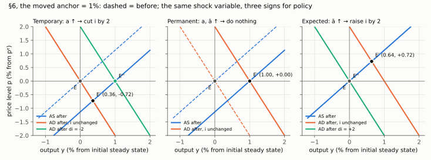
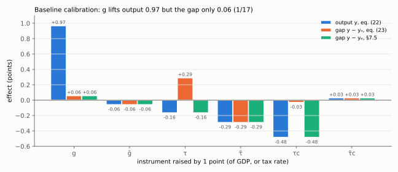
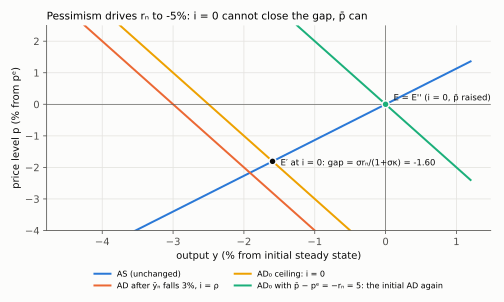
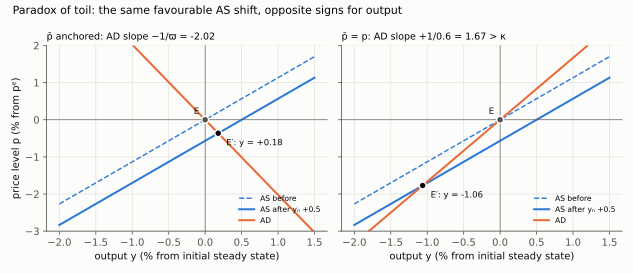
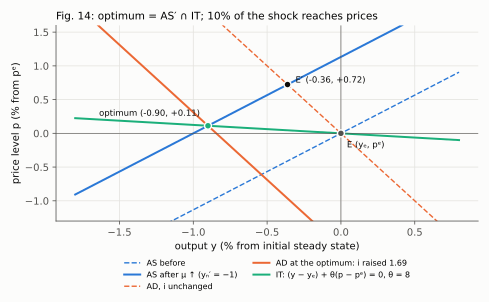

# Aula 9 — New-Keynesian AS–AD: policy analysis

**Source.** Benigno (2015), *New-Keynesian economics: an AS–AD view*, **sections 6–12**,
printed pages 511–524.

**Read this first.** The full derivation already exists: [[benigno/00-index|the Benigno
derivation set]]. This page routes the Aula 9 half of it and states the two organising
principles that make the six sections one argument rather than six.

---

## Reading order for this class

| # | Note | Article | What it settles |
|---|---|---|---|
| 5 | [[benigno/05-productivity-shocks]] | §6, Figs. 6–8 | Three productivity shocks, three *different* policy responses; the divine coincidence and its two conditions |
| 6 | [[benigno/06-markup-shocks]] | §7, Fig. 9 | Stagflation; the two gaps with opposite signs; the first genuine trade-off, with all three reachable points priced |
| 7 | [[benigno/07-fiscal-multipliers]] | §8, eqs. (22)–(23), Tables 1–2 | Table 1 derived line by line, Table 2 reproduced; why the multiplier on the **gap** is a small fraction (1/17 to 1/8) of the multiplier on **output** |
| 8 | [[benigno/08-liquidity-trap]] | §9, Figs. 11–12 | The $\mathrm{AD}_0$ ceiling; a trap is $r_n<0$, not $i=0$; the $\bar p$ exit; which fiscal instrument to avoid |
| 9 | [[benigno/09-deleveraging]] | §10, eqs. (24)–(32), Fig. 13 | Borrowers at a limit; an AD curve that can slope **up**; the three paradoxes; multipliers above one |
| 10 | [[benigno/10-optimal-policy]] | §11–§12, eqs. (33)–(35), Fig. 14 | The welfare loss derived rather than assumed; the targeting rule; the optimal split of a mark-up shock |

Companions, all in `benigno/`: [The Three Lines](benigno/companion-as-ad.html),
[The Multiplier Bench](benigno/companion-multipliers.html),
[The Floor Under Demand](benigno/companion-zlb.html),
[When Demand Slopes Up](benigno/companion-deleveraging.html).

Runnable check: `benigno/check_multipliers.py` — reproduces all eight rows of Table 2 and the
three deleveraging multipliers from the Table 1 formulas.

### The six pictures of this class

*Note 5: the same shock variable calls for a cut, for nothing, or for a rise. The rule is to move i to the new rₙ.*

*Note 6: after a mark-up shock, price stability (E″) and efficient output (E‴) need rate moves of opposite sign.*

*Note 7: g lifts output 0.97 but the gap only 0.06. For τ and τc, output and the natural gap move in opposite directions.*

*Note 8: with rₙ = −5%, i = 0 stops at E′; a long-run price commitment of 5 points lifts AD back through E.*

*Note 9: the same favourable AS shift raises output when AD slopes down and lowers it when AD slopes up.*

*Note 10: the optimum is AS′ ∩ IT, and about 10% of the shock reaches prices.*

Rules file: [[09_adas_politica]]. Narration:
[[Leituras/benigno-2015-adas-narrated.txt|the Benigno narration]], parts six to twelve.

NotebookLM prompts: `aula-09-slides-1-shocks-and-multipliers`,
`aula-09-slides-2-trap-and-optimal-policy`,
`aula-09-audio-1-divine-coincidence-and-its-limit`,
`aula-09-audio-2-the-multiplier-is-not-the-point`.

---

## The two principles that make this one argument

**Principle 1 — every shock is classified by one question: does it move the mark-up?**

From [[benigno/03-natural-and-efficient]] §3.4, $y_n-y_e=-\mu/(\sigma^{-1}+\eta)$. So:

- **If the shock does not move $\mu$** — productivity, public spending — then $y_n$ and $y_e$
  move together, one instrument hits both targets, and the right policy is simply to set $i$ to
  the new natural rate $r_n$. This is the divine coincidence, and it is not a coincidence: it
  follows from the shock being efficient.
- **If the shock does move $\mu$** — market power, oil, any distorting tax — then the two targets
  separate, the two gaps take **opposite signs**, and policy must choose. The mandate, not the
  economy, decides the direction.

**Principle 2 — always say which gap.** Prices respond to $y-y_n$, because firms price off
marginal cost. Welfare responds to $y-y_e$, because households consume and work. For a mark-up
shock these have opposite signs simultaneously, so an answer reporting "the output gap" has
already gone wrong. This is the single highest-value habit in the whole course.

## The four results most likely to be examined

1. **Three productivity shocks, three signs.** Temporary → cut; permanent → do nothing; expected
   → raise. Any answer of the form "a positive supply shock calls for easing" is wrong two times
   out of three. The invariant rule is *move $i$ to the new $r_n$*.
2. **The fiscal multiplier is the wrong number.** Short-run spending raises output by about 0.96
   and narrows the gap by about 0.06 — about a sixteenth as much (between 1/17 and 1/8 across the
   η = 0.2 rows of Table 2) — because spending raises capacity as well as demand. And a consumption-tax cut raises output while *widening* the gap.
3. **A liquidity trap is $r_n<0$.** Restating it that way makes the exit obvious: $-\sigma\,di$
   and $+\sigma\,d\bar p$ occupy the same slot in the AD curve, so when $i$ is stuck the long-run
   price level is still an instrument. Monetary policy has changed instrument, not run out.
4. **Optimal policy after a mark-up shock lets a fraction $1/(1+\theta\kappa)$ through to
   prices** — about a tenth at the article's calibration. And a bank with a steeper targeting
   line should *cut* after the same shock, so the sign of the optimal response is a property of
   the mandate rather than of the economy.

## Two errors in the article, both resolved in the notes

1. **Eqs. (15) and (19), the coefficient on $g$.** The project markdown renders it as
   $(\sigma^{-1}-1)/(\sigma^{-1}+\eta)$; it is $\sigma^{-1}/(\sigma^{-1}+\eta)$. An OCR artefact.
   Three confirmations in [[benigno/02-firms-and-as]] §2.4 and [[benigno/07-fiscal-multipliers]]
   §7.2.
2. **The prose on p. 515** claims the efficient-gap equation has the same *spending* multipliers
   as (22) and the same *tax* multipliers as (23). It is the other way round on both counts, and
   the article's own next sentence confirms the correction. Derived in
   [[benigno/07-fiscal-multipliers]] §7.5.

## Where the course ends, and what it cannot say

Section 12 is the article's own list of limitations, carried in
[[benigno/10-optimal-policy]] §10.6: no inflation **dynamics** (the AS curve is in the price
level, so disinflation paths and sacrifice ratios are outside it), two periods only, no financial
intermediation beyond the reduced-form borrowing limit, no open economy, and no interest-rate
rule — long-run prices are anchored by assumption, which is convenient and also assumes away the
determinacy questions Taylor rules exist to answer.

Saying that list back is a good close to any exam answer about what this model is for.
