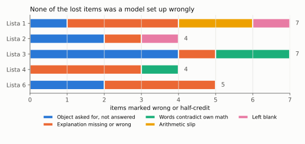
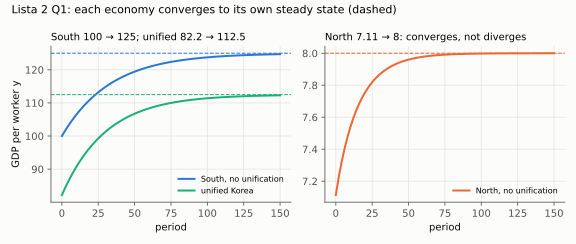
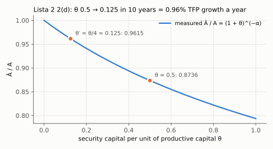
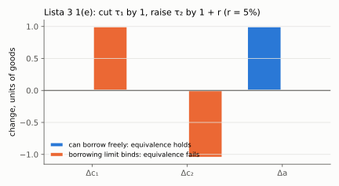
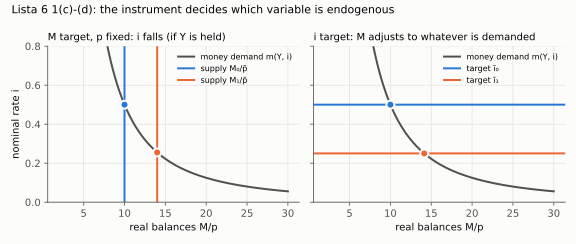

# Evaluation of the graded work: Listas 2, 3 and 6, and the gap map

Read from `Listas/correções/Lista+2+Macro.pdf` (5 pp.), `Lista+03+Macro.pdf` (5 pp.) and
`Lista+06+-+Pedro+Alves.pdf` (6 pp.). All three are CamScanner scans with no text layer, so
they were read as images. The red-pen marks are **✓** (accepted), **✗** (rejected) and
**?** (questioned). A ✓ and ✗ on the same item means half credit.

This note continues [[avaliacao-listas-1-4]]. It uses the same rules: a mark is certain;
the *reason* for a ✗ is marked **(inferred)** when the grader wrote none. Every number quoted
here is recomputed in `Map/fig/gap_figures.py`, which aborts if a claim is wrong.

Back to [[00_indice]] · [[estilo-do-professor]] · mock exams in `Simulados/simulado-0{1,2}-*.pdf`

---

## 1. The pattern across five graded lists

Five graded lists have 27 rejected or half-credit items between them. None of those items
was lost because a model was set up wrongly. The diagnosis from Listas 1 and 4 holds, with
one sharper form:

> **The algebra is right. Marks are lost at three points: the last object the question
> names, the sentence after the formula, and the step where the words have to agree with
> the sign.**

| Failure | Count | Where |
|---|---|---|
| An object the question named was never answered | 9 | L1 4(a); L2 1(c), 1(d); L3 1(a) `a`, 1(d) `a`, 2(b), 2(d); L6 1(c), 1(d) |
| The explanation is missing or names the wrong mechanism | 11 | L1 1(c), 1(e), 2(b); L2 1(b); L3 1(b); L4 2(b), 2(d), 2(e); L6 1(a), 1(b), 2(c) |
| **The words contradict the student's own math** | 3 | L3 1(c), L3 1(e), L4 1(b) |
| Arithmetic slip | 2 | L1 1(b), 1(c) |
| Left blank | 2 | L1 4(b), L2 2(d) |

**Words contradicting the math** is the most expensive category. It happened three times on
two lists, and the grader treats it as a conceptual error, not a slip. In each case the
correct conclusion was already on the page in symbols.

---

## 2. Lista 2 — Solow (Korea) and development accounting (Gotham)

| Item | Mark | What was written | Verdict |
|---|---|---|---|
| 1(a) | ✓✓✓ | $k_{N0}=10$, $y_{N0}=7.113$, $k_{S0}=400$, $y_{S0}=100$ | correct |
| 1(b) numbers | ✓✓✓✓ | $k^*_N=16$, $y^*_N=8$, $k^*_S=625$, $y^*_S=125$ | correct |
| 1(b) prediction | **✗** | "a divergence of output levels" | **wrong conclusion** |
| 1(c) | **✗** (partial ✓) | unified $y=82.16$, "South loses per capita", aggregate rises 2071 → 2465 | **incomplete** (inferred) |
| 1(d) bonus | **✗** | $n_U=1/60$, $k^*_U=506.25$, $y^*_U=112.5$, "below SS", ratios 0.90 and 0.81 | numbers right, **no explanation** (inferred) |
| 2(a) | ✓ | $Y=A(1+\theta)^{-\alpha}K^\alpha L^{1-\alpha}$, share $\theta/(1+\theta)$, loss 12.64% | correct |
| 2(b) | ✓ | $r=\alpha Y/K$, $w=(1-\alpha)Y/L$, "not distorted" | correct |
| 2(c) | ✓ | $\hat A=A(1+\theta)^{-\alpha}$, $\hat A/A=0.8736$ | correct |
| 2(d) | **✗** | *blank* | **blank** |

### 1(b): the model predicts convergence, not divergence ⭐

Both economies start **below** their own steady state ($7.11<8$ and $100<125$). So the
model predicts that **both grow** during the transition, each towards its **own** $y^*$.
That is **conditional convergence**: the gap in *levels* persists ($8$ vs $125$) because
$s$, $n$, $A$ and $\alpha$ differ. It does not widen because of any divergent dynamics. In the
long run, per-capita growth is zero in both, since there is no technical progress.

"Divergence" is the wrong word for a model whose defining result is that $k$ goes to a stable
fixed point.

**Companion:** [Two Economies, One Border](aula-02-solow-mecanica/companion-unification.html)

### 1(c): where each gain comes from (inferred)

The numbers were right. The question also asked *"Where does the gain come from in each
case?"*, and that part was never answered. The instructor's key (PSET 2) writes it in the
margin: *"capital gets diluted"* and *"Not per capita (for S) but still a gain"*.

- **North** $7.11\to82.16$: it gains twice. It adopts the South's technology ($A_S,\alpha_S$),
  and it gets **capital deepening**: $k$ jumps from 10 to 270.
- **South** $100\to82.16$: it **loses** per capita. Its capital is **diluted** from
  $k=400$ to $270$ over a larger workforce.
- **Aggregate** $2071\to2465$: $Y$ rises, because capital moves to where its marginal
  product is far higher (North's $k_0$ on the South's technology) and the North's labour now
  uses the better technology.

### 1(d): the missing sentence (inferred)

$y^*_U=112.5<y^*_S=125$ because the unified economy's labour force grows faster
($n_U=1/60>n_S=0.01$). More new workers must be equipped each period, so the $(n+\delta)k$
line is steeper and $k^*$ is lower. The saving rate and the technology are the South's in
both cases, so $n$ is the whole difference.

### 2(d): the blank, worth the most ⭐

$\theta$ falls to $\theta'=\theta/4=0.125$ over ten years, and true $A$ does not change.
With $Y=A(1+\theta)^{-\alpha}K^\alpha L^{1-\alpha}$, growth accounting gives

$$g_Y=\alpha g_K+(1-\alpha)g_L+\underbrace{\frac{-\alpha\,[\ln(1+\theta')-\ln(1+\theta)]}{10}}_{\text{Solow residual}}
=\alpha g_K+(1-\alpha)g_L+\frac{\tfrac13\ln(1.5/1.125)}{10}.$$

The residual is $\boxed{0.959\%\text{ a year}}$ (0.964% compounded). $g_K$ and $g_L$ drop out
of it. The whole reallocation from security capital to productive capital is reported as
**TFP growth**. This is Kurlat's point that the residual captures *"changes in policies that
lead to better (or worse) allocation of resources"*. If crime had worsened, the accounting
would report **negative** productivity growth with unchanged technology.

**Companion:** [Security Capital Looks Like Bad Luck](aula-03-solow-evidencias/companion-hidden-wedge.html)

---

## 3. Lista 3 — two-period consumption with taxes and a borrowing limit

| Item | Mark | What was written | Verdict |
|---|---|---|---|
| 1(a) | **✗** + "a?" | $c_1$ and $c_2$ by substitution, correct Euler | **$a$ never solved** |
| 1(b) | **✗** | $c_1/y_1$ in terms of $y_2/y_1$, "consumption rises with income" | **no PIH story** (inferred) |
| 1(c) | **✗** (✓ on the condition) | correct derivative; "$\sigma>1$ → $c_1$ **falls**" | **words contradict the sign** |
| 1(d) | **✗** + "a?" | $\partial c_t/\partial\tau_s$ correct | **$a$ never solved** again |
| 1(e) | **✗** | showed taxes enter only through $\tau_1+\tau_2/(1+r)$, then "**yes, the timing matters**" | **words contradict the proof** |
| 2(a) | ✓ (half) | "the borrowing limit" | incomplete |
| 2(b) | **✗** | one example | **two were asked** |
| 2(c) | ✓✓ | both cases, binding and slack | correct |
| 2(d) | **✗** | Euler $(c_2/c_1)^\sigma=\beta(1+r-\tau_2)$ derived; part IV blank | **no comparison with lump sum, no margin named** |

**Checked independently:** the $c_1$ in 1(a),
$c_1=\dfrac{y_2-\tau_2+(1+r)(a_0+y_1-\tau_1)}{[\beta(1+r)]^{1/\sigma}+(1+r)}$, is **correct**. It is
the canonical $W/D$ form multiplied top and bottom by $(1+r)$. The ✗ is for the missing
$a=a_0+y_1-\tau_1-c_1$. Write the canonical form anyway, because it is the form the grader
reads fastest: numerator = lifetime wealth, $D=1+\beta^{1/\sigma}(1+r)^{1/\sigma-1}$.

### 1(c): the sign was right and the sentence was wrong ⭐⭐

With $y_2=\tau_1=\tau_2=0$ the household saves everything it will consume in period 2, and
$c_1=(a_0+y_1)/D$. $D$ rises with $r$ iff $1/\sigma-1>0$. So:

| $\sigma$ | $\partial c_1/\partial r$ | Words that match |
|---|---|---|
| $<1$ | $<0$ | substitution effect dominates: saving is now more rewarding |
| $=1$ | $0$ | log: the income and substitution effects cancel exactly |
| $>1$ | $\mathbf{>0}$ | **income effect dominates**: a saver is richer when $r$ rises, and with high curvature it spends part of that today |

The page reads "$1-1/\sigma>0 \Leftrightarrow \sigma>1$" (✓ from the grader) followed by "consumption 1
**falls**" (✗). The derivative was positive and the sentence said negative.

**Rule:** set $\sigma$ to a knife-edge value and read the formula before writing the
sentence. Same rule as the Lista 4 1(b) fix: *never let the words contradict the formula.*

### 1(e): Ricardian equivalence proved, then denied ⭐⭐

The page shows $\Delta'=\tau_1-1+[\tau_2+(1+r)]/(1+r)=\Delta$ ("this change has no effect")
and two lines later says *"yes, the timing affects consumption, as seen in item (d)"*. Item
(d) is about the **level** of taxes. Item (e) is about their **timing** at a constant present
value. The two are different experiments.

Correct: $c_1$ and $c_2$ **do not change**, and $a$ **rises by exactly 1**, because the tax cut
is saved to pay the future tax (PSET 3 margin: *"#Saving extra to pay future taxes"*). The
timing does **not** matter, **as long as** the household can borrow and lend freely at $r$.

### 2(b) and 2(d)

- **2(b)**: two examples were asked for and one was given. Examples where the limit binds:
  (i) a young household whose income is low now and high later (a steep income profile,
  e.g. a medical resident); (ii) a household hit by a temporary income loss (unemployment),
  when $y_1$ is low relative to $y_2$; (iii) low $b$: no collateral or no credit history. The
  answer on the page ("very high future income") is (i).
- **2(d)**: the savings tax changes the Euler equation to
  $(c_2/c_1)^\sigma=\beta(1+r-\tau_2)$, so it **distorts the intertemporal margin**. A
  lump-sum tax that raises the same revenue leaves $(c_2/c_1)^\sigma=\beta(1+r)$ and only moves
  wealth. Both allocations are affordable with the same revenue, so the lump sum is
  welfare-superior. The key's margin note: *"Same revenue → both affordable → lump-sum
  welfare improving → Euler equation"*.

**Companion:** [Taxes, Timing and the Limit](aula-04-consumo/companion-taxes-and-limits.html)

---

## 4. Lista 6 — money and inflation

| Item | Mark | What was written | Verdict |
|---|---|---|---|
| 1(a) | ✓✗ | "true by construction; says nothing about how one variable affects the others" | half: **$V$ is a residual** was not said |
| 1(b) | ✓✗ | derived $V=\sqrt{2iY/F}$ | half: **not interpreted** |
| 1(c) | **✗** | "no obvious mechanism"; $d\ln M=-\tfrac12 d\ln i$ holding $Y$ | **no flexible-price case**, no mechanism named |
| 1(d) | **✗** | "the central bank fixes $i$; it must supply $M^S$" | **did not say $M$ becomes endogenous** |
| 2(a) | ✓ | $\pi=\mu-\eta g$ by log-differentiation | correct |
| 2(b) | ✓✓✓ | $\eta=\tfrac12$; $\mu=3.5\%$; actual $\pi=0.5\%$ | correct |
| 2(c) math | ✓ | $\pi=\mu-\tfrac12(g+f)$ | correct |
| 2(c) words | **✗** | "cheaper to get money → more inflation" | **wrong mechanism** |

### What earns each mark

- **1(a).** $V$ has no independent measurement: it is *defined* as $PY/M$. That is why the
  equation cannot fail. It becomes a theory only when you add an assumption, e.g. $V$
  constant and $Y$ determined by the real side. Then $M$ causes $P$. The direction of
  causation comes from that assumption, not from the identity.
- **1(b).** $V=Y/m=\sqrt{2iY/F}$: velocity **rises with $i$** (cash is more expensive to hold,
  so people make more trips) and **rises with $Y$** (economies of scale in cash management:
  money demand grows as $\sqrt Y$). So velocity is **not a constant**. The quantity theory's
  assumption fails exactly where the model is most interesting.
- **1(c).** With $p$ fixed, $M\uparrow$ requires $m^D(Y,i)\uparrow$: **$i$ falls and/or $Y$
  rises** (the liquidity effect). The money-market equation alone cannot say how the
  adjustment splits. That needs a second relation (the IS/Euler). **With flexible prices,
  $p$ rises in proportion, and $Y$ and $i$ do not change: neutrality.** This half of the
  question was not answered at all.
- **1(d).** If the central bank controls $M$, the equation determines $i$ (given $Y$ and
  $p$). If it controls $i$, the **same equation determines $M$**: the bank supplies whatever
  quantity is demanded at its rate, so money is endogenous and the LM curve is horizontal.
  That is why Benigno has no LM curve.
- **2(c).** A falling $F$ **lowers money demand** ($m\propto\sqrt F$), which is the same as
  raising velocity. With $\mu$ unchanged, money supply now grows faster than money demand, so
  prices must rise faster to bring real balances down. $f<0$ makes $-\tfrac12 f>0$. The
  answer on the page named the cost of *obtaining* money and never mentioned *demand*.

**Companion:** [Who Moves When Money Moves](aula-07-moeda-inflacao/companion-money-regimes.html)

---

## 5. What the NotebookLM audio covers, and what it misses

The 23 files in `NotebookLM/audio/` are **prompts**. The generated audio is not in the
repository. The table checks each diagnosed gap against the thesis and segments of every
prompt, by searching for the concept.

| Gap (item) | Audio prompt that teaches it | Status |
|---|---|---|
| Laspeyres/Paasche bias direction (L1 1c) | `aula-01-audio-2-numero-indice` | ✅ covered |
| PPP: non-tradables, Balassa–Samuelson (L1 1e) | none: no prompt mentions non-traded goods | ❌ **missing** |
| Aggregate vs per capita when $n>0$ (L1 4a, L2 1c) | none as a thesis | ❌ **missing** |
| Conditional convergence vs divergence (L2 1b) | `aula-02-audio-2-nivel-vs-taxa` skips convergence explicitly | ❌ **missing** |
| Capital dilution on a merger (L2 1c) | none | ❌ **missing** |
| A distortion shows up as TFP (L2 2d) | `aula-03-audio-1-residuo-ignorancia` | ✅ covered |
| Sign first, words must match (L3 1c, L4 1b) | `lista-05-audio-1-the-sign-is-the-answer` | ✅ covered, but for labour; no prompt does it for $\partial c_1/\partial r$ |
| Ricardian equivalence; borrowing limit; savings tax (L3 1e, 2b, 2d) | `aula-04-audio-2-timing-do-imposto` (segments 2, 4, 5) | ✅ covered, yet L3 1(e) was still lost: the knowledge was there, and the error was writing the sentence |
| Labour, income effect through the transfer (L4 1b) | none: **there is no Aula 5 audio** | ❌ **missing** |
| Search externality on *others*; shift vs movement on the Beveridge curve (L4 2d, 2e) | none | ❌ **missing** |
| $MV=PY$ as an identity (L6 1a) | `aula-07-audio-1-an-identity-cannot-fail` | ✅ covered |
| Velocity varies with $i$ and $Y$ (L6 1b) | `aula-07-audio-1` (velocity), `aula-07-audio-2` ($\sqrt Y$) | ✅ covered |
| Flexible prices → neutrality (L6 1c) | `aula-07-audio-3-neutral-but-not-superneutral` | ✅ covered |
| $i$-target makes $M$ endogenous (L6 1d) | `aula-08-audio-1-the-missing-lm-curve` | ✅ covered |
| Falling $F$ → lower money demand → inflation (L6 2c) | `aula-07-audio-2-eta-is-the-policy-number`, segment 3 | ✅ covered, almost word for word |

**What this says about how you learn.** Where an audio prompt exists, the concept was there.
L6 2(c) is explained in `aula-07-audio-2`, and L3 1(e) in `aula-04-audio-2`. Marks were still
lost, because in both cases the understanding did not reach the written sentence. **Listening
more will not fix that. Practice will: write the two sentences after the algebra, under time.**
The two mock exams are built for that practice.

**What no audio covers:** Aula 5 (labour and search) as a whole, PPP and
Balassa–Samuelson, conditional convergence, and aggregate vs per capita. These four are the
real knowledge gaps, and both mock exams test them.

---

## 6. Five rules for the final (adds to the four in [[avaliacao-listas-1-4]])

5. **List the objects before writing.** Underline every noun the question asks for
   ($c_1$, $c_2$ **and** $a$; "each country" **and** "aggregate"; "two examples"). Tick each one
   off at the end. This alone would have saved 9 of the 27 items.
6. **After every derivative, set the deciding parameter to a knife-edge value and read the
   sign aloud before writing the sentence.** Three of the lost items are sentences that
   contradicted a correct formula.
7. **A proof is followed by a conclusion that agrees with it.** If you have shown that X
   enters only through Y, the next line says "so X does not matter", never "X matters".
8. **"Explain" means name the mechanism in one causal chain** ($F\downarrow\Rightarrow
   m^D\downarrow\Rightarrow$ at a given $\mu$, $M/p$ too high $\Rightarrow\pi\uparrow$), in the
   instructor's arrow style.
9. **Every comparative-static item in money has two answers: fixed and flexible prices.**
   Every item about an instrument has two: which variable is set, and which becomes endogenous.

---

## 7. Where this feeds

- Mock exams: `Simulados/simulado-01-exam.pdf` / `-solutions.pdf` and
  `Simulados/simulado-02-exam.pdf` / `-solutions.pdf`. Each question names the gap it retests.
- New companions: [unification](aula-02-solow-mecanica/companion-unification.html) ·
  [hidden wedge](aula-03-solow-evidencias/companion-hidden-wedge.html) ·
  [taxes and limits](aula-04-consumo/companion-taxes-and-limits.html) ·
  [frozen capital](aula-06-equilibrio-geral/companion-frozen-capital.html) ·
  [money regimes](aula-07-moeda-inflacao/companion-money-regimes.html)
- [[avaliacao-listas-1-4]] · [[estilo-do-professor]] · [[study-guide]]
