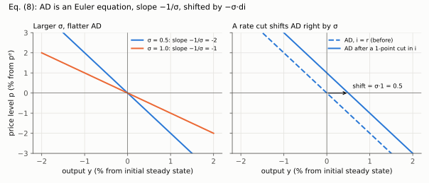
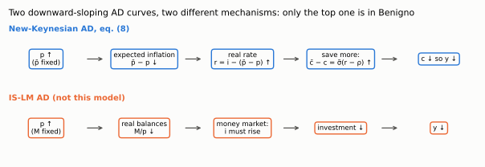

# 1. The household problem and the AD curve

**Article: §3, equations (1)–(8), printed pages 505–506.** Up: [[00-index]] ·
Next: [[02-firms-and-as]] · Rules: [[08_adas_microfundamentos]]

The aim of this section is one equation — the AD curve (21) — and one idea: in a
New-Keynesian model the demand curve is **an Euler equation**, so the reason it slopes
down is intertemporal substitution, not money demand.

---

## 1.1 The problem

Two periods. The first is "the short run", the second "the long run"; the long run earns
that name because in it all prices are flexible and the classical dichotomy holds
(shown in [[03-natural-and-efficient]]). Preferences, eq. (1):

$$u(C)-v(L)+\beta\left\{u(\bar C)-v(\bar L)\right\},\qquad 0<\beta<1 \tag{1}$$

with $u'>0$, $v'>0$. The constraint, eq. (2), is a **single intertemporal** budget
constraint — there are no separate period constraints, because the household can borrow
and lend freely at the nominal rate $i$:

$$PC+\frac{\bar P\bar C}{1+i} \;=\; WL+\frac{\bar W\bar L}{1+i}+T \tag{2}$$

$T$ is a lump-sum transfer, and it includes firms' profits (footnote 3, p. 505). That
detail is what makes **Ricardian equivalence hold** in this section, and its removal in
§10 is what breaks it — see [[09-deleveraging]].

## 1.2 First-order conditions, in full

Attach a multiplier $\lambda$ to (2) and differentiate the Lagrangian

$$\mathcal{L}=u(C)-v(L)+\beta\left[u(\bar C)-v(\bar L)\right]
+\lambda\left[WL+\frac{\bar W\bar L}{1+i}+T-PC-\frac{\bar P\bar C}{1+i}\right]$$

with respect to each of the four choices:

$$\frac{\partial\mathcal L}{\partial C}=0:\quad u_c(C)=\lambda P \tag{i}$$

$$\frac{\partial\mathcal L}{\partial \bar C}=0:\quad \beta u_c(\bar C)=\lambda\frac{\bar P}{1+i} \tag{ii}$$

$$\frac{\partial\mathcal L}{\partial L}=0:\quad v_l(L)=\lambda W \tag{iii}$$

$$\frac{\partial\mathcal L}{\partial \bar L}=0:\quad \beta v_l(\bar L)=\lambda\frac{\bar W}{1+i} \tag{iv}$$

**The intratemporal conditions.** Divide (iii) by (i), and (iv) by (ii): the multiplier
and the discount factor both cancel,

$$\frac{v_l(L)}{u_c(C)}=\frac{W}{P},\qquad \frac{v_l(\bar L)}{u_c(\bar C)}=\frac{\bar W}{\bar P}$$

The marginal rate of substitution between labour and consumption equals the real wage,
period by period. This is the equation the **firm** will use to turn its marginal cost
into a function of output, in [[02-firms-and-as]]. It is not a demand-side equation at
all; keep it in view.

**The intertemporal condition.** Divide (i) by (ii):

$$\frac{u_c(C)}{\beta u_c(\bar C)}=(1+i)\frac{P}{\bar P}\;\equiv\;1+r \tag{3}$$

which defines the gross real interest rate $1+r$ as the nominal rate deflated by gross
inflation between the two periods. Nothing has been assumed about functional form yet.

## 1.3 Log-linearising the Euler equation

Assume isoelastic utility, $u(C)=\left(C^{1-\tilde\sigma^{-1}}-1\right)/(1-\tilde\sigma^{-1})$,
so that $u_c(C)=C^{-\tilde\sigma^{-1}}$ with $\tilde\sigma>0$. Substitute into (3):

$$\frac{C^{-\tilde\sigma^{-1}}}{\beta\,\bar C^{-\tilde\sigma^{-1}}}=1+r$$

Multiply both sides by $\beta$ and collect the two powers into one ratio:

$$\left(\frac{C}{\bar C}\right)^{-\tilde\sigma^{-1}}=\beta(1+r)$$

Take logs of both sides. The left side becomes $-\tilde\sigma^{-1}(\ln C-\ln\bar C)$; with
lower-case letters as log-deviations from a common steady state ([[00-index]]), the
steady-state logs cancel in the difference, so $\ln C-\ln\bar C=c-\bar c$:

$$-\tilde\sigma^{-1}\left(c-\bar c\right)=\ln\beta+\ln(1+r)$$

Now two approximations, both first-order and both standard: $\ln(1+r)\simeq r$, and
$\rho\equiv-\ln\beta$ (a definition, so $\ln\beta=-\rho$ exactly):

$$-\tilde\sigma^{-1}\left(c-\bar c\right)=r-\rho$$

Multiply through by $-\tilde\sigma$, which turns $-(c-\bar c)$ into $\bar c-c$:

$$\boxed{\;\bar c - c = \tilde\sigma\,(r-\rho)\;} \tag{4}$$

Read it twice. Consumption *growth* between the two periods is increasing in the real
rate. A high $r$ means the household postpones: $c$ low, $\bar c$ high. A low $r$
discourages saving and pulls consumption forward. $\tilde\sigma$ is the strength of that
willingness to reallocate — the elasticity of intertemporal substitution.

Substituting $r=i-(\bar p-p)$, which is the same first-order approximation applied to
$1+r=(1+i)P/\bar P$. Step by step: take logs of that definition,

$$\ln(1+r)=\ln(1+i)+\ln P-\ln\bar P,$$

use $\ln(1+x)\simeq x$ on both rates, and note that $\ln P-\ln\bar P=p-\bar p$ once the
common steady-state log price cancels:

$$r\simeq i+p-\bar p=i-(\bar p-p).$$

Solve (4) for $c$ (subtract $\bar c$ from both sides and multiply by $-1$),
$c=\bar c-\tilde\sigma(r-\rho)$, and insert this $r$:

$$c = \bar c - \tilde\sigma\left[i-(\bar p - p)-\rho\right] \tag{5}$$

**This is already a demand curve.** Hold $i$, $\bar p$ and $\bar c$ fixed and vary the
current price level $p$. Higher $p$ today, with $\bar p$ given, means *lower* expected
inflation $(\bar p-p)$, so a higher real rate, so more saving and less current
consumption. The negative relation between $p$ and $c$ is the AD curve, and it arrived
without money appearing anywhere.

## 1.4 From consumption to output

Goods-market clearing in each period, $Y=C+G$ and $\bar Y=\bar C+\bar G$. Using the
scaling conventions of footnote 4 (p. 506) — $y$ and $c$ are proportional deviations
from *their own* steady states but $g$ is scaled by steady-state **output** — the
first-order approximation is

$$y=s_c c+g,\qquad \bar y=s_c\bar c+\bar g \tag{$\star$}$$

Derivation of $(\star)$, since the article leaves it in a footnote. Start from
$Y-\tilde Y=(C-\tilde C)+(G-\tilde G)$ and divide by $\tilde Y$:

$$\frac{Y-\tilde Y}{\tilde Y}=\frac{\tilde C}{\tilde Y}\cdot\frac{C-\tilde C}{\tilde C}+\frac{G-\tilde G}{\tilde Y}
\;\Longrightarrow\; y=s_c c+g$$

Invert $(\star)$ for $c$ and $\bar c$: subtract $g$ and divide by $s_c$, so
$c=(y-g)/s_c$ and $\bar c=(\bar y-\bar g)/s_c$. Substitute both into (5):

$$\frac{y-g}{s_c}=\frac{\bar y-\bar g}{s_c}-\tilde\sigma\left[i-(\bar p-p)-\rho\right]$$

Multiply both sides by $s_c$:

$$y-g=\bar y-\bar g-\tilde\sigma s_c\left[i-(\bar p-p)-\rho\right]$$

Add $g$ to both sides, group $g-\bar g$, and define $\sigma\equiv\tilde\sigma s_c$:

$$\boxed{\;y=\bar y+(g-\bar g)-\sigma\left[i-(\bar p-p)-\rho\right]\;} \tag{6}$$

Two things to notice, both examinable.

- **$\sigma$ is not the EIS.** It is the EIS times the consumption share. A one-point
  move in the real rate moves *output* by $\sigma$, because only the consumption part of
  output responds. Every multiplier in [[07-fiscal-multipliers]] is a function of
  $\sigma$, not of $\tilde\sigma$.
- **Public spending enters as a difference.** Only $g-\bar g$ shifts AD. A permanent
  increase in spending — $g$ and $\bar g$ up together — does not shift the demand curve
  at all. That single fact is why "permanent fiscal policy does not alter the output
  gap" in §8.

## 1.5 Adding distortionary taxes

Now put taxes on consumption and on wage income into the constraint:

$$(1+\tau_c)PC+\frac{(1+\bar\tau_c)\bar P\bar C}{1+i}=(1-\tau_l)WL+\frac{(1-\bar\tau_l)\bar W\bar L}{1+i}+T$$

Redo §1.2 with this constraint. Each price in the constraint is now tax-inclusive, so
the four first-order conditions become

$$u_c(C)=\lambda(1+\tau_c)P,\quad
\beta u_c(\bar C)=\lambda\frac{(1+\bar\tau_c)\bar P}{1+i},\quad
v_l(L)=\lambda(1-\tau_l)W,\quad
\beta v_l(\bar L)=\lambda\frac{(1-\bar\tau_l)\bar W}{1+i}$$

Divide the third by the first; $\lambda$ cancels. The intratemporal condition picks up a
tax wedge — eq. (7), and it will matter for the AS curve:

$$\frac{v_l(L)}{u_c(C)}=\frac{(1-\tau_l)}{(1+\tau_c)}\frac{W}{P} \tag{7}$$

Divide the first by the second; $\lambda$ cancels again and the intertemporal condition
becomes

$$\frac{u_c(C)}{\beta u_c(\bar C)}=(1+i)\frac{(1+\tau_c)P}{(1+\bar\tau_c)\bar P}$$

Take logs exactly as in §1.3. The left side gives $\tilde\sigma^{-1}(\bar c-c)+\rho$; the
right side gives $\ln(1+i)+\ln(1+\tau_c)-\ln(1+\bar\tau_c)+p-\bar p$, and
$\ln(1+x)\simeq x$ turns it into $i+\tau_c-\bar\tau_c-(\bar p-p)$. Subtract $\rho$ and
multiply by $\tilde\sigma$:

$$\bar c-c=\tilde\sigma\left[i-(\bar p-p)-(\bar\tau_c-\tau_c)-\rho\right]$$

This is (4) with one extra term inside the bracket. Solving for $c$ and repeating §1.4
line by line (invert $(\star)$, multiply by $s_c$, add $g$) gives the AD curve with
fiscal instruments, eq. (8):

$$\boxed{\;y=\bar y+(g-\bar g)-\sigma\left[i-(\bar p-p)-(\bar\tau_c-\tau_c)-\rho\right]\;} \tag{8}$$

In §5 the long-run output term is written $\bar y_n$, since in the long run output is
always at its natural level; that is eq. (21) and the version used from
[[04-equilibrium-geometry]] onward.

**The consumption-tax term is an expected-inflation term in disguise.** $(\bar\tau_c-\tau_c)$
sits in exactly the slot occupied by $(\bar p-p)$: what the household substitutes over is
the *tax-inclusive* relative price of consumption across dates. So a credible promise to
raise consumption taxes next year is expansionary today, by the same mechanism as a
promise to raise the future price level. That equivalence is the punchline of the
liquidity-trap policy menu in [[08-liquidity-trap]].

## 1.6 What shifts AD, and why each one

| Shift up (right) | Channel |
|---|---|
| $i\downarrow$ | lower real rate for given prices — the policy instrument |
| $g\uparrow$ | adds directly to demand at given consumption |
| $\tau_c\downarrow$ | current consumption is cheaper relative to future |
| $\bar p\uparrow$ | higher expected inflation, lower real rate |
| $\bar\tau_c\uparrow$ | future consumption taxed more: buy now |
| $\bar c_n\uparrow$ (via $\bar a\uparrow$, $\bar g\downarrow$, $\bar\mu\downarrow$) | consumption smoothing against a richer future |

The last row is the model's signature. Expectations about the long run shift demand
today, because the household is solving one intertemporal problem, not two static ones.
In the textbook IS-LM AD curve there is no such row.

**Slope.** Solve (8) for $p$. Open the bracket, so that $p$ appears once, as $-\sigma p$:

$$y=\bar y_n+(g-\bar g)-\sigma\left[i-\bar p-(\bar\tau_c-\tau_c)-\rho\right]-\sigma p$$

Add $\sigma p$ to both sides and subtract $y$:

$$\sigma p=\bar y_n+(g-\bar g)-y-\sigma\left[i-\bar p-(\bar\tau_c-\tau_c)-\rho\right]$$

Divide by $\sigma$ and move $\bar p$ out of the bracket:

$$p=\bar p+\frac{1}{\sigma}\left[\bar y_n+(g-\bar g)-y\right]-\left[i-(\bar\tau_c-\tau_c)-\rho\right]
\qquad\Longrightarrow\qquad \left.\frac{dp}{dy}\right|_{AD}=-\frac{1}{\sigma}$$

(An earlier version of this line had $-\frac{1}{\sigma}[\dots]$, which would give slope
$+1/\sigma$; the sign is $+$, as `check_multipliers.py` now verifies.)

*Left: the AD line pivots flatter as σ rises. Right: a one-point cut in i moves every point of AD right by σ = 0.5 at the same p.*

so AD is **flatter the larger $\sigma$ is**: when households substitute readily across
time, a small price change is enough to move output a lot. Compare the AS slope $+\kappa$
in [[02-firms-and-as]]; their ratio is what every comparative static in §6–§8 turns on.

## 1.7 The trap this section exists to prevent

Two curves slope down in the $(y,p)$ plane and they are not the same curve.

*Read each row left to right: the top chain never touches money; the bottom chain needs a fixed M and an LM curve, neither of which exists here.*

- **IS-LM AD.** $p\uparrow$ raises nominal money demand; with $M$ fixed the interest
  rate must rise to clear the money market; investment and output fall. The mechanism
  runs through **an LM curve and a fixed money stock**.
- **New-Keynesian AD, eq. (8).** $p\uparrow$ with $\bar p$ given lowers expected
  inflation, raises the real rate at a **fixed nominal rate set by the central bank**,
  and the household postpones consumption. There is no money stock in the model and no
  LM curve to draw.

Saying "prices rise, so money demand rises, so interest rates rise" in this model is not
a shortcut; it is a different model. The central bank here *sets* $i$.
