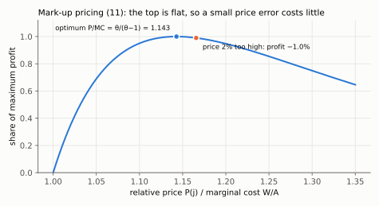
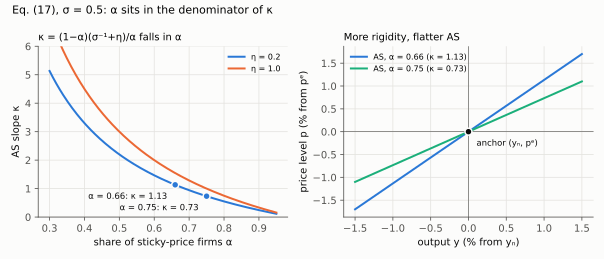
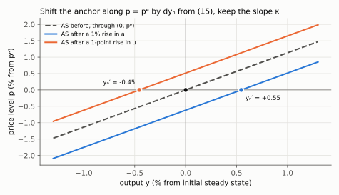

# 2. Firms, mark-up pricing and the AS curve

**Article: §4 and §4.1, equations (9)–(17), printed pages 506–508.** Up: [[00-index]] ·
Prev: [[01-household-and-ad]] · Next: [[03-natural-and-efficient]]

Target: $p-p^e=\kappa(y-y_n)$, with $\kappa$ derived and not asserted, plus the natural
rate $y_n$ that the curve is anchored on.

---

## 2.1 The environment

A continuum of producers, each making a differentiated good. Consumer preferences over
varieties are Dixit–Stiglitz, which delivers the demand curve faced by firm $j$:

$$Y(j)=\left(\frac{P(j)}{P}\right)^{-\theta}(C+G),\qquad \theta>0 \tag{9}$$

This is a *derived* demand: footnote 5 (p. 507) notes it follows from $C$ and $G$ being
CES aggregators of all goods, as in Dixit and Stiglitz (1977) and Woodford (2003, ch. 3).
The constant-elasticity form is what makes the mark-up constant, hence what makes the
whole model tractable.

Technology is linear in labour, $Y(j)=AL(j)$, with $A$ a productivity shock. Profits,
with a sales tax $\tau_y$ and a payroll tax $\tau_w$ on labour costs:

$$\Pi(j)=(1-\tau_y)P(j)Y(j)-(1+\tau_w)WL(j) \tag{10}$$

**Price rigidity.** In the short run a fraction $\alpha\in(0,1)$ of firms must keep
$P(j)=P^e$, pre-set on an information set dated before the shocks. At that price they
simply serve whatever (9) asks of them. The remaining $1-\alpha$ re-optimise. In the
long run everybody re-optimises.

Two justifications worth keeping, both from p. 507. First, under monopolistic
competition a firm at its optimum has zero first-order loss from a small price error, so
even tiny unmodelled menu costs (Mankiw, 1985) rationalise not moving — the loss is
second order. Second, the same algebra describes a **sticky-information** model, because
$P^e$ is set on pre-shock information rather than physically frozen.

## 2.2 The optimal price, derived

Substitute (9) and $L(j)=Y(j)/A$ into (10), and use that firm $j$ is too small to move
$P$ or $C+G$:

$$\Pi(j)=(1-\tau_y)P(j)^{1-\theta}P^{\theta}(C+G)-(1+\tau_w)\frac{W}{A}P(j)^{-\theta}P^{\theta}(C+G)$$

Differentiate with respect to $P(j)$ and set to zero, using the power rule on each
term: $\frac{d}{dP(j)}P(j)^{1-\theta}=(1-\theta)P(j)^{-\theta}$ and
$\frac{d}{dP(j)}P(j)^{-\theta}=-\theta P(j)^{-\theta-1}$. The second term's two minus
signs make a plus. The common factor $P^{\theta}(C+G)$ is positive and cancels:

$$(1-\tau_y)(1-\theta)P(j)^{-\theta}+\theta(1+\tau_w)\frac{W}{A}P(j)^{-\theta-1}=0$$

Multiply by $P(j)^{\theta+1}$, which turns $P(j)^{-\theta}$ into $P(j)$ and
$P(j)^{-\theta-1}$ into $1$:

$$(1-\tau_y)(1-\theta)P(j)+\theta(1+\tau_w)\frac{W}{A}=0$$

Move the first term to the right side, where $-(1-\theta)=\theta-1$:

$$(1-\tau_y)(\theta-1)P(j)=\theta(1+\tau_w)\frac{W}{A}$$

Divide both sides by $(1-\tau_y)(\theta-1)$, which is positive because $\theta>1$:

$$\quad\Longrightarrow\quad
P(j)=\frac{\theta}{\theta-1}\cdot\frac{(1+\tau_w)}{(1-\tau_y)}\cdot\frac{W}{A}$$

which is eq. (11), a **mark-up over marginal cost** $W/A$:

$$P(j)=(1+\tilde\mu)\frac{W}{A},\qquad
1+\tilde\mu\equiv\frac{\theta}{\theta-1}\frac{(1+\tau_w)}{(1-\tau_y)} \tag{11}$$

Sanity checks on (11). As $\theta\to\infty$ the goods become perfect substitutes,
$\theta/(\theta-1)\to1$, and price collapses to marginal cost: perfect competition.
$\theta>1$ is required for a finite mark-up. And a sales tax and a payroll tax are, for
this firm, the same object — both widen the wedge between price and the real cost of
labour.

*With θ = 8 the optimal price is 1.143 times marginal cost; pricing 2% too high loses only about 1% of profit, which is the second-order loss that makes small menu costs enough to keep prices sticky (§2.1).*

## 2.3 From the mark-up to a price–output relation

Divide (11) by $P$ and write $\tilde P$ for the common price of the $1-\alpha$
adjusting firms:

$$\frac{\tilde P}{P}=(1+\tilde\mu)\frac{W}{PA}$$

Now eliminate the real wage with the household's intratemporal condition (7) from
[[01-household-and-ad]], $W/P=\frac{(1+\tau_c)}{(1-\tau_l)}\frac{v_l(L)}{u_c(C)}$:

$$\frac{\tilde P}{P}=\underbrace{(1+\tilde\mu)\frac{(1+\tau_c)}{(1-\tau_l)}}_{\textstyle \equiv\,1+\mu}
\cdot\frac{v_l(L)}{A\,u_c(C)}
=\frac{(1+\mu)}{A}\cdot\frac{L^{\eta}}{C^{-\tilde\sigma^{-1}}} \tag{12}$$

the last step using $v(L)=L^{1+\eta}/(1+\eta)\Rightarrow v_l=L^{\eta}$ and
$u_c=C^{-\tilde\sigma^{-1}}$. Collecting the definition of the **aggregate mark-up**,
eq. (13):

$$1+\mu=(1+\mu_\theta)\frac{(1+\tau_w)(1+\tau_c)}{(1-\tau_y)(1-\tau_l)},
\qquad 1+\mu_\theta=\frac{\theta}{\theta-1} \tag{13}$$

Read (13) as a list of four taxes and one market structure that all do the same thing.
Nothing in the model can tell a monopoly wedge from a tax wedge — which is exactly why
§7's "mark-up shock" can be read as OPEC, as a VAT rise, or as market concentration.

Note $P\neq\tilde P$: the general index also contains the frozen prices $P^e$. Keeping
those two apart is the whole content of the next two steps.

## 2.4 The natural level of output

**Definition.** $Y_n$ is the output that would prevail if *every* firm could reset its
price. Then $\tilde P=P$ and $P(j)=P$ for all $j$, so the left side of (12) is one. With
$C=Y_n-G$ and $L=Y_n/A$:

$$\frac{(Y_n/A)^{\eta}}{(Y_n-G)^{-\tilde\sigma^{-1}}}=\frac{A}{1+\mu} \tag{14}$$

First rewrite the left side: dividing by $(Y_n-G)^{-\tilde\sigma^{-1}}$ is multiplying
by $(Y_n-G)^{\tilde\sigma^{-1}}$, so (14) reads
$(Y_n/A)^{\eta}(Y_n-G)^{\tilde\sigma^{-1}}=A/(1+\mu)$. Take logs of both sides — a
product becomes a sum and each power becomes a coefficient:

$$\eta\left(\ln Y_n-\ln A\right)+\tilde\sigma^{-1}\ln(Y_n-G)=\ln A-\ln(1+\mu)$$

Subtract the same equation evaluated at the steady state (where $\mu=0$ and the logs
take their steady-state values); every term becomes a log-deviation, with $c_n$ the
log-deviation of natural consumption $Y_n-G$ (footnote 6, p. 508):

$$\eta\,(y_n-a)+\tilde\sigma^{-1}c_n=a-\ln(1+\mu)$$

Use $\ln(1+\mu)\simeq\mu$, and eliminate $c_n$ with $y_n=s_c c_n+g$ so that
$c_n=(y_n-g)/s_c$. Since $\sigma\equiv\tilde\sigma s_c$, inverting gives
$\tilde\sigma^{-1}=s_c\sigma^{-1}$, so the second term is
$\tilde\sigma^{-1}c_n=s_c\sigma^{-1}(y_n-g)/s_c=\sigma^{-1}(y_n-g)$. Expanding both
products:

$$\eta y_n-\eta a+\sigma^{-1}y_n-\sigma^{-1}g=a-\mu$$

Keep the $y_n$ terms on the left and move $-\eta a$ and $-\sigma^{-1}g$ to the right:

$$\left(\sigma^{-1}+\eta\right)y_n=(1+\eta)\,a+\sigma^{-1}g-\mu$$

Divide both sides by $\sigma^{-1}+\eta$:

$$\boxed{\;y_n=\frac{1+\eta}{\sigma^{-1}+\eta}\,a+\frac{\sigma^{-1}}{\sigma^{-1}+\eta}\,g-\frac{1}{\sigma^{-1}+\eta}\,\mu\;} \tag{15}$$

Signs, each with its economics:

- $\partial y_n/\partial a>0$ — better technology raises the output at which the real
  wage the household demands equals the real wage the firm can pay.
- $\partial y_n/\partial g>0$ — public spending is a negative wealth effect; a poorer
  household takes less leisure and works more. This is a *supply* channel, and it is why
  AS moves when $g$ moves.
- $\partial y_n/\partial\mu<0$ — a wider wedge means firms want a higher price at any
  output, i.e. they want less output at any real wage.

> **Transcription warning.** The project markdown of the article renders the coefficient
> on $g$ as $(\sigma^{-1}-1)/(\sigma^{-1}+\eta)$, and [[08_adas_microfundamentos]]
> copied it. It is $\sigma^{-1}/(\sigma^{-1}+\eta)$ — the string $\sigma^{-1}$ is
> mangled by the PDF extraction. Three confirmations:
> 1. the log-linearisation above, done from (14) directly;
> 2. Benigno's own text on p. 508: *"When the disutility of labor is linear, i.e.
>    $\eta=0$, output rises one-to-one with public expenditure, while consumption remains
>    unchanged."* With the correct coefficient, $\partial y_n/\partial g=\sigma^{-1}/\sigma^{-1}=1$.
>    With $(\sigma^{-1}-1)$ it is $1-\sigma$, contradicting the sentence;
> 3. Table 1's long-run spending multiplier, $m_{\bar g}=\eta/[(\sigma^{-1}+\eta)(1+\kappa\sigma)]$,
>    follows only from the correct coefficient — see [[07-fiscal-multipliers]] §7.3.

## 2.5 The short-run AS curve

Divide (12) by (14) — that is, take the ratio of the adjusting firm's desired relative
price to the same object evaluated at the natural rate. Every constant, including
$(1+\mu)$ and $A$, cancels. Write (12) at actual output, with $L=Y/A$ and $C=Y-G$, and
(14) with its left side equal to one:

$$\frac{\tilde P}{P}=\frac{1+\mu}{A}\left(\frac{Y}{A}\right)^{\eta}(Y-G)^{\tilde\sigma^{-1}},
\qquad
1=\frac{1+\mu}{A}\left(\frac{Y_n}{A}\right)^{\eta}(Y_n-G)^{\tilde\sigma^{-1}}$$

Divide the first by the second. $(1+\mu)/A$ cancels, and $(Y/A)^{\eta}/(Y_n/A)^{\eta}=(Y/Y_n)^{\eta}$
because the $A$'s cancel inside the ratio:

$$\frac{\tilde P}{P}=\left(\frac{Y}{Y_n}\right)^{\eta}\left(\frac{Y-G}{Y_n-G}\right)^{\tilde\sigma^{-1}}$$

Log-linearise. The left side is $\ln\tilde P-\ln P=\tilde p-p$. The first factor gives
$\eta(\ln Y-\ln Y_n)=\eta(y-y_n)$; the second gives
$\tilde\sigma^{-1}(c-c_n)=\tilde\sigma^{-1}(y-y_n)/s_c=\sigma^{-1}(y-y_n)$, since
$c-c_n=[(y-g)-(y_n-g)]/s_c$ and $g$ is the same on both sides:

$$\tilde p-p=\left(\sigma^{-1}+\eta\right)(y-y_n) \tag{16}$$

**This is the marginal-cost equation.** Producing above the natural rate pushes the real
wage up along the labour-supply curve ($\eta$) and up along the consumption-smoothing
margin ($\sigma^{-1}$), so real marginal cost rises and the unconstrained firm wants a
higher relative price.

Now aggregate. The price index is the weighted average of frozen and flexible prices:

$$p=\alpha p^e+(1-\alpha)\tilde p$$

Solve for $\tilde p-p$, which is what (16) delivers. First isolate $\tilde p$: subtract
$\alpha p^e$ and divide by $1-\alpha$, so $\tilde p=(p-\alpha p^e)/(1-\alpha)$. Then
subtract $p$, over the common denominator $1-\alpha$:

$$\tilde p-p=\frac{p-\alpha p^e}{1-\alpha}-p=\frac{p-\alpha p^e-(1-\alpha)p}{1-\alpha}
=\frac{\alpha p-\alpha p^e}{1-\alpha}=\frac{\alpha}{1-\alpha}\left(p-p^e\right)$$

Equate to (16):

$$\frac{\alpha}{1-\alpha}\left(p-p^e\right)=\left(\sigma^{-1}+\eta\right)(y-y_n)$$

and multiply both sides by $(1-\alpha)/\alpha$ to isolate $p-p^e$:

$$\boxed{\;p-p^e=\kappa\,(y-y_n),\qquad
\kappa\equiv\frac{(1-\alpha)\left(\sigma^{-1}+\eta\right)}{\alpha}\;} \tag{17}$$

## 2.6 Everything $\kappa$ tells you

$$\frac{\partial\kappa}{\partial\alpha}<0,\qquad
\frac{\partial\kappa}{\partial\eta}>0,\qquad
\frac{\partial\kappa}{\partial\sigma}<0$$

Each sign from one derivative. Write $\kappa=\left(\tfrac{1}{\alpha}-1\right)(\sigma^{-1}+\eta)$;
then $\partial\kappa/\partial\alpha=-(\sigma^{-1}+\eta)/\alpha^{2}<0$. $\kappa$ is linear in
$\eta$ with slope $(1-\alpha)/\alpha>0$. And $\partial\sigma^{-1}/\partial\sigma=-\sigma^{-2}$,
so $\partial\kappa/\partial\sigma=-(1-\alpha)/(\alpha\sigma^{2})<0$.

*Left: κ falls steeply as α rises, and it is higher at every α when η = 1. Right: the two calibrated AS lines pivot around the same anchor; α = 0.75 is flatter.*

- **More rigidity flattens AS.** As $\alpha\to1$, $\kappa\to0$: with almost nobody able
  to reset, output moves and the price level does not. As $\alpha\to0$, $\kappa\to\infty$:
  AS is vertical and we are back to the classical model. Students routinely get this
  backwards; the mnemonic is that $\alpha$ sits in the **denominator**.
- **Steeper labour supply steepens AS**, since $\eta$ is the inverse Frisch elasticity:
  if hours are hard to expand, the extra output is expensive.
- $\kappa$ is not a free parameter. It is $(1-\alpha)/\alpha$ times the *same*
  $(\sigma^{-1}+\eta)$ that scales the natural rate in (15). The two curves share deep
  parameters, and [[07-fiscal-multipliers]] shows the cancellations that come from it.

**Calibration** (p. 515). In a Calvo scheme the expected price duration is
$D=1/(1-\alpha)$, so three quarters for the United States implies $\alpha\simeq0.66$;
$\alpha=0.75$ is the higher-rigidity experiment. With $\sigma=0.5$ and $\eta=0.2$,
$\sigma^{-1}+\eta=2+0.2=2.2$, so $\kappa=(0.34)(2.2)/0.66=0.748/0.66\simeq1.13$.

## 2.7 The plotting rule, and why it is the only thing to memorise

Set $y=y_n$ in (17): then $p=p^e$. So

> **AS always passes through the point $(p^e,\,y_n)$.**

Both coordinates of that anchor are *predetermined or real*: $p^e$ was set before the
shock, and $y_n$ comes from (15). So to shift AS after any shock, do exactly two things:
recompute $y_n$ from (15), then redraw a line of slope $\kappa$ through $(p^e,y_n')$.
A rise in $a$ or $g$, or a fall in $\mu$, moves the anchor right, so AS shifts **down and
right** (Fig. 2, p. 510).

*A 1% rise in a moves yₙ by (1+η)/(σ⁻¹+η) = 0.55; a one-point rise in μ moves it by −1/(σ⁻¹+η) = −0.45. Each new AS is the old line slid along p = pᵉ to the new anchor.*

## 2.8 One honest caveat about what this curve is

Eq. (17) is **not** a New-Keynesian Phillips curve. It relates the price *level* to the
*level* of the output gap, it has no $E_t\pi_{t+1}$ in it, and it is the object
undergraduate textbooks call the New-Classical Phillips curve, derived on different
principles by Phelps (1967) and Lucas (1973) from imperfect information rather than
sticky prices. Benigno says this in the open (p. 508) and footnote 7 explains why the
Calvo alternative is left out: it would add forward-looking terms without changing any
qualitative result in §6–§11. The cost is real, and he states it in §12 — this model
cannot speak about inflation *dynamics* or disinflation paths.
