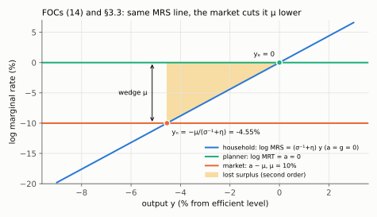
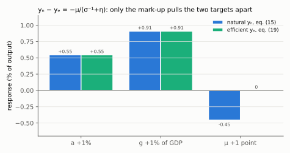

# 3. Long run, policy instruments, and the natural vs. efficient distinction

**Article: §4.2–§4.4, equations (18)–(19), printed pages 508–509.** Up: [[00-index]] ·
Prev: [[02-firms-and-as]] · Next: [[04-equilibrium-geometry]]

This is the shortest section of the article and the one that decides the answer to every
policy question in Aula 9. It contains one subtraction: $y_n-y_e$.

---

## 3.1 The long run: classical dichotomy, recovered

In period two every firm resets, so §2.4 applies with no sticky-price fraction at all:
output *is* the natural level, and the long-run Phillips curve is **vertical**. Write
(15) with bars:

$$\bar y_n=\frac{1+\eta}{\sigma^{-1}+\eta}\,\bar a+\frac{\sigma^{-1}}{\sigma^{-1}+\eta}\,\bar g-\frac{1}{\sigma^{-1}+\eta}\,\bar\mu$$

Long-run consumption follows from $\bar y_n=s_c\bar c_n+\bar g$: subtract $\bar g$ and
divide by $s_c$. Substitute $\bar y_n$ from the line above and write the lone $\bar g$ over
the common denominator, $\bar g=\bar g(\sigma^{-1}+\eta)/(\sigma^{-1}+\eta)$, so that the
two $\bar g$ coefficients can be subtracted inside one bracket:

$$\bar c_n=\frac{\bar y_n-\bar g}{s_c}
=\frac{1}{s_c(\sigma^{-1}+\eta)}\Big[(1+\eta)\bar a+\underbrace{\left(\sigma^{-1}-\sigma^{-1}-\eta\right)}_{=\,-\eta}\bar g-\bar\mu\Big]$$

$$\boxed{\;\bar c_n=\frac{1+\eta}{s_c(\sigma^{-1}+\eta)}\,\bar a-\frac{\eta}{s_c(\sigma^{-1}+\eta)}\,\bar g-\frac{1}{s_c(\sigma^{-1}+\eta)}\,\bar\mu\;}$$

Three readings, all in the article's text on p. 508, and each a check on the algebra:

| Statement (p. 508) | The algebra that carries it |
|---|---|
| Money is neutral in the long run | $\bar p$ appears nowhere in $\bar y_n$ or $\bar c_n$ |
| Fiscal policy is **not** neutral: any tax rise raises the mark-up and cuts both output and consumption | $\bar\mu$ enters both with a negative sign, and (13) makes every tax a component of $\bar\mu$ |
| With linear disutility of labour ($\eta=0$), output rises one-to-one with $\bar g$ while consumption is unchanged | $\partial\bar y_n/\partial\bar g=\sigma^{-1}/\sigma^{-1}=1$ and $\partial\bar c_n/\partial\bar g=-\eta/[\cdot]=0$ |

That third row is the cleanest proof that the coefficient on $g$ in (15) is
$\sigma^{-1}$, not $(\sigma^{-1}-1)$ — see the warning box in [[02-firms-and-as]] §2.4.

**Why $\bar c_n$ deserves a name.** It is the only channel through which the *future*
reaches the *present*: it sits inside the AD curve (21) through $\bar y_n$. Anything
that makes tomorrow richer — $\bar a\uparrow$, $\bar g\downarrow$, $\bar\mu\downarrow$ —
raises demand today by the consumption-smoothing motive. Aula 9's optimism case (§6.3)
is nothing but a shock to this object.

## 3.2 Closing the model: who sets what

The article is explicit about the instrument assignment (§4.3, pp. 508–509), and being
sloppy about it is the fastest way to get a comparative static wrong:

| Horizon | Monetary policy | Fiscal policy |
|---|---|---|
| Long run | sets $\bar p$ — it can do nothing else, by neutrality | $\bar g$ and $\{\bar\tau_l,\bar\tau_w,\bar\tau_c,\bar\tau_y\}$ |
| Short run | sets the nominal rate $i$ | $g$ and $\{\tau_l,\tau_w,\tau_c,\tau_y\}$ |

The government's intertemporal budget constraint, eq. (18), closes the fiscal side with
the lump-sum transfer $T$ as residual:

$$\tau_yPY+\tau_cPC+(\tau_w+\tau_l)WL+\frac{\bar\tau_y\bar P\bar Y+\bar\tau_c\bar P\bar C+(\bar\tau_w+\bar\tau_l)\bar W\bar L}{1+i}
=PG+\frac{\bar P\bar G}{1+i}+T \tag{18}$$

Because $T$ is lump-sum and absorbs any residual, **Ricardian equivalence holds
throughout §3–§9**. Every fiscal experiment in [[07-fiscal-multipliers]] is implicitly
financed by adjusting $T$, and the article flags (p. 516) that this is a real
qualification: if lump-sum transfers were unavailable, a spending rise would have to be
matched by a distorting tax, and the two effects would partly cancel. Ricardian
equivalence fails only in [[09-deleveraging]], where the *distribution* of $T$ between
borrowers and savers starts to matter.

## 3.3 The efficient level of output

Now a different question: not what a decentralised economy with flexible prices does,
but what a planner would choose. Maximise the period utility

$$u(C)-v(L)\qquad\text{s.t.}\qquad Y=C+G,\quad Y=AL$$

Substitute both constraints to make this a one-variable problem in $Y$:

$$\max_{Y}\;u(Y-G)-v\!\left(\frac{Y}{A}\right)$$

First-order condition. Differentiate with the chain rule: the inner derivative of
$Y-G$ with respect to $Y$ is $1$, and that of $Y/A$ is $1/A$:

$$u_c(Y_e-G)\cdot 1-v_l\!\left(\frac{Y_e}{A}\right)\cdot\frac{1}{A}=0$$

Move the second term to the right, multiply both sides by $A$ and divide by
$u_c(Y_e-G)$:

$$\frac{v_l(Y_e/A)}{u_c(Y_e-G)}=A$$

The marginal rate of substitution between labour and consumption is set equal to the
**marginal rate of transformation**, which is productivity $A$. Compare this with the
natural-rate condition (14), which reads $v_l/u_c=A/(1+\mu)$: they are the same equation
except that the decentralised economy carries the wedge $1+\mu$. Log-linearising exactly
as in §2.4 but with $\mu=0$. With the isoelastic forms, the condition is
$(Y_e/A)^{\eta}(Y_e-G)^{\tilde\sigma^{-1}}=A$; take logs, subtract the steady state, and
use $\tilde\sigma^{-1}c_e=\sigma^{-1}(y_e-g)$ as in §2.4:

$$\eta\,(y_e-a)+\sigma^{-1}(y_e-g)=a$$

Collect $y_e$ on the left, $(\sigma^{-1}+\eta)y_e=(1+\eta)a+\sigma^{-1}g$, and divide by
$\sigma^{-1}+\eta$:

$$\boxed{\;y_e=\frac{1+\eta}{\sigma^{-1}+\eta}\,a+\frac{\sigma^{-1}}{\sigma^{-1}+\eta}\,g\;} \tag{19}$$

*The household's MRS line is the same in both problems. The planner sets it equal to a; the market sets it equal to a − μ, μ lower, so with μ = 10% output stops 4.55% short. The shaded triangle is the surplus lost between yₙ and yₑ.*

## 3.4 The subtraction that organises Aula 9

Subtract (19) from (15). The $a$ and $g$ terms are **identical** and cancel:

$$y_n-y_e=\underbrace{\frac{(1+\eta)(a-a)}{\sigma^{-1}+\eta}}_{=\,0}
+\underbrace{\frac{\sigma^{-1}(g-g)}{\sigma^{-1}+\eta}}_{=\,0}
-\frac{\mu}{\sigma^{-1}+\eta}$$

$$\boxed{\;y_n-y_e=-\frac{\mu}{\sigma^{-1}+\eta}\;}$$

*Read each pair of bars: a and g move both targets by the same amount (0.55 and 0.91), so their difference is zero; only μ separates them, moving yₙ by −0.45 and yₑ not at all.*

Everything in §6–§11 follows from the two properties of that line:

1. **Productivity and public spending move $y_n$ and $y_e$ by exactly the same amount.**
   They are *efficient* shocks: the economy's target moves with its capacity. Tracking
   the natural rate and tracking welfare are then the same policy, so monetary policy
   can stabilise prices **and** deliver the efficient allocation at once — the divine
   coincidence of [[05-productivity-shocks]].
2. **The mark-up moves $y_n$ only.** It is an *inefficient* shock: capacity as the market
   computes it falls, while what a planner would want does not move. Now the two
   objectives point in different directions, and policy has to choose — the trade-off of
   [[06-markup-shocks]], priced exactly in [[10-optimal-policy]].

A corollary that pays off in exam questions: the model has **no steady-state
distortion** only if $\mu=0$. When $\mu>0$ the natural rate sits permanently below the
efficient one, and $y_n-y_e$ is a *level* gap, not just a shock response. Benigno's
footnote 21 (p. 522) is careful here: the quadratic loss function (33) is an
approximation taken around an **efficient steady state** with $\mu=0$; with a distorted
steady state the welfare-relevant target need not be $y_e$ at all, and Benigno and
Woodford (2005) is where that case is done.

## 3.5 The three output concepts, side by side

| Concept | Defined by | Moved by | Role |
|---|---|---|---|
| $y$ | AD $\cap$ AS | everything | what is observed |
| $y_n$ | flexible prices, eq. (15) | $a$, $g$, $\mu$ | the AS anchor; $y-y_n$ drives **prices** |
| $y_e$ | planner, eq. (19) | $a$, $g$ | the welfare target; $y-y_e$ drives **utility loss** |

Using the wrong gap is the single most common error in this material. $p-p^e$ responds
to $y-y_n$, because firms price off marginal cost. Welfare responds to $y-y_e$, because
households consume and work. They coincide when, and only when, $\mu$ does not move.
