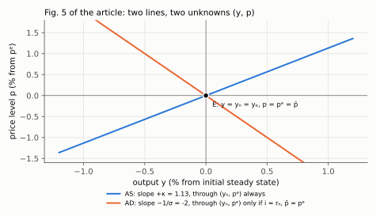
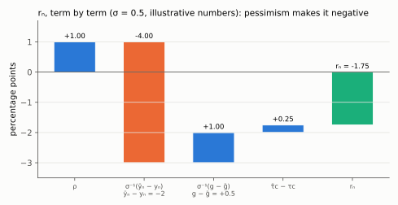
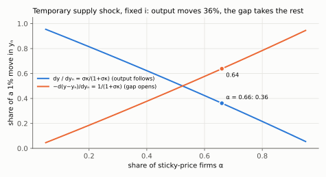
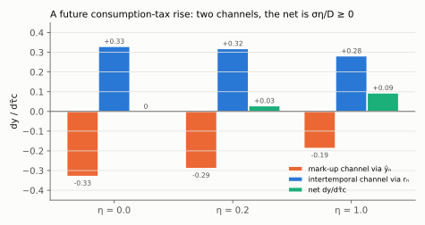

# 4. The AS–AD equilibrium: closed form, slopes, anchors

**Article: §5, equations (20)–(21), Figures 1–5, printed pages 509–511.** Up:
[[00-index]] · Prev: [[03-natural-and-efficient]] · Next: [[05-productivity-shocks]]

Benigno solves the model with a picture. This note also solves it with algebra, because
the closed form turns every later figure into a signed and sized statement. Everything
in notes 5 to 8 is one substitution into the two boxed results below.

> **Companion:** [The Three Lines](companion-as-ad.html) — move $i$, $\bar p$, $a$, $\mu$ and
> $g$ and watch the two curves, the IT line and both gaps respond. The read-outs are the closed
> forms of §4.2 evaluated live.

---

## 4.1 The system

$$\text{AS:}\qquad p-p^e=\kappa\,(y-y_n) \tag{20}$$

$$\text{AD:}\qquad y=\bar y_n+(g-\bar g)-\sigma\left[i-(\bar p-p)-(\bar\tau_c-\tau_c)-\rho\right] \tag{21}$$

Two equations, two unknowns $(p,y)$. Everything else is either a policy instrument
($i$, $\bar p$, $g$, $\bar g$, the taxes) or a shock ($a$, $\bar a$, $\mu$, which enter
through $y_n$ and $\bar y_n$ by (15)).

| | slope $dp/dy$ | anchor point it passes through |
|---|---|---|
| AS | $+\kappa$ | $(p^e,\;y_n)$ — both predetermined or real |
| AD | $-1/\sigma$ | $(p^e,\;y_n)$ **only if** $i=r_n$ and $\bar p=p^e$ |

The asymmetry in the second column is the thing to keep straight. The AS anchor is a
property of the model. The AD anchor is a *normalisation Benigno chooses* for Figs. 3–5
(p. 510): "To simplify the AD graph, we assume to start with that $p=p^e$ and that the
curve also crosses the natural level of output. This assumption requires setting the
nominal and real interest rate at the natural level." Whenever a figure shows both
curves crossing at $y_n$ with $p=p^e$, monetary policy has already been assumed to be
doing exactly the right thing.

*At the article's calibration AS rises with slope κ = 1.13 and AD falls with slope −1/σ = −2; both pass through E only because policy has set i = rₙ and p̄ = pᵉ.*

## 4.2 Solving it

Substitute (20) into (21), writing $p=p^e+\kappa(y-y_n)$. Inside the bracket,
$-(\bar p-p)=-\bar p+p=-\bar p+p^e+\kappa(y-y_n)$:

$$y=\bar y_n+(g-\bar g)-\sigma\left[i-\bar p+p^e+\kappa(y-y_n)-(\bar\tau_c-\tau_c)-\rho\right]$$

Pull the $\kappa(y-y_n)$ term out of the bracket; multiplied by $-\sigma$ it becomes
$-\sigma\kappa y+\sigma\kappa y_n$:

$$y=\bar y_n+(g-\bar g)-\sigma\kappa\,y+\sigma\kappa\,y_n-\sigma\left[i-\rho-(\bar\tau_c-\tau_c)-\bar p+p^e\right]$$

Add $\sigma\kappa y$ to both sides, so the $y$ terms are collected on the left:

$$y\left(1+\sigma\kappa\right)=\bar y_n+(g-\bar g)+\sigma\kappa\,y_n-\sigma\left[i-\rho-(\bar\tau_c-\tau_c)-\bar p+p^e\right]$$

$$\boxed{\;y=\frac{\bar y_n+(g-\bar g)+\sigma\kappa\,y_n-\sigma\left[i-\rho-(\bar\tau_c-\tau_c)-(\bar p-p^e)\right]}{1+\sigma\kappa}\;}$$

Now subtract $y_n$ from both sides. Multiply $y_n$ by $(1+\sigma\kappa)/(1+\sigma\kappa)$
so it sits over the same denominator; the numerator loses $y_n+\sigma\kappa y_n$, and
the $\sigma\kappa y_n$ terms cancel:

$$y-y_n=\frac{\bar y_n+(g-\bar g)+\sigma\kappa\,y_n-y_n-\sigma\kappa\,y_n-\sigma\left[\cdots\right]}{1+\sigma\kappa}$$

$$y-y_n=\frac{\bar y_n-y_n+(g-\bar g)-\sigma\left[i-\rho-(\bar\tau_c-\tau_c)-(\bar p-p^e)\right]}{1+\sigma\kappa}$$

Factor out $\sigma$ from the numerator: the first two terms become
$\sigma\cdot\sigma^{-1}(\bar y_n-y_n)$ and $\sigma\cdot\sigma^{-1}(g-\bar g)$, and opening
the bracket gives $\sigma[-i+\rho+(\bar\tau_c-\tau_c)+(\bar p-p^e)]$:

$$y-y_n=\frac{\sigma}{1+\sigma\kappa}\Big[\underbrace{\rho+\sigma^{-1}(\bar y_n-y_n)+\sigma^{-1}(g-\bar g)+(\bar\tau_c-\tau_c)}_{\equiv\,r_n}-i+(\bar p-p^e)\Big]$$

Give the underbraced sum a name, and multiply the gap by $\kappa$ to get prices through
(20), $p-p^e=\kappa(y-y_n)$:

$$\boxed{\;y-y_n=\frac{\sigma}{1+\sigma\kappa}\Big[\,r_n-i+(\bar p-p^e)\,\Big],
\qquad p-p^e=\frac{\sigma\kappa}{1+\sigma\kappa}\Big[\,r_n-i+(\bar p-p^e)\,\Big]\;}$$

with the **natural real rate of interest**

$$\boxed{\;r_n\equiv\rho+\sigma^{-1}\left(\bar y_n-y_n\right)+\sigma^{-1}\left(g-\bar g\right)+\left(\bar\tau_c-\tau_c\right)\;}$$

## 4.3 What $r_n$ is, and why it is the whole of monetary policy here

$r_n$ is defined by construction as the nominal rate that delivers **both** $y=y_n$ and
$p=p^e$ when long-run prices are anchored at $p^e$. Check it: set $i=r_n$ and
$\bar p=p^e$ in the boxed results and both gaps are zero. Read its four terms:

- $\rho$ — impatience. Even with a flat consumption path the real rate must compensate
  time preference.
- $\sigma^{-1}(\bar y_n-y_n)$ — the **growth** term. An economy expected to be much
  richer tomorrow wants to borrow today, which requires a high real rate to choke off.
  Equivalently: bad long-run prospects ($\bar y_n$ low) push $r_n$ **down**, possibly
  below zero. This single term is the origin of the liquidity trap in
  [[08-liquidity-trap]].
- $\sigma^{-1}(g-\bar g)$ — temporarily high public spending crowds out and raises the
  natural rate.
- $(\bar\tau_c-\tau_c)$ — an expected consumption-tax rise acts exactly like expected
  inflation.

*Illustrative numbers with σ = 0.5: expected output 2% below current output contributes σ⁻¹·(−2) = −4 points, enough to outweigh ρ = 1, temporary spending and a rising consumption-tax path, so rₙ = −1.75%.*

The whole of §6 and §7 can now be stated in one sentence: *a shock moves $y_n$ and
$r_n$; policy is right when $i$ moves to match the new $r_n$; the residual gap is
$\sigma(r_n-i)/(1+\sigma\kappa)$.*

## 4.4 The comparative-statics machine

Differentiate the two boxed lines. This is the only computation needed in notes 5 to 8.
Start from the gap line, holding taxes fixed. Differentiating $r_n$ gives
$dr_n=\sigma^{-1}(d\bar y_n-dy_n)+\sigma^{-1}(dg-d\bar g)$, so

$$d(y-y_n)=\frac{\sigma}{1+\sigma\kappa}\left[\sigma^{-1}(d\bar y_n-dy_n)+\sigma^{-1}(dg-d\bar g)-di+d\bar p\right]$$

and multiplying the $\sigma$ into the bracket cancels each $\sigma^{-1}$ (second line
below). For output, add $dy_n=(1+\sigma\kappa)dy_n/(1+\sigma\kappa)$ to the gap: the
$-dy_n$ in the numerator and the $+dy_n$ from $1\cdot dy_n$ cancel, leaving
$\sigma\kappa\,dy_n$ (first line):

$$dy=\frac{d\bar y_n+\sigma\kappa\,dy_n+(dg-d\bar g)-\sigma\,di+\sigma\,d\bar p}{1+\sigma\kappa}$$

$$d(y-y_n)=\frac{d\bar y_n-dy_n+(dg-d\bar g)-\sigma\,di+\sigma\,d\bar p}{1+\sigma\kappa},
\qquad dp=\kappa\,d(y-y_n)$$

Four facts fall straight out, and they are worth stating before any shock is named:

1. **A current supply shock passes through partially.** With AD fixed,
   $dy/dy_n=\sigma\kappa/(1+\sigma\kappa)\in(0,1)$: output follows the natural rate, but
   never all the way. The residual is the gap, $d(y-y_n)=-dy_n/(1+\sigma\kappa)<0$.
2. **A future shock passes through partially too, but with no offset.**
   $dy/d\bar y_n=1/(1+\sigma\kappa)$, and since $y_n$ has not moved, the entire response
   *is* a gap.
3. **Prices only move with the gap.** $dp=\kappa\,d(y-y_n)$. A shock that leaves the gap
   at zero leaves the price level at $p^e$, whatever it does to output. This is why the
   permanent productivity shock of §6.2 needs no policy at all.
4. **Two instruments, one slot.** $-\sigma\,di$ and $+\sigma\,d\bar p$ appear in exactly
   the same place. Cutting the current nominal rate by one point and raising the expected
   long-run price level by one point do the *same thing* to demand. With $i$ stuck at
   zero, only the second survives — that is the entire content of the Krugman exit in
   [[08-liquidity-trap]].

*Fact 1 as a function of rigidity: at α = 0.66, σκ = 0.567, so output follows 0.567/1.567 = 36% of a move in yₙ and the gap absorbs the other 64%. The curves cross at σκ = 1.*

## 4.5 Slopes, redrawn as economics

$$\left.\frac{dp}{dy}\right|_{AD}=-\frac{1}{\sigma},\qquad
\left.\frac{dp}{dy}\right|_{AS}=+\kappa=\frac{(1-\alpha)(\sigma^{-1}+\eta)}{\alpha}$$

The product $\sigma\kappa$ governs how a shock splits between quantity and price, and it
is worth reading the two limits:

| Case | $\sigma\kappa$ | Split of a supply shock |
|---|---|---|
| Nearly full rigidity, $\alpha\to1$ | $\to0$ | $dy\to d\bar y_n$ direction only; $dp\to0$. Quantities do everything |
| Nearly full flexibility, $\alpha\to0$ | $\to\infty$ | $dy\to dy_n$, gap $\to0$, $dp$ absorbs the rest. Classical model |

And the intuition behind $-1/\sigma$: a *flat* AD means households substitute readily, so
a tiny price change (hence tiny real-rate change) reallocates a lot of consumption.

## 4.6 Figures 1–5, in one list

| Fig. | p. | What it shows | The only thing to remember |
|---|---|---|---|
| 1 | 510 | AS upward sloping through $(p^e,y_n)$ | higher output ⇒ higher real marginal cost ⇒ adjusting firms raise prices |
| 2 | 510 | AS shifts right when $y_n$ rises: $a\uparrow$, $g\uparrow$, $\mu\downarrow$ (so $\mu_\theta\downarrow$ or any $\tau\downarrow$) | shift the **anchor**, then redraw the slope |
| 3 | 511 | AD downward sloping through $(p^e,y_n)$ under $i=r_n$ | the crossing at $y_n$ is a policy assumption, not a property |
| 4 | 511 | AD shifts up: $i\downarrow$, $\tau_c\downarrow$, $g\uparrow$, $\bar p\uparrow$, $\bar c_n\uparrow$ (from $\bar a\uparrow$, $\bar g\downarrow$, $\bar\mu_\theta\downarrow$, $\bar\tau_{y,w,l}\downarrow$, $\bar\tau_c\uparrow$) | the second half of that list is entirely about **expectations** |
| 5 | 511 | The initial equilibrium $E$: $p=p^e=\bar p$, $y=y_n=y_e$ | every later figure starts here, so $\mu=0$ initially |

**A note on $\bar\tau_c$**, because its sign trips people up (p. 511). A rise in the
*future* consumption tax works through two channels, and they pull opposite ways: it
raises the long-run mark-up, cutting $\bar c_n$ and hence $\bar y_n$; and it makes
current consumption cheap relative to future, raising demand. Both are in §4.4 already,
so the net sign is a two-line calculation rather than a judgement call. From (13),
$\bar\mu$ contains $\bar\tau_c$, so $d\bar y_n=-d\bar\tau_c/(\sigma^{-1}+\eta)$; and
$(\bar\tau_c-\tau_c)$ sits inside $r_n$ with coefficient one, worth $+\sigma\,d\bar\tau_c$.
In the $dy$ line of §4.4, $d\bar y_n$ enters with coefficient $1/(1+\sigma\kappa)$ and the
tax term with $\sigma/(1+\sigma\kappa)$; $y_n$ does not move, because $\bar\tau_c$ is a
future tax. Add the two, then multiply numerator and denominator by $\sigma^{-1}+\eta$,
and use $\sigma(\sigma^{-1}+\eta)-1=1+\sigma\eta-1=\sigma\eta$:

$$\frac{dy}{d\bar\tau_c}=\frac{-\dfrac{1}{\sigma^{-1}+\eta}+\sigma}{1+\sigma\kappa}
=\frac{\sigma(\sigma^{-1}+\eta)-1}{(\sigma^{-1}+\eta)(1+\sigma\kappa)}
=\frac{\sigma\eta}{(\sigma^{-1}+\eta)(1+\sigma\kappa)}\;\ge 0$$

*For each η, the orange bar (lower ȳₙ) and the blue bar (cheaper consumption today) nearly cancel. The net green bar is zero at η = 0 and 0.03 at the calibration.*

So the intertemporal channel does dominate, as the article says — but only strictly, and
it is exactly zero when $\eta=0$, which is Benigno's own remark on p. 515 that "with
linear disutility the two channels offset one another". That expression is
$m_{\bar\tau_c}$ of Table 1, obtained here for free; see [[07-fiscal-multipliers]].
