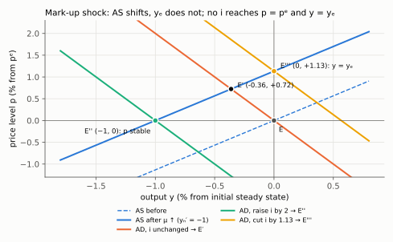
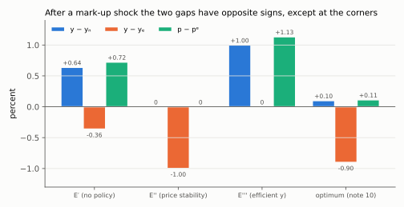

# 6. Mark-up shocks: stagflation and the first real trade-off

**Article: §7, Figure 9, printed pages 513–514.** Up: [[00-index]] ·
Prev: [[05-productivity-shocks]] · Next: [[07-fiscal-multipliers]]

One shock, three candidate equilibria, and no instrument that reaches all of them. This
note prices each of the three.

---

## 6.1 What a mark-up shock is

A short-run rise in $\mu$. By (13), any of these does it:

- $\mu_\theta\uparrow$ — more monopoly power (lower $\theta$);
- $\tau_w\uparrow$, $\tau_l\uparrow$, $\tau_y\uparrow$ — higher payroll, income or sales
  taxes;
- and the interpretation the article flags as the most appealing (p. 513): **a rise in
  the price of an inelastically demanded input, oil being the example.** The model has
  one factor, so an imported input price enters as a wedge between the price a firm
  charges and the labour cost it faces, which is exactly what $\mu$ is.

The asymmetry with §6 is the whole story, and it comes from §3.4. Differentiate (15)
with respect to $\mu$ — its coefficient is $-1/(\sigma^{-1}+\eta)$ — and (19), which has no
$\mu$ term at all:

$$dy_n=-\frac{d\mu}{\sigma^{-1}+\eta}<0,\qquad\qquad dy_e=0$$

**Capacity as the market computes it falls; capacity as a planner would want it does
not.** This is what "inefficient shock" means.

## 6.2 The equilibrium with no policy response ($E'$ in Fig. 9)

AS shifts **up and left** through the new anchor $(p^e,y_n')$; AD does not move, since
$\mu$ is not in (21). From [[04-equilibrium-geometry]] §4.4 with $dy_n<0$:

$$dy=\frac{\sigma\kappa}{1+\sigma\kappa}\,dy_n<0,\qquad
dp=-\frac{\kappa\,dy_n}{1+\sigma\kappa}>0$$

**Output falls and prices rise: stagflation.** The transmission (p. 513): firms facing a
wider wedge raise prices; higher $p$ with $\bar p$ given means a higher real rate;
households save more and postpone; demand and output fall.

Now the subtle part, which is where most errors happen. The gap against natural is the
§4.4 gap line with $d\bar y_n=di=0$. The gap against efficient is
$d(y-y_e)=dy-dy_e=dy-0=dy$. The two gaps have **opposite signs**:

$$\underbrace{d(y-y_n)=-\frac{dy_n}{1+\sigma\kappa}>0}_{\text{gap against natural: positive}}
\qquad\qquad
\underbrace{d(y-y_e)=dy=\frac{\sigma\kappa}{1+\sigma\kappa}\,dy_n<0}_{\text{gap against efficient: negative}}$$

Output is **above** the natural rate — which is why prices are rising, since by (17)
prices only move with that gap — and at the same time **below** the efficient rate,
which is why welfare has fallen. Anyone who reports a single "output gap" here has
already lost the question.

## 6.3 The three points monetary policy can reach

Each is a choice of $di$ in the machine of §4.4. All three are on the new AS curve; the
central bank picks which point of it to sit on by sliding AD.

| Point | Objective | Required $di$ | Resulting $p-p^e$ | Resulting $y-y_e$ |
|---|---|---|---|---|
| $E'$ | none (do nothing) | $0$ | $-\dfrac{\kappa\,dy_n}{1+\sigma\kappa}>0$ | $\dfrac{\sigma\kappa\,dy_n}{1+\sigma\kappa}<0$ |
| $E''$ | **price stability**, $p=p^e$ | $-\dfrac{dy_n}{\sigma}>0$ (raise) | $0$ | $dy_n<0$ — the deepest contraction |
| $E'''$ | **efficient output**, $y=y_e$ | $\kappa\,dy_n<0$ (cut) | $-\kappa\,dy_n>0$ — the largest price rise | $0$ |

Derivations, both one line. For $E''$, set $d(y-y_n)=0$: $-dy_n-\sigma di=0$. For
$E'''$, set $dy=0$: $\sigma\kappa\,dy_n-\sigma\,di=0$.

In full, with $d\bar y_n=0$ throughout:

- $E''$. Multiply $d(y-y_n)=(-dy_n-\sigma\,di)/(1+\sigma\kappa)=0$ by $1+\sigma\kappa$, add
  $dy_n$ and divide by $-\sigma$: $di=-dy_n/\sigma$. The gap is zero, so
  $p-p^e=\kappa\cdot0=0$ and $y=y_n$, hence $y-y_e=dy_n-0=dy_n$.
- $E'''$. Multiply $dy=(\sigma\kappa\,dy_n-\sigma\,di)/(1+\sigma\kappa)=0$ by
  $1+\sigma\kappa$ and divide by $\sigma$: $\kappa\,dy_n-di=0$, so $di=\kappa\,dy_n$. Output
  has not moved, so $y-y_e=0$ and $y-y_n=0-dy_n=-dy_n$, and by (17)
  $p-p^e=\kappa(y-y_n)=-\kappa\,dy_n$.

*With yₙ moved by −1: E′ is AS′ ∩ the unchanged AD; raising i by 2 slides AD down to E″ on p = pᵉ; cutting i by 1.13 slides it up to E‴ on y = yₑ = 0. All three lie on the same AS′.*

**That table is the trade-off**, and it is a genuine one: the two objectives require
interest-rate moves of *opposite sign*. Stabilise prices and you must push output even
further below the efficient level; deliver efficient output and you must accept a price
rise larger than the one you started with. No choice of $i$ reaches both, because one
instrument cannot hit two targets that no longer coincide.

The optimum is neither column but a point between them, and it is the only place in the
article where the welfare weights have to be taken seriously. That calculation is
[[10-optimal-policy]]; the answer is that the optimal policy admits exactly a fraction
$1/(1+\theta\kappa)$ of the shock into prices (substitute $dy_n=-d\mu/(\sigma^{-1}+\eta)$
into the result of §10.4, $p-p^e=-\kappa\,dy_n/(1+\theta\kappa)$ and
$y-y_e=\theta\kappa\,dy_n/(1+\theta\kappa)$):

$$p-p^e=\frac{\kappa}{1+\theta\kappa}\cdot\frac{d\mu}{\sigma^{-1}+\eta},
\qquad y-y_e=-\frac{\theta\kappa}{1+\theta\kappa}\cdot\frac{d\mu}{\sigma^{-1}+\eta}$$

with $\theta\kappa\to\infty$ (a central bank that cares only about prices, or very
flexible prices) collapsing it to $E''$, and $\theta\kappa\to0$ collapsing it to $E'''$.

*For each point, compare the blue and orange bars: y − yₙ ≥ 0 and y − yₑ ≤ 0 everywhere, so the two gaps are never of the same strict sign. E″ zeroes the first, E‴ the second; the optimum keeps p − pᵉ at 0.11, a tenth of E‴'s 1.13.*

## 6.4 The test for whether a trade-off exists at all

Do not memorise cases; apply the criterion:

$$\text{trade-off} \iff \text{the shock moves } y_n-y_e=-\frac{\mu}{\sigma^{-1}+\eta}
\iff \text{the shock moves } \mu$$

| Shock | Moves $\mu$? | Trade-off? |
|---|---|---|
| $a$, $\bar a$ (productivity) | no | no — [[05-productivity-shocks]] |
| $g$, $\bar g$ (spending) | no | no — [[07-fiscal-multipliers]] |
| $\mu_\theta$ (monopoly power), oil | yes | **yes** |
| $\tau_w,\tau_l,\tau_y$ (distorting taxes) | yes | **yes** |
| $\tau_c$ (consumption tax) | yes, **and** it shifts AD | yes, and it is the messiest case |

The last row is worth its own sentence, and the article gives it one (p. 515): a rise in
$\tau_c$ acts *both* as a mark-up shock, pushing AS up, *and* as an intertemporal price
change, shifting AD. It is the only instrument in the model that moves both curves on its
own.

## 6.5 What §7 leaves to the reader, and how to do it

Benigno restricts §7 to **temporary** mark-up shocks that move AS, "leaving other
analyses to the reader" (p. 513). The two omitted cases, with the machine already built:

- **Permanent mark-up rise** ($\mu\uparrow$ and $\bar\mu\uparrow$ equally). Now AS shifts
  up *and* AD shifts down, because $\bar y_n$ falls with $\bar\mu$: the household expects
  to be poorer and cuts consumption today. Since $d\bar y_n=dy_n$, the machine gives
  $d(y-y_n)=(dy_n-dy_n)/(1+\sigma\kappa)=0$ and $dp=0$ — no gap against the natural rate and no price movement, with
  output down by the full $dy_n$. But the *welfare* gap is now $dy_n<0$ and permanent, and
  no interest rate can close it: this is a supply-side problem, not a stabilisation
  problem.
- **Expected mark-up rise** ($\bar\mu\uparrow$ only). AS still, AD down. Output and prices
  fall, the gap against both $y_n$ and $y_e$ is negative — with $dy_n=di=0$ the machine
  gives $dy=d(y-y_n)=d\bar y_n/(1+\sigma\kappa)<0$, where $d\bar y_n=-d\bar\mu/(\sigma^{-1}+\eta)$
  — and the optimal response is a **cut**: set $(d\bar y_n-\sigma\,di)/(1+\sigma\kappa)=0$,
  so $di=d\bar y_n/\sigma<0$. Note that here the coincidence is restored, because
  $y_n$ and $y_e$ have not moved in the short run.
