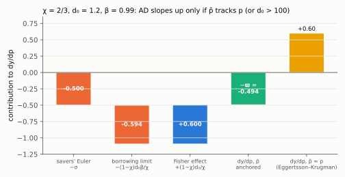
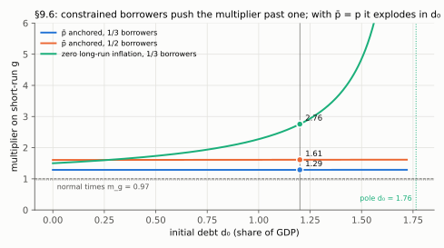

# 9. Debt deleveraging: an AD curve that can slope up

**Article: §10, equations (24)–(32), Figure 13, printed pages 518–521.** Up:
[[00-index]] · Prev: [[08-liquidity-trap]] · Next: [[10-optimal-policy]]

The model of Eggertsson and Krugman (2012), compressed into the same two-curve diagram.
Everything here follows from one change: **some households are at a borrowing limit, so
their Euler equation does not hold.** The consequences are an AD curve with a new slope,
three paradoxes, and multipliers above one.

> **Companion:** [When Demand Slopes Up](companion-deleveraging.html) — raise initial debt past
> the inversion threshold and watch AD rotate through vertical; the paradox of toil then shows
> as a favourable AS shift moving output the wrong way.

---

## 9.1 Two types

Fraction $\chi$ are **savers**, $1-\chi$ are **borrowers**, each maximising

$$u(C_j)-v(L_j)+\beta_j\left\{u(\bar C_j)-v(\bar L_j)\right\},\qquad j=b,s \tag{24}$$

with $\beta_b<\beta_s$: borrowers are more impatient, which is why they borrow at all.
Flow budget constraints, with $B_j>0$ denoting **debt**:

$$B_j=(1+i_0)B_{0,j}+PC_j-W_jL_j-\Pi_j+T_j \tag{25}$$

$$B_{2,j}=(1+i)B_j+\bar P\bar C_j-\bar W_j\bar L_j-\bar\Pi_j+\bar T_j \tag{26}$$

Note these are *flow* constraints, one per period, not a single lifetime constraint as in
[[01-household-and-ad]]. That is forced: with a borrowing limit the two periods can no
longer be collapsed. And profits $\Pi_j$ are now separated from taxes $T_j$ — the
distribution of both across types will matter.

The debt limit, a safe-debt threshold that applies in each period:

$$\frac{(1+r)B_j}{P}\le D \tag{27}$$

**The shock of interest is a fall in $D$ from $D_0$.** The article is candid that it is
unmodelled: "For reasons not modelled here, borrowers suddenly realize that they have to
reduce their debt exposure."

Assume borrowers start constrained (they are impatient) and stay constrained through the
deleveraging. Then **their Euler equation is replaced by (27) holding with equality**:
their consumption is whatever the budget constraint allows given the maximum debt they
may carry. This is the single modelling step that drives the section.

## 9.2 Two tricks that keep it tractable

**Cobb–Douglas labour.** $Y=AL$ with $L=L_s^{\chi}L_b^{1-\chi}$, and a matching wage index
$W=W_s^{\chi}W_b^{1-\chi}$, so that each type's compensation moves with total compensation,
$W_jL_j=WL$ (p. 519). Consequence, used later: labour income and profits together exhaust
output, $W_jL_j+\Pi_j=PY$.

**Exponential utility.** $u(C_j)=1-\exp(-zC_j)$, $z>0$. This is the assumption that makes
aggregation work, and it is worth seeing why. Take the intratemporal condition for each
type,

$$\frac{v_l(L_j)}{u_c(C_j)}=\frac{W_j}{P} \tag{28}$$

and average with weights $\chi$ and $1-\chi$. With $u_c(C_j)=z\exp(-zC_j)$, the marginal
utilities multiply into the *sum* of consumptions rather than a messy average.

The averaging is geometric, to match the Cobb–Douglas indices. With $v_l(L_j)=L_j^{\eta}$,
(28) for each type reads $L_j^{\eta}/[z\exp(-zC_j)]=W_j/P$. Raise the savers' equation to
the power $\chi$ and the borrowers' to the power $1-\chi$, and multiply them:

- numerator: $L_s^{\chi\eta}L_b^{(1-\chi)\eta}=\left(L_s^{\chi}L_b^{1-\chi}\right)^{\eta}=L^{\eta}$;
- denominator: $z^{\chi}z^{1-\chi}\exp(-z\chi C_s)\exp(-z(1-\chi)C_b)
  =z\exp\left[-z\left(\chi C_s+(1-\chi)C_b\right)\right]$, since exponents add;
- right side: $W_s^{\chi}W_b^{1-\chi}/P=W/P$.

The constant $z$ drops out once the equation is written in deviations from the steady
state, which is why it does not appear in (29):

$$\frac{L^{\eta}}{\exp\left[-z\left(\chi C_s+(1-\chi)C_b\right)\right]}=\frac{W}{P} \tag{29}$$

Only **aggregate** consumption appears. That is why, using $Y=AL$,
$Y=\chi C_s+(1-\chi)C_b+G$ and long-run mark-up pricing $P=(1+\mu_\theta)W/A$:

$$\frac{(Y_n/A)^{\eta}}{\exp\left[-z(Y_n-G)\right]}=\frac{A}{1+\mu_\theta}$$

which log-linearises into **exactly eq. (15) again**, with
$\tilde\sigma\equiv1/(z\tilde Y)$. The step: take logs,
$\eta(\ln Y_n-\ln A)+z(Y_n-G)=\ln A-\ln(1+\mu_\theta)$, and subtract the steady state.
The exponential term is already linear in levels:
$z[(Y_n-\tilde Y)-(G-\tilde G)]=z\tilde Y(y_n-g)$, dividing and multiplying by $\tilde Y$.
So

$$\eta(y_n-a)+z\tilde Y\,(y_n-g)=a-\mu_\theta,$$

which is the equation of note 2, §2.4, with $z\tilde Y$ where $\sigma^{-1}$ stood.
Strictly it is the output-scaled parameter $\sigma$ of (15) that equals $1/(z\tilde Y)$.
The article calls this $\tilde\sigma$, and in (30) it uses $\tilde\sigma$ for $1/z$, the
levels coefficient. Below, $\sigma=1/(z\tilde Y)$ throughout. So:

> The natural level of output is **independent of the distribution of wealth**, and the
> short-run AS curve is unchanged, still $p-p^e=\kappa(y-y_n)$.

All the action is on the demand side. (With isoelastic utility this would fail, and the
model would not fit on one diagram.)

## 9.3 The new AD curve

Savers are unconstrained, so their Euler equation survives — in **levels**, because
exponential utility makes the relevant object the level of consumption, not its log:

$$C_s=\bar C_s-\tilde\sigma\left[i-(\bar p-p)-\rho\right] \tag{30}$$

(This line previously read $\bar C_s=C_s-\tilde\sigma[\cdots]$, with the bars swapped,
which would make a higher real rate *lower* future consumption. The derivation fixes the
sign.) The savers' Euler condition with exponential utility is
$z e^{-zC_s}=\beta(1+r)\,z e^{-z\bar C_s}$. Cancel $z$, take logs, and use $\ln\beta=-\rho$
and $\ln(1+r)\simeq r$:

$$-zC_s=-\rho+r-z\bar C_s$$

Add $z\bar C_s$ to both sides, divide by $z$ and write $\tilde\sigma\equiv1/z$ (the levels
coefficient) and $r=i-(\bar p-p)$ as in note 1, §1.3. The result is (30), the same form as
(5) but in levels.

Take the resource constraint in both periods, $Y=\chi C_s+(1-\chi)C_b+G$ and
$\bar Y=\chi\bar C_s+(1-\chi)\bar C_b+\bar G$, and subtract the second from the first:

$$Y-\bar Y=\chi\left(C_s-\bar C_s\right)+(1-\chi)\left(C_b-\bar C_b\right)+G-\bar G$$

Substitute (30) for $C_s-\bar C_s$, divide by $\tilde Y$ (so $(Y-\bar Y)/\tilde Y=y-\bar y$,
$(G-\bar G)/\tilde Y=g-\bar g$, and $\tilde\sigma/\tilde Y=1/(z\tilde Y)=\sigma$), set
$\bar y=\bar y_n$ because the long run is flexible, and add $\bar y_n$ to both sides:

$$y=g+\left(\bar y_n-\bar g\right)-\chi\sigma\left[i-(\bar p-p)-\rho\right]
+\left(1-\chi\right)\frac{C_b-\bar C_b}{\tilde Y} \tag{31}$$

(Written earlier with $\tilde\sigma$ in place of $\sigma$; after dividing by $\tilde Y$ the
coefficient is the output-scaled $\sigma$, as in the article's (31), which is also what
makes $\varphi$ in (32) contain $\sigma$.)

Two changes from (21), and both matter:

- the interest-rate term is scaled by $\chi$ — **only savers respond to the real rate**,
  so the conventional monetary channel is weaker the more borrowers there are;
- a new shifter appears: the borrowers' consumption *profile* $C_b-\bar C_b$. If
  deleveraging forces them to cut today relative to tomorrow, aggregate demand falls for
  reasons no interest rate authorised.

Now solve for $C_b$. With (27) binding in every period, each debt stock is pinned down
by its limit: $(1+r_0)B_{0,b}/P_0=D_0$ gives $B_{0,b}=P_0D_0/(1+r_0)$; $(1+r)B_b/P=D$ gives
$B_b/P=D/(1+r)$; and $(1+\bar r)B_{2,b}/\bar P=\bar D$ gives $B_{2,b}/\bar P=\bar D/(1+\bar r)$.
Divide (25) by $P$, use $W_bL_b+\Pi_b=PY$, and solve for $C_b$:

$$C_b=\frac{B_b}{P}-\frac{(1+i_0)B_{0,b}}{P}+Y-\frac{T_b}{P}.$$

Divide (26) by $\bar P$ and solve for $\bar C_b$ in the same way. Then insert the three
debt stocks (taxes are written in real terms, $T_b$ for $T_b/P$):

$$C_b=-\frac{(1+i_0)P_0D_0}{(1+r_0)P}+\frac{D}{1+r}+Y-T_b,
\qquad
\bar C_b=-\frac{(1+i)PD}{(1+r)\bar P}+\frac{\bar D}{1+\bar r}+\bar Y-\bar T_b$$

using $W_jL_j+\Pi_j=PY$. Read the first: a borrower's consumption is income, minus the
real value of inherited debt service, plus what it is newly allowed to borrow, minus
taxes. Approximate both around the initial debt position, substitute into (31), and the
short-run AD curve takes its final form.

**The approximation, step by step.** Four facts, each first-order:

1. In $\bar C_b$, $(1+i)P/[(1+r)\bar P]=1$ exactly, by the definition $1+r=(1+i)P/\bar P$.
   So the second-period debt service is just $D$.
2. The period-0 real rate is formed with the expected price, $1+r_0=(1+i_0)P_0/P^e$, so
   the inherited term is $D_0P^e/P$. Dividing by $\tilde Y$ and using
   $P^e/P=e^{-(p-p^e)}\simeq1-(p-p^e)$, it becomes $d_0-d_0(p-p^e)$.
3. $1/(1+r)=e^{-\ln(1+r)}\simeq\beta\left[1-(r-\rho)\right]$ around $1+r=1/\beta$. So
   $D/[(1+r)\tilde Y]\simeq\beta(d_0+\hat d)-\beta d_0(r-\rho)$, dropping the product
   $\hat d\,(r-\rho)$, which is second order.
4. The tighter limit persists into the long run, $\bar D=D$, and $1/(1+\bar r)=\beta$. So
   $\bar D/[(1+\bar r)\tilde Y]=\beta(d_0+\hat d)$.

Subtract the scaled $\bar C_b$ from the scaled $C_b$. The $\beta(d_0+\hat d)$ terms cancel,
$-d_0$ from fact 2 cancels $+d_0$ from fact 1 (which enters as $-(-D)$), and what is
left is

$$\frac{C_b-\bar C_b}{\tilde Y}=\hat d-\beta d_0(r-\rho)+d_0(p-p^e)+(y-\bar y_n)-(\tau_b-\bar\tau_b).$$

Put this into (31):

$$y=\bar y_n+(g-\bar g)-\chi\sigma(r-\rho)
+(1-\chi)\left[\hat d-\beta d_0(r-\rho)+d_0(p-p^e)+y-\bar y_n-(\tau_b-\bar\tau_b)\right]$$

Subtract $(1-\chi)y$ from both sides; on the right, $\bar y_n-(1-\chi)\bar y_n=\chi\bar y_n$;
and collect the two $(r-\rho)$ terms:

$$\chi y=\chi\bar y_n+(g-\bar g)-\left[\chi\sigma+(1-\chi)\beta d_0\right](r-\rho)
+(1-\chi)\left[\hat d+d_0(p-p^e)\right]-(1-\chi)(\tau_b-\bar\tau_b)$$

Divide by $\chi$, name $\varphi\equiv[\chi\sigma+(1-\chi)\beta d_0]/\chi$, and substitute
$r=i-(\bar p-p)$:

$$\boxed{\;y=y_n-\varphi\left[i-(\bar p_n-p)-\rho\right]
+\frac{1}{\chi}\Big[(g-\bar g)-(1-\chi)(\tau_b-\bar\tau_b)\Big]
+\frac{(1-\chi)}{\chi}\Big[\hat d+d_0\left(p-p^e\right)\Big]\;} \tag{32}$$

$$\varphi\equiv\frac{\sigma\chi+(1-\chi)d_0\beta}{\chi}\;\ge0,\qquad
d_0\equiv\frac{D_0}{\tilde Y},\quad
\tau_b\equiv\frac{T_b-\tilde T_b}{\tilde Y},\quad
\hat d\equiv\frac{D-D_0}{\tilde Y}$$

**Notation flag.** The derivation above ends with $\bar y_n$, long-run natural output,
where the boxed (32) writes $y_n$, and with $\bar p$ where it writes $\bar p_n$. The
article's (32) reads the same way in the project's text extraction, which drops overbars.
$\bar p_n$ is the article's name for the anchored long-run price level, so it is $\bar p$.
The leading term should be read as $\bar y_n$: it is what (31) carries, and it is the
only reading under which the pessimism shock of [[08-liquidity-trap]] shifts this AD
curve. Neither reading changes the slope or the multipliers below, which do not involve
that term. `check_multipliers.py` verifies the version with $\bar y_n$.

## 9.4 The slope: two new channels, and the Fisher effect wins

Differentiate (32) with respect to $p$. The interest term contributes $-\varphi$; the new
debt term contributes $+(1-\chi)d_0/\chi$:

$$\frac{dy}{dp}=-\varphi+\frac{(1-\chi)d_0}{\chi}
=-\sigma-\frac{(1-\chi)d_0\beta}{\chi}+\frac{(1-\chi)d_0}{\chi}
=-\underbrace{\left[\sigma-\frac{d_0(1-\beta)(1-\chi)}{\chi}\right]}_{\textstyle \equiv\,\varpi}$$

$$\boxed{\;\frac{dy}{dp}=-\varpi,\qquad
\left.\frac{dp}{dy}\right|_{AD}=-\frac{1}{\varpi}\;}$$

The two channels inside $\varpi$, both running through the borrowers:

| Channel | Direction | Mechanism |
|---|---|---|
| **Borrowing limit** | flattens AD | $p\uparrow$ raises the real rate, so $D/(1+r)$ — what may be safely borrowed today — falls; borrowers consume less |
| **Fisher effect** | steepens AD | $p\uparrow$ cuts the *real value of inherited nominal debt* $P_0D_0/P$; borrowers consume more |

The Fisher channel dominates, because $d_0(1-\beta)(1-\chi)/\chi>0$, which makes
$\varpi<\sigma$ and so $|-1/\varpi|>|-1/\sigma|$: **for given $\sigma$, debt-constrained
agents make AD steeper.** And the term can be large enough to flip the sign entirely:

$$\varpi<0 \iff d_0>\frac{\sigma\chi}{(1-\beta)(1-\chi)}$$

(From the definition, $\varpi<0\iff\sigma<d_0(1-\beta)(1-\chi)/\chi$; multiply both sides
by $\chi/[(1-\beta)(1-\chi)]$, which is positive, to isolate $d_0$.)

**How large is that threshold?** At the calibration used for the multipliers below
($\sigma=0.5$, $\chi=2/3$, $\beta=0.99$) it is $0.5\cdot\tfrac23/(0.01\cdot\tfrac13)=100$,
debt of 10,000% of GDP. At $d_0=1.2$, $\varpi=0.5-1.2\cdot0.01\cdot\tfrac12=0.494$, barely
below $\sigma$. This is the article's own qualification (p. 520): "for plausible values
of the parameters the overall slope … is still negative". With anchored long-run prices,
the borrowing-limit and Fisher channels almost exactly offset.

*The first three bars add to the fourth: −0.500 (savers) − 0.594 (borrowing limit) + 0.600 (Fisher) = −0.494. Tie p̄ to p and the first two channels vanish, leaving only Fisher: the slope turns positive, +0.60 (last bar).*

i.e. **AD slopes upward when initial debt $d_0$ is high or the saver share $\chi$ is
low.** Under the Eggertsson–Krugman assumption that inflation between short and long run
is tied to zero — so the $(\bar p-p)$ channel is switched off and only Fisher survives —
the slope is positive unambiguously. That is what Fig. 13 (p. 521) draws, with the caveat
of footnote 19: AS must be flatter than AD for the equilibrium to be stable.

**In this regime lower prices are contractionary.** They raise the real burden of
nominal debt, cut borrowers' consumption, and cut output.

## 9.5 Deleveraging and the three paradoxes

A deleveraging shock is $\hat d<0$ in (32): a **left shift** of AD. Output and prices
fall, and the fall can be deep enough to put the economy in the liquidity trap of
[[08-liquidity-trap]], where cutting $i$ to zero is not enough to return to $E$.

Once AD slopes up, three things that are expansionary in normal times reverse sign:

1. **Paradox of thrift.** Borrowers save more to pay down debt; aggregate demand and
   income fall; realised saving ends up *lower*. The Keynesian paradox, recovered in a
   microfounded model.
2. **Paradox of toil.** A downward shift of AS — from a temporary productivity gain, a
   lower mark-up, or a *tax cut that should encourage work* — is **contractionary** here.
   Along an upward-sloping AD, pushing prices down destroys borrower consumption faster
   than cheaper output creates demand.

   
   *The same AS shift, with yₙ up 0.5, in both panels. With p̄ anchored, AD slopes down and output rises by 0.18. With p̄ = p, AD slopes up at 1.67, steeper than κ = 1.13 as footnote 19 requires, and output falls by 1.06. The equilibrium solves κ(y − 0.5) = y·(AD slope).*
3. **Paradox of flexibility.** *More* price flexibility — a steeper AS, i.e. larger
   $\kappa$ — produces a **larger** output contraction, because it delivers a larger fall
   in prices and so a larger increase in the real debt burden.

> **The escape clause, footnote 20 (p. 520), and it is worth knowing.** If the long-run
> price level is well anchored *irrespective of* short-run prices, AD must be drawn
> downward-sloping for a given future price level — and then **the paradoxes of toil and
> flexibility disappear.** The paradoxes are not properties of debt alone; they need the
> expectation channel to be switched off. A central bank with a credible long-run price
> level target is therefore doing paradox prevention.

## 9.6 Policy: a stronger exit and a real multiplier

**Monetary.** The §8 exit — commit to a higher long-run price level — works here
*reinforced*, because the coefficient $\varphi$ in (32) exceeds $\sigma$. Raising $\bar p$
lowers the real rate, which raises savers' consumption **and** relieves borrowers, whose
debt service falls. Two beneficiaries instead of one.

**Fiscal.** Two structural changes:

- **Ricardian equivalence fails.** $\tau_b$ — lump-sum transfers *to the borrowers* —
  appears in (32). Who is taxed now matters, and so does how spending is financed, because
  a euro taken from a constrained agent is a euro of lost consumption while a euro taken
  from a saver is largely absorbed by saving.
- **The multiplier exceeds one**, which §8's Table 2 ruled out by construction. With
  long-run prices well anchored, the multiplier on short-run government spending is

$$\boxed{\;\frac{\dfrac{1}{\chi}+\dfrac{\varpi\kappa}{1+\sigma\eta}}{1+\varpi\kappa}\;}$$

and when long-run inflation is instead tied to zero,

$$\boxed{\;\frac{1-\dfrac{d_0(1-\chi)\kappa}{1+\sigma\eta}}{\chi-d_0(1-\chi)\kappa}\;}$$

**Where the two formulas come from.** Hold $i$, $\bar y_n$, $\hat d$ and taxes fixed and
raise $g$ by $dg$.

- *Supply.* By (15), $dy_n=\frac{\sigma^{-1}}{\sigma^{-1}+\eta}dg=\frac{dg}{1+\sigma\eta}$
  (multiply numerator and denominator by $\sigma$), and AS gives $dp=\kappa(dy-dy_n)$.
- *Anchored $\bar p$.* In (32), $p$ enters through $-\varphi p$ and $+\frac{1-\chi}{\chi}d_0p$,
  together $-\varpi\,p$ (§9.4). So $dy=\frac{dg}{\chi}-\varpi\,dp$. Substitute $dp$:
  $dy=\frac{dg}{\chi}-\varpi\kappa\,dy+\frac{\varpi\kappa}{1+\sigma\eta}dg$. Add
  $\varpi\kappa\,dy$ to both sides and divide by $1+\varpi\kappa$: the first box.
- *Zero long-run inflation*, $\bar p=p$. The bracket $[i-(\bar p-p)-\rho]$ no longer
  moves with $p$, so only the Fisher term is left: $dy=\frac{dg}{\chi}+\frac{(1-\chi)d_0}{\chi}dp$.
  Substitute $dp$ and multiply by $\chi$:
  $\chi\,dy=dg+(1-\chi)d_0\kappa\,dy-\frac{(1-\chi)d_0\kappa}{1+\sigma\eta}dg$. Move the
  $dy$ term left, giving $[\chi-d_0(1-\chi)\kappa]dy$, and divide: the second box.

The denominator of the second box is zero when $\chi=d_0(1-\chi)\kappa$. That is exactly
where the AD slope in the $(y,p)$ plane, $\chi/[(1-\chi)d_0]$, equals the AS slope
$\kappa$.

Evaluated at the article's calibration — $\alpha=0.66$, $\sigma=0.5$, $\eta=0.2$,
$d_0=1.2$ (debt at 120% of GDP) — and reproduced in `check_multipliers.py`:

| Case | Borrowers $1-\chi$ | Multiplier |
|---|---|---|
| Anchored long-run prices | $1/3$ | **1.29** |
| Anchored long-run prices | $1/2$ | **1.62** |
| Zero long-run inflation | $1/3$ | **2.75** |

Why so big. In normal times the spending multiplier is held below one by two leaks:
prices rise, the real rate rises, and private consumption is crowded out. In the trap the
nominal rate cannot rise, and a share $1-\chi$ of households is constrained and spends
every euro of income. Both leaks are plugged. In the zero-inflation case the denominator
$\chi-d_0(1-\chi)\kappa$ is small and shrinking in $d_0$ — the multiplier grows with the
debt stock, and the formula is explosive near $\chi=d_0(1-\chi)\kappa$, which is the same
condition as an AD curve steeper than AS: exactly where footnote 19 says the equilibrium
stops being stable. Numbers from that region should not be quoted.

*At d₀ = 1.2 the three cases read 1.29, 1.61 and 2.76; the article prints 1.29, 1.62 and 2.75, a rounding difference. Only the zero-inflation curve depends much on d₀, and it diverges at the pole d₀ = χ/[(1−χ)κ] = 1.76. Both anchored curves are nearly flat, because ϖ hardly moves with d₀.*

## 9.7 The one-paragraph summary

Put a borrowing constraint on a third of households and three things change and one does
not. The AS curve does not change at all, thanks to exponential utility. The AD curve
gets steeper, possibly upward-sloping, because prices now move the real value of nominal
debt. Deleveraging becomes an autonomous demand shock that no interest rate authorised.
And fiscal policy, weak and sub-unitary in normal times, becomes the powerful instrument
of the textbook Keynesian story — for a reason the textbook does not give: the agents who
receive the spending cannot smooth it.
