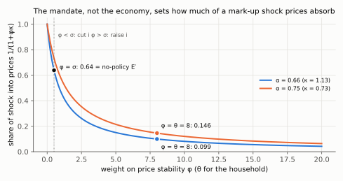

# 10. Optimal monetary policy: the third line on the diagram

**Article: §11 and §12, equations (33)–(35), Figure 14, printed pages 521–523.** Up:
[[00-index]] · Prev: [[09-deleveraging]] · Next: [[11-three-schools-and-market-clearing]] · Rules: [[09_adas_politica]]

Up to here the model said what happens. This note says what *should* happen, and the
answer is a third straight line — the IT curve — drawn on the same axes as AS and AD.

---

## 10.1 The objective is not assumed, it is derived

This is the payoff of microfoundations. A second-order approximation to the household's
utility (1) around an efficient steady state gives (Woodford, 2003, ch. 3):

$$L=\frac{1}{2}\left(y-y_e\right)^2+\frac{\theta}{2\kappa}\left(p-p^e\right)^2 \tag{33}$$

Compare the ad hoc quadratic loss functions assumed by the monetary-policy literature of
the 1980s: same functional form, but here the arguments and the weights come out of
preferences rather than being posited. Three readings:

- The output term is measured against the **efficient** level $y_e$, not the natural
  level. Households care about consumption and leisure, not about firms' marginal cost.
- The price term is in the **unanticipated** price movement $p-p^e$. Anticipated price
  levels are costless here — there is no money in the utility function and no relative
  price distortion from expected inflation, only from the dispersion that surprises
  create.
- The relative weight is $\theta/\kappa$, and both parameters point the same way:

$$\frac{\partial}{\partial\theta}\left(\frac{\theta}{\kappa}\right)>0,\qquad
\frac{\partial}{\partial\alpha}\left(\frac{\theta}{\kappa}\right)>0$$

Both signs in one line each. Substitute $\kappa$ from (17):
$\theta/\kappa=\theta\alpha/[(1-\alpha)(\sigma^{-1}+\eta)]$. Its derivative in $\theta$ is
$1/\kappa>0$. In $\alpha$, the quotient rule gives
$\frac{d}{d\alpha}\frac{\alpha}{1-\alpha}=\frac{(1-\alpha)+\alpha}{(1-\alpha)^2}=\frac{1}{(1-\alpha)^2}$,
so $\partial(\theta/\kappa)/\partial\alpha=\theta/[(\sigma^{-1}+\eta)(1-\alpha)^2]>0$.

More rigidity (higher $\alpha$, lower $\kappa$) means **more** weight on price stability.
The article's phrasing (p. 522): "The smaller the fraction [of firms that adjust], the
greater the weight to give to price stability." The logic is that with few adjusters, a
given price-level surprise implies a large *dispersion* of relative prices across
identical firms, and it is the dispersion that destroys welfare. Higher $\theta$ does the
same thing for a different reason: with goods more substitutable, consumers punish that
dispersion harder.

Svensson (2007a) reads (33) as **flexible inflation targeting** with price and output
targets.

## 10.2 One rule, and why it beats a Taylor rule

The article poses the obvious alternative first: specify an instrument rule,

$$i=\bar\imath+\psi_y\left(y-y_e\right)+\psi_\pi\left(p-p^e\right),
\qquad \bar\imath,\psi_y,\psi_\pi\ge0$$

and choose $\psi_y,\psi_\pi$ so that the equilibrium minimises (33). The objection is not
that this cannot be done but that the answer is not robust: *"it would be fortuitous if
this policy were optimal for all circumstances. Indeed, the optimal parameters are likely
to depend on the properties of the shocks"* (p. 522). Re-optimise the coefficients for
every shock process and the rule is no longer a rule.

The alternative, following Giannoni and Woodford (2002), is a **targeting rule**:
a relationship between the target variables that the instrument must be moved to satisfy,
whatever the shock. Derive it by substituting the AS curve (17) into (33) to eliminate
prices, since $p-p^e=\kappa(y-y_n)$, so $(p-p^e)^2=\kappa^2(y-y_n)^2$; then cancel one
$\kappa$, $\kappa^2/\kappa=\kappa$:

$$L=\frac{1}{2}\left(y-y_e\right)^2+\frac{\theta}{2\kappa}\kappa^2\left(y-y_n\right)^2
=\frac{1}{2}\left(y-y_e\right)^2+\frac{\theta\kappa}{2}\left(y-y_n\right)^2$$

Minimise over $y$ — the central bank can pick any $y$ it likes by sliding AD. By the
chain rule $\frac{d}{dy}\frac12(y-x)^2=(y-x)$ for either target $x$:

$$\frac{dL}{dy}=\left(y-y_e\right)+\theta\kappa\left(y-y_n\right)=0$$

The second derivative is $1+\theta\kappa>0$, so this is a minimum. Write
$\theta\kappa(y-y_n)=\theta\cdot\kappa(y-y_n)$ and substitute $\kappa(y-y_n)=p-p^e$ back in:

$$\boxed{\;\left(y-y_e\right)+\theta\left(p-p^e\right)=0\;} \tag{34}$$

This is the **IT equation**. Svensson (2007a) describes it as the "equality of the
marginal rates of transformation and substitution between the target variables in an
operational way". It is robust in the strong sense: it does not mention the shock. Move
$i$ so that (34) holds, whether the shock is to productivity, to the mark-up or to public
spending, and whether it is temporary, permanent or merely expected.

## 10.3 The IT line as geometry

Rewrite (34) as a line in the $(y,p)$ plane: subtract $(y-y_e)$ from both sides and
divide by $\theta$:

$$p-p^e=-\frac{1}{\theta}\left(y-y_e\right)$$

| | slope | passes through |
|---|---|---|
| IT | $-1/\theta$ | $(p^e,\;y_e)$ |
| AD | $-1/\sigma$ | — |
| AS | $+\kappa$ | $(p^e,\;y_n)$ |

**IT is flatter than AD iff $\theta>\sigma$**, and the article argues this is the
empirically relevant case (footnote 24, p. 522): $\theta$ around 8 delivers a 15%
mark-up, while $\sigma$ is usually taken near one. Keep that ordering in mind when
drawing: the optimum is where IT crosses **AS**, and the central bank then chooses $i$ to
put AD through that same point.

The procedure, which is all of Aula 9 in four steps:

1. shock ⇒ new $y_n$ ⇒ redraw AS through $(p^e,y_n')$;
2. new $y_e$ ⇒ redraw IT through $(p^e,y_e')$ — which for productivity or spending shocks
   moves with $y_n$, and for mark-up shocks does not move at all;
3. the optimum is $\text{AS}'\cap\text{IT}'$;
4. set $i$ so that AD passes through it.

## 10.4 The mark-up shock, priced (Fig. 14, p. 523)

Solve steps 3 and 4 for the case where the trade-off is real. Take
$d\mu>0$, so $y_n$ falls by $d\mu/(\sigma^{-1}+\eta)$ while $y_e$ stays put. Solve AS and
IT together. Insert AS, $p-p^e=\kappa(y-y_n)$, into (34):

$$y-y_e=-\theta\kappa\left(y-y_n\right)\;\Longrightarrow\;y=\frac{y_e+\theta\kappa\,y_n}{1+\theta\kappa}$$

(expand the right side to $-\theta\kappa y+\theta\kappa y_n$, add $\theta\kappa y+y_e$ to
both sides to get $(1+\theta\kappa)y=y_e+\theta\kappa y_n$, and divide.) Subtract $y_e$,
writing it as $(1+\theta\kappa)y_e/(1+\theta\kappa)$:

$$y-y_e=\frac{\theta\kappa\,(y_n-y_e)}{1+\theta\kappa},\qquad
p-p^e=\kappa(y-y_n)=\frac{\kappa\,(y_e-y_n)}{1+\theta\kappa},$$

the second by the same step with $y_n$ written as $(1+\theta\kappa)y_n/(1+\theta\kappa)$.
Finally insert $y_n-y_e=-d\mu/(\sigma^{-1}+\eta)$ (§3.4, starting from $y_n=y_e$), so that

$$\boxed{\;y-y_e=-\frac{\theta\kappa}{1+\theta\kappa}\cdot\frac{d\mu}{\sigma^{-1}+\eta},
\qquad
p-p^e=\frac{\kappa}{1+\theta\kappa}\cdot\frac{d\mu}{\sigma^{-1}+\eta}\;}$$

**Optimal policy lets exactly a fraction $1/(1+\theta\kappa)$ of the shock through to
prices and absorbs $\theta\kappa/(1+\theta\kappa)$ of it as an output loss.** Two limits,
which are the two extreme points of [[06-markup-shocks]] §6.3:

| | $\theta\kappa$ | Outcome | Point in Fig. 9 |
|---|---|---|---|
| Strict price stability | $\to\infty$ | $p=p^e$, output takes the whole hit | $E''$ |
| Pure output targeting | $\to0$ | $y=y_e$, prices take the whole hit | $E'''$ |

With the article's own numbers ($\theta=8$, $\alpha=0.66$, $\sigma=0.5$, $\eta=0.2$, so
$\kappa\simeq1.13$), $\theta\kappa=8\times1.133\simeq9.07$, so $1/(1+\theta\kappa)=1/10.07\simeq0.099$,
and only about **10%** of the shock is allowed into prices. A welfare-based central bank in this model is close to, but not
identical with, a strict inflation targeter — and Fig. 14 draws it that way, with a
relatively flat IT and the optimum $E''$ requiring the nominal rate to be **raised**
relative to the no-policy outcome $E'$.

Why raised, in two lines. At $E'$ the price rise is $-\kappa\,dy_n/(1+\sigma\kappa)$
([[06-markup-shocks]] §6.2); at the optimum it is $-\kappa\,dy_n/(1+\theta\kappa)$. With
$\theta>\sigma$ the optimum has the smaller price rise, so it lies lower on AS′, and AD
must move down, which means a higher $i$. How much: along AD with $\bar p$ fixed,
$dy=-\sigma\,di-\sigma\,dp$, so $di=-(dy+\sigma\,dp)/\sigma$. With $dy_n=-1$ the optimum is
$(dy,dp)=(-0.90,+0.11)$, so $di=-(-0.90+0.06)/0.5\simeq1.69$ points. That is less than the
2 points that full price stability ($E''$) would need.

*The optimum is where AS′ crosses the flat IT line, at (−0.90, +0.11), not at E′ where AS′ meets the unchanged AD. The solid AD through the optimum shows the 1.69-point rise that gets there.*

One line in the article deserves emphasis (p. 522): a bank *less* concerned with price
stability — IT steeper than AD — should **lower** the nominal rate after the same shock.
The sign of the optimal response to a cost-push shock is not a property of the economy; it
is a property of the mandate.

## 10.5 A mandate that is not the household's

Nothing forces society to hand the central bank the household's utility. Eq. (35)
replaces $\theta$ with a free preference parameter $\phi\ge0$:

$$L=\frac{1}{2}\left(y-y_e\right)^2+\frac{\phi}{2\kappa}\left(p-p^e\right)^2 \tag{35}$$

with targeting rule $\left(y-y_e\right)+\phi\left(p-p^e\right)=0$ and IT slope $-1/\phi$:

- $\phi$ large ⇒ flat IT ⇒ a hawk, tolerating output losses to hold the price level;
- $\phi$ small ⇒ steep IT ⇒ a dove, tolerating price movements to hold output.

Repeating §10.4 with $\phi$ in place of $\theta$, the share of a mark-up shock let into
prices is $1/(1+\phi\kappa)$. The no-policy point $E'$ lets in $1/(1+\sigma\kappa)$. So
the bank raises $i$ iff $1/(1+\phi\kappa)<1/(1+\sigma\kappa)$, i.e. iff $\phi>\sigma$, and
cuts iff $\phi<\sigma$. This is the sign result of §10.4 stated as an inequality.

*Follow a curve from left to right: the share into prices falls as φ grows. It equals the no-policy 0.64 at φ = σ = 0.5, the point where the sign of the optimal rate move flips, and it is 0.099 (α = 0.66) or 0.146 (α = 0.75) at the welfare weight φ = θ = 8.*

The welfare-based benchmark is $\phi=\theta$, and the article is careful to note why one
might not use it (p. 522): a committee has heterogeneous preferences, and a general
price-stability mandate rarely comes with explicit weights.

**And the caveat that constrains the whole section** (footnote 21, p. 522): the
approximation (33) holds around an efficient steady state with $\mu=0$. In the distorted
case of Benigno and Woodford (2005) the welfare-relevant output target need not be $y_e$,
and it is the optimal response to **mark-up shocks** that changes most. The one result
the model is least willing to carry is exactly the one where the trade-off lives.

## 10.6 §12: what the model delivers, and what it cannot

Delivered, with two curves and a third line: short-run non-neutrality and long-run
neutrality; the optimal response to real and cost-push shocks; the zero lower bound;
deleveraging; and the case for flexible inflation targeting — all without an LM curve and
without a forward-looking Phillips curve.

Not delivered, and the article says so (p. 523):

- **Inflation dynamics.** The AS curve is a New-Classical Phillips curve in the price
  *level*. Disinflation paths, inflation persistence and sacrifice ratios are outside it.
- **Two periods only.** Every "long run" statement is a statement about a single future
  date.
- **No financial intermediation or financial frictions**, beyond the reduced-form
  borrowing limit of [[09-deleveraging]].
- **No open economy**: no exchange rate, no terms of trade.
- **Interest-rate rules dispensed with.** Benigno presents this as possibly an asset and
  possibly a liability: long-run prices are anchored by assumption, so current $i$ pins
  down the equilibrium with no feedback needed — which is convenient, and also assumes
  away the determinacy questions that Taylor rules exist to answer.
