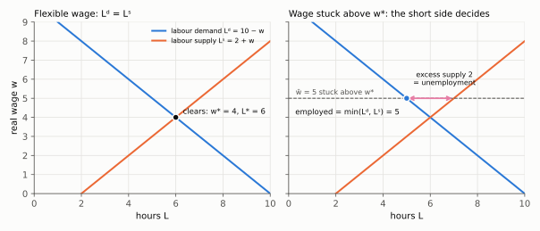
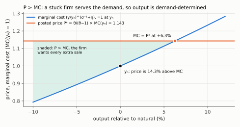
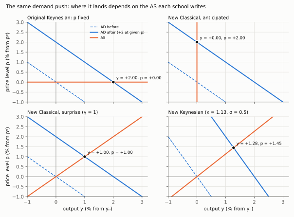

# 11. Keynesian, New Classical, New Keynesian, and what "market clearing" means

**Article: §1–§4 and §11, printed pages 503–508 and 521–522 (footnote 7 on p. 508).** Up:
[[00-index]] · Prev: [[10-optimal-policy]] · List: [[lista-07]] Question 1 · Rules:
[[08_adas_microfundamentos]]

Lista 7 Question 1 asks you to compare the New-Keynesian (NK) model with the New-Classical and
the original Keynesian models along four dimensions. The three schools disagree above all about
one question: **do markets clear in the short run, and if they don't, who decides the
quantity?** So this note starts there (§11.1), then puts each school's supply curve through the
same experiment (§11.2–§11.5), and ends with the four dimensions (§11.6). The full written
answer to the list is in `Resolucao/lista7_resolucao.pdf`, Question 1. This note is the
explanation behind it.

> **In one sentence.** The NK model takes its **method** from the New Classicals (optimising
> agents, rational expectations, general equilibrium) and its **friction** from the Keynesians
> (nominal prices that do not clear markets in the short run). It adds two ingredients to make
> that work: **monopolistic competition**, so someone *sets* the sticky price, and an
> **interest-rate instrument**, so demand runs through the Euler equation.

Every derivation below is checked symbolically by `check_three_schools()` in
`check_multipliers.py`, and the figures come from `make_figures.py`.

---

## 11.1 Market clearing, from the definition

### What the words mean

A market **clears** when, **at the going price, the quantity buyers want to buy equals the
quantity sellers want to sell**, and every participant is on its own optimal schedule at that
price. Three parts of that sentence each carry weight.

1. **"Want to."** Clearing is about *planned* (desired) quantities. The quantity actually
   *traded* always equals itself: every unit sold is a unit bought. That is an accounting
   identity and cannot fail. Clearing is the stronger claim that nobody who wanted to trade at
   that price was turned away.
2. **"At the going price."** Each buyer and seller takes the price as given and picks a
   quantity. In a competitive (Walrasian) equilibrium the price is whatever number makes the
   two plans agree.
3. **"Every participant is on its own schedule."** A household on its labour-supply curve and a
   firm on its labour-demand curve both get the hours they chose. Nobody is rationed.

This is exactly how the course has used the phrase since Aula 6. The general-equilibrium model
of Kurlat ch. 9 imposes clearing in the goods, labour and capital markets every period. There,
clearing is what makes the prices cancel and leaves the planner's conditions:
[[aula-06-equilibrio-geral/01-equilibrium-as-benchmark|equilibrium as a benchmark]] §1.2. Walras'
law says that if all but one market clears, the last one does too (same note, §1.3).

### A worked example: the labour market

Take a labour demand $L^d=10-w$ and a labour supply $L^s=2+w$ (illustrative numbers).

**Step 1. Impose clearing,** $L^d=L^s$:

$$10-w=2+w$$

**Step 2. Collect the $w$ terms on one side:** add $w$ to both sides and subtract 2:

$$10-2=w+w\quad\Longrightarrow\quad 8=2w$$

**Step 3. Divide by 2:** $\boxed{w^\ast=4}$.

**Step 4. Put it back into either schedule:** $L^\ast=10-4=6$ (check: $2+4=6$). $\boxed{L^\ast=6}$.

Now suppose the wage is **stuck** at $\bar w=5$, above $w^\ast$, and cannot fall this period.

**Step 5. Evaluate each schedule at the stuck wage:** $L^d=10-5=5$ and $L^s=2+5=7$.

**Step 6. The plans disagree.** Households want to sell 7 and firms want to buy 5. Nobody can be
forced to trade, so the quantity traded is set by the **short side**:

$$L=\min(L^d,L^s)=\min(5,7)=\boxed{5}$$

**Step 7. The gap is excess supply:** $L^s-L^d=7-5=\boxed{2}$ hours that people want to work at
the going wage and cannot. That is **involuntary unemployment**, and it exists *only* because
the market does not clear.

*Left: the curves cross at $w^\ast=4$, $L^\ast=6$, and everyone gets the quantity they chose.
Right: at $\bar w=5$ firms hire 5, households offer 7, and 2 is unemployment. The short side
(demand) decides the quantity.*

### Three schools, three answers

| | Does the market clear in the short run? | Who decides the quantity? |
|---|---|---|
| **Original Keynesian** | **No.** The nominal wage (Keynes) or the price level is rigid by assumption | The short side, usually **demand**: output is what is spent (the Keynesian cross); unemployment is involuntary |
| **New Classical** | **Yes, always.** Prices and wages move at once | Everyone is on their schedule. Fluctuations are optimal responses to *misperceived* prices |
| **New Keynesian** | **Goods market: no** in the Walrasian sense; a share $\alpha$ of firms keep a price $P^e$ posted *before* the shock. **Labour market: yes.** In Benigno the wage is flexible and the household stays on its labour-supply condition ([[01-household-and-ad]] §1.5) | **Demand**, for the sticky goods, but for a reason: the firm *wants* to serve it (below) |

### Why a sticky NK firm serves the extra demand

With a flexible price, a monopolistically competitive firm sets a **mark-up** over marginal
cost ([[02-firms-and-as]] §2.2):

$$P=\frac{\theta}{\theta-1}\,MC \qquad(\theta=8\ \Rightarrow\ \tfrac{\theta}{\theta-1}=\tfrac87=1.143).$$

So at the natural level of output the price is **14.3% above marginal cost**. Now demand rises
and the firm is stuck at $P^e$. Real marginal cost rises with output with elasticity
$\sigma^{-1}+\eta=2.2$ ([[02-firms-and-as]] §2.4), so, measuring output relative to $y_n$:

**Step 1. Write marginal cost as a function of output:** $MC(y)=(y/y_n)^{2.2}$, with $MC(y_n)=1$.

**Step 2. The firm gains from each extra unit while** $P^e>MC(y)$, i.e. while
$\tfrac87>(y/y_n)^{2.2}$.

**Step 3. Take logs of both sides** (both are positive, and log is increasing, so the
inequality keeps its direction): $\ln\tfrac87>2.2\,\ln(y/y_n)$.

**Step 4. Divide by 2.2 and exponentiate:** $y/y_n<(8/7)^{1/2.2}=1.0626$.

So the firm **wants** every extra sale up to about **6.3% above $y_n$**. Output is
**demand-determined** because the firm chooses to serve demand, not because anyone forces it.
This is the second job of monopolistic competition in §11.6 (ii). Under perfect competition,
price equals marginal cost, so a stuck competitive firm would *refuse* any extra sale. Output
could not rise, and a sticky-price theory would have no one to attach the stickiness to.

*The shaded area is where the posted price is above marginal cost. A demand increase anywhere in
it is served at the old price. The margin closes at +6.3%.*

---

## 11.2 The experiment used for all three schools

Every school has a demand side and a supply side. To compare them, shift **demand** by the same
amount and see where each school's **supply curve** puts the result. Work in logs, as
deviations: $y$ is output relative to $y_n$ and $p$ is the price level relative to $p^e$. The
push is $d=2$: at an unchanged price level, demand is 2% higher.

*The same rightward AD shift (dashed to solid) lands at four different points:
all output (Keynesian), all prices (New Classical, anticipated), half and half (New Classical,
surprise), and mostly output (New Keynesian). The next three sections derive each dot.*

---

## 11.3 Original Keynesian: IS–LM with a fixed price level

*Contrast only.* The course does not examine IS–LM. It is here because Lista 7 asks you to
compare against it, and Benigno's AD is defined partly by what it drops (see
[[01-household-and-ad]] and the "missing LM curve" audio).

**Ingredients.** Consumption depends on current disposable income, $C=c_0+c\,(Y-T)$ with
$0<c<1$. Investment falls with the interest rate, $I=I_0-b\,i$. Real money demand is
$M/P=kY-h\,i$. The price level $P$ is **fixed** in the short run. Collect every autonomous term
in $A_0\equiv c_0-cT+I_0+G$.

**Step 1. IS (goods market):** $Y=C+I+G=c_0+c(Y-T)+I_0-bi+G$. Subtract $cY$ from both sides:

$$Y(1-c)=A_0-b\,i$$

**Step 2. LM (money market):** solve $M/P=kY-hi$ for $i$. Subtract $M/P$ and add $hi$ to both
sides, then divide by $h$:

$$i=\frac{kY-M/P}{h}$$

**Step 3. Substitute LM into IS:**

$$Y(1-c)=A_0-\frac{b}{h}\left(kY-\frac MP\right)=A_0-\frac{bk}{h}Y+\frac bh\,\frac MP$$

**Step 4. Move the $Y$ term to the left and factor:**

$$Y\left[(1-c)+\frac{bk}{h}\right]=A_0+\frac bh\,\frac MP$$

**Step 5. Divide by the bracket,** $D\equiv(1-c)+bk/h>0$:

$$\boxed{\;Y=\frac{A_0+\dfrac bh\dfrac MP}{D}\;}\qquad\text{(the AD curve)}$$

**Step 6. Sign the slope.** $P$ enters only through $M/P$, with a positive coefficient, so a
higher $P$ lowers $Y$: AD slopes down **through real balances** (higher $P$ → lower $M/P$ →
higher $i$ → lower $I$).

**Step 7. The money multiplier at fixed $P$.** Differentiate Step 5 with respect to $M$:

$$\frac{\partial Y}{\partial M}=\frac{b/h}{P\,D}>0 .$$

With $c=0.75$, $b=100$, $k=0.5$, $h=200$ and $P=1$: $D=0.25+100\cdot0.5/200=0.25+0.25=0.5$
and $\partial Y/\partial M=0.5/0.5=\boxed{1}$.

**Reading.** Supply is **horizontal** at the fixed $P$, so a demand push goes entirely into
output (top-left panel above). Money has real effects for as long as $P$ stays fixed. Nothing
in the model says why it stays fixed, and expectations play no role. Add an adaptive Phillips
curve and you get the 1960s "menu": more inflation permanently buys less unemployment.

---

## 11.4 New Classical: only surprises move output

*Contrast; the model is in Romer (2012), ch. 6, and Benigno cites its supply curve (p. 508,
fn. 7).*

**Ingredients.**

- **Lucas supply.** A producer who cannot tell a general price rise from a rise in its own
  relative price supplies more when the price level is *unexpectedly* high:
  $y-y_n=\gamma\,(p-p^e)$, with $\gamma>0$.
- **Demand, the quantity equation in logs** with constant velocity: $y=m-p$.
- **Rational expectations:** $p^e=E[p]$, formed before the money stock is seen.
- **Policy:** $m=m^e+\varepsilon$, where $m^e$ is the systematic, announced part of the rule
  and $\varepsilon$ is a surprise with $E[\varepsilon]=0$.

**Step 1. Clear the goods market,** demand = supply:

$$m-p=y_n+\gamma(p-p^e)$$

**Step 2. Collect the $p$ terms on one side:** add $p$ to both sides and subtract $y_n$:

$$m-y_n+\gamma p^e=p+\gamma p=(1+\gamma)\,p
\quad\Longrightarrow\quad p=\frac{m-y_n+\gamma p^e}{1+\gamma}$$

**Step 3. Rational expectations.** Take expectations of Step 2. The only unknown is
$\varepsilon$, and $E[m]=m^e$:

$$p^e=\frac{m^e-y_n+\gamma p^e}{1+\gamma}$$

**Step 4. Solve for $p^e$:** multiply by $1+\gamma$ and subtract $\gamma p^e$ from both sides:

$$(1+\gamma)p^e-\gamma p^e=m^e-y_n\quad\Longrightarrow\quad \boxed{p^e=m^e-y_n}$$

**Step 5. The price surprise.** Subtract Step 4 from Step 2, with $m=m^e+\varepsilon$ and $p^e=m^e-y_n$:

$$p-p^e=\frac{m^e+\varepsilon-y_n+\gamma(m^e-y_n)-(1+\gamma)(m^e-y_n)}{1+\gamma}$$

In the numerator, $\gamma(m^e-y_n)-(1+\gamma)(m^e-y_n)=-(m^e-y_n)$, which cancels the
$m^e-y_n$ in front:

$$p-p^e=\frac{\varepsilon}{1+\gamma}$$

**Step 6. Output,** from the supply curve:

$$\boxed{\;y-y_n=\gamma\,(p-p^e)=\frac{\gamma}{1+\gamma}\,\varepsilon\;}$$

**Reading.** $m^e$ has **dropped out**. Any systematic, predictable part of monetary policy
moves only prices; only the surprise $\varepsilon$ moves output. This is the Sargent–Wallace
**policy-ineffectiveness proposition**, and random policy is no use for stabilising anything.
With $\gamma=1$, a 2% surprise gives $y=\tfrac12\cdot2=+1$ and $p=+1$ (bottom-left panel). The
*same* push, if announced, gives $y=0$ and $p=+2$ (top-right panel). Markets clear throughout,
so there is no involuntary unemployment. Output moves only because producers misread prices.

---

## 11.5 New Keynesian: the same supply curve, read differently

Benigno's AS curve ([[02-firms-and-as]] §2.5) is

$$p-p^e=\kappa\,(y-y_n),\qquad \kappa=\frac{(1-\alpha)(\sigma^{-1}+\eta)}{\alpha}=1.133 .$$

It has the **same form** as Lucas's, with $\kappa=1/\gamma$. Benigno says so explicitly: the
equation is Phelps's and Lucas's, "derived on different principles" (p. 508, fn. 7). It is
*not* the forward-looking Calvo NKPC, which is out of scope. What changes is the reading of
$p^e$:

- **New Classical:** $p^e$ is a *forecast*, which can be wrong.
- **New Keynesian:** $p^e$ is a *price already posted* by the share $\alpha$ of firms that set it
  before the shock. It cannot respond to anything that happens later, even if everyone saw it
  coming.

**Demand** is the Euler equation ([[01-household-and-ad]]). With $\bar p=p^e=0$, $y_n=0$ and a
demand shock $d$:

$$y=d-\sigma\,(i-\rho+p).$$

**Step 1. No policy response** ($i=\rho$). Substitute AS, $p=\kappa y$, into AD:
$y=d-\sigma\kappa y$.

**Step 2. Collect the $y$ terms:** $y(1+\sigma\kappa)=d$, so

$$y=\frac{d}{1+\sigma\kappa},\qquad p=\kappa y .$$

With $\sigma\kappa=0.5\times1.133=0.567$: a push of $d=2$ gives $y=2/1.567=\boxed{+1.28}$ and
$p=1.133\times1.28=\boxed{+1.45}$ (bottom-right panel). A push of $d=1$ gives $y=0.638$.

**Step 3. Now a systematic, fully announced rule:** $i=\rho+d/\sigma$. Substitute into AD:

$$y=d-\sigma\left(\frac d\sigma+p\right)=d-d-\sigma p=-\sigma p .$$

**Step 4. Combine with AS,** $p=\kappa y$: $y=-\sigma\kappa y$, so $y(1+\sigma\kappa)=0$ and
$\boxed{y=0,\ p=0}$.

**Reading.** A rule that everyone knows **fully offsets** the demand shock. This is where the NK
model breaks with policy ineffectiveness. The bank acts *after* $p^e$ is posted, so its
information is newer than the prices, and the rule works whether anticipated or not. The
supply-curve algebra is identical to the New Classical one. The difference is whether $p^e$ can
still react once the shock has arrived. In the NK model it cannot.

What the NK model keeps from the New Classicals: rational expectations, and **long-run
neutrality**. When every firm resets its price, the long-run AS is vertical and $\bar p$ appears
nowhere in $\bar y_n$ ([[04-equilibrium-geometry]]). As $\alpha\to0$, $\kappa\to\infty$ and the
model is classical again.

---

## 11.6 The four dimensions of Lista 7 Question 1

For each dimension the list asks for three things: what each school does, the **empirical
motivation** for the NK choice, and its **implications** for the model.

### (i) Price adjustment, expectations, short-run effects of money

| Original Keynesian | New Classical | New Keynesian |
|---|---|---|
| Rigid wages or prices, **assumed**; expectations absent or adaptive; a stable, exploitable Phillips curve | Flexible prices, markets clear; **rational** expectations; only surprises matter (§11.4) | Rational expectations **and** pre-set prices, as a **choice** (menu costs, sticky information; p. 507); systematic policy works (§11.5); neutral in the long run |

**Evidence.** The 1970s: inflation and unemployment rose together, so the stable Phillips curve
broke. That is why the NK model keeps rational expectations. The Volcker disinflation of 1979–82
was costly even though it was announced, and misperception alone cannot last that long. So
the friction must not depend on anyone being fooled. Micro data show individual prices change
only every few quarters. Benigno calibrates $\alpha\simeq0.66$ (p. 515), which is what pins
down $\kappa$.

**Implication.** The short-run AS slopes up and the long-run AS is vertical. The real effect of
policy is governed by $\sigma\kappa$: $dy=-\sigma\,di/(1+\sigma\kappa)$ ([[04-equilibrium-geometry]]).

**Why a tiny cost is enough.** At the optimal price, profit is flat in the price (envelope
theorem), so a small price error costs the firm only a *second-order* amount. A small menu cost
therefore justifies not adjusting. Output, though, moves by a *first-order* amount, because it
starts below its efficient level. Private cost small, social effect large.

### (ii) Market structure and price setting

| Original Keynesian | New Classical | New Keynesian |
|---|---|---|
| Unmodelled, or competitive firms with a rigid nominal wage | Perfect competition: everyone takes prices as given | Monopolistic competition (Dixit–Stiglitz): $P(j)=(1+\mu)\,W/A$ |

Monopolistic competition does **three jobs**:

1. **Someone sets the price**, so "a price posted before the shock" is a well-defined decision.
2. **$P>MC$**, so a stuck firm is *willing* to serve extra demand (§11.1), and output is
   demand-determined.
3. **The mark-up is a wedge.** It pushes $y_n$ below $y_e$ ([[03-natural-and-efficient]]), which
   is what makes a mark-up shock a genuine trade-off ([[06-markup-shocks]]).

**Evidence.** Firms visibly post prices and earn mark-ups. The real wage is not strongly
countercyclical, as a rigid-nominal-wage model with competitive firms would predict. Putting
the rigidity in prices set by firms fixes that co-movement.

### (iii) Aggregate demand and the policy instrument

| Original Keynesian | New Classical | New Keynesian |
|---|---|---|
| IS–LM: consumption out of current income; the bank sets $M$; AD slopes down through real balances (§11.3) | The quantity equation; $M$ is the instrument and the source of shocks | The **Euler equation**; the bank sets **$i$**; **no LM curve**; AD slopes down because a higher $p$ with $\bar p$ given raises the real rate |

**Evidence.** Central banks set short-term interest rates, not monetary aggregates, and money
demand proved too unstable to target (p. 504). With an interest-rate instrument, the money
market determines the *quantity* of money, not the rate
([[aula-07-moeda-inflacao/03-equilibrium-and-neutrality|money regimes]]; companion
[Who Moves When Money Moves](../aula-07-moeda-inflacao/companion-money-regimes.html)).

**Implication.** Policy works through the **real rate and expectations**: $\bar p$ and future
income enter today's demand. The instrument can hit a **zero lower bound** ([[08-liquidity-trap]]).
Fiscal multipliers are **below one** in normal times ([[07-fiscal-multipliers]]).

### (iv) Micro-foundations and welfare

| Original Keynesian | New Classical | New Keynesian |
|---|---|---|
| Behavioural equations estimated; loss function written by the analyst | Fully micro-founded and frictionless: equilibrium is efficient (first welfare theorem), so there is nothing to stabilise | Micro-founded **with** distortions; the loss is **derived** from utility: $L=\tfrac12(y-y_e)^2+\tfrac{\theta}{2\kappa}(p-p^e)^2$ ([[10-optimal-policy]]) |

**Evidence.** The large macro-econometric models broke down out of sample in the 1970s. The
Lucas critique explains why: reduced-form coefficients shift when policy changes. Deep
parameters $(\beta,\sigma,\eta,\theta,\alpha)$ are the defence.

**Implication.** The target for output is the **efficient** level $y_e$, not $y_n$. Only
**unexpected** price movements are costly, because they create price dispersion. Only
inefficient shocks such as mark-up shocks create a trade-off (divine coincidence for the rest;
[[05-productivity-shocks]]). A policy can raise output and still *widen* the gap
([[07-fiscal-multipliers]]).

---

## 11.7 The traps

1. **"New Keynesian = Keynesian with micro-foundations."** Half right. It keeps the New
   Classicals' rational expectations and long-run neutrality. From Keynes it takes only that
   nominal prices do not clear markets in the short run.
2. **"Markets don't clear in the NK model."** Too broad. The **labour market clears** (flexible
   wage). The **goods market** has pre-set prices, and firms serve demand *because* $P>MC$.
   There is no involuntary unemployment in Benigno's model.
3. **Calling Benigno's AS a New-Keynesian Phillips curve.** It is the New-Classical form in the
   price **level** (fn. 7). The Calvo curve is out of scope.
4. **Explaining AD's slope with money demand.** There is no LM curve. The slope is the real rate
   in the Euler equation.
5. **"Anticipated policy is useless" as a general law.** It holds in §11.4 because $p^e$ can
   respond. In §11.5 $p^e$ is already posted, so the same rule stabilises.
6. **Confusing an identity with clearing.** "Quantity sold = quantity bought" always holds.
   Clearing means *planned* supply = *planned* demand at the going price.

## The sentences that earn the mark (Question 1, compressed)

> The NK model combines the New-Classical **method** (optimisation, rational expectations,
> general equilibrium, long-run neutrality) with the Keynesian **friction** (prices that do not
> clear the goods market in the short run). Unlike the old Keynesians, the rigidity is a choice:
> monopolistic firms post prices before shocks, and small menu costs justify it because the
> private loss is second order. Unlike the New Classicals, $p^e$ is a posted price, not a
> forecast, so systematic policy moves output. Demand is the Euler equation with the interest
> rate as instrument, with no LM curve, matching how central banks operate. And because the
> model is micro-founded with explicit distortions, its welfare loss is derived: it targets
> $y_e$, not $y_n$, and penalises only price surprises.

**Companions:** [The Three Lines](companion-as-ad.html) (AS, AD and the policy line) ·
[Two Shocks](companion-two-shocks.html) (shift vs movement) ·
[The Wedge](companion-wedge.html) ($y_n$ vs $y_e$).
**Listen:** `Leituras/lista-07-topics-explained-narrated.txt`, Part One.
