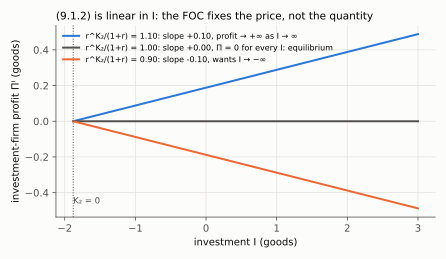
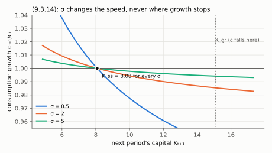

# Derivações — Kurlat, cap. 9 (*General Equilibrium*)

**Aula 6** · [[aula-06-equilibrio-geral/00-index|índice da Aula 6]] · [[06_equilibrio_geral|regras do tópico]] · [[Aula/Slides_Macro1_Aula6|slides]] ·
[[topics-index#Tópico Equilíbrio geral|índice de tópicos]] · volta ao [[00_indice]]

As **33 equações numeradas** do capítulo, uma a uma: o que a equação diz, **de onde ela
sai** (qual hipótese entra, o que se substitui, o que cancela), **de onde ela veio**
(quem a propôs e por quê) e qual é a armadilha.

A [Parte I](#parte-i--912-a-firma-de-investimento) trata em profundidade a **(9.1.2)**, o
problema da firma de investimento. As demais vêm em seguida, na ordem do livro.

> **Numeração.** Uso a do Kurlat, `(9.x.y)`. Os slides da aula numeram de (1) a (24); a
> tabela da [Parte V](#parte-v--tabela-de-correspondência-slides--livro) faz a ponte.

---

## Parte 0 — o mapa das 33

| Bloco | Equações | O que o bloco faz |
|---|---|---|
| Problemas dos agentes | 9.1.1, 9.1.2, (firma, s/ nº) | Escreve o que cada um maximiza |
| Definição de equilíbrio | 9.1.3-9.1.6 | Diz o que "fechar o modelo" significa |
| CPOs | 9.1.7-9.1.11 | Cinco condições, todas com preço dentro |
| Colapso | 9.1.12, 9.1.13 | Os preços cancelam; sobram duas |
| Planejador e prova | 9.2.1-9.2.3 | Mostra que o colapso não foi coincidência |
| Horizonte infinito | 9.3.1-9.3.13 | Repete tudo, com uma mudança só |
| Dinâmica | 9.3.14-9.3.17 | Transforma as equações num gráfico |

**A arquitetura do capítulo em uma frase:** montam-se três problemas de otimização
independentes, extraem-se cinco condições de primeira ordem em que os preços aparecem,
somam-se as condições até os preços **cancelarem**, e prova-se que o que sobrou é o que
um planejador onisciente teria escrito sem nunca ter visto um preço.

---

## Parte I — (9.1.2), a firma de investimento

$$\Pi^{I} \;=\; \max_{I}\ \underbrace{\frac{r^{K}_{2}}{1+r}\big[(1-\delta)K_1 + I\big]}_{\text{valor presente do aluguel de } K_2}\;-\;\underbrace{\big[(1-\delta)K_1 + I\big]}_{\text{custo de } K_2}$$

### O que este agente é

Uma firma cujo negócio inteiro é: comprar as $(1-\delta)K_1$ unidades de capital usado que
sobreviveram ao período 1, somar $I$ unidades novas, ficar com
$K_2 = (1-\delta)K_1 + I$ unidades de capital de período 2, e alugá-las no período 2 ao
preço $r^K_2$ por unidade. Ela não produz nada e não contrata ninguém.

### De onde sai cada pedaço

**1. O colchete.** É literalmente a lei de acumulação (9.1.5), $K_2=(1-\delta)K_1+I$,
substituída dentro. Por isso o mesmo colchete aparece duas vezes: a firma compra e aluga a
**mesma** quantidade. Escrever em $I$ e não em $K_2$ não é estilo — $K_1$ é dado, então $I$
é a única coisa que a firma escolhe.

**2. A receita.** Alugar $K_2$ unidades a $r^K_2$ rende $r^K_2 K_2$ **no período 2**. Custo
e receita estão em datas diferentes e não podem ser somados; dividir por $(1+r)$ traz a
receita para o período 1. É o operador de valor presente do cap. 8, aplicado sem nenhuma
modificação.

**3. O custo.** Construir $K_2$ unidades custa $K_2$ **unidades do bem do período 1**, e não
$p\cdot K_2$. O preço relativo do capital é **um** porque capital e consumo são o mesmo bem
físico, e porque não há custo de ajustamento. Kurlat sinaliza isso entre parênteses no
texto: *"here we are assuming there are no adjustment costs like the ones we had in Section
8.1"*. Essa frase é o cabide de toda a Parte I.

**4. O que não aparece.** Não há valor de revenda do capital ao fim do período 2, porque o
período 2 é o fim do mundo e $\delta_2 = 1$. Compare com a versão de horizonte infinito
(9.3.3), em que o termo reaparece como $\dfrac{r^K_{t+1}+1-\delta}{1+r_{t+1}}$: ali o
capital sobrevive, e a firma recupera $(1-\delta)$ dele.

### O fato estrutural decisivo: é linear em $I$

Derive:

$$\frac{\partial \Pi^{I}}{\partial I} \;=\; \frac{r^{K}_{2}}{1+r} \;-\; 1$$

*Step by step (added in English).* Factor the common bracket out of the two terms of (9.1.2):

$$\Pi^I=\frac{r^K_2}{1+r}\big[(1-\delta)K_1+I\big]-1\cdot\big[(1-\delta)K_1+I\big]=\left(\frac{r^K_2}{1+r}-1\right)\big[(1-\delta)K_1+I\big]$$

The first factor contains only prices, which the firm takes as given; the second is linear in
$I$ with coefficient 1. Differentiate with respect to $I$: the derivative of the bracket is 1,
so what remains is the price factor.

A derivada é uma **constante**: não depende de $I$. Uma função linear não tem máximo
interior. Três casos, e só um sobrevive:

| Caso | O que a firma faz | Consistente com equilíbrio? |
|---|---|---|
| $\dfrac{r^K_2}{1+r} > 1$ | $I \to +\infty$, lucro infinito | Não — capital infinito |
| $\dfrac{r^K_2}{1+r} < 1$ | $I \to -\infty$ | Não |
| $\dfrac{r^K_2}{1+r} = 1$ | **qualquer $I$**, lucro exatamente zero | Sim |

Daí a equação (9.1.11), $1+r = r^K_2$, e daí também $\Pi^I = 0$ — que é o que permite
sumir com $\Pi$ da restrição orçamentária do domicílio.

*Step (added):* $\dfrac{r^K_2}{1+r}=1$; multiply both sides by $1+r$ to get $r^K_2=1+r$. Put the
factor back into $\Pi^I$: $\Pi^I=(1-1)\cdot[(1-\delta)K_1+I]=0$ for every $I$.

*Read the slopes: each line is the profit of (9.1.2) at a given $r^K_2/(1+r)$. Above 1 the line
rises forever, below 1 it falls forever, and only at exactly 1 is it flat at zero — every $I$
is then optimal, so the first-order condition fixes the price and leaves $I$ to the goods market.*

> ### A sutileza que quase todo mundo erra
> A condição de primeira ordem desta firma **não determina a quantidade investida**.
> Ela determina o **preço**. Quando $\frac{r^K_2}{1+r}=1$, a firma é indiferente entre
> todos os níveis de $I$, então o modelo precisa de outra equação para dizer quanto se
> investe — e essa equação é o *market clearing* de bens (9.1.3). Procurar "o $I$ ótimo da
> firma de investimento" é procurar uma coisa que não existe.

### Por que este agente precisa existir

Sem ele há **dois retornos** soltos na economia:

- $r^K_t$, o aluguel que se ganha **possuindo** capital, que vem da firma produtiva (9.1.9);
- $r$, o juro que se ganha **emprestando**, que vem do domicílio (9.1.8).

Nada obriga os dois a coincidirem. A firma de investimento é o arbitrador que os amarra.
Conte as equações: o domicílio entrega duas CPOs, a firma produtiva entrega duas, e ficam
faltando relações para o número de preços a determinar. A (9.1.11) é a que fecha a conta.

### De onde veio, historicamente

**Separação de Fisher.** Que a decisão de investir possa ser destacada num agente separado,
que maximiza valor presente e ignora completamente as preferências de quem o possui, é o
**teorema da separação de Irving Fisher** (*The Theory of Interest*, 1930). Com mercado de
capitais perfeito, o dono da firma quer que ela maximize valor presente **seja qual for**
sua impaciência, porque depois ele reajusta seu próprio consumo emprestando ou tomando
emprestado. É por isso que o modelo pode ter uma firma de investimento sem preferências e
o domicílio não reclamar.

**Custo de uso do capital.** A condição $1+r = r^K_2$ é, no caso de dois períodos com
depreciação total, a versão mais simples do **custo de uso do capital** de **Dale Jorgenson**
("Capital Theory and Investment Behavior", *AER*, 1963): em equilíbrio o aluguel do capital
tem de cobrir juro mais depreciação. A forma geral aparece no capítulo como (9.3.11),
$r_{t+1}=r^K_{t+1}-\delta$.

**O que a linearidade custou.** Investimento sem custo de ajustamento é um caso de gume de
faca: a firma ou quer investir infinito, ou nada, ou é indiferente. Introduzir custo de
ajustamento quebra a linearidade, dá um $I$ interior bem definido e produz o **q de Tobin**
(James Tobin, 1969; condições sob as quais o q médio iguala o marginal em Fumio Hayashi,
1982). É exatamente o §8.1 do Kurlat, que a Aula 6 **não** cobre — o parêntese do livro está
lá para avisar que estamos do lado fácil dessa fronteira.

### Armadilhas

1. **Achar que a firma escolhe $K_2$.** Ela escolhe $I$; $K_1$ é herdado.
2. **Esquecer de descontar.** Somar $r^K_2 K_2$ com $K_2$ sem dividir por $(1+r)$ mistura
   bens de datas diferentes. É o erro que o cap. 8 inteiro existe para prevenir.
3. **Procurar quantidade numa condição de preço** — ver a caixa acima.
4. **Somar um valor de revenda.** No caso de dois períodos não há: o mundo acaba.

---

## Parte II — o resto de §9.1

### (9.1.1) — o problema do domicílio

$$\max_{c_1,l_1,c_2,l_2} u(c_1)+v(l_1)+\beta\big[u(c_2)+v(l_2)\big]$$
$$\text{s.a.}\quad c_1+\frac{c_2}{1+r}\le w_1(1-l_1)+\frac{w_2(1-l_2)}{1+r}+K_1\big(1+r^K_1-\delta\big)+\Pi$$

**De onde sai.** É o problema do §7.4 (trabalho e lazer dinâmico) com **duas adições**:
o domicílio começa dono de $K_1$, e é dono das firmas.

- $K_1(1+r^K_1-\delta)$: ele aluga o capital inicial e recebe $r^K_1$ por unidade, mas o
  estoque deprecia; o que sobra em valor é $K_1(1-\delta)$, e somando o aluguel vem o termo
  entre parênteses. **Não é** $K_1 r^K_1$ apenas — o principal também é riqueza dele.
- $\Pi \equiv \Pi^F_1 + \frac{\Pi^F_2}{1+r} + \Pi^I$: os lucros, em valor presente. Em
  equilíbrio $\Pi=0$, mas a variável tem de estar escrita para que a prova do 1º TBE
  (9.2.2)-(9.2.3) possa usá-la.

**Por que aditiva e separável.** $u(c)+v(l)$ separa consumo de lazer, e $\beta^t$ desconta
geometricamente. A separabilidade é uma restrição real sobre as preferências — ela é o que
garante que a CPO de lazer não carregue $c$ e vice-versa. O desconto geométrico é a forma
que torna as preferências **consistentes no tempo**: **Robert Strotz** (1955) mostrou que
qualquer outra forma de desconto gera inconsistência dinâmica, com o agente querendo
revisar hoje o plano que fez ontem.

**Armadilha.** Escrever a restrição período a período e esquecer que as duas colapsam numa
só quando existe mercado de crédito. O lado direito é **riqueza**, não renda.

### Problema da firma produtiva (sem número no livro)

$$\Pi^F_t=\max_{K,L}\ F(K_t,L_t)-w_tL_t-r^K_tK_t$$

**De onde sai.** Direto do cap. 4. A firma é **estática**: aluga tudo período a período e
não carrega nada entre datas. É por isso que ela não precisa de taxa de desconto e por isso
que o problema cabe em uma linha.

**História.** A firma que aluga fatores e paga a cada um seu produto marginal é a teoria da
distribuição de **John Bates Clark** (*The Distribution of Wealth*, 1899), formalizada com
a função de produção agregada por **Cobb e Douglas** (1928).

### (9.1.3) e (9.1.4) — mercado de bens

$$F(K_1,L_1)=c_1+I \qquad\qquad F(K_2,L_2)=c_2$$

**De onde saem.** De nada: são **definições contábeis** impostas como condição de
equilíbrio. Economia fechada e sem governo, então o produto só tem dois destinos, e no
período 2 só um, porque investir para um período que não existe seria desperdício.

**Armadilha.** Achar que (9.1.3) é uma equação de comportamento. Não é — é a exigência de
que as contas fechem. E é ela, não a firma de investimento, que determina $I$.

### (9.1.5) — acumulação de capital

$$K_2=K_1(1-\delta)+I$$

**De onde sai.** Contabilidade de estoque e fluxo, a mesma do Solow (cap. 4). É a única
equação do capítulo que liga fisicamente os dois períodos.

### (9.1.6) — mercado de trabalho

$$L_t+l_t=1$$

**De onde sai.** Normalização da dotação de tempo. Vale como igualdade porque o tempo não
some: cada hora ou é vendida ou é lazer.

### (9.1.7) — a margem intratemporal

$$\frac{v'(l_t)}{u'(c_t)}=w_t$$

**De onde sai.** Lagrangiano de (9.1.1): a CPO de $c_t$ dá $u'(c_t)=\lambda\cdot(\text{preço
do bem})$, a de $l_t$ dá $v'(l_t)=\lambda w_t\cdot(\ldots)$; dividindo uma pela outra o
multiplicador $\lambda$ **cancela**, e sobra a taxa marginal de substituição igual ao preço
relativo. É idêntica à (7.4.2) da Aula 5.

*The Lagrangian in full (added).* With multiplier $\lambda$ on the single lifetime budget of
(9.1.1):

$$\mathcal L=u(c_1)+v(l_1)+\beta\big[u(c_2)+v(l_2)\big]+\lambda\Big[w_1(1-l_1)+\frac{w_2(1-l_2)}{1+r}+K_1(1+r^K_1-\delta)+\Pi-c_1-\frac{c_2}{1+r}\Big]$$

Differentiate with respect to each choice and set to zero:

$$\frac{\partial\mathcal L}{\partial c_1}=u'(c_1)-\lambda=0 \qquad\qquad \frac{\partial\mathcal L}{\partial l_1}=v'(l_1)-\lambda w_1=0$$

$$\frac{\partial\mathcal L}{\partial c_2}=\beta u'(c_2)-\frac{\lambda}{1+r}=0 \qquad\qquad \frac{\partial\mathcal L}{\partial l_2}=\beta v'(l_2)-\frac{\lambda w_2}{1+r}=0$$

For $t=1$: move $\lambda w_1$ across, $v'(l_1)=\lambda w_1$, and divide by the $c_1$ condition
$u'(c_1)=\lambda$; $\lambda$ cancels and $v'(l_1)/u'(c_1)=w_1$. For $t=2$: divide the $l_2$
condition by the $c_2$ condition; $\beta$ and $\lambda/(1+r)$ both cancel and
$v'(l_2)/u'(c_2)=w_2$.

**Armadilha.** Este é o mesmo objeto do formulário da Aula 5 — lá com $\widetilde w$, aqui
sem imposto. Ver [[formulario-aula-05]].

### (9.1.8) — a equação de Euler

$$u'(c_1)=\beta(1+r)\,u'(c_2)$$

**De onde sai.** Mesmo lagrangiano, agora dividindo a CPO de $c_1$ pela de $c_2$. É a
(6.3.9) da Aula 4, sem alteração nenhuma.

*Step (added).* From the $c_2$ condition, multiply both sides by $1+r$:
$\lambda=\beta(1+r)u'(c_2)$. From the $c_1$ condition, $\lambda=u'(c_1)$. Set the two
expressions for $\lambda$ equal: $u'(c_1)=\beta(1+r)u'(c_2)$.

**História.** O nome vem de **Leonhard Euler** e da equação de Euler–Lagrange do cálculo das
variações (século XVIII) — a condição que qualquer trajetória ótima tem de satisfazer entre
dois instantes vizinhos. O uso em consumo intertemporal é de **Frank Ramsey** (1928), e a
forma moderna com utilidade marginal esperada, de **Robert Hall** (1978).

### (9.1.9) e (9.1.10) — as CPOs da firma

$$F_K(K_t,L_t)=r^K_t \qquad\qquad F_L(K_t,L_t)=w_t$$

**De onde saem.** Derivadas do lucro em $K$ e em $L$. São (4.4.1) e (4.4.2).

*Steps (added).* $\partial\Pi^F_t/\partial K_t=F_K(K_t,L_t)-r^K_t=0$ and
$\partial\Pi^F_t/\partial L_t=F_L(K_t,L_t)-w_t=0$; move the price to the right-hand side. With
$F=A K^{\alpha}L^{1-\alpha}$: $F_K=\alpha A K^{\alpha-1}L^{1-\alpha}=\alpha F/K$ and
$F_L=(1-\alpha)AK^{\alpha}L^{-\alpha}=(1-\alpha)F/L$.

**O que elas fazem no capítulo.** São a ponte pela qual a **tecnologia entra nos preços**.
Sem elas, o passo seguinte é impossível.

### (9.1.11) — a condição de arbitragem

$$1+r=r^K_2$$

Derivada na [Parte I](#o-fato-estrutural-decisivo-é-linear-em-i). É a (4.4.12) com
$\delta=1$, e é a afirmação de que o **VPL do investimento é zero em equilíbrio**.

### (9.1.12) e (9.1.13) — o colapso

$$\underbrace{\frac{v'(l_t)}{u'(c_t)}}_{\text{TMS}}=\underbrace{F_L(K_t,L_t)}_{\text{TMT}} \qquad\qquad \underbrace{\frac{u'(c_1)}{\beta u'(c_2)}}_{\text{TMS}}=\underbrace{F_K(K_2,L_2)}_{\text{TMT}}$$

**De onde saem.**
- (9.1.12): substitua (9.1.10) em (9.1.7). Uma linha.
- (9.1.13): substitua (9.1.11) e (9.1.9) em (9.1.8). $u'(c_1)=\beta(1+r)u'(c_2)$ com
  $1+r=r^K_2=F_K(K_2,L_2)$ dá o resultado direto.

*Each operation (added).* (9.1.12): (9.1.7) says $v'(l_t)/u'(c_t)=w_t$ and (9.1.10) says
$w_t=F_L(K_t,L_t)$; replace $w_t$ in the first by the second. (9.1.13): divide both sides of
(9.1.8) by $\beta u'(c_2)$ to get $\dfrac{u'(c_1)}{\beta u'(c_2)}=1+r$; replace $1+r$ by $r^K_2$
(9.1.11); replace $r^K_2$ by $F_K(K_2,L_2)$ (9.1.9 at $t=2$).

**Por que isso importa.** Do lado esquerdo, **preferências**: quanto o domicílio *está
disposto* a trocar. Do lado direito, **tecnologia**: quanto a economia *consegue* trocar.
Os preços sumiram porque cada um aparecia duas vezes, uma numa condição de domicílio e uma
numa de firma. O que sobrou não menciona mercado nenhum — e é por isso que a §9.2 consegue
provar que um planejador escreveria a mesma coisa.

**História.** "TMS = TMT" é a condição de eficiência da **nova economia do bem-estar**
(Bergson 1938, Hicks e Kaldor 1939, Samuelson 1947). É o mesmo par de igualdades da caixa
de Edgeworth, com produção.

---

## Parte III — §9.2, as três da prova

### (9.2.1) — o problema do planejador

$$\max_{c_1,l_1,c_2,l_2,L_1,L_2,K_2} u(c_1)+v(l_1)+\beta\big[u(c_2)+v(l_2)\big]$$
$$\text{s.a.}\quad K_2\le(1-\delta)K_1+F(K_1,L_1)-c_1,\quad c_2\le F(K_2,L_2),\quad L_t\le 1-l_t$$

**De onde sai.** As restrições são **exatamente** (9.1.3)-(9.1.6) reescritas. A única coisa
que mudou em relação ao domicílio é o que **não** está lá: nenhum preço, nenhuma reta
orçamentária, nenhum lucro.

**Como se resolve.** Substituem-se as três restrições na função objetivo, o que deixa um
problema irrestrito em $L_1$, $L_2$ e $K_2$:

$$u\big((1-\delta)K_1+F(K_1,L_1)-K_2\big)+v(1-L_1)+\beta\big[u(F(K_2,L_2))+v(1-L_2)\big]$$

As três CPOs, depois de rearranjadas, **voltam a ser (9.1.12) e (9.1.13)**.

*The three FOCs written out (added).* Call the objective $W$, with
$c_1=(1-\delta)K_1+F(K_1,L_1)-K_2$, $c_2=F(K_2,L_2)$, $l_t=1-L_t$. Chain rule on each argument:

- $L_1$ enters $c_1$ (through $F$) and $l_1$ (with sign $-1$):
  $$\frac{\partial W}{\partial L_1}=u'(c_1)F_L(K_1,L_1)-v'(l_1)=0 \;\Longrightarrow\; \frac{v'(l_1)}{u'(c_1)}=F_L(K_1,L_1)$$
- $L_2$ enters $c_2$ and $l_2$, both inside $\beta[\cdot]$:
  $$\frac{\partial W}{\partial L_2}=\beta\big[u'(c_2)F_L(K_2,L_2)-v'(l_2)\big]=0 \;\Longrightarrow\; \frac{v'(l_2)}{u'(c_2)}=F_L(K_2,L_2)$$
- $K_2$ lowers $c_1$ one for one and raises $c_2$ through $F_K$:
  $$\frac{\partial W}{\partial K_2}=-u'(c_1)+\beta u'(c_2)F_K(K_2,L_2)=0 \;\Longrightarrow\; \frac{u'(c_1)}{\beta u'(c_2)}=F_K(K_2,L_2)$$

(Last step of each: move the negative term across, then divide.) These are (9.1.12) for
$t=1,2$ and (9.1.13), and no price was ever written down.

**História.** A figura do planejador benevolente vem do **debate do cálculo socialista** dos
anos 1920-40 — **Ludwig von Mises** (1920) e **Friedrich Hayek** argumentando que o cálculo
seria impossível sem preços, **Oskar Lange** (1936-37) e **Abba Lerner** respondendo com um
socialismo de mercado em que o planejador imita preços. O teorema desta seção é, em certo
sentido, o resultado técnico que aquele debate estava tateando.

**Armadilha.** Chamar as restrições de "orçamentárias". Kurlat é explícito: *"these
constraints are not exactly budget constraints since the planner is not buying or selling
from anyone; rather, they are technological constraints"*.

### (9.2.2) — a desigualdade de inacessibilidade

$$\hat c_1+\frac{\hat c_2}{1+r}>w_1(1-\hat l_1)+\frac{w_2(1-\hat l_2)}{1+r}+K_1(1+r^K_1-\delta)+\Pi$$

**De onde sai.** De **revelação de preferência**, não de álgebra. Suponha que exista a
alocação com chapéu, factível para o planejador e estritamente melhor. O domicílio escolhia
livremente e **não** a escolheu. Logo ela não estava no seu conjunto orçamentário. Se
estivesse, ele a teria tomado.

**Armadilha.** Achar que a desigualdade é uma hipótese. É uma **dedução** da otimização do
domicílio — e é o primeiro dos dois pilares da prova.

### (9.2.3) — a desigualdade de lucro agregado

$$\Pi \ \ge\ F(K_1,\hat L_1)-w_1\hat L_1-r^K_1K_1+\frac{F(\hat K_2,\hat L_2)-w_2\hat L_2-r^K_2\hat K_2}{1+r}+\left(\frac{r^K_2}{1+r}-1\right)\big[(1-\delta)K_1+\hat I\big]$$

**De onde sai.** Segundo pilar. Cada firma estava maximizando lucro, então o lucro que
efetivamente obteve é **pelo menos** o que obteria produzindo as quantidades com chapéu.
Escreve-se essa desigualdade para a firma do período 1, a do período 2 e a de investimento,
e somam-se as três com os pesos da definição $\Pi\equiv\Pi^F_1+\frac{\Pi^F_2}{1+r}+\Pi^I$.

**Onde a (9.1.2) reaparece.** O último termo é o lucro da firma de investimento avaliado na
alocação com chapéu — literalmente a (9.1.2) com $\hat I$ no lugar de $I$.

**O fecho.** Substitua (9.2.3), $\hat L_t\le 1-\hat l_t$ e $\hat I=\hat K_2-(1-\delta)K_1$
dentro de (9.2.2). Todos os preços cancelam e sobra:

$$\hat c_1+\hat K_2+\frac{\hat c_2}{1+r}\;>\;F(K_1,\hat L_1)+(1-\delta)K_1+\frac{F(\hat K_2,\hat L_2)}{1+r}$$

o que obriga pelo menos uma das restrições do planejador a ser violada. Contradição: a
alocação com chapéu nunca foi factível.

*The substitution, one operation per line (added).* Start from the right-hand side of (9.2.2),
call it $R$.

1. Hat labour is feasible, $\hat L_t\le1-\hat l_t$, and $w_t>0$, so
   $w_t(1-\hat l_t)\ge w_t\hat L_t$:
   $$R\;\ge\;w_1\hat L_1+\frac{w_2\hat L_2}{1+r}+K_1(1+r^K_1-\delta)+\Pi$$
2. Replace $\Pi$ by its lower bound (9.2.3), and write $(1-\delta)K_1+\hat I=\hat K_2$ (9.1.5):
   $$R\;\ge\;w_1\hat L_1+\frac{w_2\hat L_2}{1+r}+K_1(1+r^K_1-\delta)
   +F(K_1,\hat L_1)-w_1\hat L_1-r^K_1K_1+\frac{F(\hat K_2,\hat L_2)-w_2\hat L_2-r^K_2\hat K_2}{1+r}
   +\left(\frac{r^K_2}{1+r}-1\right)\hat K_2$$
3. Cancel the wage bills: $+w_1\hat L_1$ against $-w_1\hat L_1$, and
   $+\frac{w_2\hat L_2}{1+r}$ against $-\frac{w_2\hat L_2}{1+r}$.
4. Cancel the period-1 rent: $K_1(1+r^K_1-\delta)-r^K_1K_1=(1-\delta)K_1$.
5. Cancel the period-2 rent: $-\frac{r^K_2\hat K_2}{1+r}+\frac{r^K_2}{1+r}\hat K_2-\hat K_2=-\hat K_2$.
6. What is left contains no price but $1+r$ as a discount factor:
   $$R\;\ge\;(1-\delta)K_1+F(K_1,\hat L_1)-\hat K_2+\frac{F(\hat K_2,\hat L_2)}{1+r}$$
7. Chain with (9.2.2), $\hat c_1+\frac{\hat c_2}{1+r}>R$, and add $\hat K_2$ to both sides: the
   inequality displayed just above (the one Kurlat closes the proof with).
8. Suppose the hat allocation met both planner constraints, $\hat c_1\le(1-\delta)K_1+F(K_1,\hat L_1)-\hat K_2$
   and $\hat c_2\le F(\hat K_2,\hat L_2)$. Divide the second by $1+r>0$ and add it to the first:
   the left side of step 7 would be $\le$ its right side. That contradicts the strict $>$. ∎

*Read the pink point $\hat{\mathbf x}$: preferred to the equilibrium (above the indifference
curve), hence above the budget line (9.2.2), hence above the technology frontier (steps 1–8).
The market price line separates what the household wants from what the economy can make.*

**História.** A versão informal é a **mão invisível** de **Adam Smith** (1776). A prova
formal em economias gerais é de **Kenneth Arrow** (1951) e **Gérard Debreu** (1951),
consolidada em Arrow–Debreu (1954) — trabalho pelo qual ambos receberam o Nobel. O critério
de otimalidade é de **Vilfredo Pareto** (*Manuale di economia politica*, 1906), que os
slides citam pelo nome.

---

## Parte IV — §9.3, horizonte infinito e dinâmica

### (9.3.1) e (9.3.2) — o domicílio com infinitos períodos

$$\max_{c_t,l_t,a_{t+1}}\sum_{t=0}^{\infty}\beta^t\big[u(c_t)+v(l_t)\big]$$
$$a_{t+1}=(1+r_t)a_t+w_t(1-l_t)+\Pi^F_t+\Pi^I_t-c_t$$

com $a_0=K_0(1+r^K_0-\delta)$ dado e uma condição **No-Ponzi** como a (6.3.7).

**O que mudou em relação a (9.1.1).** Uma restrição só virou uma **sequência infinita** de
restrições de fluxo, cada uma ligando um período ao seguinte. Não há mais como colapsar
tudo numa reta orçamentária sem uma condição adicional no limite — daí a No-Ponzi.

**Por que a No-Ponzi.** Sem ela o domicílio rolaria dívida para sempre, consumindo sem
nunca pagar, e o problema não teria solução. A condição proíbe que a dívida cresça à taxa
de juros indefinidamente.

**História.** O problema de poupança ótima com horizonte infinito é de **Frank Ramsey**
("A Mathematical Theory of Saving", *Economic Journal*, 1928), escrito aos 25 anos e dois
antes de sua morte; Keynes chamou o artigo de uma das contribuições mais notáveis já feitas
à economia matemática. O nome "Ponzi" vem de **Charles Ponzi**, do esquema de Boston de 1920.

### (9.3.3) — a firma de investimento, versão infinita

$$\Pi^I_t=\max_{I}\ \frac{r^K_{t+1}+1-\delta}{1+r_{t+1}}\big[K_t(1-\delta)+I\big]-\big[K_t(1-\delta)+I\big]$$

**A única diferença em relação a (9.1.2):** o numerador ganhou $+1-\delta$. O capital não
some mais no fim do período, então além do aluguel a firma recupera a fração $(1-\delta)$
do bem. Toda a lógica da Parte I sobrevive intacta: continua **linear em $I$**, continua
sem ótimo interior, e continua obrigando o coeficiente a valer exatamente um.

### (9.3.4)-(9.3.6) — *market clearing*

$$F(K_t,L_t)=c_t+I_t \qquad K_{t+1}=K_t(1-\delta)+I_t \qquad L_t+l_t=1$$

Idênticas a (9.1.3)-(9.1.6), agora para todo $t$. Nada novo.

### (9.3.7)-(9.3.10) — as CPOs

$$\frac{v'(l_t)}{u'(c_t)}=w_t \qquad u'(c_t)=\beta(1+r_{t+1})u'(c_{t+1})$$
$$F_K(K_t,L_t)=r^K_t \qquad F_L(K_t,L_t)=w_t$$

As mesmas de §9.1, com índices deslizantes. Kurlat escreve no texto que *"there isn't much
conceptual difference"* — e não há mesmo.

### (9.3.11) — arbitragem com depreciação parcial

$$r_{t+1}=r^K_{t+1}-\delta$$

**De onde sai.** Da linearidade de (9.3.3), pelo mesmo argumento da Parte I: o coeficiente
de $I$ tem de ser zero, logo $\frac{r^K_{t+1}+1-\delta}{1+r_{t+1}}=1$, que rearranjado dá o
resultado.

*Rearranging (added):* multiply both sides by $1+r_{t+1}$, giving
$r^K_{t+1}+1-\delta=1+r_{t+1}$; subtract 1 from both sides, giving
$r_{t+1}=r^K_{t+1}-\delta$. É a (4.4.12) do cap. 4 e é o **custo de uso do capital** de Jorgenson na sua
forma reconhecível: **o aluguel cobre juro mais depreciação**.

### (9.3.12) e (9.3.13) — o colapso, de novo

$$\frac{v'(l_t)}{u'(c_t)}=F_L(K_t,L_t) \qquad\qquad \frac{u'(c_t)}{\beta u'(c_{t+1})}=1+F_K(K_{t+1},L_{t+1})-\delta$$

Mesma receita: (9.3.10) em (9.3.7); (9.3.11) e (9.3.9) em (9.3.8).

*Each operation for (9.3.13) (added):* divide both sides of (9.3.8) by $\beta u'(c_{t+1})$,
giving $\dfrac{u'(c_t)}{\beta u'(c_{t+1})}=1+r_{t+1}$; replace $r_{t+1}$ by $r^K_{t+1}-\delta$
(9.3.11); replace $r^K_{t+1}$ by $F_K(K_{t+1},L_{t+1})$ (9.3.9 at $t+1$).

Note a diferença de
forma em relação à (9.1.13): agora o lado direito é $1+F_K-\delta$, e não $F_K$ puro,
porque o capital **sobrevive**. Com $\delta=1$ as duas coincidem.

### (9.3.14) — crescimento do consumo

$$\frac{c_{t+1}}{c_t}=\big[\beta\big(1+F_K(K_{t+1},1)-\delta\big)\big]^{1/\sigma}$$

**De onde sai.** Duas hipóteses simplificadoras entram aqui e não antes:
1. **Oferta de trabalho fixa**, $L_t=1$, o que aposenta a (9.3.12);
2. **Utilidade CRRA**, $u(c)=\dfrac{c^{1-\sigma}}{1-\sigma}$, logo $u'(c)=c^{-\sigma}$.

Substituindo em (9.3.13): $\dfrac{c_t^{-\sigma}}{\beta c_{t+1}^{-\sigma}}=1+F_K-\delta$, ou
$\left(\dfrac{c_{t+1}}{c_t}\right)^{\sigma}=\beta(1+F_K-\delta)$. Elevando a $1/\sigma$ vem
o resultado.

*The middle step (added).* Dividing by a negative power is multiplying by the positive one:
$\dfrac{c_t^{-\sigma}}{c_{t+1}^{-\sigma}}=\dfrac{c_{t+1}^{\sigma}}{c_t^{\sigma}}=\left(\dfrac{c_{t+1}}{c_t}\right)^{\sigma}$.
So the left side is $\dfrac{1}{\beta}\left(\dfrac{c_{t+1}}{c_t}\right)^{\sigma}$; multiply both
sides by $\beta$ to reach the second form, then raise both sides to $1/\sigma$.

*Read where the curves cross 1: at $K_{ss}=8.08$ for every $\sigma$ (here $\alpha=0.35$,
$\delta=0.06$, $\beta=1/1.03$). $\sigma$ only tilts the curve — a low $\sigma$ (high
$1/\sigma$) makes consumption react more to the same capital gap. At $K_{gr}=15.08$ growth is
already negative, which is (9.3.17) against the Golden Rule in one picture.*

**A cadeia econômica**, que Kurlat percorre explicitamente: capital baixo → produto marginal
alto (rendimentos decrescentes) → aluguel alto por (9.1.9) → juro alto por (9.1.11) →
consumo presente caro → domicílio adia consumo → consumo cresce.

**História.** A CRRA vem da medida de aversão relativa ao risco de **Kenneth Arrow** (1965) e
**John Pratt** (1964). Em contexto intertemporal, $1/\sigma$ é a **elasticidade de
substituição intertemporal**, e a distinção entre os dois papéis do mesmo parâmetro é o que
motivou as preferências de **Epstein–Zin** (1989) — fora do escopo do curso.

**Armadilha.** Trocar $\sigma$ por $1/\sigma$. É a mesma armadilha da Lista 3.

### (9.3.15) — a restrição de recursos, reescrita

$$K_{t+1}=(1-\delta)K_t+F(K_t,1)-c_t$$

**De onde sai.** Substitua (9.3.4) em (9.3.5) e imponha $L_t=1$. Só isso.

*Written out (added):* (9.3.4) solved for investment is $I_t=F(K_t,L_t)-c_t$; put it into
(9.3.5), $K_{t+1}=K_t(1-\delta)+F(K_t,L_t)-c_t$; set $L_t=1$.

**O que ela é.** Junto com (9.3.14), o par de **equações de diferenças** em $K_t$ e $c_t$
que gera o diagrama de fase. Duas equações, duas variáveis, e daí para a frente tudo é
geometria.

### (9.3.16) e (9.3.17) — a reta vertical

$$\frac{c_{t+1}}{c_t}=1 \;\Longrightarrow\; \big[\beta(1+F_K(K_{t+1},1)-\delta)\big]^{1/\sigma}=1 \;\Longrightarrow\; F_K(K_{t+1},1)-\delta=\frac{1}{\beta}-1$$

**De onde sai.** Iguale (9.3.14) a um. O expoente $1/\sigma$ some — elevar 1 a qualquer
potência dá 1 — e sobra uma condição **só em $K$**.

*Each operation (added):* raise both sides of $[\beta(1+F_K-\delta)]^{1/\sigma}=1$ to the power
$\sigma$: $\beta(1+F_K-\delta)=1$. Divide by $\beta$: $1+F_K-\delta=1/\beta$. Subtract 1:
$F_K-\delta=1/\beta-1$. Writing $\beta=1/(1+\rho)$, $1/\beta-1=\rho$, so this is
$F_K(K_{ss},1)=\delta+\rho$ — the $f'(k^*)=\delta+\rho$ of
[[aula-06-equilibrio-geral/02-dynamics-and-saddle-path|02-dynamics-and-saddle-path]] §2.2.
With $F=K^{\alpha}$: $\alpha K_{ss}^{\alpha-1}=1/\beta-1+\delta$, so
$K_{ss}=\big[\alpha/(1/\beta-1+\delta)\big]^{1/(1-\alpha)}$.

**Por que a reta é vertical.** Porque $c$ não aparece na condição final. Todo nível de
consumo é compatível com ela, logo o lugar geométrico é uma vertical. Essa é a resposta
certa; "porque $c$ é variável de salto" é verdade mas não é o motivo.

**A outra curva**, que Kurlat deriva sem numerar: imponha $K_{t+1}=K_t$ em (9.3.15) e vem
$c=F(K,1)-\delta K$ — côncava, com pico onde $F_K=\delta$.

*Steps (added):* with $K_{t+1}=K_t=K$, (9.3.15) reads $K=(1-\delta)K+F(K,1)-c$; subtract
$(1-\delta)K$ from both sides and add $c$: $c=F(K,1)-\delta K$. Its derivative in $K$ is
$F_K(K,1)-\delta$ and its second derivative $F_{KK}<0$, so it is concave and peaks where
$F_K=\delta$.

**História.** O diagrama de fase com *saddle path* neste modelo é de **David Cass** (1965) e
**Tjalling Koopmans** (1965), que trouxeram o problema de Ramsey para dentro do arcabouço de
Solow. Daí o nome **modelo de Ramsey–Cass–Koopmans**, que é como a Fig. 9.3.1 do Kurlat está
rotulada (*"Dynamics of the Neoclassical Growth Model"*). A terminologia de ponto de sela vem
da teoria de equações de diferenças; a ideia de que a estabilidade seleciona o equilíbrio é o
**princípio de correspondência** de **Paul Samuelson** (*Foundations*, 1947).

### A comparação com a Regra de Ouro (usa a (4.3.4))

$$F_K(K_{gr},1)=\delta \qquad\text{contra}\qquad F_K(K_{ss},1)=\frac{1}{\beta}-1+\delta>\delta \;\Longrightarrow\; K_{ss}<K_{gr}$$

**De onde sai.** (4.3.4) do cap. 4 dá a Regra de Ouro com $n=0$; (9.3.17) rearranjada dá o
estado estacionário. A desigualdade vale **enquanto o domicílio for impaciente**,
$\beta<1$. Como $F_K$ é decrescente, produto marginal maior significa capital menor.

*The inequality, step by step (added):* $\beta<1\Rightarrow1/\beta>1\Rightarrow1/\beta-1>0$;
add $\delta$ to both sides: $F_K(K_{ss},1)=1/\beta-1+\delta>\delta=F_K(K_{gr},1)$. Since
$F_{KK}<0$, $F_K$ is strictly decreasing, and a strictly decreasing function is larger only at a
smaller argument: $K_{ss}<K_{gr}$. With $F=K^\alpha$, dividing the two closed forms,
$K_{ss}/K_{gr}=\big[\delta/(1/\beta-1+\delta)\big]^{1/(1-\alpha)}$, which tends to 1 as
$\beta\to1$ — the limit stated next. The gap is drawn in
[[aula-06-equilibrio-geral/02-dynamics-and-saddle-path|02-dynamics-and-saddle-path]] §2.2.

**O limite que fecha o argumento:** $K_{ss}\to K_{gr}$ quando $\beta\to 1$. A distância
entre os dois **é** a impaciência, medida.

**História.** A Regra de Ouro é de **Edmund Phelps** ("The Golden Rule of Accumulation: A
Fable for Growthmen", *AER*, 1961) — o título brinca com a regra de ouro moral, "faça aos
outros", aplicada a gerações. **Maurice Allais** (1947) e **Trevor Swan** haviam chegado a
resultados próximos antes. A demonstração de que o equilíbrio com poupança endógena fica
**abaixo** dela é precisamente o que Cass e Koopmans acrescentaram: a Regra de Ouro deixa de
ser normativa quando alguém tem preferências.

---

## Parte V — tabela de correspondência slides → livro

| Slides (Aula 6) | Kurlat | O que é |
|---|---|---|
| (1) | 9.1.7 | TMS lazer-consumo $=w$ |
| (2) | 9.1.8 | Euler |
| (3), (4) | 9.1.9, 9.1.10 | CPOs da firma |
| (5) | 9.1.11 | $1+r=r^K_2$ |
| (6), (7) | 9.1.3, 9.1.4 | Bens |
| (8) | 9.1.5 | Capital |
| (9) | 9.1.6 | Trabalho |
| (10), (11) | 9.1.12, 9.1.13 | O colapso |
| (12) | 9.2.2 | Inacessibilidade |
| (13) | 9.2.3 | Lucro agregado |
| (14)-(18) | 9.3.7-9.3.11 | CPOs, horizonte infinito |
| (19), (20) | 9.3.12, 9.3.13 | Colapso, horizonte infinito |
| (21) | 9.3.14 | Crescimento do consumo |
| (22) | 9.3.15 | Recursos |
| (23), (24) | 9.3.16, 9.3.17 | A reta vertical |

---

## Parte VI — o que cai quando cada hipótese cai

| Hipótese | Onde entra | O que morre sem ela |
|---|---|---|
| Retornos constantes de escala | Firma produtiva | $\Pi^F=0$; a renda do domicílio fica indeterminada |
| Sem custo de ajustamento | (9.1.2) | A linearidade; aparece um $I$ interior e o q de Tobin |
| Mercados competitivos | (9.1.9), (9.1.10) | Preço deixa de igualar produto marginal; o colapso não ocorre e o 1º TBE cai |
| Mercados completos | Prova de §9.2 | A revelação de preferência em (9.2.2) perde validade |
| Sem restrição de crédito | (9.2.2) | Não escolher deixa de significar não poder pagar — **é a Lista 3, Q2** |
| Sem externalidade | §9.2 | Valor privado deixa de ser social; a orquestra do jardim do Kurlat |
| $\beta<1$ | (9.3.17) | Com $\beta=1$, $K_{ss}=K_{gr}$ e a Regra de Ouro volta a valer |
| Preferências separáveis | (9.1.1) | (9.1.7) passaria a carregar $c$; as duas margens deixariam de se separar |

---

## Uma linha do tempo

| Ano | Quem | O quê | Onde aparece |
|---|---|---|---|
| 1776 | Adam Smith | Mão invisível, informal | §9.2 |
| 1899 | J. B. Clark | Distribuição por produto marginal | 9.1.9, 9.1.10 |
| 1906 | Vilfredo Pareto | Critério de otimalidade | §9.2 |
| 1928 | Frank Ramsey | Poupança ótima com horizonte infinito | 9.3.1 |
| 1928 | Cobb e Douglas | Função de produção agregada | Toda a §9.3 |
| 1930 | Irving Fisher | Teorema da separação | (9.1.2) |
| 1936-37 | Lange e Lerner | Debate do cálculo socialista | (9.2.1) |
| 1947 | Paul Samuelson | Princípio de correspondência | *Saddle path* |
| 1951 | Arrow e Debreu | Prova formal do 1º TBE | Proposição 9.1 |
| 1955 | Robert Strotz | Consistência do desconto geométrico | (9.1.1) |
| 1956 | Solow e Swan | Poupança exógena, o contraste | Regra de Ouro |
| 1961 | Edmund Phelps | Regra de Ouro | $K_{gr}$ |
| 1963 | Dale Jorgenson | Custo de uso do capital | 9.1.11, 9.3.11 |
| 1964-65 | Pratt e Arrow | Aversão relativa ao risco | CRRA em 9.3.14 |
| 1965 | Cass e Koopmans | Diagrama de fase, *saddle path* | 9.3.14-9.3.17 |
| 1969 | James Tobin | q, quando há custo de ajustamento | O que a (9.1.2) evita |
| 1978 | Robert Hall | Euler em consumo, forma moderna | 9.1.8 |

> As atribuições acima são as padrão de livro-texto. Nenhuma delas é cobrada na prova: elas
> estão aqui para dar a cada equação um lugar na conversa em que ela nasceu, e porque a
> avaliação final tem parte discursiva.

---

## Onde praticar cada bloco

| Bloco | Exercícios do Kurlat |
|---|---|
| Definição de equilíbrio, §9.1 | **9.2** *Storage* (p. 179), **9.5** (p. 181) |
| Firma de investimento, (9.1.2) | **9.2** (p. 179), **9.8** *A New Technology* (p. 183) |
| 1º TBE e suas falhas, §9.2 | **9.1** (p. 179), **9.6** *Capital Income Taxes* (p. 182), **9.13** *The Enclosure Acts* (p. 186) |
| Diagrama de fase, §9.3 | **9.9** *An Oil-Producing Economy* (p. 184) — pede duas fases no mesmo gráfico |
| Regra de Ouro vs. $K_{ss}$ | **9.12** *Optimal vs Fixed Savings Rates* (p. 185) |

Páginas para ler, na ordem: §9.1 (pp. 165-168) → §9.2 (pp. 168-172) → §9.3 (pp. 172-179).
