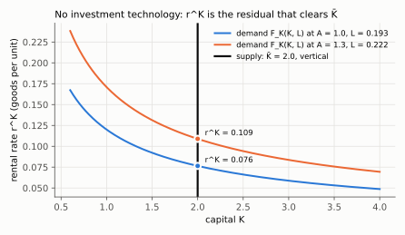
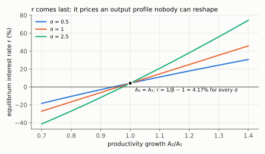

# Why $K_1$ and $K_2$ are exogenous — Lista 5, Question 1

**Kurlat (2020), cap. 9** · [[06_equilibrio_geral|regras do tópico]] ·
[[derivacoes-cap-09|as 33 equações do cap. 9]] ·
[[Listas/MPE_Macro1_2026_Lista5|Lista 5]] · volta ao [[00_indice]]

> Note on language: written in English per the global output rule, which overrides the
> project's Portuguese default. Quoted statements stay in their original wording.

The statement of Question 1 says it outright — *"There is no government and no investment
technology: the capital stock is fixed at $\bar K$ in both periods and does not
depreciate."* — but the interesting question is **what that assumption switches off**, and
why the exercise is solvable *because* of it. The short version: a variable is endogenous
only when some agent has a margin that can move it. Question 1 removes every such margin.

---

## 1. Two different reasons, one for each date

They are not exogenous for the same reason. Keeping them apart is the whole point.

| | Why it is exogenous | Still exogenous in Question 2? |
|---|---|---|
| $K_1$ | **Predetermined.** It is an initial condition — the stock the economy inherits from a past the model does not contain. Nobody at date 1 can choose it, because choosing it would require having invested at date 0. | **Yes** — $K_0$ is "given" there too, by the same argument. |
| $K_2$ | **The investment margin was deleted.** It would normally be chosen at date 1, and it is not exogenous by nature. | **No** — there $K_{t+1}$ is the central endogenous variable. |

Formally, the accumulation equation is still in the background:

$$K_2 = (1-\delta)K_1 + I$$

Question 1 sets $\delta = 0$ **and** forces $I \equiv 0$ — not because the household chose
$I=0$, but because there is no technology that converts goods into capital. So

$$K_2 = K_1 = \bar K$$

is an identity, not a first-order condition. Compare with [[derivacoes-cap-09|(9.1.5)]],
where the same equation is the only thing physically linking the two periods; kill $I$ and
the link goes with it.

**Endogenous capital needs two ingredients, and Question 1 has neither:**

1. a **technology** that turns the consumption good into the capital good (Kurlat's
   investment firm, §9.1.2); and
2. a **decision** with an intertemporal trade-off — give up $c$ today for $F_K$ tomorrow.

---

## 2. What the assumption buys you

### 2.1 The goods market clearing condition loses its $I$ term

$$F(\bar K, L_t) = c_t \qquad t = 1,2$$

in **both** periods, not just the last one. There is no storage, no investment, no trade:
the economy has literally no way of moving a unit of the good from date 1 to date 2. Output
is consumed, period by period.

### 2.2 There is no no-arbitrage condition linking $r^K$ and $r$

This is the sharpest difference from Question 2. There, the household can always convert
one unit of goods into one unit of capital, so the two returns have to be equal:

$$1 + r_{t+1} = r^K_{t+1} + 1 - \delta$$

Here that conversion is impossible, so the equation simply does not exist. The two prices
are determined by **separate, unconnected** conditions:

- $r^K_t = F_K(\bar K, L_t) = \alpha A_t \bar K^{\alpha-1} L_t^{1-\alpha}$ — a residual
  price. Supply of capital is perfectly inelastic (a vertical line at $\bar K$), so the
  rental rate is whatever makes the firm willing to absorb exactly $\bar K$.
- $r$ — comes from the household's Euler equation, and from nowhere else.

*Read the vertical black line: whatever the demand curve does, the quantity of capital stays at
$\bar K=2$ and only the price moves. With $\sigma=0.5$, $\psi=1.8$, $\alpha=0.35$, raising $A$ from
1 to 1.3 raises equilibrium hours from 0.193 to 0.222 and shifts the demand $F_K$ up, so $r^K$ goes
from 0.076 to 0.109 — a residual, and with no link to $r$.*

### 2.3 The model becomes block-recursive: $L_t \to c_t \to r$

Substituting $u'(c)=c^{-\sigma}$, $v(l)=\psi\ln l$, $l_t = 1-L_t$, $c_t = A_t\bar K^\alpha
L_t^{1-\alpha}$ and $w_t = (1-\alpha)A_t\bar K^\alpha L_t^{-\alpha}$ into the intratemporal
condition $v'(l_t)/u'(c_t) = w_t$ gives

$$\boxed{\;\psi\,\frac{L_t^{\alpha+(1-\alpha)\sigma}}{1-L_t} = (1-\alpha)\left(A_t\bar
K^{\alpha}\right)^{1-\sigma}\;}$$

*One operation per line.* Write $\tilde A_t\equiv A_t\bar K^{\alpha}$ to shorten.

1. Marginal utilities: $v(l)=\psi\ln l$ gives $v'(l_t)=\psi/l_t=\psi/(1-L_t)$; $u'(c_t)=c_t^{-\sigma}$.
   So the left side of $v'(l_t)/u'(c_t)=w_t$ is
   $$\frac{\psi/(1-L_t)}{c_t^{-\sigma}}=\frac{\psi\,c_t^{\sigma}}{1-L_t}$$
2. Substitute goods-market clearing $c_t=\tilde A_tL_t^{1-\alpha}$, so
   $c_t^{\sigma}=\tilde A_t^{\sigma}L_t^{(1-\alpha)\sigma}$, and the wage
   $w_t=(1-\alpha)\tilde A_tL_t^{-\alpha}$:
   $$\frac{\psi\,\tilde A_t^{\sigma}L_t^{(1-\alpha)\sigma}}{1-L_t}=(1-\alpha)\tilde A_tL_t^{-\alpha}$$
3. Multiply both sides by $L_t^{\alpha}$ (add exponents on the left, cancel on the right):
   $$\frac{\psi\,\tilde A_t^{\sigma}L_t^{\alpha+(1-\alpha)\sigma}}{1-L_t}=(1-\alpha)\tilde A_t$$
4. Divide both sides by $\tilde A_t^{\sigma}$: $\tilde A_t/\tilde A_t^{\sigma}=\tilde A_t^{1-\sigma}$,
   which is the boxed equation.

Look at what is **not** in that equation: no $r$, no $\beta$, no date-$s\neq t$ variable.
So $L_1$ and $L_2$ are pinned down **one at a time**, each by a static condition; then
$c_t$ follows from market clearing; and only then

$$1+r = \frac{1}{\beta}\left(\frac{c_2}{c_1}\right)^{\sigma}$$

determines $r$ **last**, with no feedback into anything.

*Where that line comes from.* The Euler equation is $c_1^{-\sigma}=\beta(1+r)c_2^{-\sigma}$.
Divide both sides by $\beta c_2^{-\sigma}$: $1+r=\dfrac{c_1^{-\sigma}}{\beta c_2^{-\sigma}}$. Dividing by a
negative power is multiplying by the positive one, $c_1^{-\sigma}/c_2^{-\sigma}=(c_2/c_1)^{\sigma}$,
which gives the display.

*Read the crossing point: with flat productivity ($A_2=A_1$) hours and output are the same in
both periods, so $c_2/c_1=1$ and $r=1/\beta-1=4.17\%$ whatever $\sigma$ is. Expected growth
raises $r$ for every $\sigma$ — the household would like to borrow against the better future,
cannot in aggregate, and the price rises until it is content to eat today's output — and
more steeply the larger $\sigma$ is.* That recursion is exactly the
order item (d) asks for — and it exists only because capital is fixed. With endogenous
capital, $r$ and $L_t$ would be jointly determined.

### 2.4 The interest rate is a shadow price, not a quantity mechanism

The household *may* borrow and lend at $r$, but with a representative agent, bonds are in
zero net supply and there is nothing to store. In equilibrium nobody saves. $r$ is
whatever makes the household content to eat $c_t = F(\bar K, L_t)$ — the price that
rationalizes an endowment profile it cannot actually reallocate.

---

## 3. The trap: what goes into the household's budget constraint

Kurlat's §9.1 household has a wealth term $K_1\left(1+r^K_1-\delta\right)$ — rent **plus**
the undepreciated principal. **Do not carry that term into Question 1.** No investment
technology means no conversion *in either direction*: $\bar K$ cannot be sold, eaten, or
turned back into goods. Only the **rents** are income:

$$c_1 + \frac{c_2}{1+r} \;=\; w_1L_1 + \frac{w_2L_2}{1+r} \;+\; r^K_1\bar K +
\frac{r^K_2\bar K}{1+r} \;+\; \Pi$$

**Consistency check.** $F$ is constant returns to scale, so by Euler's theorem

$$F(\bar K, L_t) = F_K\bar K + F_L L_t = r^K_t \bar K + w_t L_t$$

*With Cobb–Douglas, explicitly:* $F_K\bar K=\alpha A_t\bar K^{\alpha-1}L_t^{1-\alpha}\cdot\bar K=\alpha F$
and $F_LL_t=(1-\alpha)A_t\bar K^{\alpha}L_t^{-\alpha}\cdot L_t=(1-\alpha)F$; add them:
$\alpha F+(1-\alpha)F=F$. Then $\Pi_t=F-w_tL_t-r^K_t\bar K=0$.

which says two things at once: profits are zero ($\Pi = 0$, item a), and household income
in each period equals $F(\bar K,L_t) = c_t$ exactly. The budget constraint and the goods
market clearing conditions agree. Add the principal $\bar K$ to wealth and they no longer
do — the household would be able to afford more than the economy produces. That is the
algebraic reason the term has to go.

---

## 4. Two consequences worth noticing

**$\bar K$ hides inside a composite.** With Cobb–Douglas, $\bar K$ and $A_t$ only ever
appear as $\tilde A_t \equiv A_t\bar K^{\alpha}$ — see the boxed equation in §2.3. Hence

$$\frac{d\ln L_t}{d\ln \bar K} = \alpha\,\frac{d\ln L_t}{d\ln A_t} =
\frac{\alpha(1-\sigma)}{\alpha+(1-\alpha)\sigma+\frac{L_t}{1-L_t}}$$

*Deriving it.* Take logs of the boxed equation (log of a product is a sum, log of a power is
exponent times log):

$$\ln\psi+\big[\alpha+(1-\alpha)\sigma\big]\ln L_t-\ln(1-L_t)=\ln(1-\alpha)+(1-\sigma)\big(\ln A_t+\alpha\ln\bar K\big)$$

Differentiate both sides with respect to $\ln A_t$, treating $L_t$ as a function of it. On the
left, the chain rule gives
$\dfrac{d\ln(1-L_t)}{d\ln A_t}=\dfrac{-L_t}{1-L_t}\dfrac{d\ln L_t}{d\ln A_t}$ (because
$d\ln(1-L)/dL=-1/(1-L)$ and $dL=L\,d\ln L$):

$$\Big[\alpha+(1-\alpha)\sigma+\frac{L_t}{1-L_t}\Big]\frac{d\ln L_t}{d\ln A_t}=1-\sigma$$

Divide by the bracket (which is positive) to get $d\ln L_t/d\ln A_t$. Differentiating with
respect to $\ln\bar K$ instead changes only the right side, to $(1-\sigma)\alpha$ — hence the
factor $\alpha$ in the display.

A bigger fixed capital stock acts exactly like higher productivity, scaled by $\alpha$.
That is why $\bar K$ never shows up in item (e)'s elasticity: it cannot, the two are the
same shock.

**Who owns $\bar K$ does not matter either.** The statement hands it to the household, but
if the firm owned it, the rental payment would stay inside the firm as profit $\Pi =
r^K_t\bar K > 0$, and the household — the firm's owner — would receive it anyway. Same
budget set, same allocation. This is the static echo of Question 2's item (c): ownership
of capital is an accounting arrangement, not an economic one.

---

## 5. Where the assumption breaks — Question 2

| | Question 1 | Question 2 |
|---|---|---|
| Capital | $K_t = \bar K$, exogenous | $K_{t+1} = (1-\delta)K_t + I_t$, endogenous |
| Investment technology | none | goods $\to$ capital, one for one |
| Goods clearing | $F(\bar K,L_t) = c_t$ | $F(K_t,L_t) = c_t + I_t$ |
| $r$ vs. $r^K$ | unrelated | $1+r_{t+1} = r^K_{t+1}+1-\delta$ |
| Euler equation determines | $r$, residually | the **path of $K_t$** |
| Structure | recursive: $L_t \to c_t \to r$ | simultaneous; steady state from $\tfrac1\beta = F_K(K_{ss},1)+1-\delta$ |
| Labor | endogenous, the interesting margin | fixed at $L_t = 1$ |

The two questions are deliberate mirror images: Question 1 freezes capital to isolate the
labor–leisure margin in general equilibrium; Question 2 freezes labor to isolate capital
accumulation. Neither one asks you to handle both at once.

---

## Armadilhas

1. **Treating $K_2 = \bar K$ as a result.** It is an assumption. There is no optimality
   condition behind it, and writing "the household chooses $K_2 = \bar K$" is wrong —
   there is no choice.
2. **Importing $K_1(1+r^K_1-\delta)$ from Kurlat's §9.1 budget constraint.** See §3.
3. **Writing $F(\bar K,L_1) = c_1 + I$ in period 1.** There is no $I$ in this economy.
4. **Looking for a no-arbitrage condition between $r$ and $r^K$.** It does not exist here;
   $r^K_t$ is a residual, and $r$ comes from the Euler equation alone.
5. **Confusing "exogenous" with "irrelevant".** $\bar K$ is a parameter, and it moves
   $w_t$, $r^K_t$ and $c_t$ — it just does so exactly like $A_t$ does, scaled by $\alpha$.
