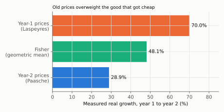
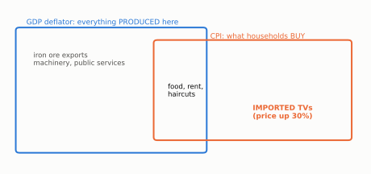

# Q1. Two True/False items on price and quantity indices

**Block I, 10 points (2 × 5: verdict 1 + justification 4).** Kurlat ch. 1, §1.2.
Up: [[00-index]] · Next: [[q2-brazil-paraguay-denominators]]

> **Companion:** [Indices](../aula-01-mensuracao/companion-indices.html). Move the year-2 prices
> and quantities and watch the Laspeyres and Paasche growth rates separate as relative prices diverge.

---

## 1(a) Which base year gives the faster growth?

**The question.** Streaming subscriptions and cinema tickets. Year 1: $(p,q)=(40,10)$ and $(20,30)$.
Year 2: $(20,30)$ and $(25,25)$. The claim is that year-2 prices give faster real growth "because they are
more up to date".

**Verdict: FALSE.** Year-2 prices give **28.9%** and year-1 prices give **70.0%**.

### Every step

**Step 1. Nominal GDP, price times quantity, summed over the two goods.**

$$Y_1^{\text{nom}}=40\cdot10+20\cdot30=400+600=1000,\qquad
Y_2^{\text{nom}}=20\cdot30+25\cdot25=600+625=1225$$

**Step 2. Year-2 quantities at year-1 prices (the Laspeyres quantity index).**

$$Y_2^{(p_1)}=40\cdot30+20\cdot25=1200+500=1700,\qquad
g^{L}=\frac{1700}{1000}-1=\boxed{70.0\%}$$

**Step 3. Year-1 quantities at year-2 prices (the Paasche quantity index).** Year 2 is valued at its own
prices, so the numerator is nominal $Y_2$.

$$Y_1^{(p_2)}=20\cdot10+25\cdot30=200+750=950,\qquad
g^{P}=\frac{1225}{950}-1=1.2895-1=\boxed{28.9\%}$$

**Step 4. The Fisher index, the geometric mean of the two gross growth factors.**

$$1+g^{F}=\sqrt{1.70\times1.2895}=\sqrt{2.1921}=1.4806\quad\Rightarrow\quad g^F=48.1\%$$

**Step 5. Read the direction.** The relative price of streaming fell from $40/20=2$ to $20/25=0.8$, and
households moved towards it: streaming tripled ($10\to30$), cinema fell ($30\to25$). Prices and quantities
moved in **opposite** directions. That is the condition under which the early base overstates growth and
the late base understates it.

*Reading:* the same quantities give 70.0%, 48.1% or 28.9% depending only on the weights. The gap is
created by substitution towards the good that became cheap.

### The sentences that earn the mark

> False. With year-1 prices growth is 70.0%; with year-2 prices it is 28.9%. The difference is
> **substitution bias**. Streaming became relatively cheaper and its quantity tripled. Year-1 prices value
> that large increase at the **old, high** price 40, so they overstate growth. Year-2 prices value it at the
> **new, low** price 20, so they understate growth. Neither base is "more correct"; "more recent" has
> nothing to do with it. A chained or Fisher index (48.1%) splits the difference.

### The tempting wrong answer

*"True, because recent prices reflect the current economy better"* or *"the base year is just a
convention"*. The second is exactly the sentence that lost Lista 1 1(c)
([[avaliacao-listas-1-4]] §3, "the missing economics"). It is true and worth nothing, because it does not
say **which way each base biases the answer, or why**. The mark is for the direction and the mechanism.

### Revise

[[aula-01-mensuracao/02-real-nominal-and-indices|Real GDP and indices]] §2.2 (why the early base gives the
larger number, proved) and §2.3 (Fisher and chain weighting).

---

## 1(b) Does an import price move the deflator?

**The question.** Only the price of **imported** televisions changes, by +30%. The claim: the GDP deflator
rises by more than the CPI (IPCA).

**Verdict: FALSE.** It is the other way round: the CPI rises and the deflator does not move.

### Every step

**Step 1. Define each index by its basket.**

$$\text{GDP deflator}=\frac{\text{nominal GDP}}{\text{real GDP}}=\frac{\sum_{\text{produced here}}p_tq_t}{\sum_{\text{produced here}}p_0q_t},
\qquad
\text{CPI}=\frac{\sum_{\text{consumer basket}}p_t\bar q}{\sum_{\text{consumer basket}}p_0\bar q}$$

**Step 2. Place the television in each basket.** It is produced abroad, so it is not in GDP: it enters
consumption $C$ and is subtracted again in imports $M$. It is bought by households, so it is in the CPI basket.

**Step 3. Apply the price change.** Deflator: no price in its basket changed, so $\Delta=0$. CPI: rises by
the TV's weight times 30%. With an illustrative weight of 2%, the CPI rises by $0.02\times30\%=0.6\%$.

*Reading:* the two baskets overlap only in domestically produced consumer goods. Imports live only in the
CPI; exports and investment goods live only in the deflator.

### The sentences that earn the mark

> False. The deflator prices what is **produced** in Brazil; the CPI prices what Brazilian households
> **buy**. An imported television is not produced here, so the deflator does not move. It is in the
> consumer basket, so the CPI rises (by 0.6% if its weight is 2%). The mirror case: a rise in the price of
> exported iron ore raises the deflator and leaves the CPI unchanged.

### The tempting wrong answer

*"True, because the deflator covers the whole economy and the CPI only part of it."* Coverage is not the
issue. The two baskets are **different sets**, not one nested in the other, and imports sit in the CPI's
part only. A second trap is forgetting that the CPI is a fixed-basket (Laspeyres-type) index, which also
carries the substitution bias of 1(a).

### Revise

[[aula-01-mensuracao/02-real-nominal-and-indices|Real GDP and indices]] §2.4 (the deflator against the CPI)
and [[aula-01-mensuracao/01-three-approaches|the three approaches]] §1.2 (why imports are subtracted).

---

## Rubric (10 points)

| Item | Object | Points |
|---|---|---|
| a | verdict F | 1 |
| a | both growth rates, 70.0% and 28.9% (or a correct qualitative ranking with the price and quantity movements named) | 1.5 |
| a | direction of each bias tied to "old high price / new low price" | 1.5 |
| a | the name *substitution bias* and the remedy (chain or Fisher) | 1 |
| b | verdict F | 1 |
| b | the deflator's basket = domestic production; imports excluded | 2 |
| b | the CPI's basket = household purchases; imports included, so the CPI rises | 2 |

**Caps.** (a) "The base year is a convention", with no direction: **max. 1.5**. Arithmetic slip with the
correct ranking: $-0.5$. (b) Verdict T: **max. 1**, whatever the justification. Caps override penalties.
