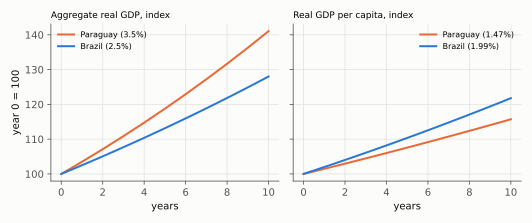
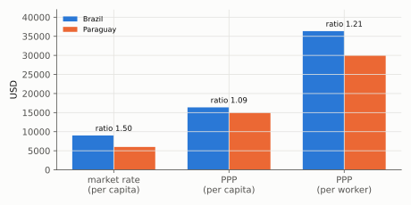

# Q2. Brazil and Paraguay: which number answers which question?

**Block I, 15 points (a, b, c × 5).** Kurlat ch. 1 (§1.3 cross-country comparisons) and ch. 2.
Up: [[00-index]] · Prev: [[q1-index-bias-and-deflator]] · Next: [[q3-convergence-and-population]]

> **Companion:** [PPP](../aula-01-mensuracao/companion-ppp.html). Lower the relative price of
> non-traded goods and watch GDP at PPP separate from GDP at market rates.

**Data (illustrative).** Real GDP growth: Paraguay 3.5%, Brazil 2.5% a year. Population growth: 2.0% and
0.5%. GDP per capita at market rates: USD 6,000 and USD 9,000. Price level relative to the US: 0.40 and
0.55. Employment/population: 0.50 and 0.45.

The question is one idea asked three times: **the denominator and the price you divide by decide what
the number means.**

---

## 2(a) Aggregate against per capita growth

### Every step

**Step 1. Write per capita output as a ratio and take gross growth factors.** $y=Y/N$, so

$$1+g_y=\frac{Y_{t+1}/N_{t+1}}{Y_t/N_t}=\frac{1+g_Y}{1+n}$$

**Step 2. Paraguay, exactly.**

$$1+g_y^{PY}=\frac{1.035}{1.020}=1.014706\quad\Rightarrow\quad \boxed{g_y^{PY}=1.47\%}$$

**Step 3. Brazil, exactly.**

$$1+g_y^{BR}=\frac{1.025}{1.005}=1.019900\quad\Rightarrow\quad \boxed{g_y^{BR}=1.99\%}$$

**Step 4. The log approximation**, $g_y\approx g_Y-n$: Paraguay $3.5-2.0=1.5\%$; Brazil $2.5-0.5=2.0\%$. The
error is under 0.03 pp, so the approximation is safe here.

**Step 5. Compound over ten years to see what the headline hides.** Aggregate: Paraguay
$1.035^{10}=1.4106$ (+41.1%), Brazil $1.025^{10}=1.2801$ (+28.0%). Per capita: Paraguay
$1.014706^{10}=1.1572$ (+15.7%), Brazil $1.019900^{10}=1.2178$ (+21.8%).

*Reading:* the ranking **flips** between the panels. Paraguay's economy grows faster; the average
Brazilian's income grows faster.

### The sentences that earn the mark

> Per capita growth is $g_Y-n$: 1.47% in Paraguay and 1.99% in Brazil. The headline's conclusion does not
> follow. Paraguay's faster **aggregate** growth comes from faster **population** growth; per person,
> Brazil grows faster, so Paraguay is not catching up but **falling further behind**. Aggregate growth
> answers "how fast is the economy (the market, the tax base) growing?"; per capita growth answers "how fast
> is the average person's income growing?".

### The tempting wrong answer

Answering with one number. The question names **two** objects, and whenever $n>0$ the two can rank
countries in opposite orders. This is the most repeated warning in the instructor's keys: Lista 1 4(a),
where only the per capita path was drawn, and Lista 2 1(c), *"Not per capita (for S) but still a gain"*
([[avaliacao-listas-1-4]] §3, [[avaliacao-listas-2-3-6]] §2).

### Revise

[[aula-01-mensuracao/03-growth-arithmetic|Growth arithmetic]] §3.2 (ratios and their growth rates) and
[[aula-01-mensuracao/04-cross-country-and-ppp|PPP]] §4.4 (which denominator).

---

## 2(b) Market rates against PPP

### Every step

**Step 1. Define the price level used in the data.** The price level relative to the US is the PPP exchange
rate divided by the market rate, $\text{PL}=e^{PPP}/e$: how much a dollar's worth of the US basket costs in
the country, converted at the market rate. Converting at PPP instead of at the market rate therefore means

$$y^{PPP}=\frac{y^{\text{market}}}{\text{PL}}$$

**Step 2. Brazil.** $y^{PPP}_{BR}=9000/0.55=\boxed{16{,}364}$ USD.

**Step 3. Paraguay.** $y^{PPP}_{PY}=6000/0.40=\boxed{15{,}000}$ USD.

**Step 4. The two ratios.**

$$\frac{y_{BR}}{y_{PY}}\Big|_{\text{market}}=\frac{9000}{6000}=1.50,\qquad
\frac{y_{BR}}{y_{PY}}\Big|_{PPP}=\frac{16{,}364}{15{,}000}=1.091$$

**Step 5. The size of the error.** $1.50/1.091=1.375$: market rates overstate the gap by 37.5%.

**Step 6. The mechanism (Balassa–Samuelson), as an arrow chain.** Traded goods: arbitrage makes their
prices similar across countries, so the market rate is set by them. Productivity in traded goods is lower in
the poorer country $\Rightarrow$ wages are lower there $\Rightarrow$ **non-traded** goods (haircuts, rent,
domestic services), whose productivity is similar everywhere, are **cheaper** there $\Rightarrow$ the whole
price level is lower (0.40 < 0.55) $\Rightarrow$ converting at the market rate values Paraguay's
non-traded output at prices below what it would cost elsewhere, and **understates its real quantity**.

*Reading:* the Brazil/Paraguay ratio falls from 1.50 at market rates to 1.09 at PPP and rises to 1.21 per
worker. Three denominators, three answers.

### The sentences that earn the mark

> At PPP, GDP per capita is USD 16,364 in Brazil and USD 15,000 in Paraguay; the ratio falls from 1.50 to
> 1.09. The market exchange rate prices only **traded** goods. Most output is **non-traded**, and non-traded
> goods are cheaper in the poorer country because its wages are lower (Balassa–Samuelson). The market rate
> therefore understates Paraguay's real output. An observer using market rates would conclude that Brazilians
> are 50% richer than Paraguayans; the true gap in quantities is about 9%.

### The tempting wrong answer

*"Transport costs and tariffs make prices differ."* That is the sentence that lost Lista 1 1(e)
([[avaliacao-listas-1-4]] §3, "wrong mechanism"). Frictions in **traded** goods are exactly where the
market rate works *best*. The gap comes from the goods that are **not** traded.

### Revise

[[aula-01-mensuracao/04-cross-country-and-ppp|PPP]] §4.2 (the construction) and §4.3 (Balassa–Samuelson,
derived).

---

## 2(c) Per capita against per worker

### Every step

**Step 1. Decompose per capita output.** With $E$ employment and $N$ population,

$$\frac{Y}{N}=\frac{Y}{E}\cdot\frac{E}{N}\quad\Rightarrow\quad \frac{Y}{E}=\frac{Y/N}{E/N}$$

**Step 2. Brazil.** $16{,}364/0.45=\boxed{36{,}364}$ USD per worker.

**Step 3. Paraguay.** $15{,}000/0.50=\boxed{30{,}000}$ USD per worker.

**Step 4. The ratio, and a check through the decomposition.** $36{,}364/30{,}000=1.212$. Check:
$1.091=1.212\times(0.45/0.50)=1.212\times0.90$. ✓

**Step 5. Match each question to its measure.**

| Question | Measure | Why |
|---|---|---|
| (i) size of the market for an exporter selling in dollars | **aggregate GDP at market rates** | the exporter is paid in dollars at the market rate, and sells to the whole economy |
| (ii) average material living standards | **GDP per capita at PPP** | what the average resident can buy, at local prices |
| (iii) labour productivity | **GDP per worker at PPP** (per hour, if hours differ) | output per unit of the input that produced it |

### The sentences that earn the mark

> Per worker at PPP: USD 36,364 in Brazil and USD 30,000 in Paraguay, a ratio of 1.21. It is larger than the
> per capita ratio (1.09) because a larger share of Paraguayans works (50% against 45%): per capita output
> is productivity times the employment rate, and Paraguay's higher employment rate flatters its per capita
> figure. The consultant understates Brazil's productivity lead. Market size: aggregate GDP at market rates;
> living standards: per capita at PPP; productivity: per worker (or per hour) at PPP.

### The tempting wrong answer

Using per capita for productivity. It mixes productivity with demography and participation. The same slip
in the other direction is using per worker for welfare, which ignores the dependants a worker supports.

### Revise

[[aula-01-mensuracao/04-cross-country-and-ppp|PPP]] §4.4 (three different "per" measures).

---

## Rubric (15 points)

| Item | Object | Points |
|---|---|---|
| a | $g_y$ Paraguay 1.47% (or 1.5% by logs) | 1 |
| a | $g_y$ Brazil 1.99% (or 2.0%) | 1 |
| a | verdict: the headline is wrong, Paraguay falls behind per person | 1.5 |
| a | what aggregate and per capita growth each measure | 1.5 |
| b | two PPP values | 1 |
| b | two ratios | 1 |
| b | mechanism: non-traded goods, lower wages, lower price level | 2 |
| b | wrong conclusion stated with direction (overstates the gap) | 1 |
| c | per-worker values and ratio | 1.5 |
| c | one correct measure for each of (i)–(iii) | 1.5 (0.5 each) |
| c | why the ratios differ: employment/population | 2 |

**Caps.** (a) Only aggregate growth discussed: **max. 2**. (b) Mechanism attributed to transport costs or
tariffs: **max. 2**. (c) Per capita used for productivity: **max. 2**. Arithmetic slip with the right
method: $-0.5$. Caps override penalties.
