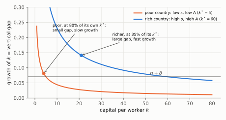
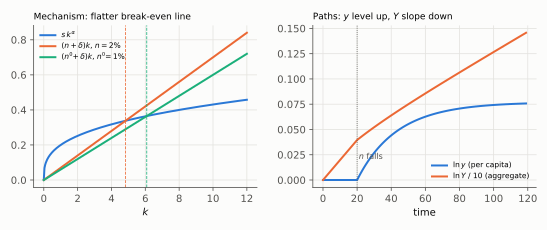

# Q3. Two True/False items on the Solow model

**Block II, 10 points (2 × 5: verdict 1 + justification 4).** Kurlat ch. 4 (§4.3–§4.5) and ch. 5 (§5.2).
Up: [[00-index]] · Prev: [[q2-brazil-paraguay-denominators]] · Next: [[q4-compliance-wedge-as-tfp]]

> **Companion:** [Transition](../aula-02-solow-mecanica/companion-transition.html). Change $n$ at a date
> and watch $k$, $y$ and $Y$ on the same time axis.

Per worker, no technological progress: $y=Ak^\alpha$, $\dot k=sAk^\alpha-(n+\delta)k$.

---

## 3(a) "Poorer countries must grow faster"

**Verdict: FALSE.** The Solow model predicts **conditional** convergence, not absolute convergence.

### Every step

**Step 1. Growth rate of $k$.** Divide the law of motion by $k$:

$$g_k\equiv\frac{\dot k}{k}=sAk^{\alpha-1}-(n+\delta)$$

**Step 2. Write $sA$ through the country's own steady state.** At $k^*$, $g_k=0$, so
$sA\,k^{*\,\alpha-1}=n+\delta$, that is $sA=(n+\delta)\,k^{*\,1-\alpha}$.

**Step 3. Substitute step 2 into step 1.**

$$g_k=(n+\delta)\,k^{*\,1-\alpha}k^{\alpha-1}-(n+\delta)=\boxed{(n+\delta)\left[\left(\frac{k^*}{k}\right)^{1-\alpha}-1\right]}$$

**Step 4. Translate to output.** $\ln y=\ln A+\alpha\ln k$, so $g_y=\alpha\,g_k$.

**Step 5. Read it.** Growth depends on $k^*/k$, the distance to the country's **own** steady state, not on
the level of $k$. Illustration with $\alpha=1/3$ and $n+\delta=0.07$: a poor country at 80% of its (low)
$k^*$ has $g_k=0.07\,[1.25^{2/3}-1]=0.07\times0.1604=1.12\%$ and $g_y=0.37\%$; a richer country at 35% of
its (high) $k^*$ has $g_k=0.07\,[(1/0.35)^{2/3}-1]=0.07\times1.0135=7.09\%$ and $g_y=2.36\%$. The richer
one grows faster.

*Reading:* the growth rate of $k$ is the vertical distance between each country's $sAk^{\alpha-1}$ curve and
$n+\delta$. The poor country sits close to where its own curve crosses the line.

### The sentences that earn the mark

> False. In the Solow model growth depends on the distance to the country's **own** steady state:
> $g_k=(n+\delta)[(k^*/k)^{1-\alpha}-1]$. Countries with different $s$, $n$ or $A$ have different $k^*$.
> A poor country with a low saving rate or low productivity can be close to its own low steady state and
> grow slowly, while a richer country far below a high steady state grows fast. The model predicts
> **conditional convergence**: poorer countries grow faster only among countries with the same
> steady-state determinants. A poor, slow-growing country does not refute it; it is evidence that its
> steady state is low.

### The tempting wrong answer

Calling the Solow prediction "divergence", or accepting absolute convergence as the model's claim. On
Lista 2 1(b) both Koreas were below their own steady states and the answer written was "a divergence of
output levels" ([[avaliacao-listas-2-3-6]] §2). The levels gap persists because the steady states differ;
each economy converges to its **own** point.

### Revise

[[aula-02-solow-mecanica/05-comparative-statics|Comparative statics]] §5.5 (absolute against conditional)
and [[aula-03-solow-evidencias/04-quantifying-and-convergence|convergence tested]] §4.3.

---

## 3(b) A fall in population growth

**The claim.** With $\alpha=1/3$, $s=0.2$, $\delta=0.05$, a permanent fall in $n$ from 2% to 1% lowers, in the
long run, both the growth of aggregate GDP and the growth of GDP per capita.

**Verdict: FALSE.** Aggregate growth falls from 2% to 1%; per capita growth is **0 before and after**; the
**level** of $y^*$ rises by **8.0%**.

### Every step

**Step 1. Steady state per worker.** Set $\dot k=0$: $sk^\alpha=(n+\delta)k$, so

$$k^*=\left(\frac{s}{n+\delta}\right)^{\frac{1}{1-\alpha}},\qquad
y^*=(k^*)^\alpha=\left(\frac{s}{n+\delta}\right)^{\frac{\alpha}{1-\alpha}}$$

**Step 2. Numbers before and after** ($\alpha/(1-\alpha)=1/2$, $1/(1-\alpha)=3/2$):
$k^*=(0.2/0.07)^{1.5}=4.83$ and $y^*=(0.2/0.07)^{0.5}=1.690$; after,
$k^{*\prime}=(0.2/0.06)^{1.5}=6.09$ and $y^{*\prime}=(0.2/0.06)^{0.5}=1.826$.

**Step 3. The level effect.**

$$\frac{y^{*\prime}}{y^*}=\left(\frac{n+\delta}{n'+\delta}\right)^{\frac{\alpha}{1-\alpha}}=\left(\frac{0.07}{0.06}\right)^{1/2}=\boxed{1.0801}$$

**Step 4. Long-run growth rates.** In steady state $y$ is constant, so $g_y=0$ with either $n$. Aggregate
$Y=yL$, so $g_Y=g_y+n=n$: **2% before, 1% after**.

**Step 5. The transition.** At the old $k^*$, saving $sk^\alpha$ now exceeds the lower break-even
$(n'+\delta)k$, so $k$ and $y$ **grow** for a while, at a declining rate, until $y$ is 8.0% higher.

*Reading:* left, the break-even line gets flatter and $k^*$ moves right. Right, $\ln y$ rises to a higher
plateau (level up, long-run slope still 0); $\ln Y$ keeps rising but with a smaller slope.

### The sentences that earn the mark

> False. Without technological progress, GDP per capita does not grow in the steady state, before or after:
> $g_y=0$ in both. Aggregate GDP grows at $n$, so its growth falls from 2% to 1%. The fall in $n$ **raises
> the level** of $y^*$ by 8.0%, because fewer new workers must be equipped each period (the $(n+\delta)k$
> line is flatter), and during the transition $y$ grows faster than 0. Higher level, same long-run per
> capita growth, lower aggregate growth, positive per capita growth during the transition.

### The tempting wrong answer

*"Fewer workers produce less, so growth falls."* This mixes the aggregate with the per capita. The
instructor's key for Lista 1 4(b), which was left blank, is four lines:
*"higher levels, lower SS growth, higher growth during convergence"* ([[avaliacao-listas-1-4]] §3).

### Revise

[[aula-02-solow-mecanica/04-steady-state-and-stability|Steady state]] §4.4 (what "no growth in steady state"
means) and [[aula-02-solow-mecanica/05-comparative-statics|comparative statics]] §5.1–§5.2.

---

## Rubric (10 points)

| Item | Object | Points |
|---|---|---|
| a | verdict F | 1 |
| a | growth depends on the distance to the country's own steady state (formula or diagram) | 2 |
| a | the words *conditional convergence*, with the conditions ($s$, $n$, $A$, $\alpha$) | 1 |
| a | why a slow poor country is consistent with the model | 1 |
| b | verdict F | 1 |
| b | $g_y=0$ in both steady states; $g_Y$ falls from 2% to 1% | 2 |
| b | the level of $y^*$ rises (8.0%), with the flatter break-even line as the reason | 1.5 |
| b | positive per capita growth during the transition | 0.5 |

**Caps.** (a) "The model predicts divergence": **max. 1**. (b) Aggregate and per capita not separated:
**max. 2**. Caps override penalties.
