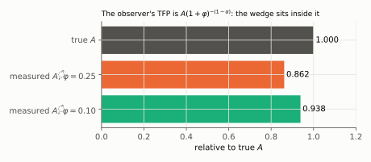
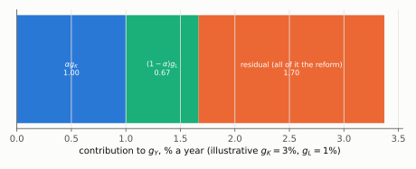
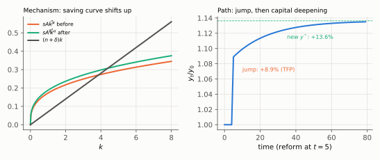

# Q4. Tax paperwork read as productivity

**Block II, 15 points (a, b, c × 5).** Kurlat ch. 5 (§5.3 development accounting, §5.4 growth accounting,
§5.5 where TFP differences come from) and ch. 4.
Up: [[00-index]] · Prev: [[q3-convergence-and-population]] · Next: [[q5-labour-tax-and-beveridge]]

> **Companion:** [Hidden wedge](../aula-03-solow-evidencias/companion-hidden-wedge.html). Lista 2's
> Gotham on one page: a capital wedge that the accounts record as low TFP. This question moves the
> same wedge to **labour**.

**Setup.** $Y=AK^\alpha L_P^{1-\alpha}$. Each production worker needs $\varphi$ compliance workers, paid the
same $w$. Statistics record $L=(1+\varphi)L_P$. $\alpha=1/3$, $\varphi=0.25$.

This is Lista 2 Gotham ([[avaliacao-listas-2-3-6]] §2) with the wedge on labour instead of capital. The
lesson is the same and it is the one the blank 2(d) never reached: **a distortion that wastes an input is
recorded as low productivity.**

---

## 4(a) What the observer measures

### Every step

**Step 1. Express production labour through measured labour.** $L_P=L/(1+\varphi)$.

**Step 2. Substitute into the production function.**

$$Y=AK^\alpha\left(\frac{L}{1+\varphi}\right)^{1-\alpha}=\boxed{A(1+\varphi)^{-(1-\alpha)}K^\alpha L^{1-\alpha}}$$

**Step 3. The firm's problem.** It pays $w$ for every worker, productive or not:

$$\max_{K,L_P}\;AK^\alpha L_P^{1-\alpha}-rK-w(1+\varphi)L_P$$

**Step 4. First-order condition for $L_P$.**

$$(1-\alpha)AK^\alpha L_P^{-\alpha}=w(1+\varphi)\quad\Longleftrightarrow\quad(1-\alpha)\frac{Y}{L_P}=w(1+\varphi)$$

**Step 5. Multiply both sides by $L_P$ and use $L=(1+\varphi)L_P$.**

$$(1-\alpha)Y=w(1+\varphi)L_P=wL\quad\Rightarrow\quad\boxed{\frac{wL}{Y}=1-\alpha=\tfrac23}$$

The labour share the agency measures is **undistorted**. Likewise $\alpha Y/K=r$ gives $rK/Y=\alpha$.

**Step 6. The observer's TFP.** He divides output by measured inputs, with the correct $\alpha$ from step 5:

$$\hat A=\frac{Y}{K^\alpha L^{1-\alpha}}=A(1+\varphi)^{-(1-\alpha)},\qquad
\frac{\hat A}{A}=1.25^{-2/3}=\boxed{0.862}$$

He understates $A$ by 13.8%.

**Step 7. Share of the workforce in compliance.** $\varphi L_P/L=\varphi/(1+\varphi)=0.25/1.25=20\%$.

*Reading:* the bars are the observer's TFP under heavy and light rules. True technology is the same in all
three.

### The sentences that earn the mark

> Output is $Y=A(1+\varphi)^{-(1-\alpha)}K^\alpha L^{1-\alpha}$. The labour share is still $1-\alpha=2/3$,
> because compliance workers are paid the market wage and the firm's first-order condition makes the whole
> wage bill $(1-\alpha)Y$. The observer, using the correct shares, measures
> $\hat A=A(1+\varphi)^{-(1-\alpha)}=0.862A$. The distortion does not show in factor shares; it shows
> **entirely in TFP**. Twenty per cent of measured workers produce nothing, and the accounts attribute
> that waste to bad technology.

### The tempting wrong answer

*"Undistorted shares mean no distortion."* The instructor's margin on Lista 2: *"$\hat A$ gets distorted;
$\hat\alpha=\alpha$ since $rk/Y$ is directly observable"* ([[estilo-do-professor]] §4). Normal shares are
exactly what hides the wedge inside the residual.

### Revise

[[aula-03-solow-evidencias/02-markets-and-factor-prices|Factor prices]] §2.3 (shares as equilibrium
objects) and [[aula-03-solow-evidencias/05-growth-accounting-and-tfp|TFP]] §5.3 and §5.5.

---

## 4(b) The simplification in the growth accounts

### Every step

**Step 1. Take logs of the measured production function.**

$$\ln Y=\ln A-(1-\alpha)\ln(1+\varphi)+\alpha\ln K+(1-\alpha)\ln L$$

**Step 2. Take the change over time, per year.** Write $\Delta$ for the annual change:

$$g_Y=g_A-(1-\alpha)\,\Delta\ln(1+\varphi)+\alpha g_K+(1-\alpha)g_L$$

**Step 3. Solve for the Solow residual** (what is left after the measured inputs):

$$g_Y-\alpha g_K-(1-\alpha)g_L=\underbrace{g_A}_{=0}\;\underbrace{-\,(1-\alpha)\,\Delta\ln(1+\varphi)}_{\text{the reform}}$$

**Step 4. Average over the five years.**

$$\text{residual}=\frac{(1-\alpha)\left[\ln1.25-\ln1.10\right]}{5}=\frac{\tfrac23\,(0.22314-0.09531)}{5}=\frac{\tfrac23\times0.12783}{5}=\frac{0.08522}{5}=\boxed{1.70\%\text{ a year}}$$

Compounded: $(1.25/1.10)^{2/15}-1=1.72\%$ a year. $g_K$ and $g_L$ drop out of it.

*Reading:* with illustrative $g_K=3\%$ and $g_L=1\%$, capital explains 1.00 pp and labour 0.67 pp. The 1.70
pp residual is entirely the reform.

### The sentences that earn the mark

> $g_Y=\alpha g_K+(1-\alpha)g_L+\underbrace{g_A-(1-\alpha)\Delta\ln(1+\varphi)}_{\text{residual}}$. With
> $g_A=0$ the residual is $\tfrac23\ln(1.25/1.10)/5=1.70\%$ a year. The agency reports 1.70% a year of
> **TFP growth** with no change in technology. This is consistent with reading the residual as "a measure
> of our ignorance" that also captures **policies that change how well resources are allocated**: the
> reform moves 20% of workers into production. If compliance got heavier, the same accounts would report
> **negative** TFP growth, technical regress that never happened.

### The tempting wrong answer

Leaving it blank or saying "TFP does not change because $A$ does not change". Lista 2 2(d) was blank, the
item worth the most on that list ([[avaliacao-listas-2-3-6]] §2). The residual is not $g_A$; it is
everything that moves output other than measured inputs.

### Revise

[[aula-03-solow-evidencias/05-growth-accounting-and-tfp|Growth accounting]] §5.2 (the identity derived) and
"What the residual actually contains".

---

## 4(c) The reform in the Solow model

Treat the reform as one change in $\hat A$ (from $0.862A$ to $1.10^{-2/3}A=0.938A$), with $s$, $n$, $\delta$
fixed and variables per **measured** worker: $y=\hat Ak^\alpha$.

### Every step

**Step 1. Steady state.** $s\hat Ak^\alpha=(n+\delta)k$ gives
$k^*=\left(s\hat A/(n+\delta)\right)^{\frac{1}{1-\alpha}}$.

**Step 2. Steady-state output.**

$$y^*=\hat A(k^*)^\alpha=\hat A\cdot\hat A^{\frac{\alpha}{1-\alpha}}\left(\frac{s}{n+\delta}\right)^{\frac{\alpha}{1-\alpha}}=\hat A^{\frac{1}{1-\alpha}}\left(\frac{s}{n+\delta}\right)^{\frac{\alpha}{1-\alpha}}$$

**Step 3. The ratio, where $s$, $n$, $\delta$ cancel.**

$$\frac{y^{*\prime}}{y^*}=\left(\frac{\hat A'}{\hat A}\right)^{\frac{1}{1-\alpha}}
=\left[\left(\frac{1.25}{1.10}\right)^{1-\alpha}\right]^{\frac{1}{1-\alpha}}=\frac{1.25}{1.10}=\boxed{1.136}$$

**Step 4. Split it into impact and deepening.** On impact $k$ is given, so $y$ jumps by
$\hat A'/\hat A=(1.25/1.10)^{2/3}=1.089$ (+8.9%). The rest comes from $k$: $k^{*\prime}/k^*=1.136$ too, and
$1.136^{\alpha}=1.0435$. Check: $1.089\times1.0435=1.136$. ✓ In logs, TFP is $0.0852/0.1278=2/3$ of the
gain and capital deepening $1/3$.

**Step 5. Sign the growth of $y$ in three horizons.** On impact: a jump (spread over the five years of the
reform, fast growth). Transition: $g_y>0$ and declining, since $s\hat A'k^{\alpha-1}>n+\delta$ at the old $k^*$.
Long run: $g_y=0$ again, with no technological progress.

*Reading:* left, the saving curve $s\hat Ak^\alpha$ shifts up and crosses the break-even line further right.
Right, $y$ jumps 8.9% and then climbs to 13.6% above its start as capital accumulates.

### The sentences that earn the mark

> The reform raises measured TFP by 8.9% and steady-state $y$ by 13.6% ($y^*\propto\hat A^{1/(1-\alpha)}$, so
> $y^{*\prime}/y^*=1.25/1.10$). On impact $y$ jumps with TFP; then, because a higher $\hat A$ raises the
> marginal product of capital, saving exceeds break-even investment and $k$ accumulates. Growth of $y$ is
> positive and declining during the transition, and zero in the long run. The total rise exceeds the TFP
> jump because TFP **induces** capital accumulation: an observer doing growth accounting over the
> transition would credit a third of the gain to capital, although the reform caused all of it.

### The tempting wrong answer

Saying the level effect equals the TFP effect (8.9%), or that the reform raises long-run growth. The first
forgets induced capital; the second confuses a level with a rate ([[aula-02-solow-mecanica/05-comparative-statics|comparative statics]] §5.3).

### Revise

[[aula-02-solow-mecanica/05-comparative-statics|Comparative statics]] §5.1–§5.2 and
[[aula-03-solow-evidencias/05-growth-accounting-and-tfp|TFP]] §5.3 (the capital–output ratio form, which
makes the $1/(1-\alpha)$ multiplier explicit).

---

## Rubric (15 points)

| Item | Object | Points |
|---|---|---|
| a | $Y(A,K,L,\varphi)$ | 1 |
| a | measured labour share $=1-\alpha$, from the FOC | 1.5 |
| a | $\hat A/A=0.862$ | 1 |
| a | 20% in compliance; the wedge sits in TFP, not in shares | 1.5 |
| b | the decomposition with the residual isolated | 2 |
| b | residual 1.70% a year | 1 |
| b | reported as TFP growth; the allocation reading | 1.5 |
| b | the opposite case (negative residual) | 0.5 |
| c | two-panel diagram, axes and curves labelled, direction of the shift | 1.5 |
| c | $y^{*\prime}/y^*=1.136$ | 1 |
| c | growth of $y$ in three horizons | 1.5 |
| c | induced capital as the source of the extra gain | 1 |

**Caps.** (a) "Shares undistorted, so no distortion": **max. 2**. (b) Residual set to $g_A=0$: **max. 1**.
(c) Reform raises long-run growth: **max. 1.5**. Arithmetic slip with the right method: $-0.5$. Caps
override penalties.
