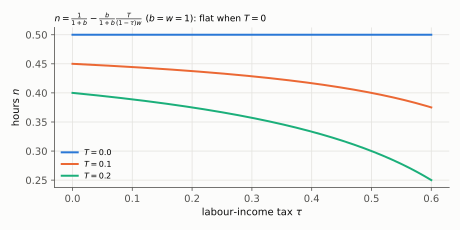
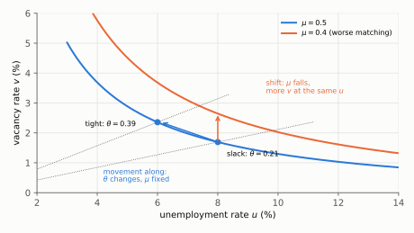

# Q5. Two True/False items on the labour market

**Block III, 10 points (2 × 5: verdict 1 + justification 4).** Kurlat ch. 7 (§7.2 the static model,
§7.5 search).
Up: [[00-index]] · Prev: [[q4-compliance-wedge-as-tfp]] · Next: [[q6-euler-ricardo-savings-tax]]

> **Companions:** [Labour supply](../aula-05-trabalho/companion-labour-supply.html) (set the transfer to
> zero and watch the wage stop mattering) · [Flows](../aula-05-trabalho/companion-flows.html) (matching
> efficiency against separations).

---

## 5(a) A labour tax with nothing returned

**The claim.** Utility $\ln c+b\ln l$, one unit of time, after-tax wage $(1-\tau)w$, transfer $T\ge0$. "If
$T=0$, a rise in $\tau$ reduces hours, because it makes leisure cheaper."

**Verdict: FALSE.** With $T=0$ hours are $1/(1+b)$ **whatever** $\tau$ is. Hours fall with $\tau$ only when
$T>0$, and then through the **income effect of the transfer**.

### Every step

**Step 1. Budget constraint.** Hours are $n=1-l$:

$$c=(1-\tau)w(1-l)+T$$

**Step 2. First-order condition: marginal rate of substitution = after-tax wage.** $u_l=b/l$ and
$u_c=1/c$, so

$$\frac{u_l}{u_c}=\frac{bc}{l}=(1-\tau)w\quad\Rightarrow\quad c=\frac{(1-\tau)w\,l}{b}$$

**Step 3. Substitute $c$ into the budget constraint.**

$$\frac{(1-\tau)w\,l}{b}=(1-\tau)w(1-l)+T$$

**Step 4. Multiply by $b$ and collect the terms in $l$.**

$$(1-\tau)w\,l+b(1-\tau)w\,l=b(1-\tau)w+bT\quad\Rightarrow\quad(1-\tau)w\,l\,(1+b)=b\left[(1-\tau)w+T\right]$$

**Step 5. Solve for leisure, then hours.**

$$l=\frac{b}{1+b}\left[1+\frac{T}{(1-\tau)w}\right],\qquad
\boxed{n=1-l=\frac{1}{1+b}-\frac{b}{1+b}\cdot\frac{T}{(1-\tau)w}}$$

**Step 6. Sign the effect of the tax.**

$$\frac{\partial n}{\partial\tau}=-\frac{b}{1+b}\cdot\frac{T}{w(1-\tau)^2}\;\begin{cases}=0&\text{if }T=0\\<0&\text{if }T>0\end{cases}$$

**Step 7. Knife-edge check (rule 6 of [[avaliacao-listas-2-3-6]] §6).** Set $T=0$: the tax has disappeared
from the formula. With $b=w=1$: $n=0.5$ at $\tau=0.2$ and at $\tau=0.3$. With $T=0.1$: $n=0.4375$ at
$\tau=0.2$ and $0.4286$ at $\tau=0.3$.

*Reading:* the $T=0$ line is flat. Hours bend down only when there is a transfer, and bend more the larger
the transfer.

### The sentences that earn the mark

> False. The tax lowers the after-tax wage, which has two effects of opposite sign on hours: leisure is
> cheaper (**substitution effect**, fewer hours) and the household is poorer (**income effect**, more
> hours). With log utility in consumption and no transfer they cancel exactly: $n=1/(1+b)$, independent of
> $\tau$. Hours fall with $\tau$ only if $T>0$. The transfer is unearned income, a pure income effect;
> a higher $\tau$ makes the same $T$ larger relative to what an hour of work pays, so that income effect
> gets stronger and hours fall.

### The tempting wrong answer

*"The tax makes leisure cheaper, so people work less"*: the substitution effect alone. It is the sentence
the grader put a large **?** on in Lista 4 1(b), under a derivative that was correct and had $T$ in the
numerator ([[avaliacao-listas-1-4]] §3, "correct formula, wrong story"). The formula already said the story
must be about $T$.

### Revise

[[aula-05-trabalho/02-static-model|The static model]] §2.3 (two effects, opposite signs) and §2.4 (the
log-log benchmark, and why hours are constant).

---

## 5(b) Movement along the Beveridge curve, or a shift?

**The claim.** "A fall in $u$ together with a rise in $v$, with $\mu$ and $s$ unchanged, is an outward
shift of the Beveridge curve: the market now has more vacancies per unemployed worker."

**Verdict: FALSE.** It is a **movement along** the curve. "More vacancies per unemployed worker" is a rise
in tightness $\theta$, which is precisely what moving along the curve means.

### Every step

**Step 1. Define tightness.** $\theta\equiv v/u$: **vacancies per unemployed worker**, the number of open
jobs for each person looking for one. On a diagram with $u$ on the horizontal axis and $v$ on the vertical,
every point lies on a ray from the origin whose slope is $v/u=\theta$.

**Step 2. The two rates depend only on $\theta$.** From $m=\mu v^\alpha u^{1-\alpha}$:

$$f=\frac{m}{u}=\mu\theta^\alpha\ (\text{rises with }\theta),\qquad q=\frac{m}{v}=\mu\theta^{\alpha-1}\ (\text{falls with }\theta),\qquad f=q\,\theta$$

A high $\theta$ (tight market, a boom): workers find jobs easily, firms struggle to hire. A low $\theta$
(slack market, a recession): the reverse.

**Step 3. Name the steady-state condition: job destruction = job creation.**

$$\underbrace{s(1-u)}_{\text{job destruction}}=\underbrace{\mu v^\alpha u^{1-\alpha}}_{\text{job creation}}$$

**Step 4. Solve for $v$: the Beveridge curve.** Divide by $\mu u^{1-\alpha}$ and raise to $1/\alpha$:

$$\boxed{v=\left[\frac{s(1-u)}{\mu\,u^{1-\alpha}}\right]^{1/\alpha}}$$

It slopes down: a higher $u$ means more searchers (more matches per vacancy) and fewer employed (less job
destruction), so fewer vacancies are needed to balance the flows.

**Step 5. Separate the two experiments.** $\mu$ and $s$ are the only parameters of the curve.
- **Movement along:** $\mu$ and $s$ fixed, $u$ and $v$ move on the same curve. Only $\theta$ changes.
- **Shift:** $\mu$ or $s$ changes, so the equation itself changes. A fall in $\mu$ multiplies $v$ at
  **every** $u$ by $(\mu/\mu')^{1/\alpha}$.

**Step 6. Numbers** ($\alpha=0.5$, $s=0.02$, $\mu=0.5$). At $u=8\%$: $v=[0.0184/(0.5\times0.2828)]^2=1.69\%$,
$\theta=0.21$, $f=0.5\times0.21^{0.5}=0.23$. At $u=6\%$: $v=2.36\%$, $\theta=0.39$, $f=0.31$. Going from the
first point to the second is the claim's scenario: a movement along the curve. A fall to $\mu=0.4$ instead
raises $v$ at $u=8\%$ to $1.6928\times(0.5/0.4)^2=1.6928\times1.5625=2.645\%$: a shift.

*Reading:* the blue arrow moves along the $\mu=0.5$ curve from a flat ray (slack) to a steep ray (tight).
The orange arrow goes straight up to the $\mu=0.4$ curve: more vacancies at the **same** unemployment rate.

### The sentences that earn the mark

> False. Tightness $\theta=v/u$ is vacancies per unemployed worker. With $\mu$ and $s$ fixed, the steady
> state $s(1-u)=\mu v^\alpha u^{1-\alpha}$ is a single curve, and a fall in $u$ with a rise in $v$ is a
> **movement along** it to a steeper ray: $\theta$ rises, so $f=\mu\theta^\alpha$ rises and
> $q=\mu\theta^{\alpha-1}$ falls. That is the cycle. An **outward shift** is a change in the matching
> technology (or in separations): with a lower $\mu$, every $(u,v)$ pair yields fewer matches, so more
> vacancies are needed at **every** unemployment rate to balance job creation and job destruction.

### The tempting wrong answer

*"The curve shifts because $\theta$ changed."* The instructor's key on Lista 4 2(e): a fall in $\mu$ is
*"a shift in all $v$–$u$ values and possible states, rather than just changing how $\theta$ is split
between $u$ and $v$"*. That distinction was the mark lost on 2(e) III ([[avaliacao-listas-1-4]] §3). A
related trap, from 2(d): the congestion externality of an extra vacancy falls on **other** firms (lower
$q$) and benefits **workers** (higher $f$), never on the firm that posts it.

### Revise

[[aula-05-trabalho/05-search-and-equilibrium|Search]] §5.3 (matching function, tightness, the Beveridge
curve derived) and [[aula-05-trabalho/01-measurement|measurement]] §1.4 (the observed curve).

---

## Rubric (10 points)

| Item | Object | Points |
|---|---|---|
| a | verdict F | 1 |
| a | labour supply with $T$ derived (or the FOC and the closed form stated) | 1.5 |
| a | with $T=0$ income and substitution effects cancel; hours independent of $\tau$ | 1.5 |
| a | with $T>0$ hours fall, through the income effect of the transfer | 1 |
| b | verdict F | 1 |
| b | $\theta=v/u$ defined in words, and its link to $f$ and $q$ | 1.5 |
| b | the Beveridge curve as job creation = job destruction, depending on $\mu$ and $s$ | 1 |
| b | movement along ($\theta$ changes) against shift ($\mu$ or $s$ changes), with a diagram | 1.5 |

**Caps.** (a) Substitution effect only, or words that contradict the formula: **max. 1.5**. (b) Shift and
movement not distinguished: **max. 2**. Caps override penalties.
