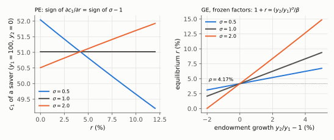
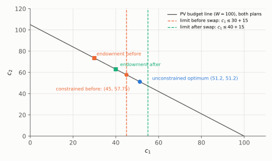
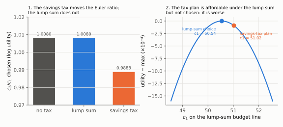

# Q6. Interest rates, a tax rebate and a tax on interest income

**Block III, 15 points (a, b, c × 5).** Kurlat ch. 6 (§6.2 two periods, §6.3 taxes and Ricardian
equivalence, §6.4 borrowing constraints) and ch. 9 (§9.1 general equilibrium with fixed factors).
Up: [[00-index]] · Prev: [[q5-labour-tax-and-beveridge]] · Next: [[q7-quantity-equation-and-superneutrality]]

> **Companions:** [Taxes and limits](../aula-04-consumo/companion-taxes-and-limits.html) (the Ricardian
> swap, the limit that breaks it, the savings tax against a lump sum, and the sign of $\partial c_1/\partial r$
> against $\sigma$) · [Frozen capital](../aula-06-equilibrio-geral/companion-frozen-capital.html) (why $r$
> is set by impatience when output cannot move) · [Two periods, one line](../aula-04-consumo/companion-euler.html).

Utility $u(c_1)+\beta u(c_2)$, CRRA with coefficient $\sigma$ (log when $\sigma=1$). Every item uses the same
two tools: the **Euler equation** $u'(c_1)=\beta(1+r)u'(c_2)$ and the **intertemporal budget constraint**.
Method as in the instructor's keys: substitute the constraints, never a Lagrangian
([[estilo-do-professor]] §2).

---

## 6(a) A rate rise for a saver, then the same rate in general equilibrium

### Every step: the saver (partial equilibrium)

**Step 1. Budget constraints.** $c_1+a=y_1$ and $c_2=(1+r)a$ (here $y_2=0$). Eliminate $a$:

$$c_1+\frac{c_2}{1+r}=y_1$$

**Step 2. Euler equation with CRRA**, $u'(c)=c^{-\sigma}$:

$$c_1^{-\sigma}=\beta(1+r)c_2^{-\sigma}\quad\Rightarrow\quad c_2=\left[\beta(1+r)\right]^{1/\sigma}c_1$$

**Step 3. Substitute step 2 into step 1 and factor $c_1$.**

$$c_1\left[1+\frac{\beta^{1/\sigma}(1+r)^{1/\sigma}}{1+r}\right]=y_1\quad\Rightarrow\quad
\boxed{c_1=\frac{y_1}{D},\quad D\equiv1+\beta^{1/\sigma}(1+r)^{\frac1\sigma-1}}$$

**Step 4. Sign the derivative.** $y_1$ does not depend on $r$ (no future income to discount), so $c_1$ moves
only through $D$:

$$\frac{\partial D}{\partial r}=\beta^{1/\sigma}\left(\frac1\sigma-1\right)(1+r)^{\frac1\sigma-2}
\quad\Rightarrow\quad\operatorname{sign}\frac{\partial c_1}{\partial r}=-\operatorname{sign}\left(\frac1\sigma-1\right)=\operatorname{sign}(\sigma-1)$$

**Step 5. Knife-edge reading, before any sentence.** $\sigma=1$: $D=1+\beta$, no $r$ at all, the two
effects cancel. $\sigma=2$: $1/\sigma-1=-0.5<0$, so $D$ **falls** with $r$ and $c_1$ **rises**.

**Step 6. Numbers** ($y_1=100$, $\beta=0.96$, $\sigma=2$, so $\beta^{1/2}=0.97980$).
At $r=4\%$: $(1.04)^{-1/2}=0.98058$, $D=1+0.97980\times0.98058=1.96077$, $c_1=100/1.96077=\boxed{51.00}$.
At $r=6\%$: $(1.06)^{-1/2}=0.97129$, $D=1+0.97980\times0.97129=1.95166$, $c_1=100/1.95166=\boxed{51.24}$.

### Every step: general equilibrium with frozen factors

**Step 7. Market clearing.** All households are identical, and with $K$ and $L$ fixed there is no investment
and output is given: $c_1=y_1$, $c_2=y_2$. Borrowing by one household must be lending by another, and all are
identical, so **aggregate saving is zero**: $a=y_1-c_1=0$.

**Step 8. The Euler equation now determines $r$, not $c$.** Put $c_1=y_1$, $c_2=y_2$ into step 2:

$$\left(\frac{y_2}{y_1}\right)^{\sigma}=\beta(1+r)\quad\Rightarrow\quad\boxed{1+r=\frac{1}{\beta}\left(\frac{y_2}{y_1}\right)^{\sigma}}$$

**Step 9. Numbers.** $y_2=y_1$: $r=1/0.96-1=\boxed{4.17\%}=\rho$. $y_2/y_1=1.03$:
$1+r=1.03^2/0.96=1.0609/0.96=1.1051$, so $r=\boxed{10.51\%}$.

*Reading:* left, $c_1$ of a saver falls with $r$ for $\sigma=0.5$, is flat for $\sigma=1$ and rises for
$\sigma=2$. Right, in general equilibrium $r$ equals $\rho=4.17\%$ with flat output and rises with expected
growth, more steeply the larger $\sigma$.

### The sentences that earn the mark

> $c_1=y_1/D$ with $D=1+\beta^{1/\sigma}(1+r)^{1/\sigma-1}$; with $\sigma=2$ the exponent is negative, so $D$
> falls and **$c_1$ rises** with $r$ (51.00 → 51.24). The **income effect dominates**: a saver is richer when
> the return on his saving rises, and with high curvature (elasticity of intertemporal substitution
> $1/\sigma=0.5$) he tilts consumption towards the future only a little, so he spends part of the gain today.
> In general equilibrium with frozen factors, identical households cannot all save: aggregate saving is zero
> and consumption equals output. The Euler equation then **prices** the endowment: $r$ must make households
> content to consume $y_1$ today and $y_2$ tomorrow. With flat output that is $r=\rho=4.17\%$, set by
> impatience alone; with 3% expected growth, 10.51%. An observer who reads "high $r$ causes saving" has
> the causation backwards: here $r$ is what adjusts.

### The tempting wrong answer

Writing the right condition and then the opposite sentence, "$\sigma>1$, so $c_1$ falls". That is the
Lista 3 1(c) mark: the grader ticked "$1-1/\sigma>0\Leftrightarrow\sigma>1$" and crossed "consumption 1
falls" ([[avaliacao-listas-2-3-6]] §3). A second trap: thinking the Copom's decision in PE carries over to GE
with frozen factors. It does not; there $r$ is an equilibrium price.

### Revise

[[aula-04-consumo/02-two-period-problem|Two-period problem]] §2.4 (closed forms),
[[aula-04-consumo/03-income-and-substitution|income and substitution]] §3.2 (the decomposition done exactly),
[[aula-06-equilibrio-geral/01-equilibrium-as-benchmark|GE as benchmark]] §1.1–§1.2.

---

## 6(b) The rebate: Ricardian equivalence, then its breakdown

**Data.** $y_1=40$, $y_2=84$, $\tau_1=10$, $\tau_2=10.5$, log utility, $\beta=1/1.05$, $r=5\%$. The
government moves the tax to period 2: $\tau_1'=0$, $\tau_2'=21$.

### Every step: free borrowing

**Step 1. Taxes enter only through their present value.** Solve $c_1+a=y_1-\tau_1$ for $a$ and substitute
into $c_2=y_2-\tau_2+(1+r)a$:

$$c_1+\frac{c_2}{1+r}=\underbrace{y_1+\frac{y_2}{1+r}}_{\text{income}}-\underbrace{\left(\tau_1+\frac{\tau_2}{1+r}\right)}_{\text{PV of taxes}}\equiv W$$

**Step 2. The PV of taxes, before and after.** Before: $10+10.5/1.05=10+10=20$. After:
$0+21/1.05=0+20=20$. Unchanged.

**Step 3. Wealth.** Before: $W=30+73.5/1.05=30+70=100$. After: $W'=40+63/1.05=40+60=100$.

**Step 4. Euler with log utility.** $c_2=\beta(1+r)c_1=c_1$, since $\beta(1+r)=1$.

**Step 5. Consumption.** $c_1+c_1/1.05=100\Rightarrow c_1=100\times1.05/2.05=\boxed{51.22}=c_2$, before
**and** after.

**Step 6. Assets, the object Lista 3 left unsolved.** $a=y_1-\tau_1-c_1$. Before:
$a=30-51.22=\boxed{-21.22}$ (borrows). After: $a=40-51.22=\boxed{-11.22}$. Assets rise by exactly the tax
cut, 10: the household borrows 10 less to pay the higher future tax.

### Every step: with $a\ge-15$

**Step 7. Before the swap the limit binds.** The desired $a=-21.22<-15$, so $a=-15$:
$c_1=30+15=\boxed{45}$ and $c_2=73.5-1.05\times15=73.5-15.75=\boxed{57.75}$.

**Step 8. Check that it is a corner, with the Euler inequality.** $u'(c_1)=1/45=0.0222>\beta(1+r)u'(c_2)=1/57.75=0.0173$:
the household would like more $c_1$ and cannot borrow for it.

**Step 9. After the swap the limit is slack.** Desired $a=-11.22>-15$, so the unconstrained plan is feasible:
$c_1=c_2=51.22$, $a=-11.22$.

**Step 10. The effect.** $c_1$ rises from 45 to 51.22 (+6.22) and $c_2$ falls from 57.75 to 51.22.

*Reading:* both endowment points lie on the same present-value line, so without a limit the optimum
$(51.2,51.2)$ is the same. The dashed limits cut the line: before the swap the optimum lies beyond the limit
and the household is stuck at $(45,57.75)$; after it, the limit moves right and the optimum is reachable.

### The sentences that earn the mark

> (i) Taxes enter only through their present value, $\tau_1+\tau_2/(1+r)=20$ before and after, so wealth,
> $c_1=c_2=51.22$, is unchanged. The only change is $a$: from $-21.22$ to $-11.22$. The household saves the
> whole tax cut to pay the higher future tax. **Timing does not matter.**
> (ii) With $a\ge-15$ the household is constrained before the swap ($c_1=45$, $c_2=57.75$, $a=-15$). The tax
> cut relaxes the constraint: the government is in effect lending it 10 at $r$, which the market would not.
> After the swap $c_1=c_2=51.22$ and $a=-11.22$. **Timing matters**, because Ricardian equivalence assumes
> households can borrow freely at $r$. Two examples where (ii) applies: a young household with a steep income
> profile (a medical resident), and a household with a temporary income loss or no collateral or credit
> history.

### The tempting wrong answer

Proving the present-value result and then writing "yes, the timing matters". That is Lista 3 1(e): the
proof and the conclusion contradicted each other ([[avaliacao-listas-2-3-6]] §3; rule 7: *a proof is followed
by a conclusion that agrees with it*). Also: not solving $a$ (Lista 3 1(a) and 1(d), "a?"), and giving one
example when two are asked (Lista 3 2(b)).

### Revise

[[aula-04-consumo/05-ricardian-and-constraints|Ricardian equivalence and constraints]] §5.1–§5.3 (the five
assumptions; the constrained Euler inequality).

---

## 6(c) A tax on interest income against an equal-revenue lump sum

**Data.** $y_1=100$, $y_2=0$, log utility, $\beta=0.96$, $r=5\%$, $\tau_a=0.02$ on the gross return.

### Every step: the savings tax

**Step 1. Budget.** $c_1+a=100$, $c_2=(1+r-\tau_a)a=1.03a$. So $c_1+c_2/1.03=100$.

**Step 2. Euler at the after-tax rate.** $c_2/c_1=\beta(1+r-\tau_a)=0.96\times1.03=\boxed{0.9888}$.

**Step 3. Consumption and saving.** With log utility $c_1=W/(1+\beta)=100/1.96=51.02$; $a=48.98$;
$c_2=1.03\times48.98=50.45$.

**Step 4. Revenue.** $R=\tau_a a=0.02\times48.98=\boxed{0.980}$ in period 2.

### Every step: the equal-revenue lump sum

**Step 5. Budget.** $T_2=R=0.980$ in period 2: $c_1+c_2/1.05=100-0.980/1.05=100-0.933=99.067$.

**Step 6. Euler at the market rate.** $c_2/c_1=\beta(1+r)=0.96\times1.05=\boxed{1.008}$.

**Step 7. Consumption.** $c_1=99.067/1.96=50.54$; $c_2=1.008\times50.54=50.95$.

### Every step: the comparison

**Step 8. The savings-tax plan is affordable under the lump sum.** Its present value at the market rate is
$c_1+c_2/1.05=51.02+50.45/1.05=51.02+48.05=99.07$, exactly the lump-sum budget. (In general
$c_2=(1+r)a-R$, so $c_1+c_2/(1+r)=y_1-R/(1+r)$.)

**Step 9. Welfare.** Under the lump sum the household could have chosen the savings-tax plan and chose
something else, so it is better off: $\ln c_1+\beta\ln c_2$ is 7.69644 against 7.69635.

*Reading:* left, the savings tax lowers the chosen $c_2/c_1$ from $\beta(1+r)=1.0080$ to
$\beta(1+r-\tau_a)=0.9888$, while the lump sum leaves it at the undistorted value: only the savings
tax distorts the intertemporal margin. Right, the savings-tax plan lies *on* the lump-sum budget line
(same revenue, so it is affordable), yet the household picks the peak instead: the tax plan is
strictly worse. The two budget lines themselves nearly coincide at these numbers, which is why they
are not drawn.

### The sentences that earn the mark

> Revenue is $0.02\times48.98=0.980$. The savings tax changes the Euler equation to
> $c_2/c_1=\beta(1+r-\tau_a)=0.9888$: it lowers the return to saving, so it **distorts the intertemporal
> margin** (the marginal rate of substitution between $c_1$ and $c_2$ no longer equals the market's $1+r$).
> The lump sum leaves $c_2/c_1=\beta(1+r)=1.008$ and only reduces wealth: it distorts no margin. Both raise
> the same revenue, the savings-tax plan is affordable under the lump sum, and the household chooses
> differently, so **the lump sum is better** for it. The difference is the deadweight loss of the savings tax.

### The tempting wrong answer

*"With log utility $c_1$ does not change, so the savings tax does not distort."* $c_1$ is 51.02 under the tax
because income and substitution effects of the lower return cancel, but the **ratio** $c_2/c_1$ changes, and
that is the margin. Lista 3 2(d) derived the distorted Euler and never made the comparison or named the
margin ([[avaliacao-listas-2-3-6]] §3). The instructor's margin: *"Same revenue → both affordable → lump-sum
welfare improving → Euler equation"*.

### Revise

[[aula-04-consumo/05-ricardian-and-constraints|Taxes in the budget constraint]] §5.1 and
[[aula-04-consumo/03-income-and-substitution|income and substitution]] §3.5 (the policy corollary).

---

## Rubric (15 points)

| Item | Object | Points |
|---|---|---|
| a | sign of $\partial c_1/\partial r$ from $D$ | 1 |
| a | "income effect dominates", in words that agree with the sign | 1 |
| a | $c_1$ = 51.00 and 51.24 | 0.5 |
| a | aggregate saving zero by market clearing with identical households | 1 |
| a | $1+r=(y_2/y_1)^\sigma/\beta$; 4.17% and 10.51%; set by impatience (and growth) | 1.5 |
| b | $c_1,c_2,a$ with free borrowing, before and after | 1.5 |
| b | verdict (i): timing irrelevant, with the PV reason | 1 |
| b | $c_1,c_2,a$ with the limit, before and after | 1 |
| b | verdict (ii): timing matters, the limit binds before | 1 |
| b | two examples | 0.5 |
| c | revenue and both ratios $c_2/c_1$ | 1.5 |
| c | margin: the savings tax distorts the intertemporal margin; the lump sum none | 1.5 |
| c | affordability argument and welfare ranking | 2 |

**Caps.** (a) Words contradict the sign: **max. 2** (the grader's L3 1(c) treatment). (b) PV result shown
and then "timing matters" in (i): **max. 2**; $a$ never solved: $-1$. (c) No comparison with the lump sum:
**max. 2**. Arithmetic slip with the right method: $-0.5$. Caps override penalties.
