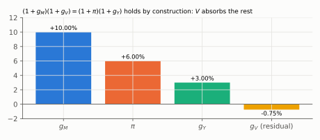
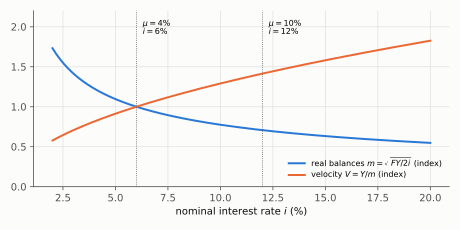

# Q7. Two True/False items on money

**Block IV, 10 points (2 × 5: verdict 1 + justification 4).** Kurlat ch. 10 (§10.2 money demand) and
ch. 11 (§11.1 the quantity equation, §11.3 steady states, neutrality).
Up: [[00-index]] · Prev: [[q6-euler-ricardo-savings-tax]] · Next: [[q8-regimes-and-two-shocks]]

> **Companions:** [Baumol–Tobin](../aula-07-moeda-inflacao/companion-baumol-tobin.html) (raise $i$ and
> watch real balances fall and trips rise) · [Inflation rule](../aula-07-moeda-inflacao/companion-inflation-rule.html).

---

## 7(a) Can the data refute $MV=PY$?

**The claim.** M2 grew 10%, inflation was 6%, real GDP grew 3%; money grew faster than nominal GDP, so the
data refute $MV=PY$.

**Verdict: FALSE.** $V$ is **defined** as $PY/M$, so the equation holds for any data. Here $V$ fell 0.75%.

### Every step

**Step 1. The definition.** Velocity has no independent measurement: $V\equiv PY/M$. Multiplying both sides
by $M$ gives $MV=PY$, true by construction.

**Step 2. Growth form, exactly.** Write the identity at two dates and divide:

$$(1+g_M)(1+g_V)=(1+\pi)(1+g_Y)$$

**Step 3. Solve for the residual.**

$$1+g_V=\frac{1.06\times1.03}{1.10}=\frac{1.0918}{1.10}=0.99255\quad\Rightarrow\quad\boxed{g_V=-0.75\%}$$

**Step 4. The log approximation.** $g_V\approx\pi+g_Y-g_M=6+3-10=-1\%$.

*Reading:* whatever the three measured growth rates are, the fourth bar is whatever makes the identity hold.

**Step 5. What turns it into a theory.** Add assumptions: $V$ constant (or a stable function of few
variables) and $Y$ set by the real side. Then $g_M$ determines $\pi$, and the causation runs from $M$ to $P$.
The causation comes from the assumptions, not from the identity. And the assumption is fragile: in
Baumol–Tobin $V=\sqrt{2iY/F}$ varies with $i$, $Y$ and the cost of cash, $F$.

### The sentences that earn the mark

> False. $MV=PY$ is an **accounting identity**: $V$ is not measured independently, it is computed as
> $PY/M$, so no data can contradict it. Here $V$ simply fell 0.75% ($1.06\times1.03/1.10-1$). The equation
> says nothing about causation. It becomes the quantity **theory** only when we add that $V$ is stable and $Y$
> is determined by real factors, and then money growth determines inflation. Money demand theory tells us
> $V$ is not constant: with Baumol–Tobin it rises with $i$ and $Y$.

### The tempting wrong answer

*"True by construction, so it says nothing"*, without saying **why** it cannot fail. That was the half
mark on Lista 6 1(a): *"$V$ is a residual"* was the missing sentence ([[avaliacao-listas-2-3-6]] §4).

### Revise

[[aula-07-moeda-inflacao/02-money-demand|Money demand]] §2.4 (velocity as an implication) and
[[aula-07-moeda-inflacao/03-equilibrium-and-neutrality|equilibrium]] §3.1.

---

## 7(b) Neutral, therefore superneutral?

**The claim.** Baumol–Tobin demand, $r=2\%$, no output growth. "Because money is neutral, a permanent rise in
money growth from 4% to 10% has no effect on any real variable in the new steady state."

**Verdict: FALSE.** Money is **neutral** (a one-off change in the *level* of $M$ changes only prices) but not
**superneutral** (a change in its *growth rate* has real effects).

### Every step

**Step 1. Steady-state inflation.** From $M=p\,m^D(Y,i)$ with $Y$ and $i$ constant, $\pi=\mu-\eta g$. With
$g=0$: $\pi=\mu$, so inflation goes from **4% to 10%**.

**Step 2. Fisher equation.** $i=r+\pi$: from $2+4=\mathbf{6\%}$ to $2+10=\mathbf{12\%}$.

**Step 3. Baumol–Tobin real balances.** $m=\sqrt{FY/(2i)}$. With $F$ and $Y$ fixed,

$$\frac{m'}{m}=\sqrt{\frac{i}{i'}}=\sqrt{\frac{6}{12}}=0.7071\quad\Rightarrow\quad\boxed{m\text{ falls }29.3\%}$$

**Step 4. Velocity and trips.** $V=Y/m$ rises by $\sqrt2$, **+41.4%**. The number of trips to the bank,
$N=Y/(2m)=\sqrt{iY/(2F)}$, also rises by 41.4%: more time and resources spent managing cash (shoe-leather
costs).

*Reading:* moving from $i=6\%$ to $i=12\%$ lowers real balances to 0.71 of their level and raises velocity
to 1.41.

### The sentences that earn the mark

> False. Neutrality is about the **level** of money: doubling $M$ once doubles $p$ and changes nothing real.
> Superneutrality would be about its **growth rate**, and it fails. Higher money growth raises steady-state
> inflation from 4% to 10% and, by Fisher, $i$ from 6% to 12%. Holding money is costlier, so real balances
> fall by 29.3%, velocity rises by 41.4%, and households make 41.4% more trips to the bank. Real balances and
> the resources spent on cash management are real variables.

### The tempting wrong answer

Treating "neutral" and "superneutral" as synonyms. A second trap: saying the effect is on $r$. In this
steady state $r$ is fixed at 2%; the real effects run through $i$, real balances and cash management.

### Revise

[[aula-07-moeda-inflacao/03-equilibrium-and-neutrality|Neutrality against superneutrality]] §3.3 (Fisher),
§3.6, and [[aula-07-moeda-inflacao/04-seigniorage-and-costs|costs of inflation]] §4.3.

---

## Rubric (10 points)

| Item | Object | Points |
|---|---|---|
| a | verdict F | 1 |
| a | $V$ is defined as $PY/M$, a residual; an identity cannot be refuted | 2 |
| a | $g_V=-0.75\%$ (or $-1\%$ by logs) | 1 |
| a | what turns it into a theory (stable $V$, real $Y$) | 1 |
| b | verdict F | 1 |
| b | neutrality (level) against superneutrality (growth) defined | 1 |
| b | $\pi$ and $i$ rise by 6 pp (Fisher) | 1 |
| b | real balances fall 29.3% or velocity rises 41.4%, named as a real effect | 2 |

**Caps.** (a) No mention that $V$ is a residual: **max. 2.5**. (b) Neutrality and superneutrality treated as
the same: **max. 1**. Caps override penalties.
