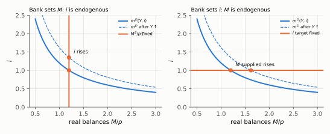
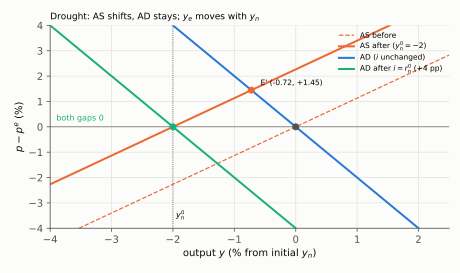
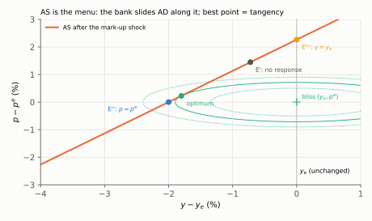

# Q8. The Copom, a drought and a payroll tax

**Block IV, 15 points (a, b, c × 5).** Kurlat ch. 10–11 for (a); Benigno (2015) §5–§7 and §11,
eqs. (20)–(21), (33)–(34), for (b) and (c).
Up: [[00-index]] · Prev: [[q7-quantity-equation-and-superneutrality]]

> **Companions:** [Money regimes](../aula-07-moeda-inflacao/companion-money-regimes.html) ·
> [Two shocks](../benigno/companion-two-shocks.html) (a productivity shock against a mark-up shock on one
> page) · [Loss bowl](../benigno/companion-loss-bowl.html) (the iso-loss ellipses sliding along AS) ·
> [The wedge](../benigno/companion-wedge.html) ($y_n$ against $y_e$).

**Setup.** AS: $p-p^e=\kappa(y-y_n)$. AD: $y=\bar y_n-\sigma[i-(\bar p-p)-\rho]$ with $\bar p=p^e$.
$\sigma=0.5$, $\kappa=1.133$, $\eta=0.2$, $\theta=8$. Everything in percent deviations.

**The closed form used in (b) and (c)** ([[benigno/04-equilibrium-geometry]] §4.2): substituting AS into
AD,

$$y-y_n=\frac{\sigma}{1+\sigma\kappa}\left[r_n-i\right],\qquad p-p^e=\kappa\,(y-y_n),\qquad r_n=\rho+\sigma^{-1}(\bar y_n-y_n)$$

With $\sigma\kappa=0.5665$: $\sigma/(1+\sigma\kappa)=0.5/1.5665=0.3192$.

---

## 8(a) Who sets what: the two regimes

### Every step

**Step 1. The condition.** $M^S=p\,m^D(Y,i)$, with $m^D$ rising in $Y$ and falling in $i$. One equation; it
determines **one** unknown, and which one depends on what the central bank fixes.

**Step 2. The bank sets $M$.** Given $p$ and $Y$, the equation determines $i$: the rate at which people are
willing to hold the money supplied (an LM curve).

**Step 3. The bank sets $i$.** Given $p$, $Y$ and the target $i$, the equation determines $M$: the bank
supplies whatever quantity is demanded at its rate. **Money is endogenous** and the LM curve is horizontal
at the target.

**Step 4. An exogenous rise in $M$, prices fixed.** $M/\bar p$ rises, so $m^D(Y,i)$ must rise: **$i$ falls
and/or $Y$ rises** (the liquidity effect). The money market alone cannot say how the adjustment splits; that
needs a second relation (the Euler/IS equation).

**Step 5. The same rise, prices flexible.** $p$ rises in proportion to $M$; $Y$ and $i$ are unchanged:
**neutrality**.

**Step 6. Why Benigno has no LM curve.** The Copom's instrument is $i$. With $i$ fixed, step 3 applies: the
money market only reports the $M$ the bank must supply. It is recursive, adding nothing to the determination
of $(y,p)$, so it can be dropped.

*Reading:* after a rise in $Y$ shifts money demand out, a fixed $M$ (left) forces $i$ up; a fixed $i$
(right) forces the bank to supply more $M$.

### The sentences that earn the mark

> One equilibrium condition fixes one variable. If the central bank sets $M$, the condition determines $i$.
> If it sets $i$, the same condition determines $M$: the bank supplies whatever is demanded, so money is
> endogenous. With prices fixed, a rise in $M$ must lower $i$ or raise $Y$ so that people hold it; how much
> of each needs the IS/Euler side. With flexible prices, $p$ rises in proportion and nothing real changes.
> Benigno's model has no LM curve because the instrument is $i$: the money market then only determines $M$.

### The tempting wrong answer

*"The central bank fixes $i$ and must supply $M^S$"*, without saying that $M$ has become endogenous; and
answering only the fixed-price case. Those were the two marks lost on Lista 6 1(c) and 1(d)
([[avaliacao-listas-2-3-6]] §4; rule 9: *two answers, fixed and flexible prices; which variable is set, which
becomes endogenous*).

### Revise

[[aula-07-moeda-inflacao/03-equilibrium-and-neutrality|Equilibrium and neutrality]] §3.1 and
[[benigno/01-household-and-ad|AD without LM]].

---

## 8(b) A drought: an efficient shock

**Data.** $y_n$ falls by 2% ($dy_n=-2$), $\bar y_n$ unchanged, $i$ unchanged.

### Every step

**Step 1. Which curve moves.** AS contains $y_n$: it shifts **left (up)**, through the new anchor
$(y_n',p^e)=(-2,0)$. AD contains $\bar y_n$, $i$ and $\bar p$, none of which moved: AD **does not shift**, and
the economy moves **along** it.

**Step 2. The natural rate moves.** $dr_n=\sigma^{-1}(d\bar y_n-dy_n)=2\times(0+2)=+4$ pp. With $i$ fixed,
$r_n-i$ rises by 4.

**Step 3. The gap against natural output.** From the closed form:

$$d(y-y_n)=0.3192\times4=\boxed{+1.277}$$

**Step 4. Output.** $dy=dy_n+d(y-y_n)=-2+1.277=\boxed{-0.723}$. (Equivalently
$dy=\frac{\sigma\kappa}{1+\sigma\kappa}dy_n=\frac{0.5665}{1.5665}\times(-2)$.)

**Step 5. Prices.** $dp=\kappa\,d(y-y_n)=1.133\times1.277=\boxed{+1.447}$.

**Step 6. The efficient level moves with the natural level.** $y_n-y_e=-\mu/(\sigma^{-1}+\eta)$ does not
contain productivity, so $dy_e=dy_n=-2$ and

$$d(y-y_e)=d(y-y_n)=\boxed{+1.277}$$

**Step 7. The policy that closes both gaps.** Set $di=dr_n=+4$ pp. Then $r_n-i$ is back to zero, so
$y-y_n=0$ and $p=p^e$; and since $y_e=y_n$, $y-y_e=0$ too. AD shifts left by $\sigma\times4=2$ and crosses the
new AS at $(y_n',p^e)$.

*Reading:* the economy slides along the blue AD to E′, with output down 0.72 and prices up 1.45. Raising $i$
by 4 pp moves AD to the green line through $(y_n',p^e)$, where both gaps are zero.

### The sentences that earn the mark

> The drought lowers $y_n$ but not $\bar y_n$: AS shifts left through $(y_n',p^e)$, AD does not move, and the
> economy moves along AD. Output falls by 0.72% and prices rise by 1.45%. Output has fallen, yet it is
> **above** its new natural level ($y-y_n=+1.28$), which is why prices rise. Productivity moves $y_n$ and
> $y_e$ together, so $y-y_e=+1.28$ as well: both gaps have the **same sign**. Raising $i$ by 4 pp, to the
> new natural rate, closes both at once. One instrument suffices because the two targets coincide.

### The tempting wrong answer

*"Output fell, so the Copom should cut rates."* Output fell **less** than its natural level; the gap is
positive. And shifting AD in response to a temporary supply shock, which is Lista 7 trap 1 ([[lista-07]]).

### Revise

[[benigno/04-equilibrium-geometry|AS–AD geometry]] §4.2–§4.3 and
[[benigno/05-productivity-shocks|productivity shocks]].

---

## 8(c) A payroll tax: a mark-up shock, and why AS is the constraint

**Data.** $d\mu=4.4\%$, so $dy_n=-d\mu/(\sigma^{-1}+\eta)=-4.4/2.2=-2$ and $dy_e=0$. Loss
$L=(y-y_e)^2+\frac{\theta}{\kappa}(p-p^e)^2$ (Benigno's eq. (33), times 2).

### Every step

**Step 1. Why AS is the constraint.** The instrument $i$ enters AD only. For any point on AS there is an $i$
that makes AD pass through it, so AD restricts nothing: it is the **tool** that selects the point. AS
contains no instrument; it is firms' price setting and cannot be moved by the Copom. So the problem is: choose
$(y,p)$ on AS to minimise $L$, then read off $i$ from AD.

**Step 2. Name the gaps.** $x\equiv y-y_e$, $\hat p\equiv p-p^e$, $d\equiv y_n-y_e=-2$. AS becomes
$\hat p=\kappa(x-d)$.

**Step 3. Substitute AS into the loss** (the substitution route of [[estilo-do-professor]] §2):

$$L(x)=x^2+\frac{\theta}{\kappa}\kappa^2(x-d)^2=x^2+\theta\kappa\,(x-d)^2$$

**Step 4. First-order condition.**

$$2x+2\theta\kappa(x-d)=0\quad\Rightarrow\quad\boxed{x=\frac{\theta\kappa}{1+\theta\kappa}\,d}$$

**Step 5. The targeting rule.** Since $\theta\kappa(x-d)=\theta\hat p$, step 4 reads $x+\theta\hat p=0$:
Benigno's (34).

**Step 6. Numbers.** $\theta\kappa=8\times1.133=9.064$, $1+\theta\kappa=10.064$.

$$x=\frac{9.064}{10.064}\times(-2)=\boxed{-1.801},\qquad \hat p=\kappa(x-d)=1.133\times0.199=\boxed{+0.225}$$

Check: $x+\theta\hat p=-1.801+8\times0.225=0$. ✓ A fraction $1/(1+\theta\kappa)=9.9\%$ of the shock reaches prices.

**Step 7. The interest rate that delivers it.** $y-y_n=x-d=0.199$. From the closed form,
$r_n-i=0.199/0.3192=0.623$. The natural rate rose by $dr_n=-dy_n/\sigma=+4$, so

$$di=4-0.623=\boxed{+3.38\text{ pp}}$$

**Step 8. Compare the corners.**

| Point | $y-y_e$ | $p-p^e$ | $di$ (pp) | Loss |
|---|---|---|---|---|
| E′: no response | $-0.723$ | $+1.447$ | 0 | 15.30 |
| E″: price stability | $-2.000$ | 0 | $+4.00$ | 4.00 |
| E‴: efficient output | 0 | $+2.266$ | $-2.27$ | 36.26 |
| **optimum** | $-1.801$ | $+0.225$ | $+3.38$ | **3.60** |

*Reading:* the Copom can reach any point on the orange AS by moving AD. The ellipses are iso-loss curves
around $(y_e,p^e)$; the best point is where an ellipse is tangent to AS, close to price stability because
$\theta=8$ weights prices heavily.

**Step 9. Why a trade-off here and not in (b).** The mark-up moves $y_n$ but not $y_e$, so $d\neq0$. Prices
stay at $p^e$ only if $y=y_n$, and welfare needs $y=y_e$; with $y_n\ne y_e$ both cannot hold. In (b), $d=0$ and
the tangency sits at the bliss point.

### The sentences that earn the mark

> AS is the constraint because the instrument $i$ appears only in AD: by moving $i$ the Copom can put AD
> through any point of AS, so AD is the tool and AS is the menu of $(y,p)$ it can reach. Substituting AS into
> the loss gives $x=\frac{\theta\kappa}{1+\theta\kappa}(y_n-y_e)$ and the rule $(y-y_e)+\theta(p-p^e)=0$:
> $y-y_e=-1.80$ and $p-p^e=+0.23$, reached by raising $i$ by 3.38 pp, less than the 4 pp that would stabilise
> prices. There is a trade-off because the mark-up is an **inefficient** shock: it lowers $y_n$ but not $y_e$,
> so the output level that keeps prices stable is no longer the efficient one. The drought moved both
> together, so one rate closed both gaps.

### The tempting wrong answer

Taking AD as the constraint (Lista 7 trap 5), or reporting one "output gap" (trap 2) ([[lista-07]]). A third:
saying the Copom can "move AS" by stabilising expectations. In this model $p^e$ is predetermined; only AD is
under its control.

### Revise

[[benigno/03-natural-and-efficient|Natural and efficient]] §3.4–§3.5,
[[benigno/06-markup-shocks|mark-up shocks]] §6.2–§6.4, [[benigno/10-optimal-policy|optimal policy]].

---

## Rubric (15 points)

| Item | Object | Points |
|---|---|---|
| a | set $M$ → $i$ endogenous; set $i$ → $M$ endogenous | 1.5 |
| a | fixed prices: liquidity effect, split undetermined by the money market alone | 1 |
| a | flexible prices: $p$ proportional, neutrality | 1 |
| a | two-panel diagram | 0.5 |
| a | why no LM curve | 1 |
| b | AS shifts left; AD fixed; movement along AD | 1.5 |
| b | $dy=-0.72$, $dp=+1.45$ | 1 |
| b | both gaps $+1.28$, same sign, with $y_e$ moving with $y_n$ | 1.5 |
| b | $di=+4$ pp closes both; why one instrument suffices | 1 |
| c | why AS is the constraint (instrument only in AD) | 1.5 |
| c | targeting rule derived by substitution | 1 |
| c | optimum $(-1.80,+0.23)$ and $di=+3.38$ | 1 |
| c | trade-off because $y_n$ moves and $y_e$ does not | 1.5 |

**Caps.** (a) Only the fixed-price case: **max. 3**. (b) AD shifted in response to the drought, or "cut
rates": **max. 2**. (c) AD taken as the constraint: **max. 2**. One output gap reported where two are needed:
**max. 3** on that item. Caps override penalties.
